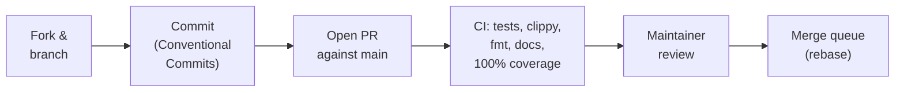

# Contributing to Leviath

Contributions are welcome: bug reports, docs fixes, and code. This page covers
this fork's contribution process and the inherited hooks, lints, and coverage
tooling.

## Validation in this fork

For owner-directed work in `a-programmers-programmer/leviath`, validation is
discretionary and based on the risk of the change. A full workspace build, test
suite, lint run, coverage run, or live daemon exercise is not a mandatory step
before committing or merging. Choose focused checks when they help establish
that the changed behavior works; expand them when there is a concrete unresolved
risk. Documentation-only changes can be reviewed directly.

Record the checks actually run and their results in the change description.
When checks were not run, say so; do not imply that unperformed checks passed.
Owner authorization to implement and merge an agreed design does not require
another issue or permission request solely to satisfy the upstream process.

This policy does not disable installed Git hooks, GitHub Actions workflows, or
repository protection rules. The sections below describe the inherited tooling
and upstream process so contributors can use them when useful or when preparing
a contribution to `GEMISIS/leviath`. Any checks enforced by the active repository
configuration still operate as configured; this document does not establish
that a particular fork has upstream's protection rules enabled.

## How a change lands upstream



The upstream contribution process uses GitHub's merge queue for `main`: once a PR is approved and green, queueing it
re-runs the required checks on the exact tree that will land, then rebase-merges automatically.

- **Start with an issue** for anything non-trivial. Agreeing on the approach
  first saves you from writing code that can't be merged. Small fixes (typos,
  doc corrections, obvious bugs) can go straight to a PR.
- **Direct pushes to upstream `main` are disabled** for everyone, maintainers included.
  Every change arrives as a pull request, must pass all required CI checks, and
  needs maintainer approval before it can merge.
- **History is rebase-only**, with no merge commits. Keep your branch rebased on
  `main`; force-pushing your own PR branch is fine and expected.
- **Commit messages follow [Conventional Commits](https://www.conventionalcommits.org)**:
  `feat:`, `fix:`, `docs:`, `ci:`, `refactor:`, `test:`, `chore:`. Look at
  `git log --oneline` for the house style.
- **Licensing**: by submitting a contribution you agree it is licensed under the
  repository's [MIT license](LICENSE). There is no CLA.
- **Conduct**: we follow the [Contributor Covenant](CODE_OF_CONDUCT.md).
- **Security issues** go through
  [private vulnerability reporting](https://github.com/GEMISIS/leviath/security/advisories/new),
  never public issues. See [SECURITY.md](SECURITY.md).

## Getting the code building

Use the fork URL for owner-directed work. The test and lint commands are
available checks, not a required sequence for every change in this fork.

```bash
git clone https://github.com/a-programmers-programmer/leviath.git
cd leviath
cargo build
cargo test --workspace
cargo clippy --workspace
```

## The pre-commit hook

The hook installs itself the first time you build or test, with no setup step. `cargo test` / `cargo build` pulls in `xtask`'s dev-dependencies, which include [`cargo-husky`](https://github.com/rhysd/cargo-husky). On the first build it installs `.cargo-husky/hooks/pre-commit` into `.git/hooks/pre-commit` automatically.

When installed and invoked, the hook checks:

- **formatting** (`cargo fmt --check`)
- **clippy** with warnings-as-errors
- **doc lints** (`cargo doc` with `-D warnings`, so no broken or private intra-doc links and no stray HTML)
- the **coverage-suppression-marker lint** (`ast-grep scan`, if `ast-grep` is installed; CI always enforces it)
- **structural limits** (`cargo xtask structure`)
- **documentation content** (`cargo xtask docs`)

The checked-in hook does **not** run `cargo test` or the full `cargo xtask
coverage` check. The inherited CI workflow contains separate test and coverage
jobs, including a 100% coverage threshold. Whether those jobs run and block a
merge depends on the repository's Actions and protection configuration.

If the hook script itself changes (e.g. a commit edits `.cargo-husky/hooks/pre-commit`), `cargo-husky` only reinstalls it on a *fresh* compile of its crate, not on incremental builds. Force it with:

```bash
cargo clean -p cargo-husky && cargo test -p xtask
```

## `ast-grep` (suppression lint)

The suppression-marker scan uses [`ast-grep`](https://ast-grep.github.io), which matches Rust/YAML structurally (via tree-sitter), and the rules live in `.sgrules/`. CI installs it automatically and always enforces the scan; the pre-commit hook runs it only if it's installed locally, otherwise it prints a warning and skips (CI is the backstop). Install it once with any of:

```bash
brew install ast-grep            # macOS / Linuxbrew
cargo install ast-grep --locked  # from source
npm install -g @ast-grep/cli     # via npm
```

## Testing policy

This fork uses the discretionary validation policy above. The inherited coverage
command and CI configuration retain a **100%** threshold on lines, regions, and
functions; choosing not to run coverage locally does not change that threshold.
Coverage-suppression markers (`#[cfg(not(test))]`, `coverage(off)`,
tarpaulin/lcov/grcov annotations) are rejected by the ast-grep lint above. Prefer
testable code rather than hiding it from measurement. The thin `lev` binary
entrypoint (`crates/leviath-cli/src/main.rs`) is excluded from coverage measurement:
it wires real terminal, stdin, network, and subprocess I/O into the library's
tested cores. The inherited CI configuration also guards entrypoint changes
with a maintainer-sign-off check.

### Suppressing a lint

The inherited lint rules reject the suppressions listed here. The pre-commit
hook (when `ast-grep` is installed) and CI's `check-exclusions` job run `ast-grep
scan`, whose rules fail the check on `#[allow(...)]` or
`#[expect(...)]` for `too_many_arguments`, `type_complexity`, `dead_code`,
`deprecated`, `async_fn_in_trait`, `match_same_arms`, `new_without_default`,
`permissions_set_readonly_false` and `enum_variant_names`.

Every one of those was cleared from this tree by changing the code, and in each
case the change was better than the suppression it replaced:

| Lint | What it turned into |
|---|---|
| `too_many_arguments` | Parameter structs, and `#[derive(SystemParam)]` for the bevy system. One of them exposed the same three fields written out twice, now a single `PromptLane<T>` |
| `permissions_set_readonly_false` | Restoring the file's *original* permissions instead of synthesising "not read-only" — which on Unix hands back `0o666` for a file that was `0o644` |
| `deprecated` | `socket2`, the layer that owns socket options, rather than tokio's wrapper that deprecates the option because it blocks a *runtime* thread |
| `async_fn_in_trait` | An explicit `impl Future` that states whether the future is `Send`. Adding the bound to `RiskyExecutors` did not compile, which is the useful answer: those futures hold non-`Send` state across awaits and the `async fn` left that unsaid |
| `match_same_arms` | One named constant per case, so "these can move independently" is expressed rather than commented |
| `new_without_default` | A constructor named for what it does (`open`, not `new`) |
| `dead_code` | Deleting the field, or wiring it up — `lev test` had two keys that parsed and did nothing |

`clippy::string_slice` is the one exception, and only as `#[expect(..., reason =
"...")]` naming the construct that guarantees the index is a char boundary. The
root `Cargo.toml` explains why that one has a hatch: it exists because slicing a
`&str` aborted the daemon twice.

`#[expect]` rather than `#[allow]` for that exception, and the difference
matters: `expect` fails the build the moment the lint stops firing, so a
suppression cannot outlive the problem it was written for. Converting the tree
from `allow` to `expect` found **six** that were already dead, including a
`dead_code` on a field that was being read.

If a new suppression looks unavoidable, it is worth an hour before it is worth an
attribute. If it genuinely is unavoidable, change `.sgrules/no-lint-suppression.yml`
in the same PR and say why.

### How long a file may be

`cargo xtask structure` holds every source file to **1,200 lines of production code**, and the pre-commit hook and CI both run it. It costs about a tenth of a second: it reads files and counts, nothing more.

It counts **production** lines, stopping at the first column-zero `#[cfg(test)]` and skipping sibling test files entirely. This workspace keeps most tests inline and gates a hard 100%, so about two thirds of the tree is test code; a total-lines rule would fire hardest on the best-tested files, which is exactly backwards.

**The cap is a ratchet and only ever goes down.** 1,200 is where the tree sits today, not where it should end up — the longest file is 1,152 against a median of 218, and the next rungs are 1,000 and 800. Each is earned by splitting the files above it, not by editing the number.

Raising the cap to admit one long file is how a limit stops being one. If a file wants to be longer, split it by concern: `config/`, `blueprint/`, `host/`, `components/`, `lint/` and `daemon/spawn/` are all worked examples, and the glob re-export they use means the split touches no call site. Split on what the code *is about*, not on where the line count lands — `lint/checks.rs` asks "will this agent work" and `lint/security.rs` asks "should this agent be allowed to", which is a real boundary; cutting the same file at "lint_a.rs" and "lint_b.rs" would have satisfied the same number and taught a reader nothing.

### Where a test module lives

Inline `#[cfg(test)] mod tests` in the file under test is the default; 205 files use it. A sibling `foo_tests.rs` (or `foo/tests.rs`) is the sanctioned alternative, used by 24 — but only for one reason.

The difference is what gets measured. An inline test module is part of the file, so the gate counts its *scaffolding* too: a helper written to build fixtures has to itself be exercised on every branch, or it fails the gate. llvm-cov excludes the sibling layout by default, so a test module whose helpers would otherwise need tests of their own belongs there. Reach for it when the scaffolding is the problem, not because a file is getting long.

Shared scaffolding goes further out: `leviath-testkit` is a dev-dependency-only crate for fixtures used by more than one crate (the always-on tracing subscriber, mock HTTP servers), and it is excluded from measurement entirely. Add to it rather than copying a helper into a second crate — that copying is exactly what it was created to stop.

## Running coverage locally

`cargo xtask coverage` gates each workspace package with `cargo llvm-cov --package <pkg> --fail-under-{lines,functions,regions} 100`. llvm-cov does the counting *and* the gating; there's no custom parsing or aggregation. CI enforces a hard **100%** on all three metrics on Linux, macOS, and Windows. Any file below 100% fails the build, and a browsable HTML report lands in the gitignored `coverage/` folder.

Measurement is deliberately **per-package**, not `--workspace`: `-C instrument-coverage` records every function in every binary that links it (including ones that never call it), and the whole-workspace merge can let a never-run record shadow the covered one, so one package at a time is what keeps llvm-cov's counts accurate. See the doc comment atop `xtask/src/coverage.rs`.

```bash
cargo xtask coverage                                   # full workspace
cargo llvm-cov --package <crate> --lib                 # a single crate
cargo llvm-cov --package <crate> --lib --html --open   # browsable per-crate report
```

> Branch coverage isn't collected: `cargo llvm-cov --branch` reliably SIGSEGVs inside LLVM's own coverage-mapping code ([open upstream bug](https://github.com/llvm/llvm-project/issues/119558)). See the doc comment atop `xtask/src/coverage.rs` for the full investigation.

## Running CodeQL locally

GitHub's default CodeQL setup scans every push with the `rust-code-scanning` suite and the `remote` threat model, and the repo keeps that count at zero with nothing dismissed. Waiting twenty minutes per push to learn whether a fix took is the slow way; the same queries run locally in a few minutes:

```bash
brew install codeql                                                    # the CLI (Linux: the GitHub release tarball)
codeql database create target/codeql-db --language=rust --overwrite    # builds the workspace through cargo
codeql database analyze target/codeql-db codeql/rust-queries:codeql-suites/rust-code-scanning.qls \
  --format=sarif-latest --output=target/codeql.sarif --download
python3 perf-tools/codeql_summary.py target/codeql.sarif                # rule, sink, and every flow's source
```

The summary's exit status is the number of findings, so a shell can gate on it. Two things worth knowing before reading a result: the Rust model treats every parameter of an axum handler as request data, `State` included (see `SECURITY.md`, "What the scanners say"), and the sensitive-data queries go by variable *name*, so a loop variable called `secret` that holds env-var names reads as a leak.

## Live-testing against a real daemon

A green test suite and a 100% coverage number do not establish every runtime
behavior: this repository has shipped fixes that a unit test certified and a
running daemon ignored. A live daemon exercise can help when a change affects
tool calls, spawning, or HTTP requests. Use it when that additional evidence is
useful under this fork's risk-based validation policy; it is not mandatory for
every such change.

`perf-tools/` holds the harness. `perf-tools/harness.sh CMD...` runs `CMD`
in an isolated environment (`LEVIATH_HOME=/tmp/lv`, the repo `.env` skipped,
the native OpenAI provider pointed at `perf-tools/mock.py`) and installs a
one-stage `probe` blueprint. `mock.py` is a stateless OpenAI-compatible server
that asks for a tool call of your choosing on the first turn; `daemon_drive.py`
starts everything, spawns runs over `lev serve`, and waits for them to finish:

```sh
cargo build --release -p leviath-cli
perf-tools/harness.sh python3 perf-tools/daemon_drive.py \
    --runs 2 --tool shell --args '{"command":"echo hi > note.txt"}' --yolo --keep
perf-tools/harness.sh target/release/lev timeline <run-id>
```

Every "the bad thing did not happen" probe needs a control in the same script
that makes the good thing happen. A probe whose control is also silent proves
that the harness is broken, not that the fix works. `mock.py`'s `GET /count`
exists so "no provider call was made" can be asserted rather than assumed.

The same directory holds tools for measuring performance changes
(`dash_pty.py`, `serve_latency.py`, `binsize.sh`) and the baseline numbers
under `perf-tools/baselines/`; see `perf-tools/README.md`.

## Dependencies

Declare a dependency in `[workspace.dependencies]` and reference it from a crate as `{ workspace = true }`. A version written inline in a crate manifest is invisible to anyone reading the root, which is how one crate ends up on a different minor from the rest without anybody deciding that.

A version requirement here records **the minimum this workspace has actually been tested against, as of the last time someone deliberately raised it** — not the oldest version that might still compile. Raising a floor to match `Cargo.lock` is a no-op for resolution (the lock already picks that version), so it costs nothing and stops the requirement drifting into a claim nobody has checked. Do it when you notice the gap; there is no obligation to chase every release.

To find genuinely duplicated dependencies, ask cargo:

```bash
cargo tree --duplicates
```

Not `Cargo.lock`. The lockfile records **unenabled optional** dependencies too, so a crate can appear there while never being compiled — `cargo tree -i <crate>` printing "nothing to print" is the tell. Trimming a feature to remove such an entry changes neither the build nor the lockfile.

## Cutting a release

Releases are triggered by a version bump, not by a schedule. Merging a bump to
`main` is what puts a build in front of users, so it is a deliberate, separate
commit rather than something that rides along with a feature.

Everything ships in lockstep — all `leviath-*` crates plus the `lev` binary
carry one version — so there is one command:

```bash
cargo xtask version 0.1.3
```

That writes `[workspace.package] version`, the eleven intra-workspace pins in
`[workspace.dependencies]` just below it, the allocator pin in
`crates/leviath-cli/Cargo.toml` (which lives there rather than in the workspace
table because only the composition-root binary should pick an allocator), and
`Cargo.lock`, then moves `## Unreleased` in `CHANGELOG.md` under a dated
`## 0.1.3` heading and opens a fresh empty one. The pins exist because
`cargo publish` refuses a path dependency with no version requirement, and Cargo
has no way to make those requirements inherit the workspace version — so they
are written out, and they have to agree. `cargo xtask version --check` is the CI
job that fails a hand-edit which moved only some of them.

That same check compares the `[profile.release]` block in
`crates/leviath-cli/Cargo.toml` against the root's. The copy exists because
`cargo install leviath-cli` builds with no workspace — that manifest is the root
there — and without it cargo's defaults apply, silently dropping
`overflow-checks`. Edit one and you have to edit the other.

Then write the changelog entries for what you are shipping, and open the PR.
Because merging a bump publishes, CI requires the **`allow-version-bump`** label
on any PR that moves the version — the same deliberate sign-off
`allow-main-rs-change` asks for, with its own label so approving a release never
doubles as approving an entrypoint change.

If you label the PR after CI has already started, the guard job that ran without
it stays red and keeps the PR blocked, because the merge rollup counts every
suite's copy of a check rather than only the newest. Clear it by rerunning that
job in the suite it failed in:

```bash
gh run rerun <run-id> --failed
```

The guards read the PR's labels live when they run, so the rerun sees the label
you just applied. Adding the label does not start a run of its own.

Merging fires the alpha release for the bump commit; beta promotes it the
following Monday and stable the Thursday after. Channels with nothing new to
publish skip in seconds. See
[Releases and channels](https://leviath.dev/docs/releases) for the full picture.

### Signing the Windows binary

`lev.exe` ships unsigned: a certificate a Windows machine trusts has to come
from a commercial CA, and Leviath is not paying for one. Each new build is
therefore a new, unknown hash to Defender, and users occasionally see it
flagged. What keeps that survivable without paying: the version resource the
build script embeds (so the exe at least says what it is), the provenance
attestation, and reporting a flagged build to Microsoft as a false positive
(<https://www.microsoft.com/wdsi/filesubmission>, as a software developer, with
the detection name from Protection history) - per build, since there is no
API for that.

**The free route, if anyone wants to pursue it:** the
[SignPath Foundation](https://signpath.org) signs open-source releases at no
cost. It is an application (OSI licence, MFA on every maintainer's GitHub
account, a "Code signing policy" section on the project page naming authors,
reviewers and approvers), and once accepted the alpha build would submit
`lev.exe` through `signpath/github-action-submit-signing-request` and receive
it back signed with the Foundation's certificate - which Windows trusts, and
which accrues reputation across releases. That is the only way the Defender
flags stop for good. The release pipeline carries no signing step today, so
adopting it means adding that step to the alpha build (beta and stable promote
the alpha artifacts, so a signature travels with them). Verify a signed asset
with `Get-AuthenticodeSignature lev.exe`.

## Design notes

Longer-form rationale that does not belong in the user docs lives in `docs/design/`. Today that is
[the `lev setup` wizard](docs/design/setup-wizard.md), which explains what the old onboarding flow
got wrong and why the replacement is shaped the way it is. Worth reading before changing `lev setup`.

## Regenerating the workflow diagrams

The agent workflow SVGs in `docs/assets/agents/` are rendered from the Mermaid sources in `docs/assets/agents/src/`. See `docs/assets/agents/src/README.md` for the render command and theme configs. If you change an agent's stage graph in `crates/leviath-cli/agents/<name>/agent.leviath`, update its `.mmd` source and re-render both the light and dark variants.
