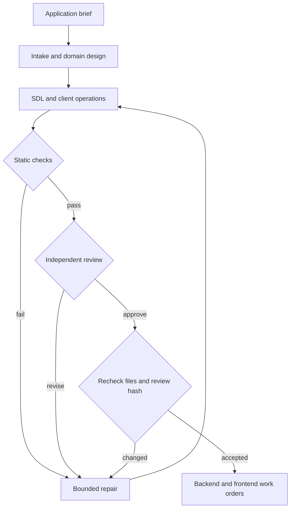

# GraphQL contract workflow

A reusable Leviath stage for building applications from a reviewed API contract.
It produces schema and implementation work orders. It does not implement resolvers
or claim their authorization, performance, or business behavior has been tested.



The actual blueprint has two repair passes and fails closed after exhaustion. The
high-tier models design and review; cheaper models gather evidence, draft, and repair.
The reviewer starts with a cleared conversation, reads the original task and files,
and has no file-write or shell tools. Hooks restrict its context writes to a review
record. A Python gate computes all mechanical outcomes and a content fingerprint;
the final acceptance reruns checks and rejects a review of different content.

## Installation and execution

Requires Python 3.11+, graphql-core 3.2.6, and a current Leviath with `transition_region`
and lifecycle hooks (the inspected baseline is `zephyyrrr/leviath` at `6688d271`).
Use your application's Python environment, with `python3` resolving to that environment:

```sh
python3 -m venv .venv-graphql
. .venv-graphql/bin/activate
python -m pip install -r /path/to/leviath/crates/leviath-cli/agents/graphql-schema/requirements.txt
lev add /path/to/leviath/crates/leviath-cli/agents/graphql-schema
lev validate graphql-schema
```

The normal bundled installer also includes this directory when building Leviath.
The checker and reference guide are embedded into tools, so a source checkout is
not required after installation. Tool permissions remain the caller's normal Leviath
policy. Do not use a global model override; it flattens the per-stage cost choices.

From a dedicated application checkout with one active schema run:

```sh
python /path/to/installed/graphql-schema/scripts/run_stage.py --task ./application-brief.md
```

The runner clears an old acceptance receipt, invokes `lev run graphql-schema --wait`,
and independently verifies a new accepted contract. It exits nonzero on missing,
failed, stale, or unreviewed work. Existing contract sources are preserved for inspection.
An interrupted `lev run --wait` can leave the daemon run alive; cancel that run before
starting another in the same checkout. Do not run competing writers in this directory.

For an interactive standalone run:

```sh
lev run graphql-schema --task ./application-brief.md --wait
```

Use the runner for pipeline launches. A successful Leviath process by itself does not
mean the schema was accepted: a workflow may legitimately finish with status `blocked`.
Do not pre-seed route, review, checked or gate_result; those are internal regions.

## Output contract

All output lives under `graphql-contract/`. No application source is changed by design.
`graphql_contract_guide` exposes this document to stages regardless of file-tool read roots.

| File | Purpose |
| --- | --- |
| `requirements.md` | Original journeys, stable requirement IDs, actor permissions, invariants, source references, assumptions and unresolved questions |
| `design.md` | Domain graph and alternatives; nullability, mutation/error semantics, tenancy, batching, pagination, evolution and subscription decisions |
| `schema.graphql` | Described SDL used by both backend and frontend |
| `operations/*.graphql` | Named representative client queries/mutations/subscriptions and shared fragments |
| `variables.json` | Coercion cases for every named operation |
| `contract.json` | Requirement traceability, per-field policies and runtime obligations |
| `baseline.graphql` | Required only when evolving an existing API; copy the real pre-change schema and cite its source hash |
| `handoff.md` | Concrete backend/frontend work orders and future runtime acceptance scenarios |
| `accepted.json` | Checker-owned acceptance, review, file hashes and fingerprint |

`contract.json` version 1 has this structure (replace example coordinates with the
actual schema; maps must include EVERY relevant coordinate, without extra entries):

```json
{
  "version": 1,
  "mode": "new",
  "assumptions": ["Explicit, source-backed routine choices"],
  "open_questions": [],
  "requirements": [{
    "id": "R-browse",
    "description": "A workspace member browses visible tasks",
    "operations": ["BrowseTasks"],
    "coordinates": ["Query.tasks", "Task.id"]
  }],
  "fields": {
    "Task.id": {
      "authorization": "Specific principal/tenant/role rule or explicit public access",
      "nullability": "Why null is possible or why non-null is guaranteed; failure propagation",
      "source": "Owning service/table/value and business invariant",
      "batching": "Batch/cache strategy and scope, or why no extra I/O occurs"
    }
  },
  "collections": {
    "Query.tasks": {
      "kind": "cursor",
      "max_items": 100,
      "enforcement": "Where default and maximum page size are enforced",
      "order": "Stable sort order and null ordering",
      "tie_breaker": "Unique stable tie-breaker",
      "cursor_scope": "Tenant, filter, sort and cursor version binding"
    },
    "TaskConnection.edges": {
      "kind": "bounded",
      "max_items": 100,
      "enforcement": "Bounded by the parent connection's capped query"
    }
  },
  "mutations": {
    "Mutation.completeTask": {
      "intent": "Business transition and preconditions",
      "idempotency": "Replay key scope, retention and changed-payload behavior; or reason unnecessary",
      "concurrency": "Optimistic revision/transaction behavior or explicit justified alternative",
      "errors": "Expected domain outcomes and unexpected GraphQL errors, including information hiding"
    }
  },
  "scalars": {
    "DateTime": {
      "format": "Exact wire format/time-zone semantics",
      "validation": "Runtime coercion/range checks and owner"
    }
  },
  "runtime": {
    "demand_control": "Depth, aliases, batch size, multiplicative list cost and per-principal budgets",
    "tenant_isolation": "Identity comes from authenticated context; authorization/cache/cursor boundaries",
    "authorization_tests": "Concrete allow/deny and cross-tenant scenarios",
    "performance_tests": "N+1, cardinality, cost and execution-plan checks",
    "schema_codegen": "Backend SDL parity, frontend operation codegen and mock validation plan",
    "subscriptions": "Delivery/replay/auth semantics, or explicit rationale that none are needed"
  }
}
```

`fields` covers object and interface output fields, including connection/page/result
wrappers; it excludes input fields. Types, output/input fields, field arguments and enum
values need descriptions in SDL. Naming is PascalCase types, camelCase fields, and
UPPER_SNAKE_CASE enums. Version 1 has a fixed convention policy; a legacy mismatch
blocks rather than silently renaming an existing API. Empty `mutations`, `scalars`, and
`collections` maps are valid when the schema has no corresponding surface.

Every output list and every field returning a type named `*Connection` needs a collection
entry. Bounded means a genuinely bounded domain collection, with an enforcement explanation;
unbounded entity sets should use cursor pagination. `max_items` is 1..10000. Cursor fields
have `first: Int` (optionally non-null), nullable `after: String` or `ID`, and a connection
with an edges list (`node`, `cursor`) and pageInfo (`hasNextPage: Boolean!`, nullable endCursor).
The reviewer evaluates the semantics; these structural checks alone cannot prove bounds.

All operations must have unique names. Documents are validated together so shared fragments
work. Each requirement maps to existing operations and coordinates that those operations
actually select, including transitive fragments. All root fields and operations must be
covered. Example coercion cases in `variables.json`:

```json
[
  {"operation": "BrowseTasks", "variables": {"workspace": "w1", "first": 20}, "expected": "valid"},
  {"operation": "BrowseTasks", "variables": {"workspace": "w1", "first": "bad"}, "expected": "invalid"}
]
```

Each operation needs a valid case. Invalid cases test GraphQL variable coercion only;
a first of -1 can coerce as Int but still violate the runtime's business bound. Custom
scalar SDL has no executable coercion implementation; its runtime validation remains a
handoff obligation. Operations are statically validated, not executed against mock resolvers.

Evolution mode compares `baseline.graphql` using graphql-core breaking AND dangerous change
classification. Both block acceptance in v1; this deliberately catches enum additions that
may surprise exhaustive clients too. Plan such migrations separately, then update the true
baseline only after the migration is authorized and completed. An omitted/incorrect baseline
cannot be discovered mechanically: intake and review must verify repository evidence.

## Independent review and acceptance

The reviewer writes a `review` context record, not a file:

```json
{
  "fingerprint": "the exact checked.fingerprint",
  "verdict": "approve",
  "blocking_findings": [],
  "rubric": {
    "domain": {"pass": true, "evidence": "Concrete invariants and design.md/SDL coordinates"},
    "client": {"pass": true, "evidence": "Actual journeys, operation names and result branches"},
    "authorization": {"pass": true, "evidence": "Tenant and field-specific rules and denial scenarios"},
    "performance": {"pass": true, "evidence": "Specific cursor, batching and demand-control mechanisms"},
    "evolution": {"pass": true, "evidence": "Baseline comparison and future migration reasoning"}
  }
}
```

Use verdict `revise`, false rubric entries, and concrete blocking findings when needed.
A fix must rerun static checks and receive a fresh review. An acceptance receipt is written
atomically only after static checks pass and all five review dimensions approve the SAME
fingerprint. The terminal hook submits the gate result rather than model-written success.

These are controls against accidental pipeline drift. Models still make fallible design
judgments. Normal host shell access means this is not a tamper-proof boundary against a
malicious worker or executable, and receipts are not signed attestations. The checker
verifies policy presence/coverage, not the truth of prose. Missing dependencies, malformed
artifacts, unresolved questions, stale reviews and exhausted repairs all block.

## Parent application pipeline

1. Requirements stage writes the application brief.
2. Invoke `scripts/run_stage.py`; require exit 0 and status `accepted`.
3. Save `fingerprint` as the parent task's expected contract identity.
4. Start backend and frontend workers, each with this fingerprint and `handoff.md`.
   Run `scripts/gate.py verify --expected-fingerprint <fingerprint>` before work;
   it rejects even a newly accepted contract if it differs from the parent task. Generate both sides from the same SDL and operations.
5. Implementers may propose contract changes by returning to this workflow. Do not
   let an implementation worker quietly change SDL to make its implementation fit.
6. Before application acceptance, verify the same fingerprint again; then run runtime
   authorization, nullability, pagination, retry/concurrency, performance and client tests.

In LifeOps, attach the fingerprint and artifact paths to the existing task/attempt records
and let the existing task controller own lifecycle transitions. This blueprint is an
execution stage, not a second task store. No dependency on proposed controller APIs is
introduced. Desk/MCP callers can run the same `graphql-schema` blueprint and require the
same receipt check; no external dispatch endpoint is assumed by this package.

The latest fork also contains `docs/workflow/schema-workflow.graphql`. That is an existing
application schema, separate from this reusable schema-authoring workflow. To evolve it,
supply it as the baseline and include the workflow decision log in the brief.

## Offline checks

```sh
python scripts/gate.py check --root examples/task-board
python -m unittest discover -s tests -v
python scripts/generate_tool.py
lev validate .
```

The task-board example covers scoped reads, cursor pagination, a business mutation, typed
expected errors, optimistic concurrency, and idempotency. It is a test fixture, not a
preapproved application contract. Tests use synthetic review records to exercise acceptance;
those records are never evidence of a real model review.

## Design references

- [GraphQL schema design](https://graphql.org/learn/schema-design/): evolution and nullable boundaries.
- [GraphQL pagination](https://graphql.org/learn/pagination/): cursor connections and edge metadata.
- [GraphQL authorization](https://graphql.org/learn/authorization/): authorization in shared business logic.
- [GraphQL security](https://graphql.org/learn/security/): pagination, depth, breadth and complexity controls.
- [GraphQL-core utilities](https://graphql-core-3.readthedocs.io/en/stable/modules/utilities.html): schema validation and compatibility comparison.
