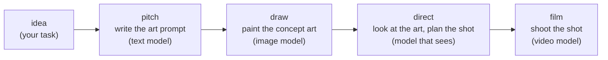

# Build an advanced agent

[Build your first agent](/docs/first-agent) wrote an agent whose stages pass text to each other.
This page builds one whose stages pass pictures and video. You give it a one-line idea. A text
model writes a prompt for concept art, and an image model paints it. A model that can see looks at
the painting and plans a shot to match, and a video model films that shot. What you get back is a
short film whose look came from the painting, not only from your words.



Every stage here runs on an OpenAI API key: `gpt-5.4-mini` writes and looks, `gpt-image-1-mini`
paints, and `sora-2` films. A run takes about two minutes and cost $0.42 when this page was
written, most of it the four seconds of video. A ChatGPT sign-in ([OpenAI
Codex](/docs/providers#openai-codex-chatgpt-subscription)) does not reach the image and video models,
so set `OPENAI_API_KEY` or add OpenAI in `lev setup`.

The ideas this page adds to the first one:

- Regions that hold images and video.
- A stage that writes to a region with a tool.
- What an image or video model is sent.
- A model that reads a picture another stage made.
- A run that hands back a file.

## Step 1: scaffold

```bash
lev create idea-to-film
cd idea-to-film
```

Open `agent.leviath`, delete what `lev create` wrote, and start with the header:

```toml
[agent]
name = "idea-to-film"
version = "0.1.0"
description = "Turn a one-line idea into concept art and a short film"
entry_stage = "pitch"
```

## Step 2: regions for words, a picture and a film

In the first agent every region held text. A region can hold any kind of file: an entry is a list
of **parts**, and a part is text or a stored file with a mime type. `accepts` says which types a
region takes, so a write of the wrong kind is refused with the reason. See
[More than text](/docs/mime).

```toml
# The idea, as the task you run the agent with.
[context.regions.idea]
kind = "pinned"
seed = "task"
required = true
budget = "5%"

# The prompt the pitch stage writes for the concept art.
[context.regions.art_prompt]
kind = "pinned"
budget = "5%"

# The concept art: one picture, the latest one drawn.
[context.regions.concept_art]
kind = "sliding_window"
max_items = 1
max_tokens = 4000
budget = "30%"
accepts = ["image/*"]

# The shot the director writes after looking at the art.
[context.regions.shot]
kind = "pinned"
budget = "5%"

# The finished film.
[context.regions.film]
kind = "sliding_window"
max_items = 1
max_tokens = 2000
budget = "10%"
accepts = ["video/*"]

[context.regions.conversation]
kind = "sliding_window"
max_items = 20
max_tokens = 8000
budget = "20%"
```

The picture and the film are not copied into every request. Each file is stored once in the run, by
its hash, and a region holds a reference to it. A model that can take the file is sent its bytes; a
model that cannot is sent one line naming it, such as `[image/png 1536x1024, 2.0 MB] image-1.png`.

## Step 3: pitch, a stage that writes a region

The first stage is a text model with one tool, `context_write`, which saves text into a region.
That is how a stage hands words to a later stage without handing over its whole conversation.

```toml
[stages.pitch]
mode = "autonomous"
description = "Turn the idea into a prompt for one piece of concept art"
available_tools = ["context_write"]
max_iterations = 6
system_prompt = """
You are the art lead on a short film. Read the idea and write one prompt for a
single piece of concept art: the subject, the setting, the light and the style,
in two or three sentences. Save it with context_write to the region
"art_prompt", then reply "done".
"""

[stages.pitch.context]
hide = ["concept_art", "shot", "film"]

[stages.pitch.model]
allow_user_default = false

[[stages.pitch.model.models]]
provider = "openai"
model = "gpt-5.4-mini"

[stages.pitch.transitions.draw]
hint = "Once the art prompt is saved."
gate = { require_region_updated = "art_prompt", message = "Save the art prompt to the art_prompt region first.", max_attempts = 3 }
```

The gate is what makes the hand-off safe. The stage cannot move to `draw` until `art_prompt` has
changed, so a model that says "done" without saving is told what is missing and tries again.
`allow_user_default = false` keeps this stage on the model named here even if your config has a
different default.

## Step 4: draw, an image model

An image model does not chat and calls no tools. It is sent a prompt, and the prompt is the text
the stage can see: the regions it has not hidden, and its conversation. So the stage hides
everything but the art prompt, and starts with an empty conversation:

```toml
[stages.draw]
mode = "autonomous"
description = "Paint the concept art from the art prompt"
max_iterations = 3

[stages.draw.context]
hide = ["idea", "shot", "concept_art", "film"]
reset = ["conversation"]

[stages.draw.model]
allow_user_default = false

[[stages.draw.model.models]]
provider = "openai"
model = "gpt-image-1-mini"

[stages.draw.model.parameters]
size = "1536x1024"
quality = "medium"

[stages.draw.output_routing]
"image/*" = "concept_art"

[stages.draw.transitions.direct]
hint = "Once the concept art is drawn."
gate = { require_region_updated = "concept_art", message = "Draw the concept art first.", max_attempts = 3 }
```

`[stages.draw.model.parameters]` is sent to the image route as written; each model's parameters are
listed in [Image, video and audio models](/docs/providers#image-video-and-audio-models).
`output_routing` is the other half of the hand-off: the picture the model makes goes to
`concept_art`, by its mime type, instead of into the conversation.

## Step 5: direct, a model that sees the art

`gpt-5.4-mini` takes images, so a stage on it that can see `concept_art` is sent the painting
itself. The director looks at it beside the idea and writes the shot:

```toml
[stages.direct]
mode = "autonomous"
description = "Look at the concept art and write the shot to film"
available_tools = ["context_write"]
max_iterations = 6
system_prompt = """
You are the director. Look at the concept art and the idea, and write the one
shot to film: what the camera sees, how it moves, and what happens, in four
seconds. Keep the look of the concept art: its palette, its light, its
subject. Two or three sentences. Save it with context_write to the region
"shot", then reply "done".
"""

[stages.direct.context]
hide = ["art_prompt", "shot", "film"]
reset = ["conversation"]

[stages.direct.model]
allow_user_default = false

[[stages.direct.model.models]]
provider = "openai"
model = "gpt-5.4-mini"

[stages.direct.transitions.film]
hint = "Once the shot is saved."
gate = { require_region_updated = "shot", message = "Save the shot to the shot region first.", max_attempts = 3 }
```

This is the step that makes the film match the art. The idea said "a cat"; the painting decided the
cat is black with amber eyes, sitting by a glowing lantern in the rain, and the director can only
know that by looking.

## Step 6: film, a stage that hands back a file

The last stage is an output stage on a video model. A video is made in the background at OpenAI
and waited for, so it gets a long `request_timeout_secs`. The film is routed into `film` and
declared as an artifact, so the run hands it back without any `submit_output` call:

```toml
[stages.film]
mode = "output"
description = "Film the shot"
max_iterations = 2

[stages.film.context]
hide = ["idea", "art_prompt", "concept_art", "film"]
reset = ["conversation"]

[stages.film.model]
allow_user_default = false
request_timeout_secs = 900

[[stages.film.model.models]]
provider = "openai"
model = "sora-2"

[stages.film.model.parameters]
seconds = 4
size = "1280x720"

[stages.film.output_routing]
"video/*" = "film"

[[stages.film.output.artifacts]]
name = "film"
type = "video/mp4"
required = true
```

Why is the painting hidden here? `sora-2` can start from an image, but only one exactly the size of
the video, and `gpt-image-1-mini` does not paint at `1280x720`. The shot text carries the look
instead. With [Veo](/docs/providers#image-video-and-audio-models) or
[xAI's video models](/docs/providers#xai), which take an image of any size, show `concept_art` to this
stage and the film starts from the painting itself.

## Step 7: check it and run it

```bash
lev validate .
```

A clean blueprint says `✓ Blueprint 'idea-to-film' is valid.` and lists the model each stage would
use on your install. Then run it:

```bash
lev run . --yolo --task "A lighthouse keeper's cat who guards the light on stormy nights"
```

Watch it move through the four stages in `lev dash`. Ask for the film once it finishes:

```bash
lev result <run-id> --artifact film --out .     # writes video.mp4
lev blobs <run-id>                              # every file the run holds
lev blobs <run-id> image-1.png > concept.png    # the concept art
```

When this page was written, the pitch stage saved *"A vigilant lighthouse keeper's cat perched
beside the lantern room window, guarding the beam on a storm-lashed night..."*. The painting showed
a black cat with amber eyes by the glowing lantern. The director saved *"the camera slowly
pushes in on the black lighthouse keeper's cat perched beside the glowing lantern room, its amber
eyes steady in the rain..."*. The film that came back is that cat, in that light.

## The whole file

```toml
[agent]
name = "idea-to-film"
version = "0.1.0"
description = "Turn a one-line idea into concept art and a short film"
entry_stage = "pitch"

[context.regions.idea]
kind = "pinned"
seed = "task"
required = true
budget = "5%"

[context.regions.art_prompt]
kind = "pinned"
budget = "5%"

[context.regions.concept_art]
kind = "sliding_window"
max_items = 1
max_tokens = 4000
budget = "30%"
accepts = ["image/*"]

[context.regions.shot]
kind = "pinned"
budget = "5%"

[context.regions.film]
kind = "sliding_window"
max_items = 1
max_tokens = 2000
budget = "10%"
accepts = ["video/*"]

[context.regions.conversation]
kind = "sliding_window"
max_items = 20
max_tokens = 8000
budget = "20%"

[stages.pitch]
mode = "autonomous"
description = "Turn the idea into a prompt for one piece of concept art"
available_tools = ["context_write"]
max_iterations = 6
system_prompt = """
You are the art lead on a short film. Read the idea and write one prompt for a
single piece of concept art: the subject, the setting, the light and the style,
in two or three sentences. Save it with context_write to the region
"art_prompt", then reply "done".
"""

[stages.pitch.context]
hide = ["concept_art", "shot", "film"]

[stages.pitch.model]
allow_user_default = false

[[stages.pitch.model.models]]
provider = "openai"
model = "gpt-5.4-mini"

[stages.pitch.transitions.draw]
hint = "Once the art prompt is saved."
gate = { require_region_updated = "art_prompt", message = "Save the art prompt to the art_prompt region first.", max_attempts = 3 }

[stages.draw]
mode = "autonomous"
description = "Paint the concept art from the art prompt"
max_iterations = 3

[stages.draw.context]
hide = ["idea", "shot", "concept_art", "film"]
reset = ["conversation"]

[stages.draw.model]
allow_user_default = false

[[stages.draw.model.models]]
provider = "openai"
model = "gpt-image-1-mini"

[stages.draw.model.parameters]
size = "1536x1024"
quality = "medium"

[stages.draw.output_routing]
"image/*" = "concept_art"

[stages.draw.transitions.direct]
hint = "Once the concept art is drawn."
gate = { require_region_updated = "concept_art", message = "Draw the concept art first.", max_attempts = 3 }

[stages.direct]
mode = "autonomous"
description = "Look at the concept art and write the shot to film"
available_tools = ["context_write"]
max_iterations = 6
system_prompt = """
You are the director. Look at the concept art and the idea, and write the one
shot to film: what the camera sees, how it moves, and what happens, in four
seconds. Keep the look of the concept art: its palette, its light, its
subject. Two or three sentences. Save it with context_write to the region
"shot", then reply "done".
"""

[stages.direct.context]
hide = ["art_prompt", "shot", "film"]
reset = ["conversation"]

[stages.direct.model]
allow_user_default = false

[[stages.direct.model.models]]
provider = "openai"
model = "gpt-5.4-mini"

[stages.direct.transitions.film]
hint = "Once the shot is saved."
gate = { require_region_updated = "shot", message = "Save the shot to the shot region first.", max_attempts = 3 }

[stages.film]
mode = "output"
description = "Film the shot"
max_iterations = 2

[stages.film.context]
hide = ["idea", "art_prompt", "concept_art", "film"]
reset = ["conversation"]

[stages.film.model]
allow_user_default = false
request_timeout_secs = 900

[[stages.film.model.models]]
provider = "openai"
model = "sora-2"

[stages.film.model.parameters]
seconds = 4
size = "1280x720"

[stages.film.output_routing]
"video/*" = "film"

[[stages.film.output.artifacts]]
name = "film"
type = "video/mp4"
required = true
```

## Make it yours

- **Give it a voice.** Add a stage on `gpt-4o-mini-tts` that reads a line the director writes, and
  route `audio/*` into a region of its own. A speech model, like an image model, is sent the text
  it can see.
- **Start the film from the art.** Swap `sora-2` for `veo-3.1-lite-generate-preview` (a Google key)
  and let `film` see `concept_art`: Veo takes the painting as the first frame.
- **Mix providers.** Nothing ties the stages to one vendor. Paint with `gemini-3.1-flash-image` or
  a Stability model on Bedrock, and film with `grok-imagine-video`; list more than one model on a
  stage and the first one you have a key for is used.
- **Choose between drafts.** Raise `max_items` on `concept_art`, set the draw model's `n` to 3, and
  give `direct` the job of picking the best one.

## Where to go next

- [More than text](/docs/mime) explains parts, the mime registry, and what a model is sent when it
  cannot take a file.
- [Image, video and audio models](/docs/providers#image-video-and-audio-models) lists every media
  model and its parameters.
- [Final outputs](/docs/outputs) covers artifacts, and output stages that hand back more than one
  file.
- [Structured context](/docs/context#routing-produced-parts) covers `output_routing`, `hide` and
  `reset` in full.
