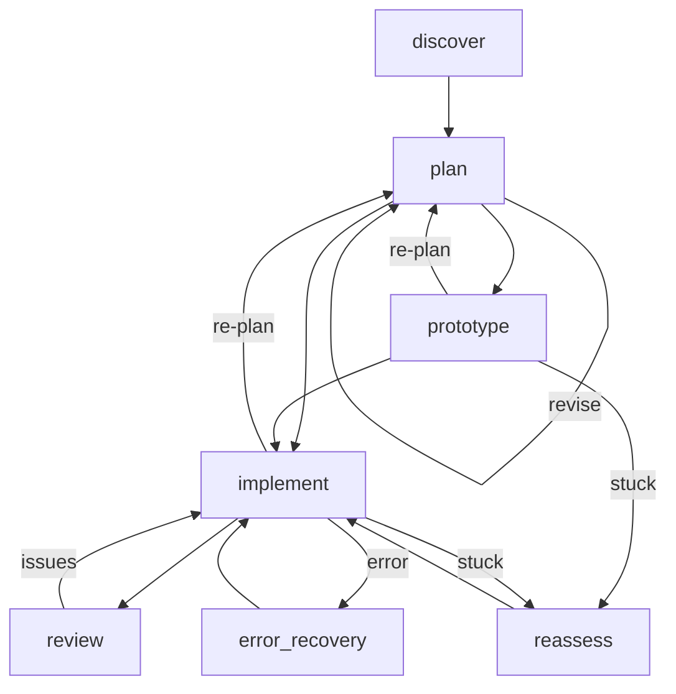
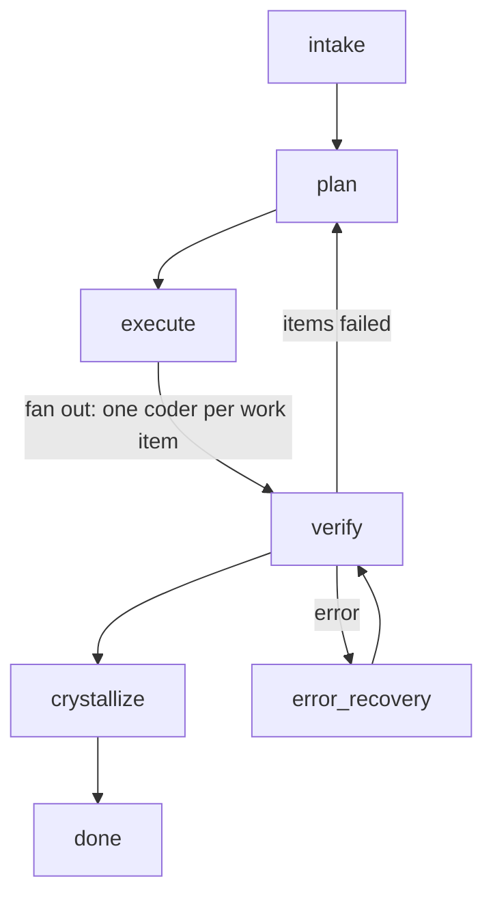
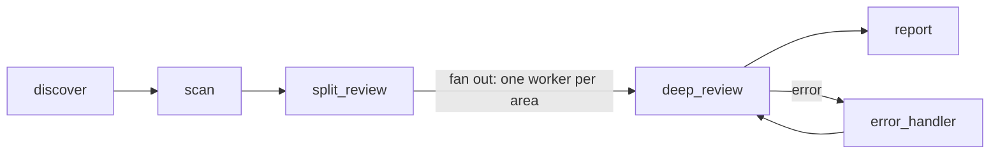
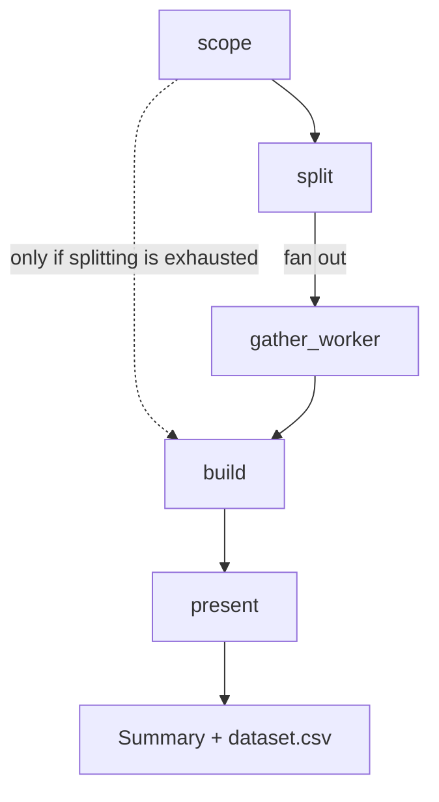
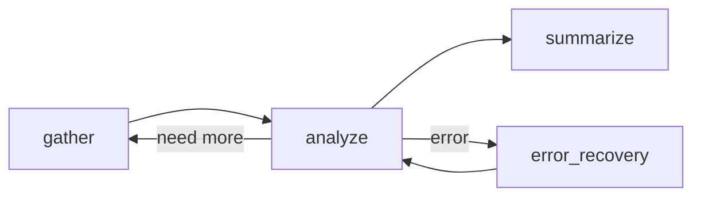
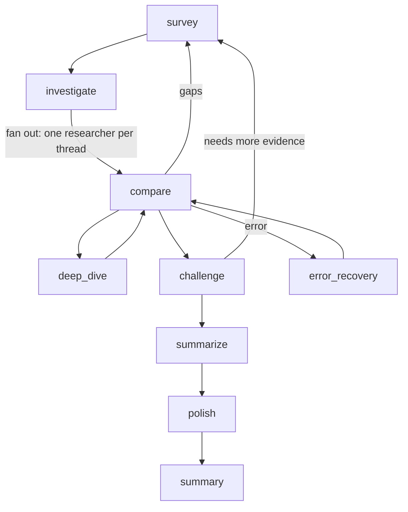
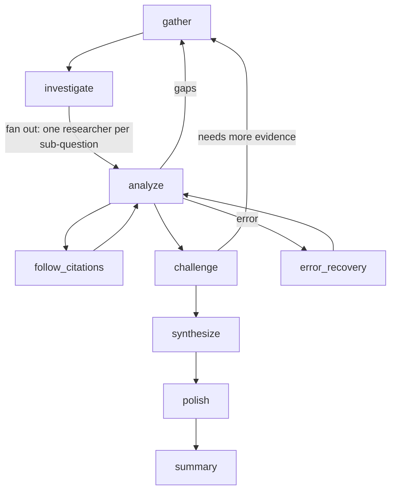
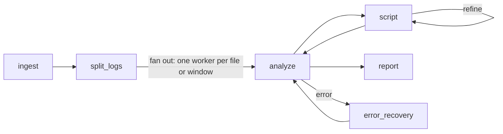

# Agent catalog

Leviath ships with eight pre-built agents. `lev setup` installs them into `~/.leviath/agents/`
(scripting it? pass `--install-agents`), one directory per agent, each holding an `agent.leviath`
[blueprint](/docs/agents). Run any of them by name:

```bash
lev run coder --task "Build a CLI that converts CSV to JSON"
```

Each entry names the models its stages prefer. Those are first choices, not requirements: every
bundled agent lists all five providers, and a stage falls back to the one you configured.

This page is also a set of worked examples. Each section shows the agent's real stages and how
they route, so you can copy the patterns into your own blueprint (`lev create my-agent` scaffolds
one, then read [Agents](/docs/agents)). The diagrams are simplified: they show each agent's main
path, and most draw the edge into its error-recovery stage, but a real graph has more edges than
these. `lev validate <agent>` prints every one of them.

> [!TIP]
> Pick by the shape of the work: a codebase change (the coding agents), a question to answer from
> sources (the research agents), or a recurring chore like triaging logs. Not sure? Run `coder`
> for one change, or `orchestrator` for a goal that is several.
>
> `coder` aside, every agent that has more than one thing to cover
> [fans out](/docs/sub-agents): `data-analyst`, `deep-researcher`, `log-analyzer`, `orchestrator`,
> `reviewer`, and `wide-researcher` all work on several at once instead of one after another.

## coder

Discover the repo, plan with your sign-off, optionally spike an uncertain approach, implement, and
review. The coding agent: reach for it for any change to a codebase.



```bash
lev run coder --task "Add rate limiting to the public API"
```

`discover` answers what the repository is and how to verify work in it before anything is planned,
so the plan is grounded in the project rather than in guesswork.

The `plan` stage runs in `interactive_points` mode, so it stops for your approval before any code
is written. That is the [human-in-the-loop](/docs/interaction) pattern. Unattended, the checkpoint
resolves as approved rather than stranding the run, so `--yolo` in CI still works. Set
`unattended = "ask"` on the interaction point if you would rather an unattended run wait.

`plan` also chooses between going straight to `implement` and spiking first with `prototype` when
the approach is uncertain, and `reassess` is reached only on a `stuck` edge. `discover` and `plan`
run on Sonnet; `implement`, `review`, and `reassess` step up to Opus, so it is a
[multi-model](/docs/stages) blueprint.

## orchestrator

Hand it a goal rather than a single change. It maps the repository, splits the goal into
independent work items, runs one `coder` per item at the same time, verifies what came back, and
persists the mechanical steps it noticed as Rhai tools for every later run. This is the agent a
host agent such as Claude Code is handed by default when it delegates to Leviath, and the one to
reach for when nothing more specific fits.



```bash
lev run orchestrator --task "Move the service from Express 4 to Express 5 without changing its routes"
```

`intake` does what `coder`'s `discover` does: it writes down what the repository is and how work
in it is verified, ending in literal BASELINE, VERIFY and DONE WHEN lines. `plan` then splits the
goal into items whose files do not overlap, each with its own check. Both run without a checkpoint,
because a host calls this agent from a tool schema with nobody watching a prompt.

`execute` is a [fan-out](/docs/sub-agents) stage whose workers are full `coder` runs, one per work
item, sharing only the working directory. `coder` is a separate installed blueprint; `lev setup`
installs the bundled set together, and a run on a machine without it reports the missing worker per
item rather than failing outright. `verify` merges the results, runs the VERIFY and DONE WHEN lines
itself rather than trusting a worker's claim, and either moves on or sends the failed items, and
only those, back to `plan`.

`crystallize` is what makes the second run cheaper than the first. While verifying, the agent
appends every step that was mechanical and repeated to a `learnings` region. `crystallize` turns
the ones that qualify into Rhai scripts and installs them with the
[`install_tool`](/docs/rhai-tools#installing-a-tool-from-a-run) built-in, which compiles a script
before writing it to `~/.leviath/tools/`. A step qualifies when it recurred, is more than one
`shell` command, encodes fixed arguments and parses its output, carries a description saying when
to use it, and is named `<domain>_<verb>`. Judgement never qualifies. `install_tool` is `ask` by
default, so an attended run confirms each install and `--yolo` waives it; `lev tools` lists what
has landed, with a provenance line in each file.

The loop closes on the next run. `intake` and `verify` set `available_global_tools = true`, as do
`coder`'s `implement` and `review` stages, so
[every installed tool is offered](/docs/agents#which-tools-a-stage-gets) to them without a
blueprint naming it. Their prompts tell the model that any tool in its list that is not a built-in
came from an earlier run, to prefer it, and to report in `learnings` when it is missing or wrong.
`plan` and `crystallize` do not set it: an installed Rhai tool may call `shell()` or
`write_file()`, and those two stages must not change the machine, so they see only the read-only
built-ins they name (plus `install_tool` in `crystallize`). `crystallize` still avoids duplicates,
because `verify` reports an existing tool in `learnings` and `install_tool` refuses a name that is
already taken unless `overwrite` is set.

This is also the agent a host such as Claude Code or Grok reaches for when you say "use leviath
to ...": see [Claude Code, Grok and other agents](/docs/host-agents) for the one command that wires
that up.

## reviewer

Review only: a fast scan pass, then a deeper look at correctness, security, and architecture,
ending in a ranked report. Reach for it to vet a diff or PR.



```bash
lev run reviewer --task "Review the changes on the feature/auth branch"
```

The two-pass split is deliberate: `scan` runs on Sonnet to flag areas, then the review itself
escalates to Opus to scrutinize only what was flagged, which keeps the expensive model focused.

`split_review` is a [fan-out](/docs/sub-agents) stage: one worker per file, module, or group of
hunks, all reviewing at once. `deep_review` merges their findings, re-checks the blocking ones,
covers any area whose worker failed, and then looks for what no single area could show. A small
change is one work item, so a two-file diff does not pay for a fan-out it does not need.

## data-analyst

Searches the web for data on a subject, builds a clean CSV of it, and hands back a summary of what
the numbers say. Reach for it when you want a dataset you can open, not a paragraph about one.



```bash
lev run data-analyst --task "EV registrations by country, 2015 to 2024"
lev result <run-id>                       # what the numbers say
```

`scope` decides the table's columns before anything is gathered, which is what keeps a hundred rows
from drifting into a hundred shapes. `split` runs in `fan_out` mode, one worker per slice of the
subject, so a broad question is gathered in parallel rather than one source at a time. See
[Sub-agents and fan-out](/docs/sub-agents).

Each worker hands back CSV rows through [`submit_output`](/docs/outputs), and `require_output` makes
that a guarantee rather than a hope. The worker's `format = "csv"` label travels with the
submission, so the merge knows what shape it is being handed.

`present` is instructed to name `data/dataset.csv` in its `artifacts`, so a caller fetches the file
rather than parsing its path out of prose.

## researcher

General-purpose research: gather, analyze, summarize, with a refinement loop. Reach for it for a
quick, focused answer.



```bash
lev run researcher --task "What changed in the HTTP/3 spec this year?"
```

The `analyze` stage loops back to `gather` when a specific sub-topic is thin, then moves to
`summarize` once the picture holds. `analyze` runs on Opus; gather and summarize stay cheap, the
[multi-model](/docs/stages) split again.

## wide-researcher

Broad landscape survey: cast a wide net, compare approaches, deep-read the interesting threads,
then write an overview with recommendations. Reach for it to map a whole space.



```bash
lev run wide-researcher --task "Survey approaches to vector database indexing"
```

`investigate` is a [fan-out](/docs/sub-agents) stage, and its workers are full `researcher` runs
rather than stages of this blueprint. Every thread the survey found is researched at the same time,
each with its own clean context window, and their findings merge into `compare`. A worker that finds
its thread is really several independent subjects can split again, one level further.

`challenge` and `polish` work as they do in [deep-researcher](#deep-researcher): every route to the
writing stage passes through an adversary that can send the survey back for more evidence, and the
finished overview is rewritten in plain language without any fact, number, citation or caveat
changing.

`compare` is then the hub: widen coverage (back to `survey`), pull one thread for a focused
`deep_dive`, or finish.

## deep-researcher

Thorough single-topic investigation: follows citation chains, cross-checks claims, and produces a
structured, cited report. Reach for it when rigor and sources matter.



```bash
lev run deep-researcher --task "Investigate the evidence for X causing Y"
```

A thorough investigation is usually several questions wearing one coat. `investigate` is a
[fan-out](/docs/sub-agents) stage that splits them out and runs each as its own `researcher` sub-agent
in parallel, merging what comes back into `analyze`. A sub-researcher that finds its own slice is
several independent subjects can split again, one level further.

`follow_citations` is a dedicated targeted-read stage: `analyze` flags a specific cited source, the
stage pulls and reads it, then hands control back.

`challenge` is the gate to the report, and every path to the writing stage runs through it. A
different vendor's model attacks the analysis, marks what holds as well as what is weak, and can send
the run back to gather more evidence. A different vendor on purpose: an adversary that shares the
writer's blind spots is not an adversary. Making it optional does not work, because a model that
feels confident will not elect to be attacked, and confidence is the failure it exists to catch.

`polish` rewrites the finished report in plain language without touching a fact, number, citation or
caveat. It exists because the stage that gathers the most evidence is not the one that writes the
clearest prose, and asking one model for both gets a worse version of each.

Per stage, the models are chosen on measurement rather than by defaulting to one family: a fast
broad-search model gathers, a cheaper reasoning model analyses, a strong writer synthesises, a
different vendor challenges, and a plain-language model polishes. See
[providers](/docs/providers) for how a stage picks its model and falls back.

## log-analyzer

Analyzes log files for anomalies, trends, and error patterns through a scripted analyze and script
loop, keeping a severity-ranked findings index. Reach for it to triage a noisy log.



```bash
lev run log-analyzer --task "Find the error patterns in /var/log/app.log"
```

`split_logs` is a [fan-out](/docs/sub-agents) stage: one sweeper per log file, per service, or per
time window of a single large file, all reading at once. `analyze` merges what they found, and a
slice whose worker failed comes back as unswept rather than silently missing. One log file is one
work item, so a single file does not pay for a fan-out.

`analyze` (on Opus) then hands off to `script` to write and run parsing or aggregation code, which
can refine itself before returning results. Findings persist in a [context region](/docs/context)
across passes so the report ranks them by severity.

## Running one

Every agent runs the same way, name it and hand it a task:

```bash
lev run deep-researcher --task "Survey the state of solid-state batteries"
```

To build your own, read how blueprints are structured in [Agents](/docs/agents), how the stage
graph routes and recovers in [Multi-stage workflows](/docs/stages), and how the parallel agents
split work in [Sub-agents and fan-out](/docs/sub-agents).
