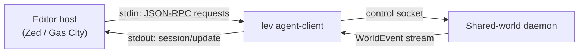

# Agent Client Protocol (editor integration)

Editors and orchestrators want to drive an agent themselves rather than have you type at a terminal.
The **Agent Client Protocol** is the common language for that: the host launches the agent as a
child process and talks to it over that process's stdin and stdout.

`lev agent-client` is Leviath speaking it. The host sends protocol messages, and the command turns
those into runs on the shared-world [daemon](/docs/daemon), streaming output back as it happens.

> [!WARNING]
> "ACP" means two unrelated things, so Leviath never writes it unqualified. This is the Agent
> **Client** Protocol, JSON-RPC over stdio. It is not the Agent *Communication* Protocol, a REST
> and SSE API from the BeeAI project.

## What it is

The Agent Client Protocol lets an editor host launch an agent as a subprocess and drive it over the
process's stdin/stdout. Messages are framed as **one compact JSON object per line** (newline-delimited
JSON-RPC 2.0), with a 64 KiB ceiling per frame. The handshake and turn cycle are:

- `initialize`: capability exchange; the protocol version is `1`.
- `session/new`: open a session (carries the working directory).
- `session/prompt`: send a prompt turn; spawns (or, on later prompts, messages) an agent in the daemon.
- `session/update`: notifications streaming the agent's live output back to the host.
- `session/cancel`: cancel the in-flight turn.

The hosts named in the Leviath source are **Zed** and **Gas City**.

## How a host connects

The host launches `lev agent-client` and speaks JSON-RPC over the process's own stdin/stdout. Every
prompt is forwarded to the daemon over its control socket; the daemon's live event stream and each
run's per-stage output are translated into `session/update` notifications until the run finishes or parks.



> [!NOTE]
> stdout is reserved for the JSON-RPC channel. All logs and diagnostics go to **stderr** so they
> can't corrupt the protocol stream.

## Starting it

```bash
lev agent-client --agent my-agent
```

With no `--agent`, each session's working directory is searched for an `agent.leviath` blueprint.

Flags (run `lev agent-client --help` for the authoritative list):

| Flag | Purpose |
|---|---|
| `--agent <name-or-path>` | Blueprint to serve: an installed [agent](/docs/agents) name, or a path to one. Omitted, the session's working directory is searched. |
| `--yolo` | Approve every tool call without prompting. Recommended when the host does not implement `session/request_permission` (e.g. Gas City). |
| `--allow <tool>` | Allow a tool outright. Repeatable. |
| `--max-depth <n>` | Override the blueprint's max sub-agent tree depth. |
| `--no-seed-commands` | Refuse the blueprint's `seed = { command = "..." }` regions, which run at spawn before any approval prompt. |
| `--output-format <label>` | Ask for the [final output](/docs/outputs) in this shape. Any label works. One that differs from the blueprint's retires its declared validator and schema. |
| `--output-instructions <text>` | Extra guidance about that shape. |

## The agent's answer

ACP has no result field. A turn returns a stop reason, and everything the user sees arrives as
`agent_message_chunk` updates carrying the stage's streamed output.

An agent that submits a [final output](/docs/outputs) gets one more chunk at the end of the turn,
holding the answer and its format label. It is set apart from the streamed output, so a host can show
it as the agent's conclusion rather than more log text.

A run that submits nothing adds nothing. Ask for a shape with `--output-format`, since the protocol
carries no field for it.

The files a run produced follow the answer, one `resource_link` block per artifact with its name,
its mime type and a `file://` URI into the session's working directory, so a host can open or
show them itself. Nothing is inlined: the host asked for a link it can follow, and a video does not
belong in a chat stream.

## Files in a prompt

`initialize` advertises `image` and `audio` prompt capabilities. An `image` or `audio` block's
bytes, and a `resource` block carrying a `blob`, become typed [parts](/docs/mime) on the task
region, exactly as `lev run --attach` sends them: the daemon stores each one and the model sees it
natively when the model takes the type, or as a stand-in otherwise. An image or audio block has no
name in the protocol, so it is named for its kind and position (`image-1.png`); a resource keeps the
last segment of its URI. A prompt that is only files gets a line naming them as its text. A
`resource_link` whose `file://` URI points inside the session's working directory is read there and
rides the prompt as a part too, named as the host named it, and the text marks it as attached under
its URI. Any other link (another scheme, a path outside the working directory, an empty file or one
over the part ceiling) is named in the text and marked as not fetched, since the agent has no other
way to read a host's file by reference. On a later prompt the same blocks ride the message.

## Permission handling

Hosts that implement the client-side methods advertise capabilities at `initialize`, and the agent
surfaces tool approvals as `session/request_permission` requests the host answers. OpenClaw's acpx
backend answers them. Hosts that send no capabilities (Gas City sends none) cannot answer such a
request, so instead of deadlocking, the question is surfaced as output and the turn stays in
flight. Answer it from Leviath's own surfaces, `lev respond` or `lev dash`, and the run continues.
It waits until you do, unless `[limits] interaction_timeout_secs` is set, in which case an
unanswered request is denied when that passes. Use `--yolo` (or scoped `--allow` flags) to run
unattended against such a host.

## Connecting a host

Point the host's agent command at `lev agent-client`, then open a session and prompt it. Output
streams back as the run progresses.

```bash
lev agent-client --agent coder --yolo
```

[Gas City](/docs/gas-city) and [OpenClaw](/docs/openclaw) have pages of their own, with the config
each one wants and the settings worth adjusting.

> [!NOTE]
> Editor integration is a thin front end over the daemon, exactly like `lev run` and `lev serve`. It
> owns no agent world of its own. See the [daemon](/docs/daemon) for what actually hosts the run, and
> the [CLI reference](/docs/cli) for the rest of the `lev` commands.

## If the daemon restarts mid-turn

A `lev daemon restart` while a prompt is streaming does not end the turn. The bridge waits for the
daemon to come back (up to ten seconds), subscribes again, and follows the run, which the new
daemon reloads from disk. The editor sees the output pause and resume. The turn ends only when no
daemon returns, with whatever the run had written by then.

If the daemon comes back on a different build than the bridge, which is what a `lev update` looks
like from a session that was already open, the bridge says so in the conversation and carries on.
The remedy is on the editor's side: start a new session, so the bridge and the daemon run the same
code.
