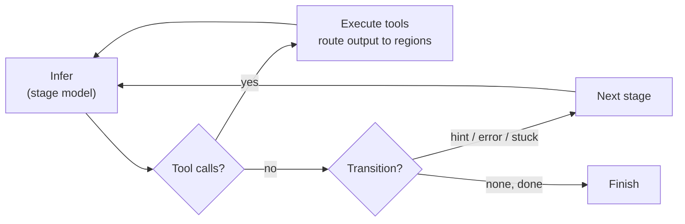
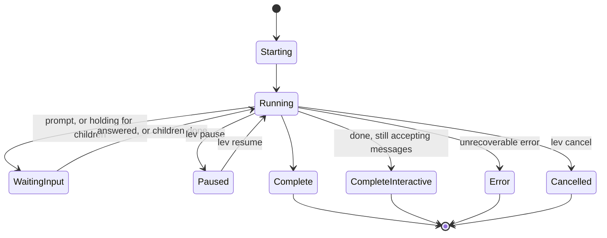

# Agent blueprints (`agent.leviath`)

A **blueprint** is a multi-stage [workflow graph](/docs/stages): a directory holding an
`agent.leviath` TOML file and the blueprint's own tools and scripts. Each `lev run` of it is a run.
The [agent catalog](/docs/agent-catalog) has seven complete ones worth stealing from.

New to this? [Build your first agent](/docs/first-agent) walks through writing one stage by
stage; this page is the reference for every field it uses.

Start from a scaffold rather than a blank file:

```bash
lev create my-agent
cd my-agent
lev run . --task "Your task here"
```

A blueprint needs very little to run: a name, an entry stage, and one stage with a prompt.
Everything else on this page is opt-in from there. A fuller one looks like this
(machine-checkable against the published
[blueprint schema](https://leviath.dev/docs/stable/blueprint.schema.json)):

```toml
[agent]
name = "coder"
version = "0.2.0"
description = "Analyze, implement, and review with graph-based recovery"
entry_stage = "analyze"

[tool_permissions]           # global defaults; per-stage overrides allowed
read_file  = "allow"
write_file = "ask"
bash       = "ask"

[stages.analyze]
mode = "autonomous"
model = { models = ["claude-sonnet-5", "gpt-5.4-mini"] }
available_tools = ["read_file", "list_dir"]
required_tools = []                # human-in-the-loop tools kept in an unattended run
max_iterations = 15
system_prompt = """Understand the task and produce a short implementation plan."""

[stages.analyze.transitions.implement]
hint = "Plan ready, begin implementation"
```

## The run loop

Within a stage, an agent runs a tight loop (infer, act on tool calls, repeat) until the model
signals it's done or a [transition](/docs/stages) fires:



## Lifecycle

A run moves through a handful of states the [dashboard](/docs/dashboard) and [API](/docs/api)
report on:



These are the exact `RunStatus` values the [dashboard](/docs/dashboard) and [API](/docs/api)
report. `CompleteInteractive` means every required stage finished but the agent is still
accepting [messages](/docs/interaction).

`WaitingInput` covers two very different situations: a run stopped on a prompt somebody has
to answer, and a run parked while its own [sub-agents](/docs/sub-agents) or
[fan-out](/docs/stages) workers get on with it. The second needs nothing from you.
[`lev ps`](/docs/cli#reading-lev-ps) tells them apart, so reach for it before concluding a
run is stuck.

## Stages and models

Each stage gets its own **model** (an ordered list of models, best first: the first one a configured
provider serves wins), tools, iteration cap, and context layout. Transitions form a
[graph](/docs/stages): linear by default, or branch on conditions like `error` and `stuck`.

```toml
[stages.analyze.model]
allow_user_default = true          # let the host's override_model and fallback_model apply;
                                   # false keeps this list exactly as written
models = ["claude-sonnet-5", "gpt-5.4-mini"]
                                   # name models, not routes: whichever provider
                                   # the user configured is asked which it serves.
                                   # Pin one only for a model a single route can
                                   # reach: { provider = "ollama", model = "..." }
request_timeout_secs = 120         # per-stage inference wall-clock cap

[stages.analyze.model.parameters]  # free-form, passed through to the provider
temperature = 0.2
max_output_tokens = "40%"          # see below; everything else goes to the provider as written
```

`max_output_tokens` is the one parameter Leviath reads itself: it is the most one reply may
contain. Three forms:

| Form | Meaning |
|---|---|
| `max_output_tokens = 8000` | a fixed number of tokens, sent as written |
| `max_output_tokens = "40%"` | that share of the model's context window |
| `max_output_tokens = "100% of claims"` | that share of the `claims` region's budget, for a stage whose reply fills a region |

The table form `{ percent = 100, of = "claims" }` is the same as the last one. A relative cap is
resolved when each request is built, against whichever model the stage landed on, and is never
more than that model's own maximum. A cap the loader cannot read fails the load, because a limit
that silently becomes "no limit" is the kind of typo that only shows up as a bill.

Prefer a relative cap for a stage that writes something whose size follows the material (a report,
a rewrite of a file). A fixed number is easy to set smaller than the thing being written, and a
reply cut off by its cap is not an answer. The runtime sends it back with the reason and retries
once at the model's maximum, but the first attempt is still paid for.

A tool call cut off halfway through its arguments is not run. The model is shown what arrived and
told how to split the call. For `write_file` that means writing the first part, then adding each
later part with `"append": true`. From the second cut-off in a row the model is also told not to
resend the call and how many tries it has left. If a fourth reply in a row is cut off in a tool call,
the stage ends with an error. It takes the stage's `error` edge when there is one, and the run fails
when there is not. Replies that are not cut off, however many tool calls they make, start the count
again.

Model selection is per stage, and only per stage. Two mistakes here are quiet ones. A top-level
`[model]` block parses and is read by nothing, and a stage naming no model takes the host default
without saying so. `lev validate` reports both. See
[every stage should name its own model](/docs/stages#every-stage-should-name-its-own-model).

### Which tools a stage gets

`available_tools` lists what the stage may call, by name or by kind. `@builtin`, `@subagent`,
`@scripts`, `@mcp` and `@all` each grant every tool of that kind, so `["@builtin", "@scripts"]`
is every built-in and every Rhai tool with nothing to keep in step. See
[tool groups](/docs/tools#tool-groups) for what each reaches and what none of them grant.

`required_tools` is the exception to the unattended cut. A [`--yolo`](/docs/glossary) run drops
every tool that waits on a person, and this is where a stage names the ones it wants kept anyway.
Every entry must also appear in `available_tools`, by name or through a group that reaches it;
`lev validate` checks the group case against the tools this install has.

Naming a tool here also settles the `blocking-tool-in-autonomous-stage` lint for it, since listing
it is how you say you meant it. See
[human-in-the-loop tools](/docs/tools#these-tools-need-someone-there).

#### Naming a tool from an MCP server

An MCP tool is always named `<server>__<tool>`: the server it came from, two underscores, then
the tool the server calls it:

```toml
available_tools = ["read_file", "tracker__create_issue"]
```

The server is part of the name whether or not anything would have collided. Two servers that both
offer `search` are `tracker__search` and `wiki__search`, and a grant means the same thing however
your `config.toml` is ordered.

The separator is `__` rather than a dot because the name is passed to the model provider, and
providers only accept `[A-Za-z0-9_-]`. A dot anywhere in a server or tool name is rewritten to `_`
for the same reason, so a server called `my.tools` offering `find.all` is advertised as
`my_tools__find_all`.

To grant a server's whole set instead of naming its tools one at a time, see
[granting a whole server](/docs/mcp#granting-a-whole-server).

## Context regions

`[context.regions]` defines the memory layout. There are nine region kinds (the default is
`temporary`); see [Structured context](/docs/context) for what each one does. Budgets come in
three forms:

```toml
[context.regions.codebase]
kind = "compacting"
budget = "35%"             # ceiling as a share of the model's context window
max_tokens = 60000         # absolute guard-rail the percentage never exceeds
min_tokens = 4000          # absolute floor on small context windows

[context.regions.task]
kind = "pinned"
max_tokens = 2000          # bare max_tokens alone = fixed absolute budget
```

Percentages are **ceilings, not allocations**. They may sum past 100%, because regions rarely all
fill at once. With a percentage, `max_tokens` caps and `min_tokens` floors the resolved value;
without one, `max_tokens` is the fixed budget. Compacting regions also take
`threshold_tokens`, the fill level that triggers compaction.

### Say how much a region moves

```toml
[context.regions.task]
kind = "pinned"
volatility = "stable"      # seeded once, never written again

[context.regions.findings]
kind = "pinned"
volatility = "grows"       # the agent appends to it

[context.regions.plan]
kind = "pinned"
volatility = "rewritten"   # revised in place each time - the default
```

Providers cache the prompt by prefix, so a region that changes invalidates the cache for every
region assembled behind it. `volatility` is what orders them: `stable` first, `grows` next and
split so its settled part still caches, `rewritten` last where it invalidates only itself.

The kind cannot answer this, which is why the setting exists. Every region above is `pinned`.
That means "never evicted", not "never written", and `context_write` into a findings region is an
ordinary move. Only the blueprint knows which is which.

Leaving it out is safe: an unclassified region is assumed to change and placed last, so declaring
can only improve matters. A region that claims `stable` and then keeps changing is named in the
log, because a wrong declaration is worse than none. It puts churn at the front of the prompt,
where it costs the most. See [what caching costs](/docs/context#what-caching-costs).

A stage can override the whole layout for itself alone with `[stages.<name>.context.regions]`. The
per-stage layout applies when the stage is entered, and uses the same syntax:

```toml
[stages.plan.context.regions.constraints]
kind = "pinned"
budget = "10%"
```

**A region the stage leaves out is hidden, not destroyed.** It keeps its contents and is left out
of that stage's prompt. It comes back with everything in it as soon as a later stage declares it
again. That is what makes this usable for narrowing: a compute stage need not carry a large data
preview through every one of its calls, and a summary stage further on can still read it.

`conversation`, `tool_results` and `final_output` are always visible, whatever a stage declares.
The first two hold the typed tool-call turns the next stage's own turns attach to, and an answer
submitted early has to survive to the end.

Re-declaring a layout is the heavy form. When a stage only needs to leave one or two regions out,
name them instead:

```toml
[stages.polish.context]
hide = ["sources"]        # everything else is carried exactly as the global layout says
```

`hide` is the right tool for the common case: a region of raw material (fetched pages, tool
output) that an early stage fills and a late stage never reads. Left in, it is re-sent on every
call of every later stage; a report-polishing stage in the bundled deep-researcher was carrying
125,000 tokens of sources it had no instruction to look at. A name that matches no region fails
the load, and the always-visible regions above cannot be hidden. The hidden set is decided afresh
by each stage: a stage that declares neither `regions` nor `hide` carries everything.

## Seed commands

A region can be seeded before the run starts:

```toml
[context.regions.codebase]
kind = "compacting"
seed = { command = "git ls-files" }
```

Seeds run at spawn **before any approval prompt**, confined to the workdir and routed through the
entry stage's sandbox, time- and size-capped.

> [!WARNING]
> A seed command runs a shell command before you approve anything, so it must be covered by
> [`[safe_commands]`](/docs/interaction#what-runs-without-asking) to run at all. `lev validate`
> prints every seed a blueprint will run; review them for third-party blueprints. Refuse with
> `--no-seed-commands` or `[security] allow_seed_commands = false`.

## Read paths

An agent that needs to *read* beyond its workdir, for run archives, design docs, or sibling
directories, declares them:

```toml
[read_paths]
allow = ["~/.leviath/runs", "../shared-docs", "glob:~/design-docs/**"]
```

The declarations do nothing on their own: the user's config must grant them, they are
read-only, and every access is checked against the symlink-resolved real path. Run
`lev validate` to see which of them the config on this machine actually grants. See
[Security](/docs/security) for the grant stanzas and the full matching rules.

## Mime types the agent brings

An agent whose tools make or take a format nothing else knows can describe it itself:

```toml
[mime_types."application/x-acme-scene"]
family = "model"
extensions = ["scene"]
magic = "41434D45"
check = "checks/scene.rhai"      # relative to this directory; refuses bytes that are not a scene
```

The rows are the same shape as the operator's
[`mime_types.toml`](/docs/configuration#mime_typestoml) and layer over it for this agent's
runs only, so a blueprint travels with the types it needs and never changes what another agent
sees. They are checked when the manifest is parsed, so a misspelled field fails `lev validate`
and the spawn. A `check` script is compiled beside the agent's other scripts with the same
fence: it has to live inside the blueprint's directory. [Mime](/docs/mime#the-registry) has
every field and [Rhai mime checks](/docs/rhai-mime-checks) the script.

## Dependencies

An agent can say what has to be in place on the machine before it runs, as a top-level
`[[dependencies]]` array. This is a declaration, never a grant: Leviath shows the operator what is
missing and how to fix it, and a run whose required dependency is unmet fails to spawn before any
model is billed. `lev deps check <agent>` reports the same findings, and `lev deps install <agent>`
sets them up after asking.

Each entry has a `name`, a `kind`, an optional `required` (true by default), a human `remedy`
shown when it is missing, and an optional `description`. The kind chooses what must be present:

```toml
# An MCP server that must be configured, plus the secret it needs.
[[dependencies]]
name = "meshy"
kind = "mcp_server"
server = "meshy"
env = ["MESHY_API_KEY"]
remedy = "Run: lev deps install my-agent, then set MESHY_API_KEY"

# What lev deps install writes into the user's config for that server. Secrets
# are never stored here: they are named in env above and prompted for.
[dependencies.install.server]
transport = "http"
url = "https://www.meshy.ai/mcp"
[dependencies.install.server.headers]
Authorization = "Bearer ${MESHY_API_KEY}"

# A program that must be on PATH, with how to install it.
[[dependencies]]
name = "blender"
kind = "binary"
command = "blender"
[dependencies.install]
command = "brew install blender"          # or per-OS:
[dependencies.install.commands]
linux = "apt-get install -y blender"

# An environment variable that must be set and non-empty.
[[dependencies]]
name = "token"
kind = "env"
var = "ACME_TOKEN"

# A condition a Rhai script decides.
[[dependencies]]
name = "acme-setup"
kind = "script"
check = "deps/check.rhai"                  # returns () when satisfied, else a remedy string
[dependencies.install]
script = "deps/install.rhai"               # optional; runs only via lev deps install
```

A `check` script runs on a hardened engine with three read-only probes and nothing else:
`has_env(name)`, `env(name)` and `path_exists(path)`. It returns `()` when the dependency is in
place, or a string remedy when it is not. An `install` script gets one host function, `sh(command)`,
and runs only when the user asks for it with `lev deps install`. Checking never changes the machine;
only install does, and only after a confirmation.

The bundled `sprite-to-3d` agent declares the Meshy dependency above: it turns a sprite sheet or
character image into a rigged, game-ready model, and a run refuses to start until Meshy is set up.
Set it up with `lev deps install sprite-to-3d`, then run it with `lev run sprite-to-3d`.

It works in stages. First it renders a clean front T-pose from the sprite, then back and side views
that match it, drawing more than one where it is unsure. A filter stage deletes the bad renders
(off-model, pixel-art, or a multi-angle turnaround sheet) and keeps the good single views. A critique
stage, on a second model chosen for a sharp eye, then compares each kept view against the source
part by part. It records anything missing or wrong into a dedicated region, such as an absent arm
cannon or a shoulder pad on the wrong side. It is the only stage that clears an item, and only
after confirming on the images that the detail is now there. A coverage stage decides whether the
angles are covered and that list is clear. If not, a generation pass redraws the views to fix
exactly those items, conditioned on both the sprite sheet and the good views already in hand. The
whole filter to critique to generate loop is bounded. Meshy then builds one model from the chosen
views, with
symmetry turned off so a one-sided detail like an arm cannon survives instead of being mirrored away.
A final stage compares the model against the views and, if it drifted, sends it back to be rebuilt a
bounded number of times before finishing.

## How the coding agent verifies its work

The bundled `coder` agent decides what "done" means before it starts, rather than judging it at
the end. Its entry stage is `discover`: before planning anything, the agent classifies the
project's testing story and writes a `workflow` region ending in three literal lines that later
stages execute verbatim:

```text
BASELINE: <command to run BEFORE any edit>
VERIFY: <command to re-run after each change>
DONE WHEN: <the completion bar, including "no regressions vs baseline">
```

The baseline is captured before the first edit, so "a test that was already failing" and "a test
I broke" are distinguishable. Each change re-runs VERIFY and compares against the baseline, and
the run is only done when DONE WHEN holds, not when "most tests pass". Regions that carry this
state are marked `required = true`; if one is empty when a stage needs it, the workflow routes
back through discovery instead of guessing. Projects with no tests at all are handled explicitly:
the plan must include *building* verification (a smoke test to write and run), stated plainly
rather than invented.

## Tracking files the agent touches

`[context.file_tracking]` keeps a running list of what the agent has read and written, in its own
region, so a later stage knows what has already been looked at.

```toml
[context.file_tracking]
region          = "files"    # default "files"
track_reads     = true       # default true
track_writes    = true       # default true
max_file_tokens = 4000       # cap on how much of one file is tracked
```

## Catching an agent going in circles

`[repetition_detection]` watches for an agent making the same call over and over, or reading without
ever writing. When it sees one, it writes a `[System]` note into the agent's conversation telling it
what it is doing and to try something else.

It nudges, it does not intervene. The run keeps going either way, the stage does not fail, and no
transition fires. If you want a loop like this to actually route somewhere, use a `stuck` edge in
[stages](/docs/stages#stuck-detection). The two work well together: the nudge gives the agent a
chance to correct itself, and the edge catches it if it does not.

```toml
[repetition_detection]
enabled             = true   # default
max_repeat_calls    = 3      # default; identical tool call, back to back
max_readonly_streak = 10     # default; read-only calls with no modification in between
```

## Who does the summarizing

A [`compacting` region](/docs/context) summarizes rather than evicting, and something has to write
that summary. By default it is Sonnet on Anthropic, whatever the stage itself runs on, because a
summary is cheap work that does not need the stage's model:

```toml
[compaction]
provider           = "anthropic"          # default
model              = "claude-sonnet-4-6"  # default
max_summary_tokens = 2000                 # default
temperature        = 0.2                  # default
system_prompt      = "..."                # optional; replaces the built-in summarizer prompt
```

Point it at a provider you have configured if you do not use Anthropic. A run whose compaction
provider is not registered loses compaction rather than failing, so an unset `[compaction]` on an
OpenAI-only machine quietly stops summarizing. `lev doctor` reports which providers are
registered.

## Discovering tools mid-run

By default a stage advertises a fixed tool set resolved at spawn, and a tool that appears later is
invisible to it. `tool_rescan` says when a run looks again:

```toml
[agent]
tool_rescan = "after_writes"   # at_spawn | after_writes | before_dispatch
```

| Value | When it looks | What that catches |
|---|---|---|
| `at_spawn` | Once, at spawn | The default. An agent cannot grow its own capabilities mid-run |
| `after_writes` | Before the next turn, when the agent writes a script | A tool this agent installed, from its next turn on |
| `before_dispatch` | Also at the directories, before each batch | A tool that arrived without this agent writing it |

Anything but `at_spawn` puts the run's own `tools/` directory in the scan set. The directory is the
workdir's, so anything else running there sees the same tools and a sub-agent inherits it.

The difference between the last two is what they notice. `after_writes` is told about a tool when
the agent writes one with `write_file` or `edit_file`, or installs one. A tool that arrives any
other way sets nothing, and stays invisible for the rest of the run: one written by a shell command,
one written by a script tool, one dropped in by a sub-agent or fan-out worker sharing the workdir,
or one a person adds while the run is going. `before_dispatch` looks at the directories rather than
waiting to be told, so it sees those, and sees a tool that was edited or removed too. The cost is
one `stat` per scanned directory per batch, and a re-scan only when something changed.

Neither value makes a tool callable in the batch that creates it. Every call in a batch is checked
before any of them runs, so a batch that writes a script and calls it has the call refused either
way.

`dynamic_tools = true` is the older spelling of `after_writes` and still reads as it.

## Handing context to a sub-agent

`[[transforms]]` maps one blueprint's regions onto another's when a parent spawns a child, so the
child starts with the parent's findings under its own region names.

```toml
[[transforms]]
from_blueprint = "researcher"
to_blueprint   = "reviewer"

[[transforms.mappings]]
from_region = "findings"
to_region   = "source_material"
transform   = "direct"        # direct | summarize | extract

[[transforms.mappings]]
from_region = "conversation"
to_region   = "brief"
transform   = "summarize"
```

`extract` additionally takes `fields` to pull named pieces out. See
[Sub-agents](/docs/sub-agents).

## Counts are never negative

Every count a blueprint carries (`max_iterations`, `max_items`, `max_tokens`, `max_child_depth`,
`request_timeout_secs`, a gate's `max_attempts`, a `stuck_after_*` threshold, and the rest) must
be zero or more. A negative value fails the load, and the error names the key and the value:

```text
region 'notes': max_items must not be negative (got -1)
```

Earlier versions read `-1` as the largest possible number, so a cap written as a typo loaded as
no cap at all. Zero keeps whatever meaning the key gives it (`max_iterations = 0` is unlimited,
a gate's `max_attempts = 0` never holds, a `stuck_after_*` of zero is unset).

## Validate before you run

```bash
lev validate .                    # check the graph, and what the blueprint leaves unsaid
lev validate . --deny-warnings    # for CI: warnings fail too
lev test .                        # run the blueprint's tests/ cases (real API calls)
lev test . --dry-run              # parse and report them without calling a provider
```

Beyond the graph, `lev validate` reports the fields whose absence quietly changes what a run does.
That covers a stage with no model block, a tool name that matches nothing, and an autonomous stage
offering a tool that waits for a person. Errors exit non-zero, warnings do not, notes never can. The
[CLI reference](/docs/cli#lev-validate-path) lists every check. The daemon logs the same findings
when a run spawns, so a blueprint nobody validated still says what is wrong with it.
