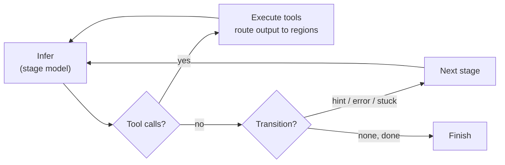
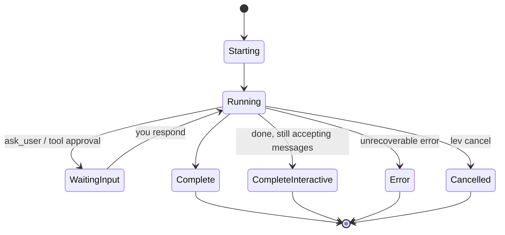

# Agent blueprints (`agent.leviath`)

An agent is a directory with an `agent.leviath` file, a TOML **blueprint** describing a
multi-stage [workflow graph](/docs/stages). `lev create <name>` scaffolds one.

```toml
[agent]
name = "coder"
version = "0.2.0"
description = "Analyze, implement, and review with graph-based recovery"
entry_stage = "analyze"

[tool_permissions]           # global defaults; per-stage overrides allowed
read_file  = "allow"
write_file = "ask"
bash       = "ask"

[stages.analyze]
mode = "autonomous"
model = { models = [
  { provider = "anthropic", model = "claude-sonnet-4-6" },
  { provider = "openai",    model = "gpt-5.4-mini" },
] }
available_tools = ["read_file", "list_dir"]
max_iterations = 15
system_prompt = """Understand the task and produce a short implementation plan."""

[stages.analyze.transitions.implement]
hint = "Plan ready, begin implementation"
```

## The run loop

Within a stage, an agent runs a tight loop (infer, act on tool calls, repeat) until the model
signals it's done or a [transition](/docs/stages) fires:



## Lifecycle

A run moves through a handful of states the [dashboard](/docs/dashboard) and [API](/docs/api)
report on:



These are the exact `RunStatus` values the [dashboard](/docs/dashboard) and [API](/docs/api)
report. `CompleteInteractive` means every required stage finished but the agent is still
accepting [messages](/docs/interaction).

## Stages and models

Each stage gets its own **model** (an ordered provider/model fallback list: the first configured
provider wins), tools, iteration cap, and context layout. Transitions form a
[graph](/docs/stages): linear by default, or branch on conditions like `error` and `stuck`.

```toml
[stages.analyze.model]
allow_user_default = true          # fall back to the user's default model, else fail closed
models = [
  { provider = "anthropic", model = "claude-sonnet-4-6" },
  { provider = "openai",    model = "gpt-5.4-mini" },
]
request_timeout_secs = 120         # per-stage inference wall-clock cap

[stages.analyze.model.parameters]  # free-form, passed through to the provider
temperature = 0.2
max_tokens  = 8000
```

## Context regions

`[context.regions]` defines the memory layout. There are eight region kinds (the default is
`temporary`); see [Structured context](/docs/context) for what each one does. Budgets come in
three forms:

```toml
[context.regions.codebase]
kind = "compacting"
budget = "35%"             # ceiling as a share of the model's context window
max_tokens = 60000         # absolute guard-rail the percentage never exceeds
min_tokens = 4000          # absolute floor on small context windows

[context.regions.task]
kind = "pinned"
max_tokens = 2000          # bare max_tokens alone = fixed absolute budget
```

Percentages are **ceilings, not allocations** - they may sum past 100% because regions rarely all
run full at once. With a percentage, `max_tokens` caps and `min_tokens` floors the resolved value;
without one, `max_tokens` is simply the fixed budget. Compacting regions also take
`threshold_tokens`, the fill level that triggers compaction.

A stage can override the whole layout for just itself with
`[stages.<name>.context.regions]` - the per-stage layout applies when the stage is entered and
uses the same syntax:

```toml
[stages.plan.context.regions.constraints]
kind = "pinned"
budget = "10%"
```

## Seed commands

A region can be seeded before the run starts:

```toml
[context.regions.codebase]
kind = "compacting"
seed = { command = "git ls-files" }
```

Seeds run at spawn **before any approval prompt**, confined to the workdir and routed through the
entry stage's sandbox, time- and size-capped.

> [!WARNING]
> A seed command runs a shell command before you approve anything. `lev validate` prints every
> seed a blueprint will run; review them for third-party blueprints. Refuse with
> `--no-seed-commands` or `[security] allow_seed_commands = false`.

## Read paths

An agent that needs to *read* beyond its workdir - run archives, design docs, sibling
directories - declares them:

```toml
[read_paths]
allow = ["~/.leviath/runs", "../shared-docs", "glob:~/design-docs/**"]
```

The declarations do nothing on their own: the user's config must grant them, they are
read-only, and every access is checked against the symlink-resolved real path. See
[Security](/docs/security) for the grant stanzas and the full matching rules.

## How the coding agents verify their work

The bundled coding agents (`software-engineer`, `coder`) treat verification as workflow, not
vibes. Their entry stage is `discover`: before planning anything, the agent classifies the
project's testing story and writes a `workflow` region ending in three literal lines that later
stages execute verbatim:

```text
BASELINE: <command to run BEFORE any edit>
VERIFY: <command to re-run after each change>
DONE WHEN: <the completion bar, including "no regressions vs baseline">
```

The baseline is captured before the first edit, so "a test that was already failing" and "a test
I broke" are distinguishable. Each change re-runs VERIFY and compares against the baseline, and
the run is only done when DONE WHEN holds - not when "most tests pass". Regions that carry this
state are marked `required = true`; if one is empty when a stage needs it, the workflow routes
back through discovery instead of guessing. Projects with no tests at all are handled explicitly:
the plan must include *building* verification (a smoke test to write and run), stated plainly
rather than invented.

## Validate before you run

```bash
lev validate .             # check the graph, print seeds + permissions
lev test .                 # dry-run the blueprint
```
