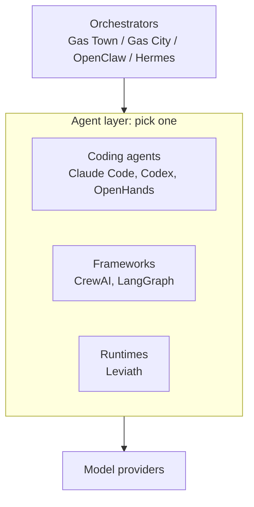

# Where Leviath sits

People arrive at Leviath already using something else, and the useful question is usually not "which
of these is best" but "what job does each of these do, and do I need more than one".

A coding agent, an orchestrator, a framework, and a runtime are four different jobs. Leviath is the
runtime. So this page is about layers, not scores, and several of the tools below are worth running
*alongside* Leviath rather than instead of it.

## Four different jobs

- **A coding agent** is a finished product you talk to. You install it and start working.
- **An orchestrator** decides which work happens and where. It does not write code itself. It picks
  up an issue, assigns it, tracks it, and collects the result.
- **A framework** is a library you build an agent *in*, in your own codebase and language.
- **A runtime** is a service your agents run *on*. You describe an agent and it executes it.

Leviath is the last one. That is why an orchestrator sits happily above it, which is what
[the Integrations section](/docs/integrations) is about.

## Side by side

These tools make different architectural bets. The table compares models, not merit, and every
description comes from that project's own documentation.

| | **Leviath** | **Claude Code + Agent SDK** | **CrewAI** | **LangGraph** |
|---|---|---|---|---|
| **Layer** | Standalone agent runtime, single binary | Coding agent CLI plus an SDK harness | Python multi-agent framework | Orchestration framework (Python/JS) |
| **Running N agents** | N entities in one daemon process | One `claude` subprocess per session | Inside your Python app | Inside your app process |
| **Context management** | Typed regions, explicit eviction, per-stage budgets | Auto-compaction near the limit | Auto-summarizes on overflow | Developer-controlled graph state |
| **Multi-agent** | Stage graphs plus in-process fan-out | Subagents within a session | Role-based crews, coordinated by flows | Explicit graphs of deterministic and agentic steps |
| **Agents are defined in** | TOML plus Rhai scripts | Markdown and YAML, or SDK code | Python classes or YAML | Python or TypeScript |
| **Expects on the machine** | One native binary | A native CLI; the SDKs want Node 18+ or Python 3.10+ | Python 3.10-3.13 | A Python or Node runtime |
| **Headless surface** | REST, WebSocket, [ACP](/docs/agent-client-protocol) over stdio | `claude -p`, plus the SDKs | `kickoff()` in-process, REST via AMP | Library calls, REST via LangSmith |
| **Human in the loop** | Mid-run messages, interaction points, ask-user tools | Interactive steering and permission prompts | `human_input` pauses a task | `interrupt()` pauses and resumes |
| **Isolation** | Per-agent state, workdir, and policy; opt-in containers or namespaces for shell (widening) | Opt-in OS sandbox for shell | External sandbox services | Sandbox backends via Deep Agents |
| **Hosted option** | None | Managed Agents | CrewAI AMP | LangSmith Deployment |

## When to use something else

We would rather you pick the right tool than pick ours, so here is where Leviath is the wrong
answer and what to reach for instead.

**Use a coding agent like Claude Code or Codex** when you want the familiar thing: a chat in your
terminal or editor, aimed squarely at writing code, that you steer turn by turn. That interactive
loop is what they are built around, and it is the experience most people want most days. Leviath
asks you to describe the work up front instead, which pays off on a task with distinct phases and
gets in the way of a quick edit.

**Use CrewAI or LangGraph** when your orchestration already lives in Python or TypeScript and you
want the workflow expressed in code, with your own types and your own tests around it. A Leviath
agent is a TOML blueprint plus optional Rhai script tools, so if you want agent logic in a general
language against an SDK, that model is not here. Other languages drive Leviath through the
[REST API](/docs/api) instead.

**Use a hosted platform** if you want somebody else operating it. You run the Leviath daemon
yourself. [`lev serve`](/docs/api) and [The Lair](https://leviath.dev/lair) reach it from anywhere,
but there is no hosted service and no multi-machine scheduling.

You also need a model provider either way: an API key, a ChatGPT or Claude subscription you sign in
to, or a local Ollama.

One current limit worth knowing before you choose. Every agent has its own state, workdir fence,
tool policy, and panic boundary, so one agent's crash stays its own. The opt-in
[OS sandbox](/docs/security) is narrower than that: today it wraps shell execution, seed commands,
and script shell calls, while file tools rely on path confinement and network tools run on the
host. Widening it to cover every side effect is
[in progress](https://github.com/GEMISIS/leviath/issues/326).

**Reach for Leviath** when the hard part is inside a single unit of work. That is the case when a
task has distinct phases wanting different models and different tools. It is also the case when you
care about exactly what is in the context window at each phase, or want many agents running at once
without paying for a process each.
Every run journals to disk as it goes, so a daemon you kill mid-run picks the work back up on its
next start.

## Scored against 12-Factor Agents

[12-Factor Agents](https://github.com/humanlayer/12-factor-agents) is a widely used checklist for
agent design. Here is Leviath against it, factor by factor.

| # | Factor | Status | Notes |
|---|---|---|---|
| 1 | Natural language to tool calls | ✓ | Provider tool calls map 1:1 into the runtime |
| 2 | Own your prompts | ✓ | Stage, system, and transition prompts live in your blueprint |
| 3 | Own your context window | ✓ | Region kinds, per-stage layouts, per-tool routing, percentage budgets |
| 4 | Tools are structured outputs | ✓ | Every tool declares a JSON Schema, validated at dispatch before it runs |
| 5 | Unify execution and business state | ✓ | One append-only run journal, replayable with `lev context` |
| 6 | Launch, pause, resume | ✓ | From CLI, REST, or ACP. A paused run survives a daemon restart |
| 7 | Contact humans with tool calls | ✓ | `ask_user_*` tools plus blueprint interaction points |
| 8 | Own your control flow | ✓ | Graph transitions on error, iteration cap, stuck, and model choice |
| 9 | Compact errors into context | ✓ | Tool, inference, and iteration-cap errors all land in context |
| 10 | Small, focused agents | ✓ | Per-stage models, tools, and prompts, plus bounded fan-out |
| 11 | Trigger from anywhere | ✓ | Start a run from the CLI, REST, or ACP |
| 12 | Stateless reducer | ✓ | Durable state lives on disk; the process is disposable. Runs resume on restart, and interrupted tool batches replay exactly-once |

**Trigger from anywhere** covers reporting as well as starting. A running agent emits WebSocket
updates, and a finished one can fire a webhook. Scheduling stays with your own cron or CI.

## How we measure

Leviath orchestrates agents rather than being a coding agent itself, so there are no head-to-head
numbers against Claude Code or Codex here. They sit at a different layer, and a benchmark comparing
them would not mean much.

What is worth measuring, on the same tasks with the same models:

- **Structured context against flat context**: the same runtime with regions on and off, scored on
  test pass rate, total billed tokens including cache reads and writes, and cost.
- **Resource footprint**: actual memory for one daemon running many concurrent agents.

Methodology and raw data will be published with the results.
