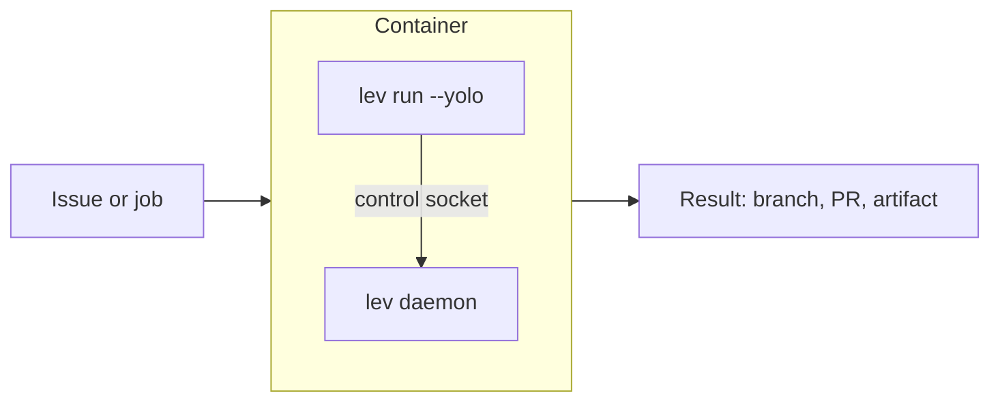

# Running Leviath in a container or CI job

Lots of orchestrators share one shape: a fresh container per unit of work, with a command that is
expected to do the job and exit. A CI job is the same shape. This page is how Leviath fits it.



## Getting `lev` into the image

Leviath is a single native binary with no Node, Python, or Docker runtime underneath it, so this
part is short:

```dockerfile
RUN curl -fsSL https://leviath.dev/install.sh | sh
```

Add your agent blueprint too, either baked into the image or mounted at run time. See
[Packaging blueprints](/docs/packaging) for shipping one as a unit.

## The part that catches people

`lev run` does not run the agent in the foreground. It hands the work to the
[daemon](/docs/daemon) and returns straight away. In a container that exits when its command exits,
that kills the run you just started.

Two ways to deal with it.

**Wait for the run.** Start the daemon, spawn the agent, then poll until it is finished:

```bash
#!/usr/bin/env bash
set -euo pipefail

export LEVIATH_HOME=/work   # data lands under /work/.leviath
lev daemon start

# `lev run` returns straight away; there is no blocking flag, so poll below.
RUN_ID=$(lev run /work/agent --task "$TASK" --yolo --json | jq -r '.run_id')

# `runs` holds what the daemon is actively driving. Once the id drops out of
# that list the run is over, whatever the outcome.
while lev ps --all --json | jq -e --arg id "$RUN_ID" \
        '.runs[] | select(.run_id == $id)' >/dev/null; do
  sleep 5
done

# `finished` and `not_running` never overlap, so this prints exactly one record.
lev ps --all --json | jq --arg id "$RUN_ID" \
  '(.finished[], .not_running[]) | select(.run_id == $id)'
```

[External work queues](/docs/work-queues) explains why the poll reads those three lists rather than
a single status field.

**Or use the protocol instead.** If the orchestrator can launch a subprocess and talk JSON-RPC to
it, `lev agent-client` stays in the foreground for the whole turn. It streams progress back, which
removes the polling entirely. That is what the [Gas City](/docs/gas-city) page uses, and it is the
nicer shape when it is available.

## Settings that matter in a container

```toml
# config.toml
[limits]
stall_timeout_secs = 120   # fail fast rather than burning the job's time budget
wedge_timeout_secs = 300   # a run nothing can reach is failed, not left hanging
```

Also worth knowing:

- **`--yolo` is not optional here.** Nobody is attached, so any tool that asks for approval would
  wait forever. It approves every call and removes the tools that need a person. It cannot lift a
  `deny`, so keep real restrictions in `[tool_permissions]`. See [Security](/docs/security).
- **Set `LEVIATH_HOME`** to a path inside the container that you control. Keep it short: the control
  socket is a Unix socket, and socket paths have a length limit that a deep temp directory will
  exceed.
- **The container is already a sandbox.** If your orchestrator isolates each job in its own
  container, turning on Leviath's own [sandboxing](/docs/security) as well is usually redundant.
  One boundary you understand beats two you half-configured.
