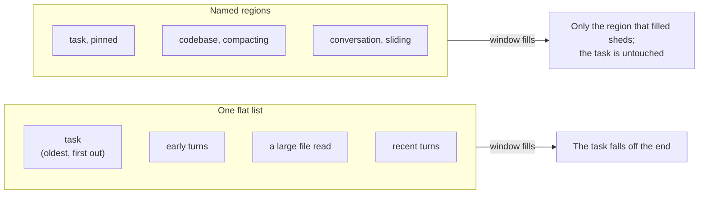
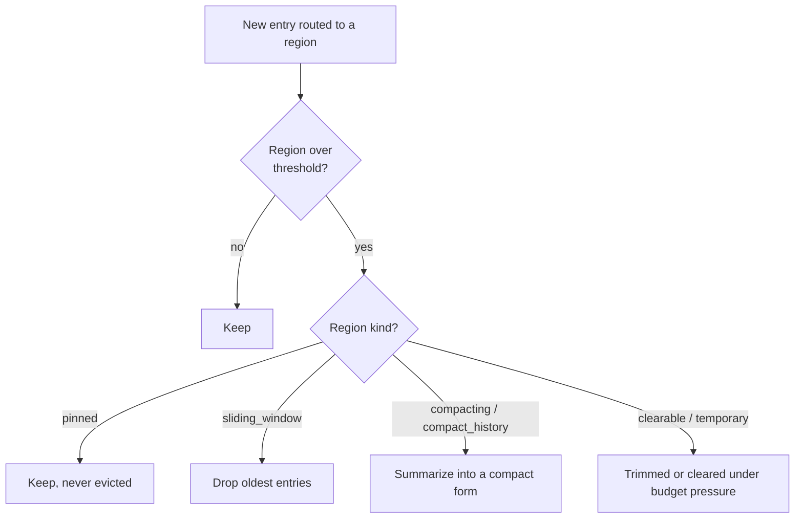

# Structured context memory

The usual way to give a model its history is one flat list of messages. That has a failure mode: read
one large file and it pushes everything else toward the edge of the window, including the system
prompt and the task the agent was given. The agent then forgets what it was doing, and nothing chose
that outcome.

Leviath splits the window into named **regions** instead. Each one has its own size limit and its
own rule for what to throw away first, so a big file read can only ever crowd out the region it
landed in.



## What that looks like

A typical coding agent might divide its window like this:

| Region | Share | Kind | Holds | When it fills |
|---|---|---|---|---|
| `task` | 12% | `pinned` | The task and the ground rules | Nothing. Pinned regions are never dropped |
| `codebase` | 20% | `compacting` | Files the agent has read | Older content is summarized, not lost |
| `conversation` | 33% | `sliding_window` | The back-and-forth | Oldest turns drop off |
| `history` | 15% | `compact_history` | Summaries carried from earlier stages | Rolls forward, compacted |
| headroom | 20% | | Left free for the reply | |

The point is the last column. In a flat message list, all five of those compete for the same space
and the loser is whatever happens to be oldest. Here, a file dump can fill `codebase` completely and
`task` is still exactly where it was.

```toml
[context.regions]
task         = { kind = "pinned", budget = "12%", seed = "task_input" }
codebase     = { kind = "compacting", budget = "20%" }
conversation = { kind = "sliding_window", budget = "33%", max_items = 20 }
history      = { kind = "compact_history", budget = "15%", source_region = "codebase" }
```

## The nine region kinds

| Kind | Behavior |
|---|---|
| `temporary` | The **default** when `kind` is omitted; recent entries, trimmed first under budget pressure. |
| `pinned` | Never evicted (architecture, the task). |
| `sliding_window` | Keeps the most recent entries; the conversation lives here. |
| `compacting` | Summarizes instead of evicting: file reads and tool results. |
| `compact_history` | Carries summaries from earlier stages forward, so a later stage skips the raw content. `source_region` names what it summarizes. |
| `clearable` | Wiped in one shot when space is needed (scratch). |
| `hashmap` | Keyed entries (alias `hash_map`); a write to a key replaces it. |
| `checklist` | A task list whose entries carry state. Written through `todo_add` / `todo_done` / `todo_note`, never evicted, and rendered open-items-first. |
| `custom` | Behavior defined by a Rhai script (see [Rhai regions](/docs/rhai-regions)). |

A `custom` region gets keyed writes too: entries written under one key render last-wins, like
`hashmap`, though the shadowed entries keep holding budget until something evicts them. [Rhai
regions](/docs/rhai-regions#keyed-writes-render-as-an-upsert) has the details.

An unrecognized `kind` is a hard parse error, not a silently ignored region. So is an
unrecognized `strategy`: `strategy = "per-item"` with a hyphen is refused, rather than leaving the
region to evict one entry at a time as if the line had not been written.

### Per-kind keys

Most kinds take extra keys that only make sense for them:

```toml
[context.regions.conversation]
kind      = "sliding_window"
max_items = 20                 # default 10
strategy  = "per_item"         # per_item (default) | bulk | compact
overflow  = 10                 # with strategy = "bulk": how many to drop at once
compact_count = 10             # with strategy = "compact": how many to fold into a summary

[context.regions.codebase]
kind             = "compacting"
budget           = "20%"
compact_at       = "80%"       # compact once this full, see below
threshold_tokens = 30000       # a hard token ceiling, applied as well as compact_at

[context.regions.history]
kind          = "compact_history"
source_region = "codebase"     # which region's summaries roll forward

[context.regions.findings]
kind        = "hashmap"
max_entries = 50               # a write to an existing key replaces it

[context.regions.brain]
kind       = "custom"
script     = "context_hooks/brain.rhai"   # relative to the agent directory
persistent = false             # true behaves pinned-like: never evicted
```

### Tracking work with a checklist

A pinned region plus `context_append` gives persistence, which is the easy half. What it does not
give is *state*: "compute the fee table" and "~~compute the fee table~~ done" are two different
strings, so nothing can count what is left and no gate can ask.

```toml
[context.regions]
todos = { kind = "checklist", budget = "3%" }
```

The agent writes to it through tools rather than free text, so the state cannot drift from what the
model believes it wrote:

| Tool | Effect |
|---|---|
| `todo_add(region, item)` | Adds an open item, returns its id |
| `todo_done(region, id)` | Ticks it off |
| `todo_note(region, id, note)` | Records a note **without** closing it |

It renders as one stable block with open items first. Sitting in the system section is what keeps it
in front of the model every turn, as instruction rather than history.

An id is never reused, so a `todo_done` cannot land on a different item than the one it names. An id
that matches nothing is an error the model can read rather than a silent no-op.

The gate is the part that makes any of this enforceable:

```toml
[stages.implement.transitions.review]
gate = { require_no_open_items = "todos",
         message = "Finish or explicitly drop the open items first." }
```

The nudge names the items that are still open. It shares the same `max_attempts` budget as every
other gate, so it cannot wedge a run. A gate naming a region no stage declares, or a region that is
not a `checklist`, is refused by `lev validate`. At runtime such a gate could only ever count zero
and pass on the first attempt, which looks exactly like a stage that finished its work.

### Keys every region accepts

| Key | Default | Meaning |
|---|---|---|
| `budget` | unset | A share of the model's context window, written as `"35%"` |
| `max_tokens` | `5000` | A token ceiling. See below for how it interacts with `budget` |
| `min_tokens` | unset | A floor for a percentage budget, so the region stays usable on a small model |
| `seed` | unset | What the region starts with. See below |
| `required` | `false` | The stage re-runs rather than moving on while this region is empty |
| `summarizable` | `true` | Set false to keep an edge `transform = "compact"` from paraphrasing this region. See [transforms](/docs/stages#carrying-context-across-an-edge) |
| `description` | unset | One line on what the region is for. Documentation by default: it reaches `lev dash` and the API, not the model |
| `describe_in_prompt` | `false` | Also show the `description` to the model, above the region's contents. See [what the model sees](#what-the-model-sees) |
| `volatility` | `"rewritten"` | How much the region's contents move between requests, which decides where it sits in the prompt. See [what caching costs](#what-caching-costs) |
| `admission` | `"evict"` | What happens when a write does not fit. `"reject"` refuses it instead of dropping something. See [letting the agent decide what to forget](#letting-the-agent-decide-what-to-forget) |
| `accepts` | unset | Mime types the region takes, as `type/subtype` or `type/*`. Unset takes anything. A write carrying another type is refused with this list. See [typed mime](/docs/mime) |
| `required_message` | generated | What the model is told when a required region is empty. Supports `{region}` |

**Resolved budget** is the phrase used for the number a region actually gets, once the percentage
has been worked out against the model in front of it. A `budget = "20%"` region on a 200k-token
model resolves to 40,000 tokens. `compact_at = "80%"` then means 80% of *that*, so 32,000.

`max_tokens` behaves differently depending on whether `budget` is set. On its own it is a plain
ceiling. Alongside `budget`, it caps the resolved percentage, so the region gets whichever is
smaller.

That last part is worth dwelling on, because it is easy to write a cap that quietly cancels the
percentage. `budget = "30%", max_tokens = 40000` is 30% only below a 133k window; above that it is
a flat 40,000 however large the model, and every bundled agent shipped that way until a 1M-context
run held its findings to 40k while its own blueprint asked for 314k. If you mean the percentage,
write the percentage on its own. Reach for `max_tokens` when a region genuinely must not grow, and
`min_tokens` when a small one must not shrink on a narrow window - and check what the pair resolves
to at the largest model you expect to run.

A malformed `budget` or `compact_at` string is a hard error at load, so `lev validate` catches it
instead of a run failing later.

### Seeding a region

`seed` fills a region before the first inference:

```toml
[context.regions]
task      = { kind = "pinned", seed = "task_input" }
standards = { kind = "pinned", seed = "input" }
readme    = { kind = "pinned", seed = { files = ["README.md"] } }
layout    = { kind = "temporary", seed = { glob = "src/**/*.rs" } }
rules     = { kind = "pinned", seed = { literal = "Never edit generated files." } }
env       = { kind = "pinned", seed = { command = "git log --oneline -20" } }
clock     = { kind = "pinned", seed = { tool = "current_time" } }
machine   = { kind = "pinned", seed = { tools = ["current_time", "system_info"] } }
computed  = { kind = "temporary", seed = { rhai = "blueprint:seeds/plan.rhai" } }
inherited = { kind = "pinned", seed = { caller = "brief" } }
```

| Form | Fills from |
|---|---|
| `"task_input"` | The caller's `task` key, which is what `lev run --task` sets |
| `"input"` | A caller key named after this region, so `--<region>` on the CLI reaches it |
| `"<any-other-string>"` | The caller key of that name |
| `{ files = [...] }` | The contents of those files |
| `{ glob = "..." }` | Every file matching the pattern |
| `{ literal = "..." }` | Fixed text |
| `{ command = "..." }` | The stdout of a shell command |
| `{ rhai = "..." }` | The return value of a Rhai script |
| `{ caller = "..." }` | A named value passed by a parent agent |

A region literally named `task` gets `seed = "task_input"` implicitly, so older blueprints keep
working.

A `seed` that matches none of the forms above is ignored and the region starts empty. `lev validate`
reports that as `region-seed-not-understood`, which is worth reading before wondering why a region
came out blank. The table keys are exactly the ones in the left column, so `{ caller_input = "..." }`
is a typo for `{ caller = "..." }` and seeds nothing. A blueprint that seeds no region from the
task refuses a task outright rather than running without it.

> [!WARNING]
> A `command` seed runs at spawn, before the first inference and therefore before any tool-approval
> prompt. Because there is nobody to ask in the moment, it must also be covered by
> [`[safe_commands]`](/docs/interaction#what-runs-without-asking), or it does not run at all.
> `lev validate` prints every command seed in a blueprint, `lev run --no-seed-commands` refuses
> them for one run, and `[security] allow_seed_commands = false` refuses them machine-wide. Seeds
> run once: a daemon restart does not replay them.

#### Where a seed path resolves

`files`, `glob` and `rhai` seeds resolve against the run's working directory and may not leave it.
A path that does is refused at spawn, before anything is read.

The rule is the one `read_file` follows, for the same reason: the *blueprint* chose this path, not
you. Seeded contents land in a region the model reads on its first turn, so a path that escaped
would put whatever it named in front of the model without anything having asked you.

To read outside on purpose, declare it under `[read_paths]` and grant it in your config. That is
already the mechanism for "this agent is meant to read there and I agreed", and seeding answers to
it rather than having a second one of its own. A glob is checked per match, since `../*.toml` cannot
be judged before it is expanded.

A blueprint can also seed from files it ships itself. The `blueprint:` prefix resolves the rest of
the path against the blueprint's own directory instead of the working directory, so bundled
material travels with the agent:

```toml
guidelines = { kind = "pinned", seed = { files = ["blueprint:config/style.md"] } }
rubric     = { kind = "pinned", seed = { glob  = "blueprint:rubrics/*.md" } }
plan       = { kind = "temporary", seed = { rhai = "blueprint:seeds/plan.rhai" } }
```

A prefixed path may never leave the blueprint's directory, and `[read_paths]` does not apply to it.
A grant widens what an agent may read on your machine, not what a package pretends to ship, so
`blueprint:../secrets.txt` is refused however the config is set. This is the same containment a
script gets, because the claim is the same: these are the blueprint's own files, and a blueprint's
own files live beside it.

Scripts proper are stricter still and have no `[read_paths]` escape at all: a stage hook, a
custom-region script and an output validator must all live inside the blueprint's own directory. A
script is code the agent ships, and there is no such thing as loading your logic from somewhere
else on purpose.

### Seeding from tools

A `tools` seed calls the run's own tools at spawn and writes their output into the region, so the
agent's first inference already knows what the tools would have told it. Several calls fill one
region, in order, each under a heading naming the tool:

```toml
environment = { kind = "pinned", budget = "1%", volatility = "stable", seed = { tools = [
  "current_time",
  "system_info",
  "locale_info",
] } }
```

```
--- current_time ---
{ "utc": "2026-08-18T19:32:07Z", ... }

--- system_info ---
{ "os": "macos", ... }
```

Any tool the agent could call works, spelled as the agent would spell it: a built-in, an
[MCP server's](/docs/mcp) `<server>__<tool>`, or a [Rhai script tool](/docs/rhai-tools). A call that
takes arguments uses the table form, and the two spellings mix in one list:

```toml
toolchain = { kind = "pinned", seed = { tools = [
  { name = "which_command", args = { command = "git" } },
  "locale_info",
] } }
```

Use it for anything the agent should not have to think to ask for. The clearest case is the date: a
research agent that never calls `current_time` reasons from its training cutoff, and seeding the
answer costs it no turn.

> [!IMPORTANT]
> Unlike a `command` seed there is no separate kill switch, because a tool seed reaches nothing
> new. Every call resolves against the same `[tool_permissions]` the tool lane applies mid-run, so a
> seed can call exactly what the agent could call and nothing more, and a `deny` counts here too.
>
> A tool set to `ask` is **refused**, not prompted: a seed runs before the first inference, so there
> is nobody to answer. Set it to `allow` if the agent is meant to call it at spawn. `lev validate`
> lists every tool a blueprint seeds from, as `tool-seed`.

A failed call is skipped with a warning and the other calls still fill the region; if the region is
`required`, a failure is a spawn error naming the tool.

#### Refreshing on every stage

Seeds resolve once, at spawn, like every other kind. `refresh = "each_stage"` resolves them again
whenever a stage is entered:

```toml
environment = { kind = "pinned", seed = { tools = ["current_time"], refresh = "each_stage" } }
```

Use it where the answer moves. A run that spends an hour in one stage and then enters another
should date the second stage from when it started, not from when the run did. The stage waits for
the refreshed region before its first request, so the values are in place for the turn that reads
them.

It costs a tool call per stage entry for the life of the run, and rewrites a region that would
otherwise sit still in the cached prefix, so leave it at the default for anything that does not
actually change. A call that fails leaves the region as it was rather than blanking it: the
previous value is stale, and stale beats absent. `lev validate` marks a refreshing seed
"on every stage entry".

Seeds do not re-run when a run is reloaded from a snapshot, whatever their `refresh` setting.

## What the model sees

Regions that assemble into the system prompt are labelled with their own name:

```
## task
research what meta's most recent earnings call was about

## sources_index
[1] RFC 9110 - https://example - 2022 - credibility: high
```

The name is the part that earns its tokens. An agent writes to a region *by
name* - `context_write { region: "sources_index", … }` - and without the heading
it reads a region's contents with nothing saying which region they came from. It
could read `sources_index` and write to `sources_index` and have no way to know
they were the same place. A heading costs three tokens, once per region, however
many entries the region holds.

A `description` says what the region is for. On its own it is documentation:
`lev dash` shows it under the region, `GET /api/blueprints/{name}` returns it,
and the model never sees it. Add `describe_in_prompt` to spend the tokens and
put it in front of the model too:

```toml
[context.regions]
sources_index = { kind = "pinned", budget = "4%", describe_in_prompt = true,
                  description = "One bibliography line per source actually used." }
```

which renders as:

```
## sources_index
One bibliography line per source actually used.

[1] RFC 9110 - …
```

The split is deliberate. Describing every region for the people who maintain the
blueprint should not quietly cost tokens on every turn, and most region names
are already the explanation. Turn it on where the region has a convention the
agent has to follow - a format, an ordering, a rule about what belongs - rather
than a purpose it can infer from the name.

Empty regions contribute nothing - no heading, no blank block - so a blueprint
can declare the regions it might need without paying for the ones it has not
filled yet.

### Stored parts in the prompt

An entry can hold more than text: an image, a clip, a document, any
[typed mime](/docs/mime) part. In a region that renders into the system prompt
the part appears as its one-line stand-in, `[image/png 1024x768, 240 KB] hero.png`,
and the bytes travel in one user message placed before the conversation, each
after a pointer naming the region, the key and the part. In the conversation the
part sits in its own turn, after the text it came with. A tool result's parts
follow the result in the same turn.

Whether the model gets the bytes is decided when the request is built, not
when the entry is written. A model whose input types cover the part gets it as
that provider's native block; a part whose bytes are text reaches any model as
text; anything else is the stand-in alone, which still names the part so the
model can hand it to a tool. The journal and `context.json` carry references,
never the bytes.

## What caching costs

A provider caches the prompt by **prefix**: it stores everything up to a marker, and next
request it reuses that only if every byte in front of the marker is identical. So one region
that changes invalidates the cache for every region behind it, however still those are.

That makes the ordering of the prompt worth money, and the ordering is decided by what each
region declares:

```toml
[context.regions]
task    = { kind = "pinned", volatility = "stable" }      # set once at spawn
sources = { kind = "pinned", volatility = "grows" }       # appended to as the run goes
scratch = { kind = "hashmap", volatility = "rewritten" }  # rebuilt each turn
```

| value | means | gets |
|---|---|---|
| `stable` | written rarely or never after setup | sorted first, forming the prefix everything else caches behind |
| `grows` | appended to, existing entries untouched | sorted next, and split so its settled part caches while only the newest is re-sent |
| `rewritten` | existing content changes in place | sorted last, where it invalidates nothing but itself |

The default is `rewritten`, which is the pessimistic one. A region nobody has classified is
assumed to move, so leaving this out never puts a region somewhere that invalidates another;
declaring it is what earns the caching.

That is worth stating in money, because "safe default" reads as "no decision needed" and the
region this matters most for is the biggest one you have. A research run measured here left its
280,000-token findings region undeclared: assumed rewritten, cached at 4%, so the same content
was re-sent, re-billed and re-processed on every inference for the rest of the stage. Declared
`grows`, almost all of it caches. The bigger the region, the more the default costs, and the
biggest region in a blueprint is usually the append-only one tool results land in.

> [!NOTE]
> The region's **kind** does not answer this, which is why the setting exists. A `pinned`
> region sounds immutable and is written constantly - `context_write` into a findings region
> is an ordinary move, and [tool routing](#routing-tool-output) sends read results straight
> into one. Only the blueprint knows which of yours is which.

`temporary` and `clearable` are worth declaring for the same reason, and the payoff is larger.
Both names describe when the region is *thrown away* - one at stage exit, the other on demand -
and say nothing about whether the contents hold still in between. Undeclared they are treated as
uncacheable, which is right at the boundary and wrong everywhere else: a stage that reads a corpus
into a `temporary` region and then works through it for forty calls re-sends the whole corpus at
full rate on every one of them. Measured on one such stage: 5.36M tokens across 46 calls, the
largest single cost line in the run. Declaring it `grows` splits it the same way any other growing
region is split, so the part already read caches and only the newest excerpt is re-sent.

If a region declares `stable` and then keeps changing, Leviath says so in the log rather than
silently paying for it: the declaration is a hint it checks, not a promise it trusts.

### A region that stops growing caches itself

Declare a region by what it does across the whole run, not per stage. A `grows` region is split
into chunks that freeze once full, so when the appending stops - a gathering stage ends and a
planning stage only reads what it collected - every chunk is already frozen and the whole region
caches. Measured on that shape: 99% of the prompt cacheable in the planning stage, with only the
plan itself, rewritten each turn, outside it.

Re-declaring such a region `stable` for the later stage changes nothing worth having. The same
bytes are cached either way; `stable` renders as one block where `grows` renders as several, so
there are fewer places to put a marker and one fewer *fallback* - and a fallback only pays if the
region turns out to change, which in that stage it does not. Declare a region by what it does
across the run and leave it alone.

Caching is also per model, so a stage that switches model starts cold whatever the blocks look
like. The benefit concentrates inside a stage rather than across a model change, and no layout
avoids that.

A stage can still override the layout, volatility included, with
`[stages.<name>.context.regions]` - see [per-stage layouts](/docs/agents#context-regions). That is
for a stage whose memory is genuinely shaped differently, not for this.

## Where a stage's own instructions live

A stage's `system_prompt` is pinned context, which is why it reads as instruction rather than
history. It goes into a region like everything else. By default that region is *whichever pinned
region you declared first*. That costs three things: its tokens are charged to that region's name in
the [stage ledger](/docs/cli#lev-stages-run-id), you cannot size or scope it, and it lands wherever
that region sits in the cacheable prefix.

Name a region for it and all three go away:

```toml
[context.regions]
stage_instructions = { kind = "pinned", budget = "3%" }
```

The runtime writes the entering stage's prompt there, replacing the previous stage's. It is always
assembled **after** every other pinned block, however you declared it, so the content in front of it
stays byte-identical when the stage changes. That content is what a provider's prompt cache
matches on. Instructions sitting in front of the shared prefix rewrite its head on every transition,
which invalidates everything behind them.

Measured on a two-stage agent whose prompts are about 63 tokens each:

| Region | Without the declaration | With it |
|---|---|---|
| `task` | 65 | 2 |
| `stage_instructions` | not present | 63 |

The 65 is the whole problem in one number: two tokens of task and sixty-three of somebody else's
instructions, under a heading that says `task`.

A blueprint that declares no such region keeps the old behaviour exactly, so this costs nothing to
ignore. The region is never hidden by a stage that omits it from its own `[context.regions]`: it
holds the instructions of the stage being entered, so hiding it would drop that stage's prompt.

### What a stage change still costs

The declaration keeps the system prompt's *head* cacheable across a transition. It cannot keep the
**conversation** cacheable, and on a long run the conversation is most of the prompt.

A provider matches one prefix running from the start of the request. The system prompt comes first
and the conversation second, so a stage's new instructions sit in front of every message. Change
them and nothing behind them matches, however byte-identical the transcript is. Measured on a run
whose closing stage rewrote its prompt: the final call read 2,376 tokens of stable system head and
paid full price for 246,812 tokens of conversation, which was about 40% of what the whole run cost
after caching.

The remedy is to not change the system prompt on the last hop. A closing instruction delivered as a
[nudge](/docs/stages) goes into the conversation instead, which leaves the prefix in front of it
untouched, so the transcript still matches and only the nudge itself is new.

Worth the trouble only where the conversation is large and the stage is short - a wind-down stage
that makes one expensive call is exactly that shape. A stage that makes twenty calls amortizes its
transition over all of them and this is not worth restructuring for.

## Eviction is deterministic

When a region crosses its threshold, the runtime acts by the region's *kind*, never by pushing out
whichever message is oldest across the whole window:



A summary is text. When a compacting region's entries carried stored [parts](/docs/mime) (an
attached image, a file a tool stored), the summary is written from their stand-ins and the parts
leave the window with the entries they sat on. The bytes stay in the run's store, `lev blobs`
still lists them, and the run log names which ones a compaction dropped. Pin a region whose files
a later stage needs, or have the stage put them somewhere pinned with `context_attach`.

## Letting the agent decide what to forget

Everything above is reactive: a region crosses a threshold and the runtime makes room. That is the
right default, and it has a blind spot. The runtime knows sizes; only the agent knows when it is
*done* with something. A gather stage that fetches a spec, pulls out the three paragraphs that
matter and writes them to a curated region has no further use for the raw text - but the raw text
sits there until pressure happens to push it out, or, with a generous budget, until the run ends.

An agent can release an entry the moment it is spent:

```
context_delete { region: "sources", key: "rfc-9110" }
context_delete { region: "sources", index: 2 }
context_delete { region: "sources", oldest: 3 }
```

Name the entry by `key` if it was written with one, by `index` as shown in `context_list`, or ask
for the oldest few. Releasing returns the tokens immediately.

Giving an entry a key when you write it is what makes the first form possible:

```
context_append { region: "sources", key: "rfc-9110", content: "<the raw spec>" }
```

### Making the agent choose

By default a full region evicts, and the agent is never told. For a region holding material the
agent curated, that is the wrong trade: whichever write arrives when the region is full silently
decides what was least important.

`admission = "reject"` hands that decision back:

```toml
[context.regions]
sources = { kind = "temporary", budget = "30%", admission = "reject" }
```

Now a write that does not fit fails, and the agent is told the region is full and to release
something first. Nothing already in the region is lost to a write the agent did not know would
displace it. A region set this way is also exempt from the window-level eviction cascade - otherwise
`reject` would only change which code did the silent dropping.

This turns memory management into an explicit decision: *you must choose what to forget before you
can read more*. It is a better failure mode than a silent omission the agent never learns about, and
it is a genuinely different memory discipline from mechanical eviction - worth reaching for when the
region holds findings rather than transcript.

## Routing tool output

Tool output is **routed** to a region, so exploration lands in a persistent codebase region rather
than scratch:

```toml
[stages.analyze.tool_routing]
default_region = "scratch"
max_result_tokens = 4000          # ceiling for any tool without one of its own
[stages.analyze.tool_routing.overrides]
read_file = "codebase"
# A stage that both greps and reads files needs two numbers, not one: a cap
# sized for the file read lets every grep through untouched, and one sized for
# the grep truncates every file.
[stages.analyze.tool_routing.max_result_tokens_per_tool]
read_file = 20000
```

Both tables are keyed by tool name, and an alias matches the tool it aliases. Writing `bash` covers
the `shell` the model actually calls.

A stage may only route into a region it can see. Routing a result into a region the stage left out
of its own `[context.regions]` writes it where that stage cannot read it back, so `lev validate`
refuses the blueprint and says which region to add. The four the runtime always carries are always
valid targets: `conversation`, `tool_results`, `final_output` and `stage_instructions`.

### What the model is told about a routed result

A routed result cannot sit in the message stream - a `tool_result` has to follow its `tool_use`
immediately - so the full output goes to the region and a short pointer stays in the conversation in
its place. The pointer names the region, and says the contents are already in the prompt under that
heading, because they are: a region the stage carries is rendered into the system prompt every turn.

That wording matters more than it looks. The pointer used to end "read that region for the full
result", which is an instruction with no tool behind it - and the model, holding `read_file` and no
`context_read`, would aim `read_file` at the region name and keep trying spellings. Grant
`context_read` on a stage that routes and reads files; `lev validate` warns
(`routing-without-region-read`) when one does not, and a path tool pointed at a region name now says
so in its error.

The pointer also says what actually happened rather than what was meant. A region too full to take
the result whole reports the truncation or the refusal, instead of promising a full result that is
not there.

An override entry can also carry both answers at once, which is usually what you mean when a tool
needs its own region *and* its own ceiling:

```toml
[stages.analyze.tool_routing.overrides]
read_file = { region = "codebase", max_result_tokens = 20000 }
grep = "scratch"                     # route it, no cap
```

Either key on its own is fine: `{ region = "codebase" }` routes without capping, and
`{ max_result_tokens = 500 }` caps without moving the result out of `default_region`. A value that
is neither a region name nor one of these tables is an error rather than a line that is quietly
skipped.

`read_file` also has a hard byte cap of its own, independent of any of this, and says so in the
result when it applies. Without one, a large file went into its region whole and was either
truncated or dropped as `[result omitted]` depending on how full the region already was. That is a
cliff rather than a limit.

## Routing produced parts

`tool_routing` moves *tool results*. A model can also **produce parts of its own** - a picture from
an image model, audio from a speech model, a document a generator returns - and those default to the
conversation, riding the assistant turn like its text. `output_routing` sends them somewhere else,
**by mime type**, so a produced file lands in a region a later stage reads instead of in the running
transcript:

```toml
[context.regions]
artwork      = { kind = "pinned", accepts = ["image/*"], max_stored = 4 }
conversation = { kind = "sliding_window", budget = "50%" }

[stages.draw.output_routing]
"image/*"         = "artwork"
"application/pdf" = "handouts"
```

Each key is a mime pattern (`image/png`, `image/*`, `*/*`) and each value a region. A reply that
mixes text and other parts is split part by part: every part goes to the region of the **most
specific** matching pattern (`image/png` beats `image/*` beats `*/*`), and the reply's text, plus
any part no rule matched, stays in `conversation` as before. Nothing here names a family in code -
it is mime types all the way down, so the same table routes audio, video, 3D models or any type you
register the same way it routes images.

Unlike `tool_routing`, the target need not be a region *this* stage reads back - the whole point is
usually to hand a produced file forward - so it is checked against every region the blueprint
declares, not just the ones the producing stage can see. A target no layout declares is refused by
`lev validate`.

A pinned target lifts its stored parts into the leading user turn, and a sliding window renders them
as a user message, so the next stage's model sees the bytes either way (subject to that model taking
the type; otherwise it sees the stand-in, as anywhere else).

### A clean slate for the next stage

Routing the produced part out of the conversation is half of handing it on; the other half is the
receiving stage not inheriting the producing stage's transcript. `conversation` cannot be hidden -
the model's own turns live there - but a stage can **empty** a region as it is entered:

```toml
[stages.describe.context]
reset = ["conversation"]
```

`reset` clears the named regions on entry (the content is gone, not merely hidden from this stage),
so the stage starts on a clean conversation with only what its visible regions hold - the routed
image in `artwork`, say. A re-entered stage clears them again each visit. Unlike `hide`, `reset` may
name `conversation`; like `hide`, a name no layout declares is refused.

## Requests are measured before they are sent

The window sizes what it holds with a byte estimate, corrected by what earlier calls in the run
were charged. That is cheap and it is usually close, but a provider whose window is a hard ceiling
rejects a request that is over by one token, and the rejection is not transient: the retry resends
the same request and the stage dies.

So a request that could be near the window is measured before it goes out. When the corrected
estimate plus the reply budget reaches half the model's window, the runtime asks the provider's own
tokenizer what the request costs (`/messages/count_tokens` on Anthropic, `:countTokens` on Gemini,
tiktoken locally on OpenAI, a script's `count_tokens` on a [Rhai provider](/docs/rhai-providers))
and refuses to send one that would not fit. The refusal names all three numbers it was computed
from - the prompt count, the `max_output_tokens` reply budget, and the window - because the reply
budget is usually the one that tipped the sum, and an error that only showed the prompt against the
window pointed at the wrong number. A request under that line is sent as it is, so a short turn
pays nothing. Every lane is guarded the same way: the stage's own call, the routing call at a
stage boundary, compaction and titling.

The window in that refusal is whatever the provider declares for the model, and a declared window
that is too small refuses everything a real one would have carried. The common case is a
[Rhai provider](/docs/rhai-providers#the-script-contract) left on its 8192-token
`@max_context_tokens` default: a stage asking for an 8192-token reply can then never send anything,
and the fix is the script's annotation (or a `[model_capabilities]` entry), not the stage.

The count is also fed back into the correction, so a refused request tightens the estimate for the
retry rather than being rediscovered by it.

## Budgets travel across models

This is why budgets are written as percentages. A region sized at 20% of the window is 20% whether
the model has 32k or 200k tokens, so the same blueprint keeps its shape when you switch models. Fixed
token counts would need rewriting every time.

> [!NOTE]
> Percentages are ceilings, and they may add up to more than 100%. That is deliberate: regions
> rarely fill at the same time, so reserving exact shares would waste most of the window. A ceiling
> also costs nothing until it is reached - a region is charged for what is stored in it, not for its
> budget - which is why raising one is cheap and capping one is not. Use `max_tokens` and
> `threshold_tokens` when you need a limit that really is hard, and remember they override the
> percentage rather than sitting beside it.

## Regions on a provider with no cache breakpoints

Not every provider takes cache markers. The Codex transport, which bills a
ChatGPT subscription, has no `cache_control` and no TTL to choose: it caches by
literal prefix and nothing else.

Your regions still arrive whole, one block each, in the order assembly sorted
them. What changes is what that order is worth. Elsewhere the stable-first sort
is an optimisation on top of explicit markers; there it is the entire strategy,
because a cache hit runs up to the first byte that moved and stops. A region
that declares `volatility = "stable"` and is rewritten every turn costs more
there than anywhere else, and the warning about an unstable declaration is
worth acting on rather than noting.
