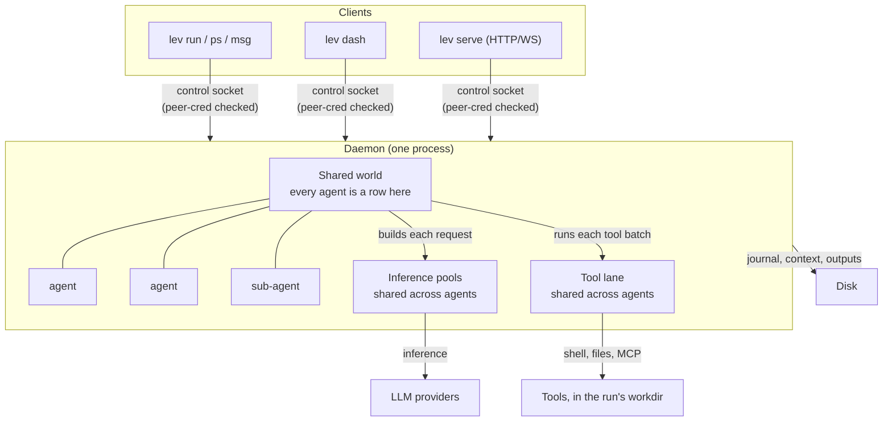
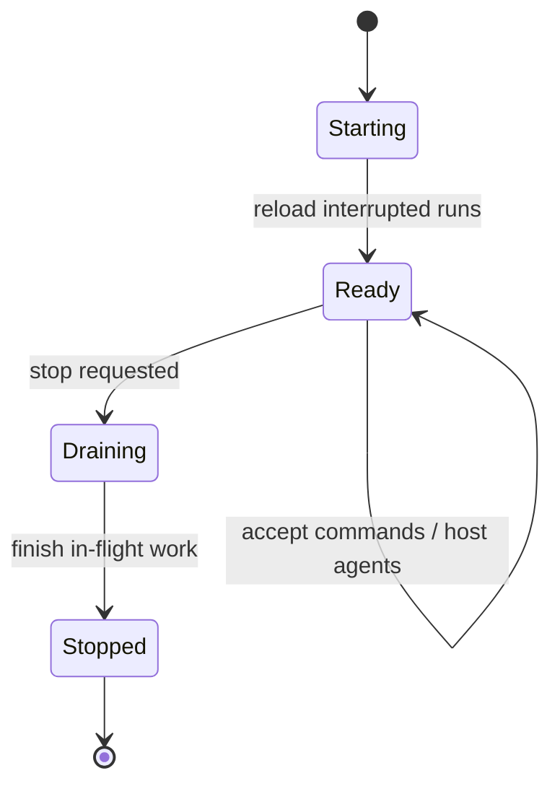

# The shared-world daemon

If an agent runs inside your terminal, then closing the terminal kills it, and a long job means
leaving a window open for hours. Leviath does not work that way. `lev run` hands the agent to a
background service called the **daemon**, which owns every run on the machine.

So your runs keep going after you close the terminal, and thousands of agents share one process
instead of taking a process each. Building Leviath into your own Rust program instead? You can skip
the daemon entirely. See [Embedding](/docs/embedding).



Agents never talk to a provider or run a tool themselves. The world builds each request and each
tool batch on their behalf, which is what lets one process share connections, rate limits, and tool
capacity across every run instead of duplicating them per agent.

You do not normally start it yourself. It starts the first time a command needs it.

```bash
lev daemon                 # run in the foreground (with logs)
lev daemon status          # is it running?
lev daemon start           # start in the background
lev daemon stop
lev daemon restart
```

## What happens when it restarts

On start, the daemon reloads any runs that were interrupted, so a crash or a restart does not lose
work.

The tricky part is tool calls that were mid-batch when it went down. Some of those already had real
effects: a file written, a shell command run. Re-running them would do the damage twice. So the
daemon keeps a **journal**, an append-only record of every tool batch when it is dispatched and
every result as it arrives. On reload it uses the journal to work out what actually happened:

- **A call that finished** is replayed from the journal, not run again. A file write that already
  landed does not land twice.
- **A call that was still running** comes back to the model as an error saying the effect may or may
  not have happened, with instructions to check before re-running anything with side effects.
- **An interrupted `spawn_agent`** also lists the run's existing children, so the model looks for
  the child it may already have created instead of spawning a duplicate.
- **A crash in the instant between an effect landing and the journal recording it** is the one gap
  this cannot close, because no journal can watch an external side effect happen atomically. Those
  calls come back as the same check-first error rather than being quietly re-run.

A reloaded run keeps the launch options that shape it: `--yolo`, the output format it was asked for,
and a `--model` override, replayed exactly as given. A run launched with no `--model` resolves each
stage afresh on reload, the same way the launch did, so its failover list is intact. (Before 0.4.1,
the reload handed back the entry stage's resolved `provider/model` as if it had been the override,
which pinned every stage of a reloaded run to that one pair.)

A reloaded run keeps the launch options that shape it: `--yolo`, the output format it was asked for,
and a `--model` override, replayed exactly as given. A run launched with no `--model` resolves each
stage afresh on reload, the same way the launch did, so its failover list is intact. (Before 0.4.1,
the reload handed back the entry stage's resolved `provider/model` as if it had been the override,
which pinned every stage of a reloaded run to that one pair.)

If something on your end consumes completion webhooks, deduplicate on `delivery_id`, described in
the [API guide](/docs/api). A completion that re-fires after a restart carries the same id as the
original.



## What the front-ends do while it restarts

A daemon restart used to break whatever was talking to it. `lev serve` answered 503 for the
second the socket was gone, and the ACP bridge ended its turn with half an answer. Now the
long-lived front-ends ride the restart out: `lev serve`, `lev dash`, and `lev agent-client`.

A request that arrives while the daemon is down waits up to ten seconds for it to come back. The
new daemon serves it. The wait is per outage, not per request: a daemon that is really gone costs
one caller the ten seconds, and every caller after that fails at once until it returns. Requests
that could double an effect, a spawn or a message that got no reply, are reported rather than
sent twice. One-shot commands such as `lev ps` do not wait: a daemon that is not running is
reported at once, with the advice to start it.

The daemon says who it is (version, build, pid) when a front-end connects. That is how each one
tells a restart from an update:

| What happened | `lev serve` | `lev dash` | `lev agent-client` |
|---|---|---|---|
| The daemon restarted on the same build | Logs it, and sends WebSocket clients a `daemon_link` event | A log line and a toast | Follows the run onto the new daemon, silently |
| The daemon came back on a different build | Logs a warning, and the `daemon_link` event carries the advice | A log line, a toast, and a chip on the run list | Says so in the conversation |

The advice is always the same: restart that front-end, so both ends run the same code. Requests
keep working while the two still understand each other. One that fails because they no longer do
is reported as exactly that (`lev serve` answers 502 rather than 503), since a daemon restart
cannot fix it.

> [!NOTE]
> After `lev update`, the next `lev` command restarts the daemon onto the new build. A `lev serve`
> or `lev dash` that was already running is now the older half of the pair, and says so. Restart
> it when convenient.

## Run it unattended

For an always-on setup, install the daemon under your operating system's service manager. It then
starts at login, restarts if it dies, and reloads interrupted runs on start:

```bash
lev daemon install         # launchd (macOS) / systemd --user (Linux)
lev daemon uninstall
```

There is no Windows service integration yet: `lev daemon install` reports itself unsupported
there. Use `lev daemon start`, and remember that `lev run` starts a daemon automatically anyway.

> [!TIP]
> An installed daemon plus [`lev serve`](/docs/api) is all you need to drive Leviath from the
> [The Lair](https://leviath.dev/lair), the browser console, with no terminal involved.

## Config changes take effect on the next run

The daemon watches `~/.leviath/config.toml` and picks up your edits on its own. Change a tool
permission, a `[read_paths]` grant, a sandbox default, a limit, or a taint setting, and the next
`lev run` uses the new value. No restart needed.

If a save leaves the file briefly unparseable, which happens while you are halfway through typing an
edit, the daemon keeps serving the last version that worked. It reloads on your next clean save, so
an in-progress edit never breaks a spawn.

That is the right behaviour and it used to be invisible, which made it the wrong experience: a typo
you did not spot meant every edit after it silently did nothing, and the only record was one line in
`daemon.log`. So a config that will not load is now a state Leviath reports rather than a fact it
keeps to itself:

- `lev run` prints one line before the run starts, naming the file, where in it the problem is, and
  that this run is on the last config that loaded.
- `lev ps` puts the same fact under the run table.
- `lev doctor` fails its `config` check with the line and column, or with the key for a value that
  parsed and was then refused.
- `lev dash` keeps a warning across the top of the screen for as long as the file is broken. It
  clears itself when the file parses again.
- `GET /api/config` carries a `config_error` object, and `/ws` sends a `config_health` frame each
  time the answer changes. See [the API reference](/docs/api#when-the-config-file-will-not-load).

The file is re-read once per save, not once per run: a broken file that nobody has touched since
costs one `stat` and produces one log line, rather than a re-read and a fresh warning on every
spawn. Fix the file and everything above clears on its own, with nothing restarted.

`[model_providers.<name>]` reloads too, as of this release. A script provider's own `.rhai` file
has always been re-read on each use, so a table beside it that needed a restart made two halves of
one feature disagree in silence - setting a `base_url` and watching it do nothing looked exactly
like having typed the key wrong. Both halves are now live: edit the script or the table, and the
next provider load uses it.

`[security] allow_env_vars` is live for both things that read it: a Rhai script's `env_var()`, and
the `${VAR}` in an MCP server's `headers`. Naming a variable there reaches the next provider load
and the next MCP connection. A server already connected keeps the header it was given, so a global
`[[mcp_servers]]` entry that interpolates a variable is reconnected when you change the list, which
is what puts the new value in front of the next run.

`[[mcp_servers]]` is live as well. Add, edit or remove a global server - with `lev mcp add`, `POST
/api/mcp/servers`, or by hand - and the next run gets the tools the file names now. A run already
under way keeps the servers it started with: a removed one stays connected for
`[limits] mcp_idle_disconnect_secs` so nothing loses a tool mid-call, and is torn down after that.

Provider credentials reload as well. Add a key, replace one, remove one by untoggling it in
`lev setup`, point a provider at another base URL, or change `default_provider`: the daemon
compares the file's credentials against the ones its registry was built from, and rebuilds the
registry when they differ, before the next run resolves its stages. It makes no difference whether
the write came from `lev setup`, `PUT /api/config` or an editor, because all three write the same
file. Two details are deliberate:

- A run **already under way** keeps calling the provider its current stage started on, even one you
  removed, so a config edit never pulls a provider out from under a stage mid-flight. New runs, new
  stages, and a parked run you `lev resume` all resolve against the new set.
- A provider whose key changed has its circuit-breaker record cleared, so a key you just replaced is
  tried immediately instead of sitting out the rest of the old key's cooldown.

The taint gate's own two files reload as well: `policy.toml` and the `.rhai` files in the `rules/`
directory beside it. `lev policy add` writes a rule and the next run is gated against it, with no
restart. The scripted half needed this most, because it failed in a way no restart advice covered:
the rule sources were read into the compiled checker at boot, so editing a `.rhai` file changed
nothing at all and the gate went on answering from the text it started with.

[`yolo.toml`](/docs/configuration#yolotoml) is read whenever a run is spawned under a named
profile and again when such a run resumes, so an edited rule is in force for the next `lev run
--yolo=<name>` and for a parked run you `lev resume`. Three of a profile's keys are decided once,
when the run is built: `questions`, `checkpoints` and `gate`. Those reach the next run, not one
in flight. Bare `--yolo` never reads the file.

[`mime_types.toml`](/docs/configuration#mime_typestoml) and a `[mime_types]` table in the
config reload, and they are the one thing that reaches a run already under way without waiting
for anything: the daemon re-reads both files on its own timer, every thirty seconds, and rebuilds
every live run's registry over the new rows, so a type you add while a run is going types that
run's next file. A new run reads the files as it spawns.

`[observability]` reloads too. Turn export on, point it at a different collector, rename the
service, or turn it off, and the next run emits into what the file says now. The verbosity of the
daemon's own log is not part of that; it is one of the three things below that still need a
restart.

### A run in progress reads them again when it resumes

An agent resolves its permissions when it spawns, so an edit made while it is running does not
reach the run that is already going. That mattered most in exactly the case you would want it to
work: a run stopped on a tool it is not permitted to call, a path it may not read, or a write
ceiling it has hit, with the fix sitting in a file the run was never going to read again.

So a run re-reads four things when it starts moving again: `[tool_permissions]` (including the
per-agent overlay), `[safe_commands]`, `[security] read_paths`, and the write ceilings. Three
moments count as starting again:

- `lev resume` on a paused run.
- Answering an approval prompt, since the person answering may equally have gone and changed the
  permission the prompt was about.
- The daemon paging a run back in from disk to act on it.

A stage that is running keeps the snapshot it started on, so nothing is re-judged halfway through a
batch of tool calls. Nothing the run has already spent or been granted is reset either: the write
total, the approvals you granted for the run or the stage, and the blueprint's own per-stage
permissions all stay as they were.

Some changes do still need `lev daemon restart`. After this release the list is three items long,
and only one of them is a setting in `config.toml`:

- `[limits] mcp_idle_disconnect_secs`. It is handed to the MCP pool when the pool is built and
  nothing re-reads the config into it, so a blueprint's per-agent servers keep the grace window the
  daemon started with.
- How verbose the daemon's own log is. Its `tracing` subscriber is installed from `--verbose` on the
  command line before any config is read, and a process can install one only once.
- A provider key you exported as an environment variable instead of writing it to the file. The
  daemon inherited its environment when it started, and an export in your shell afterwards never
  reaches it.

`[providers] fallback_order` needs no restart either. It is per-run policy, so it reloads like
everything else and a new fallback provider applies on the next `lev run`.

Nor does the outbound-network policy. `[security] allow_local_network` and the two script-HTTP
limits, `script_http_timeout_secs` and `script_http_max_per_host`, are copied into process-wide
state because the shared HTTP client has no handle on your config by the time a script tool calls
through it. That copy is now refreshed on every reload, so all three follow the file. It matters
most in the direction nobody tests: turning `allow_local_network` **off** used to stop a script
naming a loopback URL at once, while a redirect from a permitted URL down to loopback carried on
being followed until you restarted the daemon.

### The `[limits]` the world is built with

These used to need a restart and no longer do, as of this release: the inference pools
(`max_concurrent_inferences` and its `_by_model` and `_by_provider` tables), the tool lane
(`max_concurrent_tools`), `stream_inference`, the two watchdogs (`stall_timeout_secs`,
`wedge_timeout_secs`), the provider circuit breaker (`provider_failures_before_open`,
`provider_circuit_cooldown_secs`), the inference retry schedule (`inference_retry_attempts`,
`inference_retry_base_ms`), `dead_cycles_before_relief`, `notify_spend_usd`, `max_agents_per_run`,
`finished_retention_secs`, `interaction_timeout_secs`, and the whole `[title]` section.

Most of them reach the runs already going, not only the next one, because the engine reads them on
every pass: lower `stall_timeout_secs` and the watchdog is stricter with the run in front of it,
lower `max_agents_per_run` and the next fan-out split stops at the new ceiling. The ones that only
apply to what starts next are the ones nothing can retroactively change: a request already on the
wire keeps the streaming setting, the retry schedule and the pool slot it started with, and a prompt
already waiting keeps the deadline it opened with.

Lowering a concurrency limit never interrupts anything. The slots nobody is holding are taken back
at once and the rest as the requests and tool batches in flight finish, so the pool narrows by
draining rather than by cancelling work you are paying for.

`[title]` had a worse failure than doing nothing. Turning it on marked each new run for a title,
because spawn already read a fresh config, and then the part that actually makes titles read the
value from boot, saw titling switched off, and dropped the marker without a word. Both halves read
the same file now.

The list is a description of the code, not a policy. Anything not on it reloads.

## Control surface

Everything reaches the daemon over a local **control socket**. That is a Unix socket, or a named
pipe on Windows, guarded by a check on who is connecting. It is not a TCP port, so nothing on the
network can reach it.

These are the commands that talk to it:

| Command | Does |
|---|---|
| `lev ps` | List running agents and their status. See [reading it](/docs/cli#reading-lev-ps) |
| `lev msg <id> <text>` | Send a message to a running agent |
| `lev respond` | Answer a pending `ask_user` question |
| `lev pause <run-id>` | Pause a run |
| `lev resume <run-id>` | Resume a paused run |
| `lev cancel <run-id>` | Cancel a run |
| `lev context <run-id>` | Show a run's context-window history |

> [!NOTE]
> To reach the daemon over the network instead of the local socket, run the
> [HTTP API server](/docs/api). It is a thin REST and WebSocket gateway in front of this same
> daemon, with a required auth token.

## Fail a wedged run instead of finding it later

A run can end up in a state no part of the engine can reach: no model call in flight, no tool batch
running, nothing waiting on it. It has stopped for good, but it still reports as `running`.

Set `[limits] wedge_timeout_secs` and the daemon fails such a run itself. That frees whatever was
assigned to it and turns it into an ordinary finished run:

```toml
[limits]
wedge_timeout_secs = 300
```

It is `0`, meaning off, by default, because it fails runs and that should be your choice.

A slow run never trips it. An agent waiting on the model, on a tool, on its
sub-agents, or on a person is exempt however long it takes. If it does fire, the run's error says
so and the daemon logs it at `error` level. That is a bug in Leviath, and worth reporting.

## Observability

The daemon can export its telemetry over OpenTelemetry to any collector. Turn it on in
`~/.leviath/config.toml`:

```toml
[observability]
enabled      = true
exporter     = "otlp"
endpoint     = "http://localhost:4318"
service_name = "leviath"
```

See [Observability](/docs/observability) for what it exports.

> [!TIP]
> Driving Leviath from a scheduler, a CI job, or a work queue that tracks its own slots? See
> [External work queues](/docs/work-queues) for how to ask the daemon whether a run is still going,
> and which fields lie to you if you read them the obvious way.
