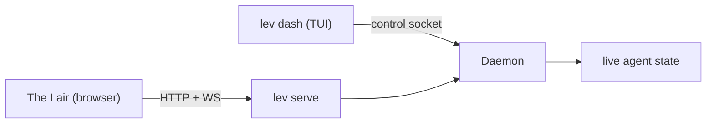

# Dashboard (`lev dash`)

`lev dash` is a full-screen TUI for managing concurrent agents. It's the fastest way to watch a fleet
of runs, answer their questions, and steer them.

```bash
lev dash
```

It reads the same [daemon](/docs/daemon) that [The Lair](https://leviath.dev/lair) does, over
the local control socket instead of HTTP:



## Answer a waiting run

The most common reason to open the dashboard: a run stopped to ask you something. Select the run
with the arrow keys, press `Enter` for its detail view, then press `i` to open the interaction
panel and answer. `lev respond` does the same from the shell.

## What's on screen

- **Agent run table**: title and run id, blueprint, stage, status, tokens, and start time, with
  sub-agents nested under their parent. Titles are auto-generated per run. The model, iteration,
  and context-window occupancy live in the detail view.
- **Detail view**: the run's path as a band under the header (the flat stage tabs
  on a short terminal), a context-window visualization, and content panes for **Output**,
  **Logs**, **Context** (JSON) and, once the run has submitted an answer, **Final**: the
  answer exactly as `GET /api/agents/{id}/result` serves it. Markdown is rendered. `t` swaps
  the band to the whole blueprint, and `g` opens the blueprint full screen.
- **Interactions**: answer an agent's question (free-text, edit, multiple-choice, tool-approval, or
  confirm) or send it a mid-run message.
- **Agents**: the catalog of agents this machine can run (`a`), and an editor that builds one on
  the same graph canvas: stages as boxes, paths drawn between them, an inspector for whatever is
  selected. The same editor The Lair has, in the terminal.
- **Mouse support**: click a run to select it and again to open it, click the `▸`/`▾` arrow to fold
  a run's sub-agents, click a stage tab or a content-pane chip (`[l]`, `[o]`, `[c]`) to switch to
  it, click a Context row to fold or unfold it, click the log panel to move the keys there. Wheel
  scroll, click-drag select with copy-on-release, OSC52 copy over SSH, `y` to yank a pane,
  Shift+drag for native selection.
- **`m`** opens the MCP management screen without leaving the dashboard.
- **The daemon link**: the dashboard polls the [daemon](/docs/daemon) ten times a second, so a
  daemon restart costs it nothing but a moment. It says so in the log pane and a toast when the
  daemon stops answering and again when it is back. While the daemon is unreachable, or came back
  on a different build than this dashboard, the run list wears a chip beside the sort chip. The
  second case is the one that asks something of you: restart `lev dash` so both run the same code.
- **The config banner**: when `~/.leviath/config.toml` stops loading, a warning takes the top row of
  every screen and stays there. It names the file, where in it the problem is - a line and column
  for a syntax error, the key for a value that was refused - and says that runs are on the last
  config that loaded, which is the part a broken file otherwise hides. It is a banner rather than a
  toast because the condition lasts until somebody edits the file, and a message that faded three
  seconds after the save cannot explain the run you start two minutes later. Fix the file and it
  clears itself, with nothing restarted. On a narrow terminal the path gives way first, then the
  reassurance; the error itself is the last thing cut.

## Keys

Most keys work on one screen only. Press `?` for the list that applies to where you are, or `F1`
where `?` would be typed as text: on the new-run screen every printable character goes into the
filter or the task.

Besides the main list and the detail view below, there is a screen for starting a run (`n`), one for
your agents and the agent editor (`a`), one for MCP servers (`m`), and the stage explorer (`g`, from
the detail view).

### Main list

| Key | Action |
|---|---|
| `↑` / `↓` (or `k` / `j`) | Select a run |
| `Home` / `End` (or `g` / `G`) | Jump to the first / last run |
| `Enter` | Open detail view |
| `←` / `→` | Fold / unfold the selected run's sub-agents. On a run that has none, `←` moves up to its parent and `→` down to its first worker |
| `n` | Start a run: pick an agent, write the task, press Enter |
| `a` | Your agents: the catalog and the editor |
| `Tab` / `Shift-Tab` | Focus the log panel (keys below) |
| `/` | Filter runs by name or status |
| `s` | Cycle the sort: start time (default), recent activity, or status groups |
| `x` | Kill the selected run. Asks first |
| `d` | Delete the run, and the sub-agent runs nested under it. Permanent, and asks first |
| `Space` | Mark or unmark the selected run, then move down a row |
| `p` / `r` | Pause / resume the selected run |
| `m` | Manage MCP servers |
| `Esc` | Clear the filter, or clear the marks once no filter is set |
| `?` / `F1` | Help for the screen you are on |
| `q` / `Ctrl-C` | Quit |

By default runs are listed newest first and keep their row for their whole life, so nothing jumps
around when a run finishes. The sort indicator sits in the table's top-right corner.

A run that spawned sub-agents (a fan-out, or the sub-agent tool) shows them nested under it, each
row wearing a `▾` while its workers are showing and a `▸` once they are folded, with `+N` for how
many the fold is hiding. `←` and `→` work the tree, and clicking the arrow does the same. A fold is
remembered by run, so it survives sorting, filtering and new rows arriving above it, and folding
the run you were inside moves the highlight onto the fold rather than back to the top.

`d` on such a run deletes the whole tree, and the confirmation says how many sub-agent runs that
is before you answer. Nothing goes the other way: deleting one worker leaves the run that started
it, and the workers beside it, alone.

Folds also outlive the dashboard. They are written to `ui-state.json` under the data directory as
you make them, not on the way out, so a session that ends with the terminal window keeps them all
the same. A run list starts fully expanded until you fold something; a fold whose run is later
deleted is forgotten the next time the dashboard can see the run list.

Three other choices live in that same file: the sort order `s` cycles, the agent the new-run
screen opens on (whichever one you last launched), and how each run's [Context view](#context-view)
was left folded. Nothing transient joins them - a filter, a search and the marks are all gone when
you come back, and unattended (`Ctrl-Y`) is deliberately off every time the new-run screen opens,
because a setting that runs tools without asking is not one to inherit out of sight.

Marking selects several runs at once: press `Space` on each run, then `x` or `d` acts on all of
them behind one confirmation. Marked rows show a check mark, the pane title counts them, and marks
follow the run rather than the row, so sorting or filtering never changes what is marked. A kill
skips marked runs that have already finished.

### Log panel

`Tab` from the main list moves the focus into the activity log under the table.

| Key | Action |
|---|---|
| `↑` / `↓` (or `k` / `j`) | Scroll a line |
| `PgUp` / `PgDn` | Scroll a screen |
| `Home` (or `g`) | Oldest line |
| `End` (or `G`) | Newest line, and follow new lines again |
| `Tab` / `Shift-Tab` / `Esc` | Back to the run list |
| `?` / `F1` | Help |
| `q` / `Ctrl-C` | Quit |

### Starting a run (`n`)

Agent blueprints on the left, the task on the right, and above the task the selected blueprint's
stage graph, so you can see what an agent will do before you give it a task: how many stages, in
what order, where it loops back. Between the graph and the task, when the blueprint takes
[inputs from the caller](/docs/context#seeding-a-region) beyond the task (a `pictures` region with
`seed = "input"`, a `--diff`), an **Inputs** box with one slot per region. A slot for a region
that takes files opens a picker of the working directory, filtered to the types the region
accepts, so you choose a file from a list rather than typing its name (and never with an `@`); a
slot for a text region takes a line of text. A file region takes as many files as its token
budget allows, added and removed in the same picker; the number is bound by the budget, never a
fixed count. The slot names what the region takes, its token budget (`≤117k tok`, the region's
share of the entry model's context window), and whether it is required. It follows the selection,
previews bundled blueprints that are not
installed yet from the copy inside the binary, and says so when a manifest cannot be read. It is
the explorer's canvas showing the whole graph: drag to pan, wheel to zoom; on a screen too short to
fit both, the task keeps its rows and the preview is skipped. Once
the run starts, the dashboard opens that run's page, and `Esc` from there goes back to the list
rather than back into the form.

| Key | Action |
|---|---|
| `↑` / `↓` | Choose an agent. Any letter filters the list; `Backspace` shortens the filter |
| `Tab` / `Enter` | Move from the agent list to the inputs, when the agent has any, else to the task |
| `↑` / `↓` (in the inputs) | Choose a slot. A file slot opens the picker on `Enter` (or `Ctrl+O`); a text slot takes what you type, and `Enter` moves to the next slot and, after the last, to the task. `Tab` to the task; `Shift+Tab` or `Esc` back to the agent list |
| picker (in a file slot) | `↑` / `↓` move, any letter filters by name, `Space` selects or deselects the highlighted file, `Enter` confirms. `Enter` never selects on its own, so a slot can be left empty; `Esc` cancels. The list is the working directory only, so it never offers a file the run could not read, and each file shows its own token cost. The title shows the tokens the choice costs against the region's budget (its share of the model's context window); a file that would overflow the budget is refused with the reason, and a run that would not fit is stopped before it starts |
| `Ctrl+S` (in the task) | Start the run. `Ctrl+Enter` also starts it, but only a terminal with the kitty keyboard protocol (kitty, WezTerm, Ghostty, foot, recent Alacritty) can tell Ctrl+Enter from Enter; elsewhere it inserts a newline, and `Ctrl+S` or the Start button is the way to submit |
| `Enter` / `Alt+Enter` | Newline |
| `Tab` (in the task) | Move to the Start button under the editor. `Enter` or `Space` there starts the run, as does a click on it; `Tab` or `Esc` returns to the agent list, `Shift+Tab` to the task |
| `@` | Reference a file from the working directory: `↑` / `↓` choose a path, `Enter` or `Tab` inserts it, `Backspace` over the `@` ends the reference, `Esc` dismisses the list and keeps what you typed. A path that names a file is attached to the task as a typed part when the run starts, and the task box's title counts them as you type; one that names nothing stays text, with a warning |
| `Ctrl-Y` | Run unattended, so the agent approves its own tool calls |
| `F1` | Help. `?` types a question mark here |
| `Esc` (in the agent list) | Clear the filter, then close the screen |
| `Esc` (in the task) | Back to the agent list; `Shift+Tab` back to the inputs, when there are any |


The task box wraps: a task longer than the pane is wide folds onto the next
row rather than scrolling sideways, so the beginning of what you wrote is
still on screen when the cursor is at the end. See
[Formatting a long-form box](#formatting-a-long-form-box) for what the toolbar
along its top does.

`Ctrl-Y` warns every time you turn it on (turning it off never asks), and the warning is worth
reading: an unattended run approves its own file edits and shell commands, but it does **not** skip
a checkpoint the blueprint asks a person for. Those still stop, and by default one nobody answers
waits for as long as it takes. `[limits] interaction_timeout_secs` is how you bound that wait. The
setting is off again every time the screen opens.

### Detail view

On a terminal at least 36 rows tall the stage row is the blueprint's graph, drawn by the same
canvas as the explorer: the path the run took and the options from where it is, boxes on layers,
the stage the run is in in the run's colour, visited stages with their visit count. The selected
box is the open stage tab, in a thick bright frame: `←` / `→` move it through the graph, `1`-`9`
jump to a stage by number, and a click on a box picks it. Drag a box to move it, drag empty canvas
to pan, `g` opens the same graph full screen with the rest of its keys. On a shorter terminal, and
for a run whose blueprint could not be read, the flat tab strip stays.

| Key | Action |
|---|---|
| `←` / `→` | Switch stage tab, through the graph when it is on screen (`h` / `l` are not aliases here: `l` is Logs) |
| `1`–`9` | Jump to that stage tab |
| `↑` / `↓` (or `k` / `j`) | Scroll the pane; in the Context view, move the tree cursor |
| `PgUp` / `PgDn` | Scroll ten lines |
| `Home` / `End` (or `b` / `e`) | Jump to the beginning / end |
| `l` / `o` / `c` | Switch the pane to Logs / Output / Context |
| `f` | Switch the pane to Final: the answer the run submitted, the same bytes `lev result` and the HTTP API return. The `[f] final` chip and the key are there only while the run has one; Output shows what the stage wrote along the way, which can differ |
| `g` | Open the stage graph explorer |
| `t` | Swap the band between the run's path and the whole blueprint |
| `R` | Re-snake the path, undoing boxes you moved by hand |
| `Enter` / Space | Fold or unfold the row under the Context tree's cursor |
| `[` / `]` | Jump to the previous / next region in the Context view |
| `v` / `w` | On a stored part's row in the Context view: open the file with whatever the OS opens it with, or write it into the run's working directory under its own name |
| `,` / `.` | Step back and forward through context history |
| `/` , then `n` / `N` | Search, then next / previous match |
| `y` | Copy the pane to the clipboard |
| `i` | Respond to or message the agent |
| `x` | Kill the run. Asks first |
| `p` / `r` | Pause / resume the run |
| `Esc` | Clear the search, or go back to the list |
| `?` / `F1` | Help |
| `Ctrl-C` | Quit. `q` is unbound here, so a stray keystroke cannot close the dashboard mid-run |

A `@path` in a typed response or message attaches that file from the run's working directory,
the way it does on `lev respond --attach` and `lev msg`: the words keep the token, the file lands
beside them as a typed part, and a token that names no file stays text with a warning toast.

While you are typing a response, `Enter` inserts a newline, the way it does in the new-run task
box, and `Ctrl+S` sends. `Ctrl+Enter` sends too on a terminal with the kitty keyboard protocol,
which is what it takes to tell `Ctrl+Enter` from `Enter`; `Tab` moves to the Send button under
the box, where `Enter` or `Space` sends, as does a click on it. `PgUp` / `PgDn` scroll the document above the prompt, and
`Esc` cancels. `/quit` or `/exit` on its own line ends the conversation when sent. An in-place
document edit takes the same keys, with a Save button in place of Send. Single-line boxes (a
rename, a filter, a server URL) still submit on `Enter`.

A tool approval is a list of choices: `↑` / `↓` pick one and `Enter` answers. Its last row, "Deny
with feedback", opens the same response box instead of answering, for the line or two that tells
the run what to do instead of the call. `Ctrl+S` or the Send button sends it with the deny, and
`Esc` goes back to the choices with nothing sent. The text reaches the model inside the refused
call's tool result; see [Human-in-the-loop](/docs/interaction#tool-approval).

Destructive keys always confirm on a dialog with real buttons: `←`/`→` pick an answer, `Enter`
activates it, and a stray keypress does nothing. The safe answer holds focus to start.

### Context view

The Context view is a tree, not one long scroll. Each region is a header row with its token bar;
its entries are one-line stubs with a preview. Move with `↑`/`↓`, fold or unfold with `Enter` or
Space (or by clicking the row), and jump between regions with `[` and `]`. An unfolded entry that
carries files (an attached image, a stored `read_file`, a submitted artifact) shows each as its own
row above the text: the stand-in the model sees, the hash, the token estimate. With the cursor on
one, `v` hands a copy to the program the operating system opens that kind of file with, and `w`
writes it into the run's working directory. Nothing in the dashboard plays or draws a file. The
Final view lists the files a run produced under its answer; their parts sit in the `final_output`
region, where the same two keys reach them. While a search (`/`) is active everything is
temporarily unfolded so matches inside entries stay reachable. Browsing history with `,`/`.` keeps
your scroll position and fold state, and the context card's title shows which archived point you
are on, in which stage, recorded when.

What you fold here is remembered **per run**, and outlives the dashboard: reopening a run finds its
regions and entries as you left them, while a different run opens at the defaults. Folding
`conversation` on one run says nothing about another, and an entry index certainly does not. A run
you put back to its defaults keeps no record at all, and a run you delete takes its record with it.
The one caveat is a *live* run whose region evicts from the front: entry numbers shift under an
expansion, which is already true within a single session and is why this is a convenience rather
than a promise.

### The path band

The rows under the detail view's header draw the run's path: one box per stage **visit**, in the
order the run walked them, snaking across rows so it stays compact and grows a row at a time while
the run is still going. A stage entered three times is three boxes - `implement`, `implement (2)`,
`implement (3)` - because the order is the story, and each says when it was entered and how many
iterations it took. The rows alternate direction, so the last box of a row sits directly above the
first box of the next and the hand-off between them is a short vertical hop rather than a jump back
across the canvas. The band grows a row taller when the path wraps; past that it pans, keeping the
stage the run is in on screen. This is the same picture The Lair's run view draws on the web.

`t` swaps the band to the whole blueprint, painted with what the run has done to it, and back
again. Boxes can be dragged and the canvas panned; a box you move stays where you put it as the
path grows, and `R` throws the arrangement away and snakes it again. On a terminal too short to
give the band its rows, the flat stage strip stays.

### Stage explorer

`g` in the detail view opens the full-screen stage explorer for any run (a linear blueprint is a
chain; a graph blueprint is a graph). Where the band is what the run did, the explorer is the map
of everything it could do:

- **Graph** draws the blueprint on a canvas: stages are boxes on layers, transitions are routed
  edges. The layers run left to right when that fits the terminal and top to bottom when only that
  does (`r` turns it by hand); boxes are never shrunk to make a graph fit, the canvas pans instead,
  with a minimap in the corner when there is more graph than screen. The stage the run is in
  spins in the run's colour, stages it has been through show a visit count (`×2`) and the time of
  their last visit, the last transition it took is animated while the run is still going, and
  revisit loops run along a lane
  beside the boxes. The whole blueprint is on show, so you can see what the run has not done as
  well as what it has. `t` narrows it to the path and the options - the stages the run has been
  through and the one it is in, the transitions between them, and the transitions it can take from
  where it is with the stages they lead to - and everything else waits off screen, so a stage never
  sits there without a line to it.
  The escape edges (`error`, `dead_end`, `stuck`, `max_iterations`) are hidden until you ask for
  them, because nearly every stage has one to the same hub; with the path in focus, `e` shows the
  escapes from the current stage. A fan-out stage that is running shows its worker counts.
  A stage that takes [files](/docs/mime) beyond text wears what it takes (`◧ image/* audio/wav`,
  from its regions' `accepts` or its `[input] accepts`), and one that declares files it hands back
  wears their types (`▤ video/mp4`); a path whose file the next stage's regions cannot take
  carries `!` on its label, and selecting it says which type would cross as a stand-in.
  Selecting a stage or an edge describes it on the line under the canvas. Boxes can be dragged
  into an arrangement you prefer; the explorer remembers it, and the view, for as long as the
  dashboard is open.
- **Timeline** lists each actual visit in order, with when it started, how long it lasted, and how
  many iterations it ran. `Enter` on a visit opens the context window exactly as it was at that
  point.

| Key | Action |
|---|---|
| `←` `→` `↑` `↓` (or `h` `j` `k` `l`) | Select a stage in that direction |
| `[` / `]` | Select the previous / next stage in blueprint order |
| `Enter` | Graph: open the selected stage's tab. Timeline: open the visit's context |
| `+` / `-` , `0` | Zoom in / out, back to 100% |
| `f` | Fit the whole graph on screen |
| `r` | Turn the graph: left to right or top to bottom |
| `t` | The whole graph (the default), or only the path taken and what comes next |
| `e` | Show or hide the escape edges |
| `Tab` / `Shift-Tab` | Switch between Graph and Timeline |
| `?` / `F1` | Help |
| `Esc` / `g` | Close the explorer |

The mouse works on the canvas: drag a box to move it, drag empty canvas to pan, wheel to zoom at
the cursor, click a stage to select it. While the explorer is open the detail view's keys are off, so `e`, `c`, `l`, `o` and `b` mean
what the table above says rather than what they mean underneath.

`lev validate --graph <agent>` prints the same picture as plain text.

### Agents (`a`)

The catalog: every agent `lev run` can resolve (installed under `~/.leviath/agents`, configured in
`agent_paths`, the working directory's own) and the ones bundled in the binary and not installed
yet. The right half shows the selected agent's graph, what it does, where it lives and its stages.
An installed bundled agent that has been edited says `edited`, and `r` puts the bundled copy back.

| Key | Action |
|---|---|
| `↑` / `↓` (or `k` / `j`), `Home` / `End`, `PgUp` / `PgDn` | Move |
| `Enter` / `e` | Open the agent in the editor. A bundled agent not installed yet opens from its embedded copy and is installed when saved |
| `n` | New agent: start from the two-stage starter, or clone any agent in the catalog, under a name you type |
| `l` | Launch it: the new-run screen with this agent picked |
| `r` | Rename an installed agent: type the new name, `Enter` renames its directory and the `name` in its manifest (its saved arrangement comes along), `Esc` keeps it. A bundled agent not installed keeps its name (clone it with `n`); agents that live elsewhere are renamed where they are |
| `d` | Delete an installed agent and its directory. Asks first. Agents that live elsewhere are edited in place but deleted where they are |
| `R` | Reset an edited bundled agent to the copy bundled in the binary. Asks first |
| `/` | Filter by name or description; `Enter` keeps the filter, `Esc` clears it |
| `?` / `F1` | Help |
| `Esc` / `q` | Back to the run list |
| mouse | Wheel over the list to move; wheel and drag on the preview to zoom and pan |

### Agent editor

The editor is one screen: the graph on the left, an inspector on the right showing whatever is
selected on the graph, a problems line under the graph, and a hint bar. Nothing is written until you
save. The inspector shows one thing at a time, and a field that does not apply is greyed rather than
hidden, so the panel never reflows under the cursor:

- **This agent**, when nothing is selected: description, which stage a run starts at, the model every
  stage tries first, and the shared context regions (`Enter` on one opens it).
- **A stage**, on four tabs (`1` to `4`). *Behaviour*: how it works, description, tries, revisits,
  whether it may finish the run, the fan-out settings when it fans out, its loop back to itself when it
  has one, the prompts, delete. The worker a fan-out runs as is picked
  from the agent's other stages or from every agent installed here (with an *another…* row for
  one that is not), and typed only when it is a query. *Inputs & outputs*: the input types (what
  the stage takes as files beyond text; left empty it is whatever its regions take, and each
  region is listed under it with the [mime](/docs/mime) it takes, `Enter` opening it), what is
  sent to the model as text whatever it takes, the output type (picked from the plain shapes,
  `markdown`, `json`, `text`, or any mime type), and the output files it declares it hands back
  (`Enter` opens one, `x` drops it, the last row declares another and asks its name). *Models & tools*: the model chain (the first is tried first; `Enter` swaps an entry, `x`
  drops it, `h` `l` or a drag on its `⠿` grip move it, the last row adds a fallback), the tools it may
  use, picked from every tool this install has (`Space` toggles, `Enter` keeps): the groups, each
  [MCP server](/docs/mcp) from your config and the agent's own manifest as a connector that grants
  every tool it advertises, and, once the server has answered (it is asked when the screen opens),
  its tools one by one under their `server__tool` names; and under them what
  each tool may be handed at this stage (`Enter` picks the types, `x` lifts the limit): call another
  agent with images only, or hand a tool that takes text and images only text here.
  *Context & tools*: whether the stage sees the agent's shared regions or has a layout of its own, the regions
  it sees (`Enter` opens one), a button to give it its own layout or go back to the shared one, where
  tool results land by default, and per-tool routing (`Enter` on a row changes the region, `x` stops
  routing the tool).
- **A path**: when it is taken, the hint the model routes on, whether it needs your approval, what
  context is carried across (everything, only pinned regions, everything summarized, or per-region
  rules: carry, summarize or drop each one, with the instructions the summary follows), delete.

A region, a declared file and a stage's loop back to itself open in a window over the editor rather
than in the inspector's place, so the panel they came from stays in view; `Esc` closes the window.

- **A context region**: name, kind (each kind says what it does), share of the context window and
  token cap, the sliding-window knobs when it is one, the mime types it takes and how many stored
  parts it keeps, whether it must be filled before the run goes on and what to say if it is not, what
  seeds it, description, delete.
- **A declared file**: name, type or pattern, whether it is required, description, and a button to
  drop the declaration.

Every mime type field is one chooser: the families (`image/*`, `audio/*`, and so on), every type
the registry knows (the built-in table, then your [`mime_types.toml`](/docs/configuration#mime_typestoml)),
and an *another…* row that takes a `type/subtype` or `type/*` the list does not have. `Space`
picks as many as the field takes, `Enter` keeps them, `x` on the field clears it.

The models the chooser offers come from every provider in your config (asked when the screen
opens, so the list fills in a moment later) on top of the built-in catalog, marked with the context
window when it is known. The prompts open full screen: the system prompt (what the stage is told)
and the transition prompt (how it picks the next path; only read when there is more than one), with
`Tab` between them, `Ctrl-S` or `Esc` to apply, `Ctrl-Q` to discard, and `F2` to hand the
focused prompt to `$EDITOR` (`$VISUAL` first): the dashboard steps aside while the editor runs and
the text comes back into the box when it closes.

Every edit is checked as you make it, the way `lev validate` checks a file: the line under the graph
says how many errors and warnings there are (`p` opens the list), a stage an error names carries a
`!` on its box, and saving is refused while there are errors. `Ctrl-Z` undoes the last edit, `Ctrl-Y`
(or `Ctrl-Shift-Z`) redoes it. `v` shows the exact `agent.leviath` that will be saved, comments and all: the editor keeps
your file's comments, key order and formatting, and only writes the keys it knows.

An arrangement dragged into shape is kept per agent (in `dash/graph-layouts.json` under the data
directory), so a graph opens the way you left it; it is never part of the manifest.

| Key | Action |
|---|---|
| `Ctrl-S` | Save (checks first; errors block it and open the problems list) |
| `Tab` | From the graph: move the keys to the inspector. On a stage's inspector: the next tab (`Shift-Tab` the one before). On any other panel: back to the graph |
| `Ctrl-Z` / `Ctrl-Y` | Undo / redo (`Ctrl-Shift-Z` redoes too) |
| `v` | The definition; `y` copies it, `Esc` closes it |
| `p` | Open or close the problems list under the graph |
| `?` / `F1` | Help |
| `Esc` | On the graph: close the editor (asks when there are unsaved edits). On the inspector: back to the graph |

On the graph:

| Key | Action |
|---|---|
| `←` `→` `↑` `↓` (or `h` `j` `k` `l`) | Select a stage in that direction; `[` / `]` the previous / next in file order |
| `Enter` | Edit the selected stage or path in the inspector |
| `a` | Add a stage after the selected one (asks its name) |
| `c` | Connect the selected stage to another, picked from a list (or to itself: a loop) |
| `x` / `Delete` | Delete the selected stage (asks first) or path |
| `+` / `-` , `0`, `f`, `r` | Zoom, fit, turn the graph |
| mouse | Click a box or a path to select it; click empty canvas to select nothing (back to **This agent**); drag a box to move it, drag a `●` handle onto another box to connect them, drag empty canvas to pan, wheel to zoom |
| right-click | A menu for what is under the pointer: a stage (edit, connect to, add a stage after it, rename, edit prompts, delete), a path (edit, delete), or the empty canvas (add a stage there, fit, turn, show the definition). `↑` `↓` and `Enter` work it, `Esc` or a click elsewhere closes it |

On the inspector:

| Key | Action |
|---|---|
| `↑` / `↓` (or `k` / `j`), `Home` / `End` | Move between rows |
| `Enter` | Edit the row: type into it, choose from a list, flip it, open it, or press the button |
| `←` / `→` (or `h` / `l`) | Change the row in place: cycle a choice, step a number, flip a toggle, move a model in its chain |
| `x` / `Backspace` | Remove the row: a model from the chain, a tool's routing, a file declaration, a list of types |
| `1` `2` `3` `4` | A stage's tabs: behaviour, inputs & outputs, models & tools, context & tools |
| `Esc` | Close the window a region, a file or a loop is open in; otherwise back to the graph |
| mouse | Click a row to pick it (again to open it); click a tab to switch to it; drag a model's `⠿` grip to move it in the chain |

A stage's model chain is a priority order, and the `⠿` grip at the start of each model row is how
the mouse changes it: press the grip, drag it up or down the chain, and let go. The rows reorder as
you drag, so where you drop it is what you saw, and nothing is written until the button comes up --
one undo entry for the whole move, and a drop back where it started costs not even that.

The grip is deliberately a small target rather than the whole row. Dragging anywhere else on a row
still selects text the way it does everywhere else in the dashboard, so a model id stays something
you can highlight and copy.

In the prompts:

| Key | Action |
|---|---|
| `Tab` | Move between the system prompt and the transition prompt |
| `Ctrl-S` / `Esc` | Apply both and close |
| `Ctrl-Q` | Close without applying |
| `F2` | Open the focused prompt in `$EDITOR`; the dashboard waits for it |
| `F1` | Help. `?` types a question mark in a prompt |

Both boxes wrap and carry the formatting toolbar; see
[Formatting a long-form box](#formatting-a-long-form-box).

On a terminal under 120 columns the graph and the inspector take turns: `Tab` moves to the
inspector and `Esc` back to the graph.

### MCP servers (`m`)

| Key | Action |
|---|---|
| `↑` / `↓` (or `k` / `j`) | Move |
| `a` | Add a server: type its URL, `Enter` adds it, `Backspace` edits, `Esc` cancels |
| `d` | Remove the selected server. Asks first |
| `l` | Log in through the browser |
| `t` | Test the connection |
| `r` | Refresh the list |
| `?` / `F1` (`F1` while typing a URL) | Help |
| `Esc` | Back to the run list |
| `q` / `Ctrl-C` | Quit |

### Formatting a long-form box

Four boxes in the dashboard take prose rather than a word: the task on the
new-run screen, the box you answer a waiting run in, the document you edit in
place when a run asks you to revise one, and a stage's system and transition
prompts in the agent editor. All four are the same editor. They wrap, and each
one draws a toolbar along its top:

```
   Edit ⇄    │ B  i  S  U │ <>  ```  [] │ ▦  ◇ │ H  •  1.  >
```

Each button's face is drawn in the style it applies, so the bold button is
bold and the struck one is struck. Hover any of them and the box's bottom
border names it and its chord. A button lifts under the pointer; the view you
are in is the filled one.

#### The two views

The switch on the left says which view you are in and flips it: `Edit ⇄` while
you are writing markdown, `Preview ⇄` while you are looking at how it will
read. `Ctrl-P` does the same. It keeps its width when its label changes, so the
buttons beside it do not jump when you press it.

`Preview` is rendered by the same code that draws an agent's output in the run
view, so the two cannot disagree.

Which view you prefer is remembered in `ui-state.json` and every box opens in
it, including the next time you start the dashboard.

**The preview is not read-only.** Typing goes into the document underneath and
the rendering re-runs as you type, so markup resolves the moment it is well
formed. Because a rendered document has nowhere to put a caret, the strip along
the bottom of the box carries the line you are on, as markdown, and the preview
follows it as you move.

#### The buttons

Click one, or use its chord. Select text first (hold `Shift` and use the arrow
keys) and the chord wraps the selection; with nothing selected it opens an
empty pair and leaves the cursor between the halves. The list, heading and
quote keys toggle, and act on every line a selection touches.

| Button | Chord | What it writes |
|---|---|---|
| `B` | `Ctrl-B` | `**bold**` |
| `i` | `Ctrl-I` | `*italic*` |
| `S` | `Ctrl-D` | `~~strikethrough~~` |
| `U` | `Ctrl-U` | `<u>underline</u>` |
| `<>` | `Ctrl-E` | `` `inline code` `` |
| ` ``` ` | `Ctrl-Shift-E` | a fenced code block |
| `[]` | `Ctrl-K` | `[text](url)`, cursor ready for the URL |
| `H` | `Ctrl-H` | cycles `#`, `##`, `###`, none |
| `•` | `Ctrl-L` | toggles `- ` on the line |
| `1.` | `Ctrl-O` | toggles `1. ` on the line |
| `>` | `Ctrl-.` | toggles `> ` on the line |
| `▦` | `Ctrl-T` | a table, after asking how many columns and rows |
| `◇` | `Ctrl-G` | a ```mermaid``` flowchart to fill in |

Markdown has no underline of its own, so `U` writes the HTML tag every
renderer takes for one. The dashboard renders `<u>` too, in a preview and in an
agent's output alike.

`Ctrl-Z` undoes and `Ctrl-Shift-Z` (or `Ctrl-R`) redoes. Clicking in the text
puts the caret where you clicked.

#### Links, tables and diagrams

`Ctrl-K` opens a popup with two fields, `Text` and `URL`. Selected text becomes
the caption, so only the URL is left to type. `Tab` moves between the fields,
`Enter` on the second one inserts, `Esc` cancels. A popup rather than
punctuation to type around, and it is the only thing that can work in
`Preview`, where there is no caret to park inside `[]()`.

`Ctrl-T` asks how many columns and rows, then writes the grid. `Ctrl-G` writes
a small `flowchart TD` to edit rather than an empty fence, because mermaid's
syntax is the part people look up.

Both render in `Preview`, and in an agent's output:

* A **table** is drawn as a framed grid. Columns are sized to their content and
  squeezed to fit the pane, widest first, with `…` where a cell was cut.
* A **```mermaid``` flowchart** is drawn as a diagram. `flowchart` and `graph`
  are supported, with the `[]`, `()`, `{}` and `(())` shapes and the `-->`,
  `---`, `-.->` and `==>` connectors. Any other kind of mermaid diagram (a
  sequence diagram, say) shows its source, because a wrong picture is worse
  than an honest listing.

On macOS these read as `⌘B`, `⌘I` and so on in the hint bar and the help
overlay, and **both** `⌘` and `Ctrl` work. That is deliberate: Terminal.app and
iTerm2 keep `⌘` for themselves and never hand it to the program, so a build
that listened only for `⌘` would be a build with no working chords.

Two chords depend on what the terminal can report. Without the kitty keyboard
protocol (kitty, Ghostty, WezTerm and foot speak it; Windows Terminal has an
equivalent) `Ctrl-I` arrives indistinguishable from `Tab` and `Ctrl-H` from
`Backspace`, so italic and heading are on their buttons there. Nothing else
changes: `Tab` and `Backspace` keep doing what they always did.

Every box takes the same chords, including the agent editor's prompt overlay.
`Ctrl-E` there used to mean "open this prompt in `$EDITOR`"; that moved to
`F2` so the formatting chord means one thing everywhere.

#### Following a diagram

The point of a diagram is being able to see what connects to what, so no two
lines ever share a row:

```
     ┌─────────────┐
     │  Discover   │◀───────╮
     └─────────────┘        │
            │               │
            ▼               │
     ╭─────────────╮        │
     │ <Plan ok?>  │        │
     ╰─────────────╯        │
            │               │
     ╭──────┤ yes           │
     │      ╰──────╮ no     │
     ▼             ▼        │
┌─────────┐  ┌───────────┐  │
│  Build  │  │  Rethink  │──╯
└─────────┘  └───────────┘
```

Every edge leaves its box, turns onto a row nothing else uses, and turns down
again over its target, with its label at the end of that row. Where several
edges leave the same box the stem tees off (`├`, `┤`) rather than ending, so
the line below still reads as connected.

A loop, or an edge that skips a layer, runs down a corridor of its own beside
the diagram and comes back in with a `◀`. Only when the pane is too narrow for
a corridor does it fall back to being named underneath.

The whole toolbar needs 61 columns. A box narrower than that drops buttons off
the right a group at a time, keeping the view switch; one too short to spare a
line drops the row entirely. The chords and the text are never what gets cut.

> [!TIP]
> Prefer a browser, or want to drive Leviath from another machine?
> [The Lair](https://leviath.dev/lair) mirrors the dashboard over the [HTTP API](/docs/api).
