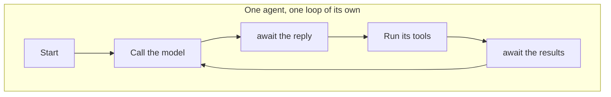
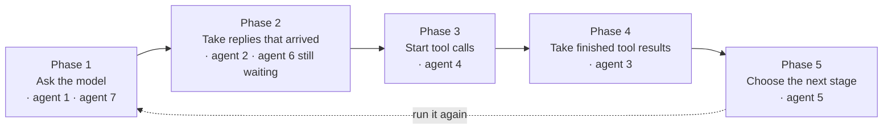
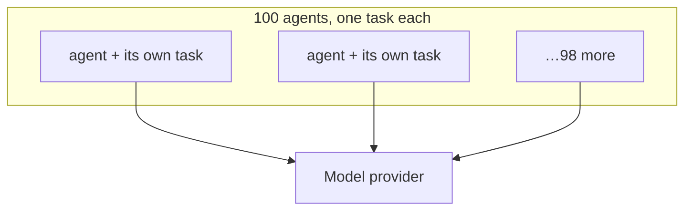
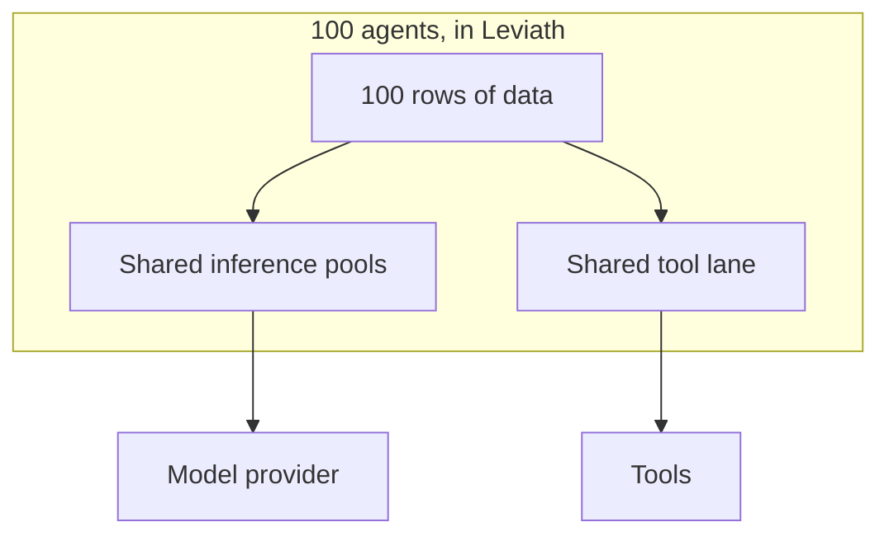
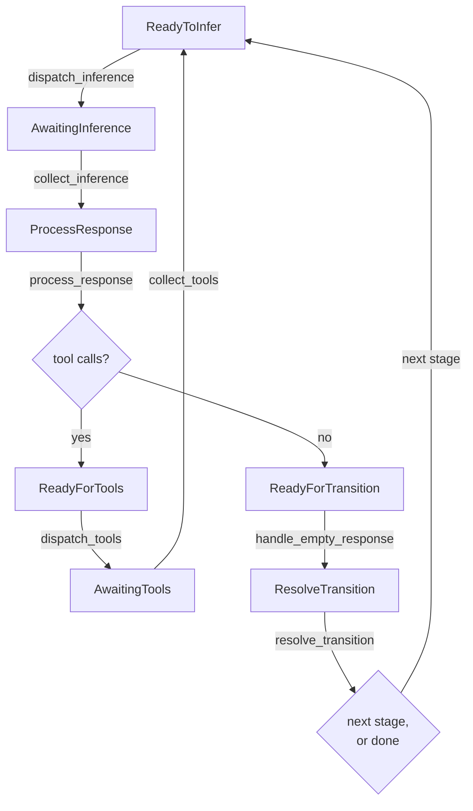

# The agent engine

Most of the agents you run are waiting. Waiting on a model to reply, on a tool to finish, on a
person to answer a question. If every waiting agent costs you an operating system process, then a
thousand agents cost a thousand processes whether or not any of them are doing anything.

So Leviath does not give an agent a process, a thread, or even a task of its own. It keeps each
agent as a **row of data** in one shared table, and runs a fixed list of functions across the whole
table over and over. An agent with nothing to do is a row those functions skipped, which costs
close to nothing.

That arrangement has a name: an **Entity Component System**, usually shortened to **ECS**. Game
engines use it to move thousands of objects per frame. Leviath borrows the storage and iteration
rather than the reason. Games want cache locality in a tight frame budget, while an agent
runtime wants a way to hold state for something that is mostly waiting. If you have written a
reactor with a state machine per connection, this will feel familiar. The ECS supplies the table
and the sweep so Leviath does not hand-roll them.

The three words are the three pieces, and this page explains each one as it goes:

| Word | Means here |
|---|---|
| **Entity** | One agent. A row number, with no code attached to it. |
| **Component** | One piece of an agent's data, such as its context window or which stage it is on. |
| **System** | One function that runs across every agent in a given state and moves it along. |

Two words from elsewhere in the docs turn up throughout. A **stage** is one phase of the agent's
own workflow, with its own prompt, model, and tools, described in
[Multi-stage workflows](/docs/stages). The **world** is the single table this page keeps talking
about: one per daemon, holding every agent on the machine.

You never configure any of this.

## The usual shape, and this one

Most agent runtimes give an agent a loop of its own. The agent is an object, it owns a task, and
that task walks through its own steps, stopping on an `await` whenever it needs the outside world:



Leviath turns that inside out. The loop belongs to the engine, not to any agent, and it is a
pipeline: a fixed sequence of phases that runs start to finish, over and over. Each phase is one
function, and it acts on whichever agents happen to be sitting at that phase right now.

Here is the spine of it. The real pipeline has about forty-five functions, and these five are the
ones that move an ordinary turn. The rest handle summarizing context, spotting a stuck agent,
iteration caps, checkpoints, fan-out, telemetry, and writing to disk.



Read one pass of that left to right. Agents 1 and 7 have a request ready, so the first phase sends
both and moves on. Agent 2's reply has come back, so the second phase takes it. Agent 6 is in that
same phase but its reply has not arrived, so the function looks at it, finds nothing to do, and
leaves it there. Agent 4's turn asked for tools, so the third phase starts them. Agent 3's tools
have finished. Agent 5 reached the end of its stage and needs its next one chosen.

Two things to take from that. **Nothing blocked**: sending a request and collecting its reply are
different phases, so an agent that asks the model in one pass is collected in some *later* pass,
whenever the answer actually arrives. And **an agent with nothing to do costs a glance**. Agent 6
was looked at and skipped; no thread was parked on it, and no work was queued behind it.

An agent's position in the pipeline is itself a piece of its data, which is what lets each phase
find its agents by looking rather than by being told.

The difference shows up when there are many of them. Give each agent its own task and the runtime
has 100 things it must schedule, each holding a turn's worth of stack. Any budget you want to
apply across all of them then has to be coordinated between them:



In Leviath they are 100 rows in one table, and the budgets live in one place because there is only
one place to put them:



### The cost that is left

Being straight about what this does and does not buy. It removes the per-agent task and the
per-agent scheduling, which is the part that scales badly. It does **not** make an agent free,
because the expensive thing an idle agent holds is its context window, and that stays in memory
while the run is live. A hundred idle agents with large windows cost real memory, whatever the
concurrency model.

Two cases reclaim it. A **paused** run is written to disk and dropped from the world entirely, then
rebuilt when you resume it. A **fan-out worker** whose result has been merged and persisted has its
window, blueprint, and stage tables removed while its record stays. Everything else keeps its
window until the run ends.

Every system also runs on one thread, in a fixed order, so a pass is serial in the number of agents
that have something to do. Idle agents cost a glance each, and a pass where nothing changed puts
the loop to sleep entirely, which is the [fixed point](#what-a-tick-is) below.

From here the page gets specific:
[what the three words mean precisely](#entities-components-and-systems),
[what one agent is made of](#an-agent-is-an-entity), [how it moves between phases](#markers-are-the-state-machine),
[what one pass costs](#what-a-tick-is), and
[what happens when one agent breaks](#one-agents-failure-stays-one-agents-failure).

## Entities, components, and systems

Leviath gets this from [bevy_ecs](https://bevy.org/), a library built for game engines and
used here unchanged. Precisely:

- An **entity** is an id and nothing else. No data, no methods. Think of it as a row number.
- A **component** is a plain struct attached to an entity. `AgentState` is a component,
  `ContextWindow` is a component. An entity is nothing more than the components it carries.
- A **system** is an ordinary function that runs over every entity carrying some particular set of
  components. It asks for what it needs and changes it in place.

So there is no agent object that knows how to run itself. There is agent-shaped **data**, and the
pipeline of functions above running across all of it. Nothing sits on an `await`, because nothing
owns a call stack. A blocked agent is a row that this pass skipped.

That trade is aimed at running many agents at once:

- **A blocked agent costs one row.** Concurrency is paid for only where real work happens: one
  async task per in-flight request, never one per agent.
- **[Sub-agents and fan-out](/docs/sub-agents)** are more entities in the same world. No new
  processes, nothing serialized between a parent and its children.
- **Rate limits, retries, and provider clients are shared** instead of duplicated per process.
- **One place holds all the state**, so the [dashboard](/docs/dashboard) and [API](/docs/api) read
  every agent without talking to thousands of separate processes.

The cost is the process boundary. Agents keep their own state, workdir, and tool policy, and
[a panic in one stays in one](#one-agents-failure-stays-one-agents-failure). But they share the
daemon's memory and its fate, which is a weaker guarantee than a process per agent. For a hard OS
boundary around what an agent can run, add a [sandbox](/docs/security).

## An agent is an entity

When the daemon spawns an agent, this is all that happens:

```rust
world.spawn((
    AgentBlueprint(blueprint),   // the whole stage graph, as data
    AgentState { .. },           // agent id, current stage, iteration, status
    MessageInbox::default(),     // mid-run messages not yet delivered
    StageCursor { index: 0 },    // which stage we are in
    StageProgress::default(),    // per-stage counters (tool calls, edits, timings)
    StageInferences(..),         // pre-resolved model + tools, one per stage
    StageSetups(..),             // pre-resolved layout + prompt, one per stage
    visits,                      // times each stage has been entered
    window,                      // the ContextWindow: regions and their budgets
    stage0_inf,                  // this stage's model and tool set
    stage0_cfg,                  // this stage's temperature, token caps, timeouts
    ReadyToInfer,                // a marker, explained below
));
```

Every line is a component, and most come straight from the [blueprint](/docs/agents):

| Component | Filled from |
|---|---|
| `AgentBlueprint` | the entire `agent.leviath` file |
| `ContextWindow` | `[context.regions]`, with percentage budgets resolved against the model's window |
| `StageInferences` | each `[stages.<name>.model]` and its `available_tools` |
| `StageSetups` | each stage's `system_prompt`, context layout, and tool routing |
| `StageProgress` | nothing, these are the runtime's own counters |

The per-stage arrays are worked out once, at spawn. A stage is not an entity of its own: it is
`StageCursor.index`, a position in the blueprint the agent already carries. A transition moves that
integer, resets `StageProgress`, and swaps in the next stage's pre-resolved model, tools, and
layout. It tears nothing down, which is why a workflow graph is cheap to run.

## Markers are the state machine

An agent has no field saying what phase it is in. Instead it carries one of twelve **marker**
components, and each system asks for the marker it acts on.

| Marker | What it means | Picked up by |
|---|---|---|
| `ReadyToInfer` | Ready to build a request and call the model | `dispatch_inference` |
| `AwaitingInference` | The call is in flight | `collect_inference` |
| `ProcessResponse` | The reply landed and has not been read yet | `process_response` |
| `ReadyForTools` | The reply asked for tools | `dispatch_tools` |
| `AwaitingTools` | The tool batch is running | `collect_tools` |
| `ReadyForTransition` | The reply asked for no tools, so the stage may be done | `handle_empty_response` |
| `ResolveTransition` | The stage is done, work out what comes next | `resolve_transition` |
| `AwaitingTransitionChoice` | Several edges are possible, the model has to pick | the transition-choice system |
| `AwaitingTransitionResponse` | That pick is in flight | the transition-collect system |
| `AwaitingCompaction` | The context is being summarized; the agent holds until it lands | the compaction system |
| `PendingTitle` | This run wants a generated title | `dispatch_title` |
| `AwaitingTitle` | The title call is in flight. Titling runs alongside the first turn | the title-collect system |

Moving an agent forward means removing one marker and adding another. `dispatch_inference` asks for
entities `With<ReadyToInfer>`, so an agent without that marker is not in the results at all. The
same trick makes control operations nearly free: pausing a run sets `AgentStatus::Paused`, and
every dispatch system already ignores agents that are not `Active`.

## The path one agent takes

From a fresh stage to the next one:



1. **`dispatch_inference`** builds the request from the agent's context regions and tries to take a
   slot from the model's [pool](#inference-pools). No free slot means no action, and the agent stays
   `ReadyToInfer` for a later pass.
2. **`collect_inference`** picks up whatever came back and moves the agent to `ProcessResponse`.
3. **`process_response`** reads the reply. Tool calls go down the tool path; plain text goes toward
   a transition.
4. **`dispatch_tools`** checks each requested call before it runs. A tool the stage never
   advertised in `available_tools` was never sent to the model, and is refused here too if it
   guesses the name. [Permissions](/docs/tools) decide
   whether the call needs you, and [taint tracking](/docs/security#taint-tracking-experimental)
   blocks a call that would carry sensitive data somewhere it should not go. Calls that only edit
   the agent's own context apply here; the rest go to the tool lane.
5. **`collect_tools`** merges the results back into the order the model asked for them, files each
   into the [context region](/docs/context) the stage routes it to, and returns the agent to
   `ReadyToInfer`.
6. **`resolve_transition`** picks what happens at the end of a stage. A stage's outgoing edges are
   its [transitions](/docs/stages), including ones that fire on an error or when the agent is
   detected going in circles. There are six answers. Four are ordinary: `Terminal` (done),
   `TerminalError` (failed, with no `error` edge to catch it), `Next` (take this edge), and
   `Choose` (ask the model which edge). `Resume` means the agent looked stuck but the stage has no
   edge for that, so it carries on. `DeadEnd` means every edge out is exhausted, which routes to the
   `error` edge or fails the run rather than reporting a completion that did not happen.

Those are six of the roughly forty-five. See [Multi-stage workflows](/docs/stages) for what the
transition conditions mean and [Structured context](/docs/context) for what the regions do.

## What a tick is

A **tick** is one pass of that whole system list over every agent in the world. The systems run
one after another in a fixed order, so no two ever overlap, and no system ever awaits. A dispatch
system starts async work and swaps in an `Awaiting*` marker; a collect system on a later tick
picks the result up. That one rule is what keeps a pass short no matter how many agents are
waiting. It also gives you backpressure for free: a full pool means an agent stays
`ReadyToInfer` until a later tick finds it a slot.

At the end of a tick, Leviath counts how many agents carry each of the twelve markers. Those
counts are the world's **fingerprint**. The loop does not do its work on a clock. It ticks for as
long as the fingerprint keeps changing, and when a whole tick changes nothing it sleeps. One slow
30-second timer stays armed as a safety net, re-driving anything a lost wakeup would strand:

```rust
loop {
    self.run_to_fixed_point();
    tokio::select! {
        _ = self.wake.notified() => {}
        _ = self.shutdown.notified() => return,
    }
}
```

Anything that could give the world work wakes it: a model reply, a tool finishing, a `lev msg`, a
new run, a control command. An idle world costs almost no CPU, no matter how many blocked or
paused agents it holds.

## Inference pools

The world holds one pool per model that caps how many requests can be in flight at once. An agent
takes a slot before calling the provider and holds it for the whole request. The default cap is
`[limits] max_concurrent_inferences` in the [config](/docs/configuration); a model named in
`[limits.max_concurrent_inferences_by_model]` uses its own number instead.

One pool per *model*, which is what decides how wide a fan-out actually runs. Workers that resolve
to the same model share a single pool, no matter how many of them were spawned. So a fan-out of
fifty agents that all lead with the same model runs `max_concurrent_inferences` at a time, and the
rest wait their turn. Measured on a 67-agent run where 65 agents resolved to one model: 9.9
inference turns a minute against a default pool of 8.

If a fan-out is slower than its worker count suggests, that is the first thing to check, and there
are two ways to widen it. Raise the pool for the model the workers pile onto:

```toml
[limits.max_concurrent_inferences_by_model]
"claude-sonnet-5" = 32
```

Or give the stages different models, which spreads them across separate pools. Neither is a rate
limit: a provider rate limit is configured per provider under `[model_providers.<name>.rate_limit]`
and is a different mechanism, so a slow fan-out is worth measuring before it is blamed on one.

A provider named in `[limits.max_concurrent_inferences_by_provider]` gets a second, coarser pool in
front of that one, bounding every model it serves together. A request takes a slot in both and
holds both for its duration. It is for the metered API where the point of a small pool is bounding
spend: capping one provider at 1 leaves every other provider's pool untouched, which lowering the
global number cannot do. A provider that is not named there has no pool of its own. The global
fallback is a per-model number and is not applied a second time per provider.

Pool sizes reload with `config.toml`, so a new number applies to the next request that asks for a
slot and no daemon restart is involved. Raising a cap is immediate: the extra slots go to whoever is
already waiting on that pool. Lowering one takes back only the slots nobody is holding, so the pool
narrows as requests finish and nothing in flight is interrupted.

The smallest a pool can be is 1. A configured `0` is read as `1`, since a pool of nothing would
park every request on it forever under the backpressure rule below. That is exactly the shape
nothing ever reports.

Waiting for a slot is ordinary backpressure and is never treated as a failure, however long it
lasts. Waiting for a provider that was never configured is different: that agent has nothing to
wait for, so it fails after `[limits] stall_timeout_secs` (60 seconds by default; `0` waits
forever).

This knob gets confused with two others. Fan-out's `max_workers` bounds how many *sub-agents* a
stage spawns. `[rate_limits.<provider>]` shapes how fast requests are sent. The pools bound how
many run at once. All of them apply independently.

The daemon's health reading carries each pool's occupancy, providers included. It is in
`lev ps --json` under `health`, and in the lane heartbeat in the log. It has to be, because a run
parked on a full provider pool sees every model pool with room in it.

## The tool lane

Tools have a pool of their own: `[limits] max_concurrent_tools` (8 by default) caps how many
agents' tool batches run at once across the whole daemon. It resizes on a config reload under the
same rule as the inference pools: wider at once, narrower as the batches in flight finish.

The interesting part is waiting. Some things a batch can wait for have no time limit at all: a
tool-approval prompt, an `ask_user`, a `wait_for_agent` that only ends when another run finishes.
A batch waiting on one of those gives its capacity back, and takes a fresh unit when it has
something to do again. Without that, a parent waiting on a child it spawned would hold the exact
capacity the child needs, and enough parents doing it at once has frozen whole fleets. `lev ps`
lists waiting batches separately from running ones for the same reason. Waiting is fine. Queued
with nothing draining is not.

As a backstop for jams nobody has diagnosed yet, the daemon counts 30-second cycles where the lane
is full and no run moves. Past `[limits] dead_cycles_before_relief` (10, so five minutes) it
widens the lane so the queue can drain. It only adds capacity, never cancels anything, and stops
after one extra lane's worth. Set the key to `0` to turn relief off. The count is reported either
way, in `lev ps` and as `leviath.scheduler.dead_cycles.total`.

## One world, one daemon

There is exactly one world per daemon process, and every run lives in it: top-level agents,
spawned sub-agents, and fan-out workers alike. A sub-agent is an ordinary entity that also carries
a `ParentRef`.

Entity ids never leave the world. Everything outside refers to runs by **run id**, and the daemon
keeps the mapping. That is the line between the engine and
[the daemon's control surface](/docs/daemon): the CLI, the [API](/docs/api), and the
[dashboard](/docs/dashboard) all speak run ids.

## One agent's failure stays one agent's failure

Every system runs on the driver thread, so when one panics, the driver catches it and works out
which agent was being touched. That agent is marked `AgentStatus::Error` with an internal-error
message, and the tick loop carries on. A cap bounds how many such failures one round will absorb,
so a thoroughly broken world stops rather than spins.

This is the main thing Leviath does to make up for not having a process boundary per agent. It
handles a panic in a system. It cannot help with something that corrupts the whole process, which
is the guarantee separate processes would give you and this design does not.

> [!NOTE]
> The engine is not something you usually configure. You describe *what* an agent does in its
> [blueprint](/docs/agents), and the engine works out how to run it. This page exists so the
> design is inspectable rather than something you have to take on trust.
