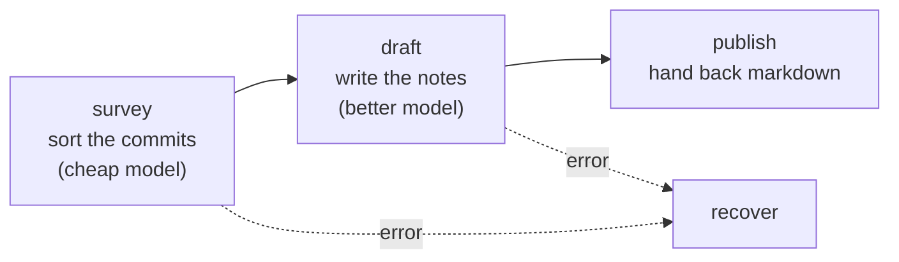

# Build your first agent

[Getting Started](/docs/getting-started) had you run somebody else's agent. This page has you write
one, a stage at a time, and explains each piece as you add it. At the end you will have an agent
that turns your project's recent commits into release notes a user can read.

It is a good first agent because the work genuinely has phases. Deciding which commits matter is
cheap sorting. Writing the notes is the part worth a better model. Handing back a clean answer is a
third job again, and none of them wants the others' tools.

You need what Getting Started set up: `lev` installed and one provider configured. Run this in a
git repository with some history, because the agent reads your commit log.



## Step 1: scaffold

```bash
lev create release-notes
cd release-notes
```

That writes a directory with an `agent.leviath` file in it, plus a `.gitignore` and a
`.env.example`. The blueprint it generates is a working one-stage agent. You are going to replace
it, so open it and delete everything. (There is also a graph editor for this in the
[dashboard](/docs/dashboard#agent-editor): `lev dash`, then `a`, then `n`. This page writes the file
by hand so every key is explained.)

Every agent needs a name and an entry stage. Start there:

```toml
[agent]
name = "release-notes"
version = "0.1.0"
description = "Turns the commits since your last release into notes a user can read"
entry_stage = "survey"
```

`entry_stage` names the stage a run begins in. Without it, a run starts at whichever stage you
declared first, which is fine until you reorder the file.

## Step 2: give it something to read

An agent's memory is divided into named **regions**, each with its own budget and its own rule for
what to drop first. That is [structured context](/docs/context), and it is the reason a large file
read cannot push your task description out of the window.

Four regions is enough here:

```toml
[context.regions]
task    = { kind = "pinned", budget = "3%", seed = "task_input", volatility = "stable" }
commits = { kind = "pinned", budget = "25%", seed = { command = "git log --oneline -50" }, volatility = "stable" }
notes   = { kind = "pinned", budget = "20%", volatility = "grows" }
conversation = { kind = "sliding_window", budget = "25%", max_items = 20 }
```

Four things are happening.

**`pinned` means never dropped.** The task and the commit list are the whole point of the run, so
nothing may evict them to make room. `conversation` is a `sliding_window` instead, because the
back-and-forth is worth keeping recent and not worth keeping forever.

**Budgets are percentages of whatever model the stage runs on**, so this layout works the same on a
1M-token model and a 200K one. They are ceilings rather than allocations, which is why they may sum
past 100%: regions rarely all fill at once.

**`seed` fills a region before the first inference.** `task_input` is whatever you pass to
`--task`. The `command` form runs a shell command and keeps its output, so the agent starts already
holding your commit log instead of spending a turn fetching it.

**`volatility` says how much a region moves, and it is worth real money.** Providers cache the
prompt by *prefix*: they store everything up to a marker and reuse it next turn only if every byte
in front of that marker is identical. So one region that changes invalidates the cache for every
region behind it, and the order the prompt is assembled in decides the bill.

Here `task` and `commits` are seeded once and never written again, so they are `stable` and go
first, forming the prefix everything else caches behind. `notes` is written to as the run goes, so
it is `grows`: it sits after the stable content and is split so its settled part still caches while
only the newest note is re-sent.

The value cannot be guessed from `kind`. All three of these are `pinned`, which sounds immutable
and says nothing about whether the agent writes to them - only you know that `notes` is the one it
adds to. Leaving it out is safe: an undeclared region is assumed to change, which is the pessimistic
placement, so declaring can only improve things. On a twenty-turn run of this shape, declaring took
the cache hit rate from 0% to 84% and the cost per turn down by roughly two thirds.

> [!NOTE]
> A seed command runs at spawn, before any approval prompt, so it only runs if it is already
> trusted. `git log` is on Leviath's built-in safe list, which is why this one needs no
> configuration from you. A seed running something less ordinary needs a
> [`[safe_commands]`](/docs/interaction#what-runs-without-asking) entry, and `lev validate` prints
> every seed a blueprint will run.

## Step 3: the first stage

A **stage** is one phase of the work, with its own prompt, model, and tools:

```toml
[stages.survey]
mode = "autonomous"
description = "Sort the commits into what a user would notice and what they would not"
model = { models = ["claude-sonnet-5", "gpt-5.4-mini"] }
available_tools = ["context_write"]
max_iterations = 10
system_prompt = """
The `commits` region holds this project's recent commits, newest first.

Sort them into changes a user of this project would notice, and changes they
would not: refactors, test-only work, dependency bumps, CI.

Write the user-visible ones into the `notes` region with context_write, one per
line, each keeping its short commit hash. Then say you are done.
"""
```

`models` is an ordered fallback list, not a choice. The first entry whose provider you have
configured wins, so this stage runs on Anthropic if you have a key for it and OpenAI if you do not.
Adding your own provider to the front is how you take an agent somewhere else.

`available_tools` is the entire set this stage may call. Sorting text needs no file access and no
shell, so it gets neither. A tool left out here is not sent to the model at all: it never sees the
name or the schema, so it cannot be tempted by one. If it guesses a name anyway, the call is
refused before anything runs, and the refusal goes back as that call's result so the model can
correct itself. Both halves matter, and together they keep a stage's blast radius equal to its
list.

`max_iterations` bounds the loop. A stage that never decides it is finished stops here rather than
spending your budget.

## Step 4: a second stage, and the edge between them

Stages are joined by **transitions**, which form a [graph](/docs/stages):

```toml
[stages.survey.transitions.draft]
hint = "The commits are sorted and the user-visible ones are in the notes region"
```

The table name is the destination stage. `hint` is what the model reads when it decides whether to
take this edge, so write it as the condition it describes rather than as an instruction.

Now the stage it points at:

```toml
[stages.draft]
mode = "autonomous"
description = "Turn the sorted changes into release notes"
model = { models = ["claude-opus-5", "gpt-5.5"] }
available_tools = ["bash", "read_file"]
max_iterations = 15
system_prompt = """
Write release notes from the `notes` region, grouped under Added, Changed, and
Fixed. Drop any group with nothing in it.

Write for someone who uses this project and has not read its commit log. If a
commit message is too terse to explain, run `git show --stat <hash>` to see what
it touched before you describe it.

Then hand the notes to the publish stage.
"""
```

This is the payoff of splitting the work. `draft` runs on a stronger model than `survey`, because
prose about your project is worth more than sorting a list. It also gets tools `survey` had no use
for, so it can look at a commit whose message says `fix edge case` and find out which one.

Both facts are per stage. Neither could be expressed if this were one agent with one prompt.

## Step 5: hand back a real answer

A run's result should be something a script can use, not a transcript to read. That is what a
[final output](/docs/outputs) is:

```toml
[stages.publish]
mode = "output"
description = "Hand back the finished notes"
max_iterations = 3
model = { models = ["claude-sonnet-5", "gpt-5.4-mini"] }

[stages.publish.output]
format = "markdown"
instructions = "The release notes only. Start at the first heading, with no preamble."
```

`mode = "output"` does three things: it grants the `submit_output` tool, it requires the stage to
call it, and it takes away everything else. The stage has one job and one way to finish it.

`format` is a label carried to the model and recorded beside the answer. It is not an enum, so a
shape Leviath has never heard of works the same way; `instructions` is where you explain one.

Point `draft` at it:

```toml
[stages.draft.transitions.publish]
hint = "The notes are written"
```

## Step 6: somewhere to land when something breaks

Every edge so far is a happy path. Give both working stages somewhere to go when they fail:

```toml
[stages.survey.transitions.recover]
condition = "error"

[stages.draft.transitions.recover]
condition = "error"

[stages.recover]
mode = "autonomous"
description = "Say what went wrong when a stage fails"
model = { models = ["claude-sonnet-5", "gpt-5.4-mini"] }
available_tools = []
max_iterations = 3
system_prompt = """
A stage failed. Say briefly what was being attempted and what the error was, so
the person running this can decide what to do.
"""
```

`condition = "error"` fires on a failure rather than on the model's judgement, so it needs no
`hint`. Without an error edge a failed stage ends the run with whatever the runtime knows, which is
usually less than the agent knows. See [transitions](/docs/stages) for the other conditions,
including `stuck` and `max_iterations`.

## Step 7: check it before you run it

```bash
lev validate .
```

`lev validate` reads the blueprint the way the runtime will, then says what it found:

```console
✓ Blueprint 'release-notes' is valid.
  4 stages, version 0.1.0
  Graph mode: entry stage 'survey'
  - survey → draft, recover
  - draft → recover, publish
  - publish (linear)
  - recover (linear)
  NOTE 1 region(s) run a shell command at spawn, before the first inference and
       before any tool-approval prompt: commits: git log --oneline -50 (pre-approved)
```

The graph it prints is the one to read carefully, because a stage with no way out and a stage
nothing reaches both look fine in a text editor. The note about the seed is the check from step 2
confirming itself: `(pre-approved)` means `git log` needed no permission from you.

Warnings are worth fixing even though they do not stop a run. A stage with no `max_iterations` and
a model this build has never heard of both turn up here.

## Step 8: run it

```bash
lev run . --task "Release notes for the changes since the last tag"
```

`lev run .` runs the blueprint in the current directory, which is what you want while you are still
editing it. Install it as a named agent once you are happy:

```bash
lev add .
lev run release-notes --task "..."
```

The run goes to the background, so watch it or come back later:

```bash
lev dash                    # live view
lev result <run-id>         # the notes, once it finishes
```

Expect to be asked once. `draft` may call `git show`, and the shell defaults to asking before it
runs anything, so answer in `lev dash` or with [`lev respond`](/docs/interaction). Pass `--yolo` if
you would rather it not stop.

## The whole file

```toml
[agent]
name = "release-notes"
version = "0.1.0"
description = "Turns the commits since your last release into notes a user can read"
entry_stage = "survey"

[tool_permissions]
read_file = "allow"
bash = "ask"

[context.regions]
task    = { kind = "pinned", budget = "3%", seed = "task_input", volatility = "stable" }
commits = { kind = "pinned", budget = "25%", seed = { command = "git log --oneline -50" }, volatility = "stable" }
notes   = { kind = "pinned", budget = "20%", volatility = "grows" }
conversation = { kind = "sliding_window", budget = "25%", max_items = 20 }

[stages.survey]
mode = "autonomous"
description = "Sort the commits into what a user would notice and what they would not"
model = { models = ["claude-sonnet-5", "gpt-5.4-mini"] }
available_tools = ["context_write"]
max_iterations = 10
system_prompt = """
The `commits` region holds this project's recent commits, newest first.

Sort them into changes a user of this project would notice, and changes they
would not: refactors, test-only work, dependency bumps, CI.

Write the user-visible ones into the `notes` region with context_write, one per
line, each keeping its short commit hash. Then say you are done.
"""

[stages.survey.transitions.draft]
hint = "The commits are sorted and the user-visible ones are in the notes region"

[stages.survey.transitions.recover]
condition = "error"

[stages.draft]
mode = "autonomous"
description = "Turn the sorted changes into release notes"
model = { models = ["claude-opus-5", "gpt-5.5"] }
available_tools = ["bash", "read_file"]
max_iterations = 15
system_prompt = """
Write release notes from the `notes` region, grouped under Added, Changed, and
Fixed. Drop any group with nothing in it.

Write for someone who uses this project and has not read its commit log. If a
commit message is too terse to explain, run `git show --stat <hash>` to see what
it touched before you describe it.

Then hand the notes to the publish stage.
"""

[stages.draft.transitions.publish]
hint = "The notes are written"

[stages.draft.transitions.recover]
condition = "error"

[stages.publish]
mode = "output"
description = "Hand back the finished notes"
max_iterations = 3
model = { models = ["claude-sonnet-5", "gpt-5.4-mini"] }

[stages.publish.output]
format = "markdown"
instructions = "The release notes only. Start at the first heading, with no preamble."

[stages.recover]
mode = "autonomous"
description = "Say what went wrong when a stage fails"
model = { models = ["claude-sonnet-5", "gpt-5.4-mini"] }
available_tools = []
max_iterations = 3
system_prompt = """
A stage failed. Say briefly what was being attempted and what the error was, so
the person running this can decide what to do.
"""
```

## Make it yours

Small changes worth trying, each of which reaches for one more idea:

- **Point it at a range.** Change the seed to `git log --oneline $(git describe --tags --abbrev=0)..HEAD` so it reads only what is genuinely unreleased.
- **Make the shape strict.** Add a `schema` to `[stages.publish.output]` and the answer is validated against it before the run is allowed to finish. See [final outputs](/docs/outputs).
- **Ask before publishing.** Set `mode = "interactive_points"` on `draft` and declare an [interaction point](/docs/interaction), so you approve the notes before they are finalized.
- **Split the reading.** If your project is large, give `draft` a [fan-out](/docs/sub-agents) stage that reads several commits at once instead of one at a time.

## Where to go next

- [Agent blueprints](/docs/agents) is the field-by-field reference for everything used here.
- [Multi-stage workflows](/docs/stages) covers the rest of the graph: conditions, gates, revisit
  limits, and what happens at a dead end.
- [Structured context](/docs/context) covers the other region kinds, including one that compacts
  instead of dropping and one that tracks a checklist.
- [The agent catalog](/docs/agent-catalog) has eight shipped blueprints, each with its graph drawn,
  which are worth reading now that the syntax means something.
