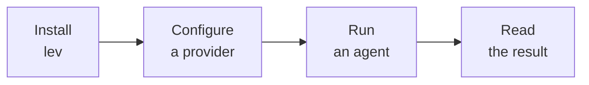

# Getting Started

Leviath runs LLM agents. What it adds over asking a model directly is **structure**. That means
context that stays coherent across hundreds of tool calls, a different model for each phase of a
task, and thousands of agents running at once in one process.

You'll go from nothing to a running agent in four steps:



## Install

One command, any platform. It installs a prebuilt binary, so no Rust toolchain is needed.

**macOS and Linux**

```bash
curl -fsSL https://leviath.dev/install.sh | sh
```

**Windows**, in PowerShell (Windows Terminal opens one):

```powershell
irm https://leviath.dev/install.ps1 | iex
```

No administrator is needed: it unpacks into `%LOCALAPPDATA%\Leviath\bin` and adds that folder to
your own PATH.

Paste it into PowerShell rather than Command Prompt. The old form that spawned PowerShell from
cmd (`powershell -ExecutionPolicy Bypass -c "..."`) is the launch pattern endpoint protection
refuses on managed machines - it answered "Access is denied." before anything ran.

If Windows Defender or another antivirus quarantines `lev.exe`, that is a false positive on a new,
unsigned binary, not something it found. You can check the file is exactly what this repo's CI
built with `gh attestation verify "$env:LOCALAPPDATA\Leviath\bin\lev.exe" --repo GEMISIS/leviath`,
then restore it from quarantine or add the folder to the exclusions; reporting it as a false
positive to your vendor helps every later install.

Check it worked:

```bash
lev --version
```

That is the whole install. The options below are here when you want them, not because you need
them.

<details>
<summary>Prefer Homebrew or Scoop</summary>

The one-liners above already use Homebrew on macOS when you have it. To manage the tap yourself:

```bash
brew tap gemisis/leviath https://github.com/GEMISIS/leviath-dist.git
brew trust gemisis/leviath # Homebrew 6 requires trusting third-party taps
brew install leviath
```

On Windows, Scoop works the same way:

```powershell
scoop bucket add leviath https://github.com/GEMISIS/leviath-dist.git
scoop install leviath
```

</details>

<details>
<summary>Switch to the beta or alpha channel</summary>

`stable` is the default and is what you want unless you have a reason to be ahead of it. To ride a
faster channel, pass it to the installer:

```bash
curl -fsSL https://leviath.dev/install.sh | sh -s -- --channel beta
```

The installer prints which channel it is about to install, so you can see you got the one you
asked for.

Homebrew and Scoop name the channels as separate packages instead: install `leviath-beta` or
`leviath-alpha` in place of `leviath`. See [Releases and channels](/docs/releases) for what each
channel means and how often it moves.

</details>

<details>
<summary>Build with Cargo, or embed the runtime</summary>

With [Rust](https://rustup.rs/) installed:

```bash
cargo install leviath-cli                # released version from crates.io
cargo install --git https://github.com/GEMISIS/leviath.git --bin lev   # latest development build
```

To embed the runtime in your own application instead of running the CLI, add the
[`leviath`](https://crates.io/crates/leviath) crate as a dependency.

</details>

## Configure a provider

One provider is all you need: an API key from Anthropic, OpenAI, Google AI, or OpenRouter; a
ChatGPT subscription you sign in to (OpenAI Codex, no key); or a local [Ollama](https://ollama.com)
with no key at all.

```bash
lev setup
```

The wizard detects keys already in your environment, sets a default model, and installs the
pre-built agents.

> [!TIP]
> No API key handy? Two paths need none: sign in to a ChatGPT or Claude subscription, or point
> Leviath at a local [Ollama](https://ollama.com) install and run entirely offline. `lev setup`
> sets up either. See [Providers](/docs/providers) for the full list.

<details>
<summary>Script the setup instead</summary>

For CI, containers, or any headless machine:

```bash
lev setup --non-interactive --anthropic-key "$ANTHROPIC_API_KEY" --install-agents
```

Two flags matter more than they look:

- `--install-agents` installs the pre-built agents. Without it, non-interactive setup configures
  the provider and installs nothing.
- `--default-model <provider>/<model>` sets the model every stage falls back to. Without a default
  model, a blueprint's own list decides, which may not pick your provider.

The other credential flags are `--openai-key`, `--google-key`, `--openrouter-key`, and
`--ollama-url`. See [`lev setup`](/docs/cli#lev-setup) for the full set.

</details>

## Run an agent

First `cd` into the directory you want the agent working in. That directory becomes the run's
**workdir**: its file tools are confined to it, and its output lands there.

Then pick one of the eight [pre-built agents](/docs/agent-catalog) and give it a task:

```bash
lev run coder --task "Build a CLI that converts CSV to JSON"
lev run deep-researcher --task "Survey the state of solid-state batteries"
```

A run spends real API tokens on your configured provider. For a free first try, point
`lev setup` at a local Ollama instead.

Leave `--task` off and your editor opens on a template, which is easier than
fighting shell quoting for anything longer than a sentence. It also takes a
file: `lev run coder --task ./brief.md`.

`lev run` returns as soon as the work is accepted, not when it is done. The agent runs in the
background and keeps going after you close the terminal, so the next section is how you check on
it. Real tasks take minutes.

## Read the result

Watch it live, or come back later. Either way:

```bash
lev dash                  # live view of every run
lev ps                    # one-shot list: what is running, what finished
lev result <run-id>       # the answer, once a run is complete
```

Files the agent created are in the workdir you ran it from. See [Outputs](/docs/outputs) for
structured answers.

Expect to be asked things along the way. The agent **stops and waits** before it writes a file or
runs a shell command. Answer in `lev dash` (select the run, `Enter`, then `i`) or with
[`lev respond`](/docs/interaction), or pass `--yolo` to pre-approve everything for an unattended
run.

> [!TIP]
> Prefer a visual UI? Serve the daemon over HTTP and open
> [The Lair](https://leviath.dev/lair), the browser console:
>
> ```bash
> lev serve --token <your-secret> --cors https://leviath.dev
> ```
>
> It shows the same runs, context, logs, and interactions, from any browser.

On Windows the agent's shell is `cmd.exe`, not a POSIX shell, and Leviath tells the model so. See
[which shell you get](/docs/tools#which-shell-you-get), and
[Troubleshooting](/docs/troubleshooting#windows-quoting-and-environment-variables) for PowerShell
quoting and environment-variable syntax.

## Create your own

```bash
lev create my-agent        # scaffolds an agent directory
cd my-agent
lev run . --task "Your task here"
```

This writes an `agent.leviath` file you can customize: the stages, the model for each phase, and
the context regions. [Build your first agent](/docs/first-agent) walks through writing one from
scratch, a stage at a time, and is the natural next thing to read.

## Where to go next

- The [Agent catalog](/docs/agent-catalog) tours the eight pre-built agents and what each is for.
- [Build your first agent](/docs/first-agent) writes one from an empty directory, explaining each
  piece as it goes.
- [Overview](/docs/overview) explains what Leviath is doing underneath: stages, context regions,
  and the shared world your agents run in.
- [Agent blueprints](/docs/agents) covers what goes in an `agent.leviath` file, for building your
  own.
- [Troubleshooting](/docs/troubleshooting) has the common snags, and `lev doctor` diagnoses most of
  them for you.
- [Glossary](/docs/glossary) defines every term these docs use in a particular way. Worth a skim if
  a page starts using a word you have not met.
- [Where Leviath sits](/docs/comparison) is for deciding whether you want Leviath at all, and what
  to run alongside it.
- [How Leviath integrates](/docs/integrations) covers driving Leviath from a tool you already use,
  like an orchestrator or a CI job.
