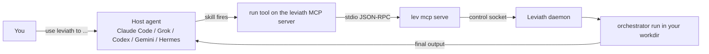

# Claude Code, Grok and other agents

A coding agent you already use never picks Leviath on its own. Its model sees the tools in its
schema, and `lev` is a binary on your disk, not a tool. So "use leviath to fix the flaky test" ends
with the host spawning its own subagent and doing the work itself. `lev mcp serve` puts Leviath
into that schema as an MCP server, and `lev integrate <host>` registers it plus a skill that tells
the model when to reach for it.

```bash
lev integrate claude-code    # or grok | codex | gemini | hermes | all
```

Restart the host, then say "use leviath to write the migration and verify it". The host calls the
`run` tool, Leviath runs the `orchestrator` agent in your project, and the host reports the result.



## What `lev integrate` writes

Every host gets the same three things: a server entry that launches `lev mcp serve`, a
`SKILL.md`, and the bundled blueprints the default agent needs (skip those with `--no-agents`).
The command merges into an existing file with a real parser, so keys it did not touch survive.
Running it twice changes nothing.

| Host | Server entry | Skill |
|---|---|---|
| `claude-code` | `claude mcp add-json --scope user`, else `~/.claude.json` | `~/.claude/skills/leviath/SKILL.md` |
| `claude-code --project` | `./.mcp.json` | `./.claude/skills/leviath/SKILL.md` |
| `grok` | `~/.grok/config.toml` (`--project`: `./.grok/config.toml`) | `~/.grok/skills/leviath/SKILL.md` |
| `codex` | `~/.codex/config.toml` | `~/.codex/skills/leviath/SKILL.md` |
| `gemini` | `~/.gemini/settings.json` | `~/.gemini/skills/leviath/SKILL.md` |
| `hermes` | Printed snippet for `~/.hermes/config.yaml` | `~/.hermes/skills/autonomous-ai-agents/leviath/SKILL.md` |
| `all` | Every host whose dot-directory exists under your home | Same, per host |

Claude Code honours `CLAUDE_CONFIG_DIR`: with it set, the config is `$CLAUDE_CONFIG_DIR/.claude.json`
and the skill goes under `$CLAUDE_CONFIG_DIR/skills`. The Grok and Codex entries set
`startup_timeout_sec = 30` and `tool_timeout_sec = 86400`; Gemini gets `timeout: 86400000` (it counts
milliseconds). Grok also imports `~/.claude.json`, so `grok mcp list` may show `leviath` twice after
`lev integrate all`; `config.toml` wins by name.

Hermes is the one host the command cannot finish for you. There is no YAML dependency in Leviath, so
it prints the `mcp_servers:` block to paste into `~/.hermes/config.yaml`, then you run `/reload-mcp`
in chat. `lev integrate all` says so in its next steps.

`--print` shows every file and command without writing or running anything. `--no-skill` registers
the server only. The JSON files come back with their keys sorted, because the merge goes through
`serde_json`; the hosts read them by key, so nothing breaks.

The command ends with next steps. If no provider is configured it tells you to run `lev setup`. If
`[limits]` has no write ceiling it prints the two lines to add, because an unattended run has no
other byte limit:

```toml
[limits]
max_tool_call_write_bytes = 2147483648   # 2 GiB; delete the line for no limit
max_run_write_bytes       = 10737418240  # 10 GiB; delete the line for no limit
```

## What the skill does

Hosts hide MCP tool descriptions behind a search step, so a tool description alone never triggers
anything. A skill's description is always in the model's context. The Leviath skill's description
begins with the word "Leviath", names the trigger phrases (`leviath`, `levaith`, `lev run`, "use
leviath to ..."), and says to use it instead of spawning a subagent.

The body is the procedure: pick an agent (`orchestrator` by default, `coder` for one code change,
the researchers for questions, `reviewer` when there is a diff), call `run` with a self-contained
`task`, an absolute `workdir` and `wait: true`, handle a background move or a `waiting_input`
result, then report the final output. It ends with the rule for the self-improvement loop below and
the strict conditions for installing a tool. Each copy spells the tools the way its host does:
`mcp__leviath__run` in Claude Code, `leviath__run` in Grok, `mcp_leviath_run` in Gemini and Hermes,
and "the `run` tool on the `leviath` MCP server" in Codex.

## The tools

The server key is `leviath`, so the host prefixes every name below with its own scheme.

| Tool | Arguments | Does |
|---|---|---|
| `run` | `task`, `agent`, `workdir`, `wait`, `timeout_secs`, `yolo`, `model`, `allow`, `regions`, output options | Starts a run; with `wait: true` returns its final output. An agent that takes named inputs (`reviewer` takes `diff`) gets them as `regions` and no `task` |
| `wait` | `run_id`, `timeout_secs` | Waits for an existing run |
| `status` | `run_id` | Status, stage, iteration and tokens, from disk first |
| `result` | `run_id`, `offset`, `max_bytes` | Pages the final output without the daemon |
| `cancel` | `run_id` | Cancels the run. The only tool that does |
| `message` | `run_id`, `content`, `target_region` | Sends a message into a running agent |
| `respond` | `request_id`, `value`, `choice_index`, `approved`, `scope`, `feedback` | Answers a pending prompt; without `request_id`, lists them |
| `list_runs` | `limit`, `include_finished_on_disk` | Newest first, with whether the daemon was reachable |
| `list_agents` | none | Installed blueprints, plus bundled ones `run` installs on demand |
| `install_tool` | `name`, `source`, `overwrite` | Compiles and installs a Rhai tool into `~/.leviath/tools` |
| `list_tools` | none | The global Rhai inventory, with each file's provenance line |

`run` installs a bundled blueprint it needs (`orchestrator`, and `coder` as its worker) when the
name is not yet under `~/.leviath/agents`, so a server registered by hand works too. Text results
are cut at 48 KiB for the host; the full text is in `result` and on disk under the run directory.

Runs the host starts are unattended by default (`yolo`), since nobody is at a terminal to approve
a shell command. `lev mcp serve --attended` flips that default, and `--allow <TOOL>` pre-approves one
tool for every run. See [Security](/docs/security#when-there-is-nobody-to-ask) for what an
unattended run may do.

## Prompts and `respond`

An agent can stop to ask a question, and under `yolo` most of those prompts are answered
automatically. Under `--attended`, or for a prompt `yolo` does not cover, `run` and `wait` return a
`waiting_input` result carrying a `request_id`. The host answers with `respond` and then calls
`wait` again. The skill tells the model exactly that, so you usually see the question relayed to
you and the answer relayed back.

## Long runs and host timeouts

A multi-stage run takes minutes to hours, and every host has an opinion about a tool call that long.

| Host | Behaviour with `lev integrate` | Behaviour without it |
|---|---|---|
| Claude Code | Moves a call over 2 minutes to a background task; idle timeout 30 minutes | Same |
| Codex | `tool_timeout_sec = 86400` | 60 seconds |
| Gemini | `timeout: 86400000` | 10 minutes |
| Grok | `tool_timeout_sec = 86400` | Its default |
| Hermes | `timeout: 86400` in the pasted snippet | Its default |

When a host gives up on a call, the server stops waiting and nothing else. The run continues, and
the skill says to find it with `list_runs` and pick it up with `wait` or `status`. `cancel` is the
only tool that ends a run. Claude Code's idle timeout is kept alive by progress notifications while
a run is in flight, so a two-hour run reaches you as a background task result. On a host with a
short default timeout the skill calls `run` with `wait: false` and then `wait`.

## The workdir guard

`run` needs an absolute `workdir`. A relative one is a protocol error the host sees at once. A
workdir that is your home directory or a filesystem root is refused with a message asking for a
project path, unless it is listed under
[`[security] allowed_workdirs`](/docs/configuration#security). A host launched from your home
directory (Claude Desktop, a gateway agent) would otherwise run an unattended agent there.

## The self-improvement loop

A host model rediscovers the same mechanical steps in every session. Leviath gives it somewhere to
put them. `install_tool` compiles a Rhai script and writes it to `~/.leviath/tools/<name>.rhai`
with a provenance comment naming who installed it and when. Any stage that sets
`available_global_tools = true` sees every tool in that directory on its next run; the bundled
`orchestrator` and `coder` do. `lev tools` lists the inventory and prints each file's provenance
line under its tool, or `no provenance line (hand-written, or written outside install_tool)` for a
file `install_tool` did not write; deleting the file removes the tool.

The skill is deliberately strict about when to install: the step ran at least twice, it is not a
single command the model already has through its shell, the script encodes an invariant (fixed
arguments, parsed output, loud failure) rather than wrapping an arbitrary command, and the model
checked `list_tools` first. The one-line rule it carries: invariants and moving bytes live in Rhai,
judgement lives in the model. See
[Installing a tool from a run](/docs/rhai-tools#installing-a-tool-from-a-run) for what the
install refuses and how to audit the directory.

## Optional: a hard gate in Claude Code

The skill is advice. If you want Claude Code to refuse its own subagent tool whenever Leviath is
registered, add a `PreToolUse` hook to `~/.claude/settings.json`. `lev integrate` does not install
this; it is a choice about your host, not about Leviath.

```json
{
  "hooks": {
    "PreToolUse": [
      {
        "matcher": "Agent",
        "hooks": [
          {
            "type": "command",
            "command": "printf '{\"hookSpecificOutput\":{\"hookEventName\":\"PreToolUse\",\"permissionDecision\":\"deny\",\"permissionDecisionReason\":\"Use mcp__leviath__run instead of a subagent\"}}'"
          }
        ]
      }
    ]
  }
}
```

The same shape works in Grok's `~/.grok/hooks/leviath.json` with matcher `spawn_subagent` and a
`{"decision":"deny","reason":"..."}` output. A softer alternative in Claude Code is
`"permissions": {"deny": ["Agent"]}`.

## Troubleshooting

| Symptom | Check |
|---|---|
| The host never calls Leviath | Restart the host after `lev integrate`; confirm the skill is listed (`/context` in Claude Code, `grok inspect`) |
| `claude mcp list` shows leviath as failed | Run `lev mcp serve` by hand and type `{"jsonrpc":"2.0","id":1,"method":"ping"}`; it must answer `{}` |
| Grok cannot connect | `grok mcp doctor leviath` |
| A `run` says no model or no provider | `lev doctor`, then `lev setup` |
| A run seems lost after a host timeout | `lev ps`, then `lev result <id>`; or ask the host to call `list_runs` |
| The daemon will not start | `lev daemon status`, and the daemon section of [the CLI reference](/docs/cli#lev-daemon-action) |

Every run the host starts is an ordinary Leviath run: `lev ps`, `lev dash`, `lev stages` and
`lev timeline` all see it.
