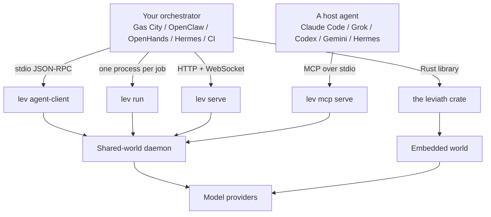

# Running Leviath under another tool

If you already use an orchestrator, you have something deciding *which* work happens: which issue
gets picked up, which repo it runs in, who reviews the result. What you plug into it decides *how*
one piece of that work actually gets done.

Orchestrators come in two shapes here. [Gas City](/docs/gas-city) and
[OpenHands](https://docs.all-hands.dev/) coordinate coding workflows across repos and issues.
[OpenClaw](/docs/openclaw) and [Hermes Agent](https://hermes-agent.nousresearch.com/docs/) are
always-on gateway agents that reach for a coding harness when a task needs one. Both shapes want
the same thing from Leviath.

That second job is what Leviath is. Your orchestrator keeps doing the coordinating. Leviath takes
one task and runs it as a multi-stage agent with structured context, its own tools, and whichever
models you configured.

## Which way in

| You want | Use | Covered in |
|---|---|---|
| A host that already speaks the Agent Client Protocol | `lev agent-client` | [Agent Client Protocol](/docs/agent-client-protocol), [Gas City](/docs/gas-city), [OpenClaw](/docs/openclaw) |
| One run per job, usually in a container | `lev run` | [CLI reference](/docs/cli) |
| A long-lived service that several jobs share | `lev serve` | [HTTP API](/docs/api) |
| Leviath inside your own Rust program | the `leviath` crate | [Embedding](/docs/embedding) |
| A host agent that speaks MCP (Claude Code, Grok, Codex, Gemini, Hermes) | `lev mcp serve` | [Claude Code, Grok and other agents](/docs/host-agents) |

Most orchestrators land on one of the first two. If yours can launch a subprocess and speak
JSON-RPC over its stdin and stdout, use `lev agent-client`, because you get streaming output and
in-turn tool approvals for free. If it thinks in terms of "run this command in this container until
it exits", use `lev run`.

The fifth row is for a different kind of host: an agent that already has a tool schema, such as
Claude Code or Grok on your own machine. It never picks a shell binary it has not been told about,
so `lev integrate <host>` registers `lev mcp serve` as an MCP server and installs a skill, and from
then on "use leviath to fix the flaky test" becomes a tool call that waits for Leviath's answer.

Not every host can speak it. Hermes Agent implements the
[Agent Client Protocol as a server](https://hermes-agent.nousresearch.com/docs/user-guide/features/acp)
rather than a client, so it reaches Leviath the second way, through its terminal tool running
`lev run`.

## Three things worth knowing up front

**Approvals need somewhere to go.** By default Leviath asks before a tool call that changes
something. Under an orchestrator there is usually nobody there to answer, so a run would stop and
wait indefinitely. Either run with `--yolo`, or list the specific tools you trust with `--allow`.
The [Gas City](/docs/gas-city) and [OpenClaw](/docs/openclaw) pages cover both cases, the host that
cannot answer and the host that answers with a default you may not want.

**The daemon outlives your command.** `lev run` hands the agent to a background
[daemon](/docs/daemon) and returns. In a container that exits as soon as the command finishes, that
is the wrong shape, and [Containers and CI](/docs/containers) covers how to handle it.

**Polling needs the right field.** If your side tracks slots and needs to know whether a run is
still going, read [External work queues](/docs/work-queues) first. Two of the obvious fields to poll
do not mean what they look like.

## When Leviath is not the right choice

Three cases where plugging Leviath in does not pay off:

- **For a single quick edit**, a coding agent CLI you already have is less setup and does the job.
  Leviath is worth the wiring on work with several distinct phases, or on many agents at once.
- **If your orchestration already lives in Python** and you want the workflow expressed in code
  rather than TOML, a framework you can import is a better fit than a separate runtime.
- **If you need an OS boundary around every tool an agent has**, note that Leviath's opt-in
  [sandbox](/docs/security) covers shell execution today, and its file tools are path-confined
  rather than containerized. Widening it is
  [in progress](https://github.com/GEMISIS/leviath/issues/326). Meanwhile, running the whole daemon
  in a container gives you the blanket boundary, and a container-per-job orchestrator gives you one
  per unit of work.

[Where Leviath sits](/docs/comparison) goes into this properly.
