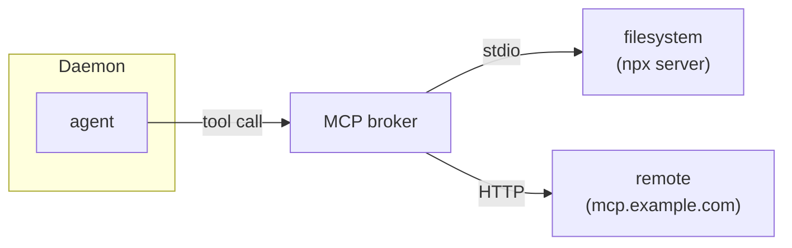
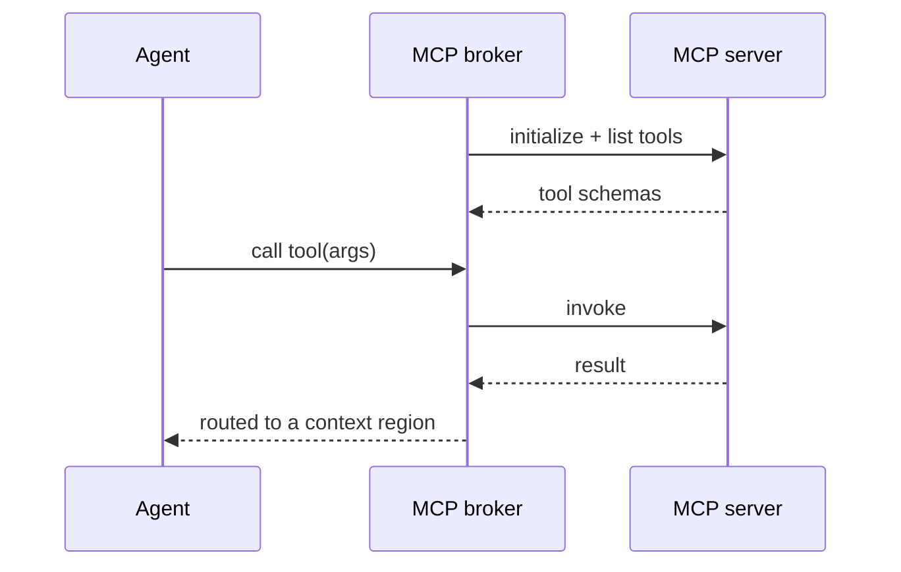

# MCP tool servers

Leviath connects to [Model Context Protocol](https://modelcontextprotocol.io) servers over stdio or
HTTP (streamable, with a legacy HTTP+SSE fallback), giving agents extra tools beyond the built-ins.



## Managing servers

```bash
lev mcp add filesystem --command npx \
  --arg -y --arg @modelcontextprotocol/server-filesystem --arg /path
lev mcp add remote --url https://mcp.example.com --header "Authorization=Bearer $TOK"
lev mcp list
lev mcp login <name>        # OAuth servers: opens your browser
lev mcp logout <name>       # drop the stored OAuth tokens
lev mcp test <name>
lev mcp remove <name>
```

`lev mcp add <name>` takes `--command` + repeatable `--arg` for a stdio server, or `--url`
(with optional `--header`/`--env`) for an HTTP one; `--no-login` skips the OAuth handshake.

`--header` and `--env` both want `KEY=VALUE`, split on the first `=`. Note that this is not the
`Name: value` form an HTTP header is usually written in, so `Authorization: Bearer ...` is rejected
with `--header must be KEY=VALUE`.

`--arg` passes its value through to the server's own command line. An argument of its own that
starts with `-` is fine: `--arg -y` is the `-y` that `npx` wants, not a flag of ours.

There are two ways an HTTP server authenticates you, and Leviath picks between them by asking the
server rather than by guessing. If a `--header` you configured is enough, as it is for a server that
takes an API token of its own, `add` reports that no login is needed and stores nothing. If the
server answers with a `401` instead, the OAuth flow runs and the tokens land in the credential
store. `lev mcp login` on an already-satisfied server says so rather than failing.

That question is asked with the headers as they will actually be sent, `${VAR}` references
expanded, so a credential that comes from the environment is recognised as the credential it is.

> [!NOTE]
> GitHub's MCP server is a published example of one that accepts either. A personal access token
> in an `Authorization` header needs no login at all, and the same endpoint runs the browser flow
> if you configure no header.

Or configure in `~/.leviath/config.toml`:

```toml
[[mcp_servers]]
name = "filesystem"
command = "npx"
args = ["-y", "@modelcontextprotocol/server-filesystem", "/path"]

[[mcp_servers]]
name = "remote"
url = "https://mcp.example.com"
headers = { Authorization = "Bearer ${MY_TOKEN}" }   # ${VAR} is expanded
```

Either way, the next run picks it up. The daemon watches `config.toml`, so a server you add, edit
or remove takes effect without `lev daemon restart`. See
[the daemon docs](/docs/daemon#config-changes-take-effect-on-the-next-run).

## Discovery and invocation

On connect, Leviath discovers the server's tools and exposes them to any stage whose
`available_tools` includes them.

### How an MCP tool is named

Always `<server>__<tool>`: the name you gave the server, two underscores, the name the server gives
the tool. A `tracker` server offering `create_issue` is advertised as `tracker__create_issue`.

That is the whole rule. Nothing is ever added to it, so you can write the name into a blueprint
before the server has been connected once, and it will still be the name next month.

The server is always part of the name, not only when something would clash. Two servers that both
offer `search` become `tracker__search` and `wiki__search`, so a grant says which one it means and
keeps meaning that however your `config.toml` is ordered.

Calls route back to the owning server under the tool's original name, so the server never sees the
qualified form.

The separator is `__` and not a dot because the advertised name goes to the model provider, and
providers accept only letters, digits, `_` and `-`. A dot anywhere in the name makes the provider
reject the whole request, however much better it reads.

### Naming a server

The name you give a server in `[[mcp_servers]]` becomes part of every one of its tool names, so it
has to be a name a provider will accept. Leviath refuses anything else when the config loads:

```toml
[[mcp_servers]]
name = "my.tools"    # error: a provider will not accept "." in a tool name
```

Rename it to `my-tools` or `my_tools` and it loads.

Leviath will not quietly rewrite the dot for you. `my.tools` and `my_tools` would both become the
prefix `my_tools`, and then two different servers would be claiming one set of tool names. A dot
and an underscore are different characters, so the fix is yours to make rather than ours to guess.

Two servers cannot share a name either. That is refused at load for the same reason.

A tool's *own* name is different: the server chose it, not you, and MCP allows a dot there. Those
Leviath does rewrite, because it has no other option: a `tracker` server offering `find.all` is
advertised as `tracker__find_all`. If that ever lands on a name another tool already holds, the
tool is not offered and the daemon log says which two names ran into each other. Nothing is
silently renamed.

A result's text blocks reach the model as text. Its `image` and `audio` blocks, and an embedded
`resource` carrying a `blob`, are decoded and stored as typed [parts](/docs/mime) on the same
result. Each part takes its type from the server's `mimeType`, corrected by the registry when that
does not parse. Each is named after the resource URI, or after the tool for a bare block. A `resource_link` is described
in the text with its URI and type, since its bytes were never sent. A part the run cannot hold
(over `[mime] max_part_bytes`) is described in the text instead of dropped.

Tools used to be advertised bare, with the server prefixed only on a clash, so a blueprint written
against that naming grants `create_issue` where the tool is now `tracker__create_issue`. Such a grant
still resolves, **as long as exactly one server offers a tool by that name**. Two do and the name is
genuinely ambiguous: it resolves to nothing and the manifest has to say which. Worth updating the
manifest either way, since the ambiguity can arrive later when somebody adds a second server.

A built-in is never captured this way. `read_file` matches the built-in, whatever any server
calls its own tools.



## Granting a whole server

`available_tools` is an exact-match list, so granting a server tool by tool means knowing what it
advertises, and that is not yours to know. It is whatever the server ships today. GitHub's
server, to name a public one, advertises dozens of tools. A house server gains one when somebody
deploys. A tool added later is never offered, and nothing says so, so the stage quietly cannot do
a thing you believed it could.

Name the server instead:

```toml
[stages.triage]
available_tools = ["read_file", "wiki__search"]
available_connectors = ["tracker"]
```

That stage gets the built-in `read_file`, one named tool from `wiki`, and everything `tracker`
advertises. The two forms mix freely, and a tool named individually *and* covered by a connector is
granted once.

The connector is resolved at spawn against what the server actually advertises then, and merged
with `available_tools`, so the two mix freely. A tool the server gains next month is offered
without touching the manifest.

A connector that resolves to nothing grants nothing, exactly as an `available_tools` name
matching nothing does. That covers a server which is not installed, and one that did not connect
this run. Whether a server is
present is not a property of your blueprint, so `lev validate` says nothing about connector names
either, the same way it never reports an MCP tool as unknown.

Everything else is unchanged. Connector-granted tools are ordinary tools from there on: they go
through the same `tool_permissions`, the same taint gate, and the same approval prompts as a tool
you named by hand.

> [!NOTE]
> A connector grant is per server. To grant every connected server at once, put `@mcp` in
> `available_tools` instead (see [tool groups](/docs/tools#tool-groups)); `@mcp` and
> `available_connectors` compose, so `["@builtin", "@mcp"]` with no connector list is the
> "all built-ins and every MCP tool" shape in one line. `available_tools` has no pattern form such
> as `tracker__*`, because a server name may itself contain `_`: in `a__b__c` there is no way to
> tell `a`'s `b__c` from `a__b`'s `c`. `available_connectors` asks Leviath which tools a server owns
> rather than inferring it from how they are spelled.

## OAuth, safely

`lev mcp add` detects OAuth servers, binds tokens to the server origin (RFC 8414 issuer check,
HTTPS-only, capped redirects), and stores them in `~/.leviath/mcp-auth.json` (`0600`), refreshing
non-interactively.

> [!NOTE]
> Manage servers from the [dashboard](/docs/dashboard) with `m`, or over the [API](/docs/api) under
> `/api/mcp/servers` (add/remove need `--allow-admin`).

## Serving Leviath as an MCP server

This page is about Leviath as an MCP client. The other direction exists too: `lev mcp serve`
speaks MCP over stdio so a host agent such as Claude Code, Grok, Codex, Gemini, or Hermes hands a
task to Leviath with a tool call, and `lev integrate <host>` registers it in the host and installs
a skill saying when to use it. The tools it exposes and the host-by-host setup are on
[Claude Code, Grok and other agents](/docs/host-agents); the flags are under
[`lev mcp serve`](/docs/cli#lev-mcp-serve).
