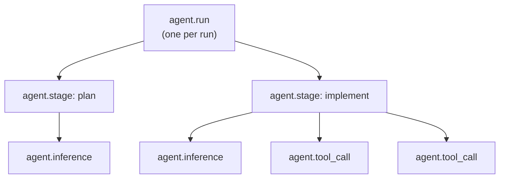

# Observability

When one run out of two hundred goes wrong, reading logs is a poor way to find it. Leviath can
export traces, metrics, and logs over OpenTelemetry, so your existing dashboards can answer "which
run is stuck" and "is anything actually moving" without you going digging.

It is off by default. Turning it on is one config block, and nothing about how a run behaves changes
either way.

## Turning it on

```toml
[observability]
enabled = true
exporter = "otlp"                     # "otlp" | "stdout" | "none"
endpoint = "http://localhost:4318"
service_name = "leviath"
```

The standard OpenTelemetry environment variables fill in anything the file leaves out.
`OTEL_EXPORTER_OTLP_ENDPOINT` and `OTEL_SERVICE_NAME` are both honoured, and an explicit config
value beats the environment.

To see what would be exported without sending it anywhere, set `exporter = "stdout"`. It narrates
the same events as readable lines on stderr.

This block reloads: the daemon re-reads it and the next run emits into whatever it now names, with
no restart. Turning export off puts the daemon's own log lines back on stderr alone. The one part
that is fixed for the process's life is the log level, which comes from `--verbose` on the daemon's
own command line rather than from here.

> [!WARNING]
> Export is OTLP over HTTP, on port **4318**. Many collector examples use 4317, which is the gRPC
> port, and Leviath does not speak it. Pointing at 4317 fails silently from the outside.

## Traces

Every run becomes one trace, shaped like the run itself:



Stage transitions, retries, and the final status all land as span attributes. That means a stuck or
looping run is visible as a *shape* on a trace view, rather than something you have to infer from
log lines.

## Metrics

Per run, labelled by agent, stage, provider, and model:

| Metric | Type | What it tells you |
|---|---|---|
| `leviath.agents.active` | gauge | How many runs are going right now |
| `leviath.tokens.total` | counter | Tokens consumed |
| `leviath.cost.total` | counter | Spend in USD, by provider and model. See below |
| `leviath.tool_calls.total` | counter | Tool calls made |
| `leviath.stage_duration` | histogram | How long stages take |
| `leviath.inference_latency` | histogram | How long model calls take |
| `leviath.runs.total` | counter | One per finished run, attributed by `leviath.status` and `leviath.empty_output` |

`leviath.cost.total` carries the same figure the run's own record does: the provider's own cost
when it reported one, and arithmetic from published rates when it did not. A call nothing can price
contributes nothing rather than a zero, so the counter is a floor when some model has no known rate.
Compare it against `unpriced_calls` on the run to know whether it is the whole story, and see
[managing your costs](/docs/costs).

Emitting it rather than leaving a dashboard to multiply tokens by rates is deliberate: rates differ
per input class and change when a vendor reprices, and a dashboard carrying its own copy of the
table is how a monitoring figure comes to disagree with the invoice.

Per daemon, sampled every 30 seconds:

| Metric | What it tells you |
|---|---|
| `leviath.tool_lane.busy` | Tool batches running |
| `leviath.tool_lane.queued` | Tool batches waiting for a slot |
| `leviath.tool_lane.parked` | Batches waiting on something with no time limit, holding no slot |
| `leviath.scheduler.dead_cycles.total` | 30-second intervals where the lane was full, work was queued, and nothing moved |
| `leviath.tool_lane.relief.total` | Times the daemon widened the lane to break a jam |
| `leviath.provider.circuit.open` | Providers Leviath has currently stopped sending work to |
| `leviath.provider.circuit.opened.total` | Times a provider was pulled, attributed by `leviath.provider` and `leviath.reason` |

`leviath.reason` is one of `credits-exhausted`, `auth-failed`, `forbidden`, or `unreachable`.

## The three worth alerting on

Most of the above is for dashboards. These three are for pages.

**`leviath.scheduler.dead_cycles.total`** separates a busy daemon from a stuck one. A dead cycle is a
full 30-second interval where a lane was at capacity, work was queued behind it, and no run moved
anywhere. A healthy daemon sits at zero. Anything sustained above zero means work is arriving that
nothing is getting to.

**`leviath.provider.circuit.open`** goes back to zero on its own once a provider recovers, so a
reading that stays non-zero means a person has to top up an account or fix a key. This is the one
that catches a drained account, which otherwise hides: the runs it kills die before producing any
per-run telemetry at all.

**The `leviath.empty_output` attribute on `leviath.runs.total`** is worth charting as a rate. A run
reaching `complete` only means it got to the end of its pipeline. It does not mean anything came of
it. Divide empty runs by total runs, and a jump usually means an agent started editing through the
shell, where Leviath cannot see the writes. Runs by agents that never had a file-writing tool are
excluded, so a fleet of routers and researchers will not drown the signal. See
[what counts as output](/docs/stages#what-counts-as-output).

## Logs

Log records carry the run's trace ID. A collector that joins all three signals can therefore jump
from a log line straight to the span that produced it.

They carry the line as it was written. Every output and runtime log line of every run is exported,
and nothing redacts a credential a tool happened to print on its way out, so point the exporter only
at a collector you would trust with the run's transcript.

## Trying it locally

Any OTLP-over-HTTP collector works. With a local Jaeger all-in-one listening on 4318, enable the
block above and run an agent. The run shows up as a trace named `agent.run` under whatever
`service_name` you set.

The daemon owns the exporter. It starts with the daemon and flushes on shutdown, so short-lived CLI
commands do not each pay the setup cost. See [the daemon](/docs/daemon) for where this sits in its
lifecycle.

## Where one run's cost went

The metrics above answer "is the fleet healthy". For "what did this one run spend, and on which
stage", read its stage ledger instead: [`lev stages <run-id>`](/docs/cli#lev-stages-run-id) at a terminal,
or [`GET /api/agents/{id}/stages`](/docs/api#where-a-runs-cost-went) over HTTP. Both carry the
per-stage token split, the cache read and write halves, what each stage spent in dollars, the split
of that by each stay in the stage, and the largest each context region reached while that stage was
active, which is the number to look at before trimming a layout.

Pricing is the daemon's job on purpose. A dashboard that multiplied the token counts by a rate card
of its own would produce a fourth answer, disagreeing with the run's figure, the stage's, and the
provider's invoice, with nothing to say which of the four was wrong. Where the daemon cannot price a
call it reports the cost as unknown rather than as zero, and says how many calls it could not price.
