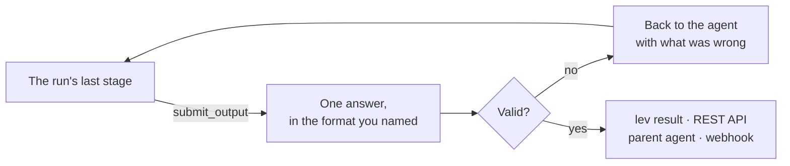
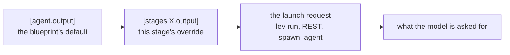
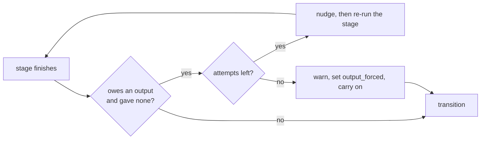
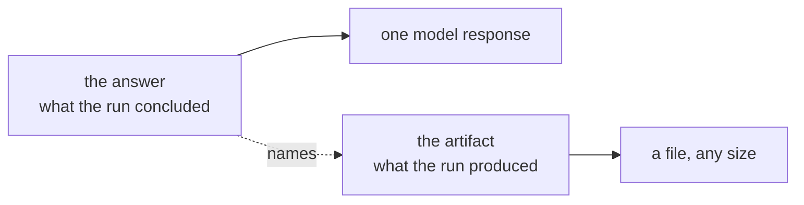

# Final outputs

An agent that finishes has usually learned something you want back. Without somewhere to put it, the
only way to say anything is to write a file and hope you look there. Its logs record what it did,
not what it concluded.

So an agent can **submit a final output**: one deliberate answer, produced by a tool call, that
every surface reports. The API returns it, `lev result` prints it, a parent agent receives it, and
the completion webhook carries it.



## The smallest version

Add a stage with `mode = "output"`:

```toml
[stages.review.transitions.summary]
hint = "The work is done"

[stages.summary]
mode = "output"
model = { models = ["claude-sonnet-5"] }
description = "Say what changed"
max_iterations = 8
system_prompt = """
Say what you changed, for whoever asked for it. List the files you touched and
what each change does. Then anything they need to know before merging.
"""

[stages.summary.transitions]
```

Then read it back:

```bash
lev result <run-id>          # the answer, with its run and stage
lev result <run-id> --raw    # the answer alone, for a pipeline
lev result <run-id> --json   # the answer plus its shape and stage
```

`mode = "output"` does three things for you. It grants the stage the `submit_output` tool, it
requires the stage to call it, and it lets the run end there.

## Any shape you like

You name a shape, and the model produces it. There is no fixed list: the label reaches the model, and
nothing converts between formats.

```toml
[stages.summary.output]
format = "a2ui"
instructions = "One card per finding, highest severity first."
example = """
{"root": {"component": "Card", "children": [{"component": "Text"}]}}
"""
```

`format` is a label. Markdown, XML, CSV, [a2ui](https://a2ui.org/), a mime type, or a format you
invent this afternoon all work the same way. The label, your instructions, and your example go
into the `submit_output` tool description, and into the stage's system prompt too when
`require_output` is set.

The label travels with the answer so a reader can act on it. [The Lair](https://leviath.dev/lair),
the browser console for Leviath, renders a2ui differently from markdown by matching on that string.

## Checking the answer

Two different questions get asked about a submission, and it is worth keeping them apart.

**Is it the format it claims to be?** Leviath checks this for free, for formats it can parse:

| Label | Checked |
|---|---|
| `json`, `xml`, `yaml` (or `yml`), `csv`, `toml` | The answer parses |
| anything else | Nothing |

That catches the failure that actually happens. The model wraps its answer in a code fence, adds a
sentence of preamble, or hands back JSON when you asked for XML. All three fail to parse, and the
agent is told so and tries again.

A label with no built-in is carried through unchecked. That is the honest outcome: `a2ui` and
`text/vnd.acme+xml` are not formats this code knows, and pretending otherwise would mean owning every
format's parser.

**Does it have the shape you wanted?** That is a schema, and only happens if you write one.

For JSON, use a JSON Schema. For anything else, ship a [Rhai validator](/docs/rhai-validators) with
your agent. A validator that cannot run rejects the submission by default, sending the script's
error back to the model as feedback; set `on_validator_error = "accept"` on the output block if you
would rather record the answer unchecked.

## Asking for a shape at launch

A blueprint declares a default. Whoever starts the run can ask for something else. Every bundled
agent ends in an output stage, so this works on all of them out of the box.

### From the command line

```bash
lev run reviewer --task "review the auth module" --diff @./change.patch \
  --output-format xml \
  --output-instructions "One <finding> element per issue, with a severity attribute."
```

`lev run` returns as soon as the run starts, printing the run id. Read the answer when it finishes:

```bash
lev run reviewer --task "..." --output-format xml --json   # prints {"run_id": "..."}
lev ps                                                     # watch it
lev result <run-id> --raw > findings.xml                   # the XML, and nothing else
```

`--raw` matters for a pipeline. The default rendering adds a heading naming the run and stage, and
`--json` wraps the answer in a record. Only `--raw` gives you the bytes the agent produced.

Nothing converts between shapes. `--output-format xml` puts the label and your instructions in front
of the model, and the model writes the XML. Ask for something the model cannot produce and you get
its best attempt, not an error.

### From the API

`POST /api/agents` takes the same three fields:

```bash
curl -X POST http://localhost:3000/api/agents \
  -H "Authorization: Bearer $TOKEN" -H "Content-Type: application/json" \
  -d '{"blueprint":"reviewer","task":"review the auth module",
       "output_format":"xml",
       "output_instructions":"One <finding> element per issue."}'
```

Then `GET /api/agents/{id}/result`, where `final_output` carries the answer and its label. The
completion webhook carries the same, so a receiver needs no second request.

### From a host over ACP

The [Agent Client Protocol](/docs/agent-client-protocol) has no field for this, so the host asks when
it starts the server:

```bash
lev agent-client --agent reviewer --output-format xml \
  --output-instructions "One <finding> element per issue."
```

The answer arrives as the turn's closing `agent_message_chunk`, set apart from the streamed output.

### From a parent agent

A parent asks a child through `spawn_agent`, using `output_format` and `output_instructions`. The
child's answer comes back from `wait_for_agent`.

Three levels combine, and the later one wins per field.



One rule breaks that pattern on purpose. If you name a `format` other than the one the blueprint
declares, any Rhai validator and any JSON schema it declared are retired together. A check written
for one shape says nothing about another. The retirement is not silent: `lev run` warns on stderr,
the REST spawn response carries a `warnings` array naming what was retired, and the daemon logs a
line for every spawn path. Re-stating the format the blueprint already declares retires nothing.
Supply your own schema alongside your format when you want the answer validated.

### It outranks the stage's prompt

A stage's `system_prompt` often has opinions about presentation of its own. The bundled
`log-analyzer` tells its summary stage to lead with the diagnosis and name the report file, which is
good default behaviour and directly at odds with `--output-instructions "reply with only the
integer"`.

Once the three levels above have combined, the winning spec is stated to the model as the one that
governs how the answer is presented. The stage prompt yields to it wherever the two disagree. So a
caller who passes `--output-format` or `--output-instructions` does not have to know what the
blueprint's prompt says. A blueprint author, in turn, does not have to strip presentation guidance
out of a prompt to leave room for callers who may never pass anything.

The claim is scoped to presentation: length, structure, what to lead with. It does not tell the
model to disregard what the stage prompt asked it to *do*.

## Checking the shape, with a JSON Schema

```toml
[stages.summary.output]
format = "json"

[stages.summary.output.schema]
type = "object"
required = ["summary", "files_changed"]

[stages.summary.output.schema.properties]
summary = { type = "string" }
files_changed = { type = "array", items = { type = "string" } }
```

A submission that fails goes back to the agent as an error, and it tries again. Nothing is recorded
until one passes, so a bad correction never replaces a good answer.

A submission is checked for well-formedness first, so "this is not even JSON" comes back before a
list of missing properties. That is the more useful thing to hear.

One asymmetry to know about: a schema that itself will not compile skips the check and records the
submission unchecked, where a [Rhai validator](/docs/rhai-validators) that cannot run rejects by
default. A bad schema refusing every submission would leave the run unable to finish, so it fails
open, deliberately.

## Requiring one

`require_output` makes a stage produce an answer before it moves on. `mode = "output"` sets it for
you. Set it by hand on any other stage that owes a deliverable.



A missing output never strands a run. The stage is nudged and re-run a few times, bounded by its
`max_revisits`. After that the run finishes anyway and records `output_forced` in its flags, so you
can tell a missing answer from an answer nobody asked for.

Give the stage enough `max_iterations` to spend that budget. Each nudge costs one iteration, so a
stage that runs out of iterations first ends on its `max_iterations` path instead. That path takes
precedence over the nudge, and the run records both flags, `max_iterations_hit` and
`output_forced`, so the outcome stays honest about what was required.

## What each surface returns

| Surface | Where the answer appears |
|---|---|
| `lev result <run-id>` | The whole answer, and the files it named, each with its type, size and hash. `--raw` for pipelines |
| `lev ps --json` | `has_final_output` only. Fetch the answer itself with `lev result` |
| `GET /api/agents/{id}/result` | `final_output`, beside the existing `output` log tail |
| Completion webhook | `final_output`. The `result` field is the run's error, as it always was |
| `wait_for_agent`, `check_agent` | The child's answer, with its status |
| Fan-out merge stage | Each worker's answer, in the consolidated report |
| Embed `AgentEvent::Completed` | `final_output` on the event, plus `AgentWorld::result()` |

## Sub-agents and fan-out

A parent that waits on a child receives what the child submitted. A fan-out merge stage receives
what each worker submitted.

A worker that submits nothing falls back to the text of its last message. That text is often empty,
because a worker whose final action was a tool call has no trailing prose. Set `require_output` on a
worker stage when the merge depends on its answer.

```toml
[stages.fix_worker]
mode = "autonomous"
available_tools = ["read_file", "edit_file", "shell", "submit_output"]
allow_as_worker = true
require_output = true
```

Once you set it, a worker that finishes without an answer is counted as a **failed** worker, not as
one that had nothing to say:

```
[fan_out results: 7 succeeded, 3 failed]

## worker w4 FAILED
worker finished without the final output its stage requires
```

That distinction is the reason to set it. A worker that cannot satisfy its format or its validator
keeps retrying until its iterations run out, and that ends the worker normally. Counted as a success
it contributes an empty section, and the merge stage cannot tell "nothing to report" from "never
reported", so it merges confidently over a hole.

The default `on_worker_failure` is `continue`, so the merge still runs on whatever did arrive. It now
knows what it is missing.

## An answer counts as output

A run that changes no files is normally reported as `complete (no output)`. That verdict exists to
catch an agent that was supposed to write something and did not.

A submitted answer clears it. A researcher, a reviewer, or a router produces its answer and nothing
else, and reporting those runs as empty was wrong.

## Taint tracking gates the submission

With [taint tracking](/docs/security#taint-tracking-experimental) on, `submit_output` counts as a
way off the machine, the same as `shell` or `web_fetch`. The answer is what `lev serve` hands to
anyone who reads `GET /api/agents/{id}/result`, and what the dashboard shows.

So a stage that read a Private region and then submits it meets the gate before the answer is
recorded. Your policy decides what happens: allow it, deny it, or ask. A blocked submission is not
recorded as the run's answer, and the model is told, so the stage can submit something else. Taint
tracking is off unless you turn it on, so this changes nothing for an install that leaves it alone.

An unattended run is the exception. `--yolo` waives the gate along with everything else it stops
asking about, so the submission goes through and the answer, private regions and all, is served from
`GET /api/agents/{id}/result`. The waiver is recorded rather than silent: the run's
`stages/<n>/taint_audit.json` carries the block and the `YoloAutoApprove` that overrode it. See
[when there is nobody to ask](/docs/security#when-there-is-nobody-to-ask) for what every other
unattended shape does, which is not the same thing.

## Large results

An answer is one model response. That is a hard ceiling, not a policy. `submit_output` takes its
content as a tool-call argument, and the model writes that argument token by token in a single turn.
The 256 KiB cap is roughly 65k tokens, about what a current frontier model can emit at most.

A million-row CSV is around 25 million output tokens. It will never arrive this way, at any cap, for
any budget. So an agent with a lot to hand back does not put it in the answer. It writes a file as it
goes, and the answer describes it:



| | Holds | Size | Read it with |
|---|---|---|---|
| Answer | The findings, the summary, the verdict | One model response | `lev result` |
| Artifact | The dataset, the long report, the generated file | Unbounded | `GET /api/agents/{id}/files?path=` |

A file larger than one response is read a window at a time. Pass `offset`, then continue from the
`next_offset` each response carries until it comes back null. Concatenating the windows gives you the
file back exactly, including through multi-byte characters.

Name your files in `artifacts` when you submit, as a path or as `{ name, path, type }`:

```
submit_output(
  content: "2.1M registrations across 14 countries. Norway leads per-capita ...",
  artifacts: ["data/registrations.csv", { name: "chart", path: "out/trend.png" }]
)
```

Every path must land inside the working directory, the same rule that governs serving one, and
name a file that exists when you submit. A path that escapes, or a file that is not there, refuses
the whole submission rather than being quietly dropped, so a named file is always a file you can
fetch. Each accepted file is typed by the [mime registry](/docs/mime) (a `type` you give wins),
hashed, and stored as a part of the run when it fits `[mime] max_part_bytes`, so a later stage
sees it in the `final_output` region the way it sees any other part. The answer records
`name`, `path`, `mime_type`, `size` and `sha256` per file.

A file the run **produced** but never wrote to disk - a picture from an image model, say, which
lives in the run's store - can be named the same way. When the path is not a file in the working
directory, the name (then a sha256 prefix) is resolved against the parts the run has produced, and a
match is written to that path before it is recorded. So a describe-the-image stage can attach the
picture it was handed with `artifacts: [{ name: "image", path: "image-1.png" }]` (the file name is
shown beside the part in its region), and the user gets a real file. A name that is neither a file
nor a produced part is refused, saying both places were checked.

A stage can say up front which files it hands back:

```toml
[[stages.assemble.output.artifacts]]
name = "final"
type = "video/mp4"
required = true
description = "the finished cut"

[[stages.assemble.output.artifacts]]
name = "shots"
type = "text/*"
```

The model is told to submit each by name. A `required` one that is missing is refused back to the
model like a schema failure, and a submitted file whose type does not match its declaration (a
`video/*` that turns out to be a PNG) is refused with both types named. Declared artifacts cascade
like the rest of the shape: the nearest non-empty list wins whole, and a caller who reshapes the
output with `--output-format` retires them with the schema and validator.

Files are what a stage hands back; what it takes is its regions' `accepts`, and
`[stages.<name>.input]` can narrow or widen that. See [Mime](/docs/mime).

This is why there is no pagination. What a caller reads is bounded by what a model can say. What
gets big is a file, and files are fetched by path.

An answer that does hit the cap is cut at a character boundary and marked `truncated`, and the agent
is told so it can shorten.

### Many results at once

Asking for a hundred things is a [fan-out](/docs/sub-agents), not a large answer. Each worker
gathers its slice and submits its own bounded piece, and the merge stage assembles them. Set
`require_output` on the worker stage so the merge is guaranteed something to merge.

The consolidated report the merge stage receives is bounded per worker, so one verbose worker cannot
crowd out the rest. A worker's full answer stays on its own run if you want it.

The bundled `data-analyst` works exactly this way.

## Checking a blueprint

`lev validate` refuses an output stage that cannot submit, and warns about the ways one becomes
unreachable.

| Finding | What it means |
|---|---|
| `output-unreachable` | No edge routes to the output stage |
| `allow-complete-skips-output` | An earlier stage may end the run instead of routing onward |
| `output-shape-not-required` | A shape is declared but nothing must produce it |
| `output-stage-can-modify` | An output stage can also write files |
| `mime-unseen` | A stage's regions take a mime type none of its listed models can see, so those parts reach the model as stand-ins |

The second one is worth knowing about. `allow_complete` offers the model a "DONE" it can choose
instead of a transition. Leviath appends that option even to a stage's own `transition_prompt`, so a
stage can offer an exit its prompt never mentions. A run that takes it ends with no answer and looks
like a success.
