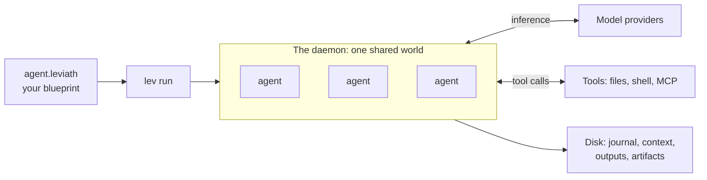

# How Leviath works

Leviath runs LLM agents. You describe an agent in a file, and a background service executes it,
keeping its context coherent, calling its tools, and writing everything to disk as it goes.

This page is the whole system in one pass. Each section is a summary with a link to the page that
covers it properly, so read straight through once and then follow whichever link you need.

## An agent is a blueprint

An agent is a directory holding an `agent.leviath` file, a TOML **blueprint**. It names the stages
the agent moves through, the model and tools each stage gets, and the shape of its memory. There is
no agent code to write, and nothing is compiled.

Eight [pre-built agents](/docs/agent-catalog) ship with Leviath, and `lev create` scaffolds your own.
See [Agent blueprints](/docs/agents).

## Work happens in stages

A stage is one phase of a task, with its own prompt, its own model, and its own tool list. Stages
are joined by **transitions** into a graph, so an agent can loop, branch on an error, or escape a
stage it is stuck in.

That is the main reason to reach for Leviath: a discovery stage can run a cheap model with
read-only tools, and the implementation stage that follows can run an expensive one with write
access. See [Multi-stage workflows](/docs/stages).

## Context is structured, not a flat list

Most agent frameworks keep one growing list of messages, so a large file read pushes the original
task toward the edge of the window. Leviath splits the window into named **regions**, each with its
own budget and its own rule for what to drop first.

A file dump can fill the region it landed in and nothing else. See
[Structured context](/docs/context).

## Tools are declared and gated

Each stage advertises the tools it may call: file tools confined to the run's working directory, a
shell, [MCP](/docs/mcp) servers, and any [Rhai script tools](/docs/rhai-tools) you write. A tool the
stage never advertised cannot be called, and a tool that changes something asks you first unless you
said otherwise.

See [Built-in tools](/docs/tools) and [Security](/docs/security).

## Agents can spawn agents

A stage can hand work to [sub-agents](/docs/sub-agents), either one at a time or as a **fan-out**
that splits a job across many workers and merges what they return. Children are ordinary agents in
the same world, so there is no new process and nothing is serialized between a parent and its
children.

## A person can step in at any point

An agent can ask you a question, ask permission for a tool call, or stop at a checkpoint its
blueprint declares. You answer from the dashboard, the CLI, or the API, and a run that is waiting
holds its place rather than burning tokens. See [Interaction](/docs/interaction).

## Runs hand back an answer

A run's result is more than its logs. A stage can require a structured **output** in a shape you
name, validated before the run is allowed to finish, which is what makes a run safe to call from a
script. See [Outputs](/docs/outputs).

## Everything runs in one shared world

`lev run` does not execute the agent in your terminal. It hands the work to a background
[daemon](/docs/daemon) that holds every agent in one process, and returns immediately.

That is what makes thousands of concurrent agents affordable: a waiting agent is a row of data
nothing touched this pass, not an idle process. [The agent engine](/docs/engine) explains how, and
you never have to think about it to use Leviath.

## Nothing lives only in memory

Every run journals to disk as it goes: its context, its stages, its logs, and its final answer.
Kill the daemon mid-run and the next start picks the work back up, replaying an interrupted tool
batch rather than running it twice.

## Ways in

The CLI is one of four front doors, and they all drive the same daemon.

| You are | Use | Covered in |
|---|---|---|
| At a terminal, or scripting one | `lev` with `--json` | [CLI reference](/docs/cli) |
| A service built on Leviath | `lev serve` | [HTTP API](/docs/api) |
| An editor or orchestrator that spawns processes | `lev agent-client` | [Agent Client Protocol](/docs/agent-client-protocol) |
| A Rust program | the `leviath` crate | [Embedding](/docs/embedding) |

For anything long-lived, prefer the HTTP API over shelling out to the CLI. Its listings are
paginated, sortable, and searchable, a WebSocket pushes changes so you do not have to poll, and
webhooks can deliver a finished run to you. See
[driving Leviath from a work queue](/docs/work-queues#prefer-the-api).

## Where to go next

- [Build your first agent](/docs/first-agent) is the natural next page: it writes one from
  scratch, and the ideas below make more sense once you have.
- [Agent blueprints](/docs/agents) is the field-by-field reference for what you wrote.
- [Multi-stage workflows](/docs/stages) and [Structured context](/docs/context) are the two ideas
  that do the most work.
- [Glossary](/docs/glossary) defines every term these docs use in a particular way.
