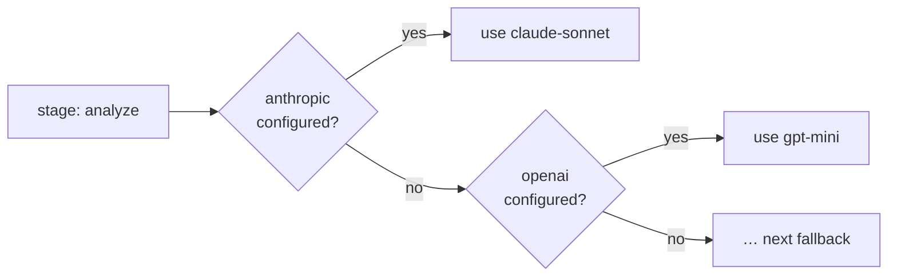

# Providers

Leviath needs at least one model provider, and a key reaches it three ways. Exporting the
provider's environment variable is enough on its own, with no config file at all. `lev setup`
writes it into `~/.leviath/config.toml` for you, interactively or with
`--non-interactive --anthropic-key ...`. Or write the config file yourself; every key is in
[Configuration](/docs/configuration).

| Provider | Env var | Get a key |
|---|---|---|
| Anthropic | `ANTHROPIC_API_KEY` | [console.anthropic.com](https://console.anthropic.com/settings/keys) |
| OpenAI | `OPENAI_API_KEY` | [platform.openai.com](https://platform.openai.com/api-keys) |
| OpenAI Codex | none (ChatGPT subscription; browser sign-in) | [see below](#openai-codex-chatgpt-subscription) |
| Google | `GOOGLE_API_KEY` | [aistudio.google.com](https://aistudio.google.com/app/apikey) |
| xAI | `XAI_API_KEY` | [console.x.ai](https://console.x.ai) |
| Grok | none (SuperGrok or X Premium+ subscription; browser sign-in) | [see below](#grok-supergrok-or-x-premium) |
| Meta | `META_AI_API_KEY` | [dev.meta.ai](https://dev.meta.ai/) |
| OpenRouter | `OPENROUTER_API_KEY` | [openrouter.ai/keys](https://openrouter.ai/keys) |
| Meshy | `MESHY_API_KEY` | [meshy.ai](https://www.meshy.ai/api) |
| AWS Bedrock | `AWS_BEARER_TOKEN_BEDROCK` (region from `AWS_REGION`) | [console.aws.amazon.com/bedrock](https://console.aws.amazon.com/bedrock/home#/api-keys) |
| Ollama | `OLLAMA_HOST` (optional, local) | [ollama.com/download](https://ollama.com/download) |
| Claude Code | none (subscription; terms caveat below; not in the wizard) | [see below](#claude-code-transport) |

The setup flag `--ollama-url` sets the same base URL that `OLLAMA_HOST` supplies.

Which providers can take an image, audio or a document in a request, and which can hand an image
back, is a per-model capability rather than a provider-wide one. [More than text](/docs/mime) covers
what a model sees and what a model hands back, and `lev models list --accepts image/*` names the
models on your keys that take a given type.

Every provider here is opt-in, Ollama included. It needs no key and answers on a well-known local
port, which used to be reason enough to register it on every machine. That made a bare model name
in a blueprint resolvable against whatever happened to be running locally, which is a surprising
place for a run to end up. Choose it in `lev setup`, or set `[providers]
ollama_enabled = true`; naming an `ollama_base_url` also counts, so an install that configured it
before the switch existed keeps working untouched.

## Model identifiers

A model is always named by a `provider` and a `model` together. The `model` string is passed to that
provider verbatim. Spell it the way the provider spells it:

| Provider | Shape | Example |
|---|---|---|
| Anthropic | the bare model name | `claude-sonnet-5` |
| OpenAI | the bare model name | `gpt-5.4-mini` |
| OpenAI Codex | `codex/model` (prefix required) | `codex/gpt-5.5` |
| Google | the bare model name | `gemini-2.5-pro` |
| xAI | the bare model name or one of its aliases | `grok-4.3` |
| Grok | `grok/model` (prefix required) | `grok/grok-4.6` |
| Meta | the bare model name | `muse-spark-1.3` |
| OpenRouter | `vendor/model` | `deepseek/deepseek-v4-flash` |
| Ollama | `model:tag` | `qwen3.5:9b` |
| AWS Bedrock | the inference-profile id, or the bare model id | `us.anthropic.claude-sonnet-5` |

OpenRouter is the one that trips people up: its identifiers carry a vendor prefix, and the prefix is
part of the name. `deepseek-v4-flash` is not a valid OpenRouter model; `deepseek/deepseek-v4-flash`
is. OpenAI Codex carries a prefix for a different reason. `gpt-5.5` is the model, and the `codex/`
in front of it names the provider. The prefix is required because a bare model name never routes to
Codex on its own (see [OpenAI Codex](#openai-codex-chatgpt-subscription)). Browse the full
OpenRouter catalog at [openrouter.ai/models](https://openrouter.ai/models), or ask your install:

```bash
lev models list --provider openrouter        # live from the gateway, with dates and prices
lev models list --provider openrouter --offline   # only what this build's table names
lev models list --all                        # every provider, even unconfigured ones
```

> [!NOTE]
> `lev models list` and `GET /api/models` both build their answer from `config.toml` as it stands
> when you ask, so what they show is **what your next run can use**, not what a run already under
> way is using. A daemon that started before your last edit may not have picked a new provider up
> yet, so a provider can appear in the listing a moment before a run can reach it. If a run is
> refused a provider the listing offers, the daemon is behind: start a new run, or restart it.

> [!NOTE]
> `lev models list` asks each provider for its own listing and shows that; the table compiled into
> this build is shown only for a provider that could not be reached, or with `--offline`. The table
> is a convenience, not the catalog. A model absent from it is not necessarily invalid: with no
> listing read, `lev validate` flags an unrecognized string with an `unknown-model` warning, never
> an error, and the string is still sent to the provider exactly as written. Once a provider's
> listing has been read, a model it does not carry is an `unserved-model` error instead, because
> the provider has said outright what it serves. Locally an unrecognized model gets conservative
> capability assumptions: 128K context and 8192 output on OpenRouter, 8192 context and 4096 output
> elsewhere.

### Dated and rotating identifiers

Providers publish dated aliases (`deepseek/deepseek-v4-flash-0731`,
`deepseek/deepseek-r1-0528`) alongside undated ones. A dated alias can be perfectly valid upstream
while being absent from `lev models list`, and it can also stop resolving later when the provider
retires it. Nothing local will warn you: the first sign is a model-not-found error from the API.

If you pin a dated identifier, treat it as something to revisit. If you would rather not, pin the
undated one and accept that the provider may move it under you.

## Per-stage model selection with fallback

Each [stage](/docs/stages) names an ordered list of provider/model pairs. The runtime picks the
first one you have configured. A blueprint can prefer a strong model and fall back gracefully:



This is why a blueprint written against Anthropic still runs for someone who only has OpenAI keys.

The rest of the list is kept, not discarded. If the provider in use stops being usable partway
through a run, the stage moves to the next entry and carries on rather than failing:

```toml
[[stages.analyze.model.models]]
provider = "openrouter"
model    = "deepseek/deepseek-v4-flash"

[[stages.analyze.model.models]]
provider = "anthropic"
model    = "claude-sonnet-5"
```

"Stops being usable" is narrow. The account is out of credits, the key was rejected or is not
allowed to use that model, or the provider could not be reached at all after every retry. An
ordinary bad request is not that, and never spends a fallback.

## A host-wide fallback chain

A stage that names a single model has nowhere to go on its own. Give the whole host somewhere to
fall back to:

```toml
[providers]
fallback_order = ["anthropic/claude-sonnet-5", "openai/gpt-5.6-mini"]
```

Entries are `provider/model` pairs, best first, and are tried after the stage's own list and your
default model. A failover target needs a model to send, so a bare provider name is not enough. An
entry naming a provider you have not configured is skipped, and a malformed one is ignored with a
warning rather than stopping the daemon.

This is read per run, so editing it takes effect on the next `lev run` with no restart.

## When a provider keeps failing

Failing over saves the run in front of you. It does nothing for the next one, which would start on
the same dead provider and fail the same way. So Leviath counts consecutive failures per provider,
and after a few takes it out of service for every run:

```toml
[limits]
provider_failures_before_open  = 3    # consecutive failures before it is pulled
provider_circuit_cooldown_secs = 300  # how long before it is tried again
```

Three rather than one, because a single "payment required" can be one oversized request. It asks for
more output tokens than the balance covers, and a smaller request would survive. Three in a row is
the account.

Timeouts are counted on a longer fuse: four times the number above, so twelve by default. A provider
that refuses the connection is not serving anyone, and the next request proves it again. One that
accepts the connection and answers slowly is demonstrably there. The usual cause is a large prompt
rather than a dead server. Pulling it after three would take a working provider away from every run
for the cooldown.

While a provider is out, runs move to their next candidate. A run with none left is failed with an
error saying so, rather than left sitting there looking healthy. Once the cooldown passes, the next
request goes through as a probe: if it works the provider is back immediately, and if it fails the
wait restarts. Topping up an account needs no restart.

`lev ps` lists anything currently out of service under the table, with why and how long until it is
retried. `lev ps --json` carries the same under `health.providers_down`, and the
`leviath.provider.circuit.open` metric reports it per provider. Set `provider_failures_before_open`
to `0` to switch the whole thing off and keep only per-run failover.

## Which entry a stage starts on

Failover decides where a run *goes* when something breaks. This decides where it *begins*.

The choice is made once, at spawn. The one thing to hold on to: it depends on whether the
**provider** is configured, never on whether the model exists. A typo in a model name is not caught
here, it fails at the first request.

In order:

1. `lev run --model <provider>/<model>`, which overrides everything and skips the check entirely. A
   bare `--model <model>` replaces only the model name and keeps the provider resolved below.
   "Everything" means the whole run: every stage of the blueprint, every
   [fan-out](/docs/sub-agents#fan-out) worker, and every sub-agent spawned with `spawn_agent`. A
   worker's own blueprint may list different models; they are its failover candidates when the run
   names no model, and are not consulted when it does.
2. Your `default_provider` from `config.toml`, when that provider is configured and the stage did
   not set `allow_user_default = false`. Every entry in the stage's `models` on that provider moves
   to the front, keeping the blueprint's order among them. This is what a preference means: your
   provider first, then whatever the blueprint asked for.
   An entry that names a model and **no** provider is an *open route*: the providers configured
   here are asked which of them serves that model, and yours is asked first. That is how the
   bundled agents run on whichever key you have without ever naming it. A
   [script provider](/docs/rhai-providers) is asked too when it is the one you named as
   `default_provider`. See [preferring a script provider](#preferring-a-script-provider) for what
   it has to report before it can answer.
3. Your `override_model`, when it is set, first among the entries from step 2. It leads even when the
   blueprint lists that same provider with a different model: `default_provider = "ollama"` with
   `override_model = "qwen3.8:latest"` runs on `qwen3.8:latest`, and the blueprint's own
   `qwen3.5:9b` becomes the failover. The name says what it does: it overrides the blueprint.
4. The first entry in `models` whose provider is configured.
5. Your `fallback_model`, when it is set, on `default_provider`. It sits behind every model the stage
   named and is never moved ahead of them, so it only ever carries a stage none of whose own models
   is configured here.
6. The host-wide `fallback_order`, for the stages that got past everything above with nothing left.
7. The first entry in the list, whether or not its provider exists. If it does not, the run fails at
   spawn with `stage '<name>' has no usable provider`.

Everything below the first line is the failover chain, in that same order, so a stage that starts on
your override still has the blueprint's own entries to fall back to.

A run says so when one of your two settings moved a stage off the model its blueprint named. The
run's log carries one line per stage at spawn, such as `[model] stage 'fix' starts on
openrouter/deepseek-v4-flash (override_model); blueprint asked for openrouter/deepseek-v4-pro`. A
stage whose blueprint choice stands gets no line. `lev validate` prints the same thing before
anything is spent.

> [!IMPORTANT]
> `override_model` pins **one** model across every stage, which is usually not what you want. A
> blueprint picks per stage on purpose: `deep-researcher` gathers on a mid-tier model and analyses
> on a top one. Setting `default_provider` alone keeps that shape and moves it onto your
> provider, gathering on that provider's mid-tier entry and analysing on its top one. Setting
> `override_model` too flattens it, and the cheap stages start paying top-tier prices while the
> deciding stage loses the model the author chose for it. `fallback_model` is the safe one: it
> changes nothing for a stage that can run what it asked for.

Going back is a first-class move, not a repair. Delete the `override_model` line from `config.toml`,
or over the API send `PUT /api/config` with `{"override_model": null}`. `null` clears it, an
absent key leaves it alone, and an empty string is refused rather than read as a clear. Either way the next
run picks per stage again, with no restart. `GET /api/config` reports both settings, `null` when
nothing is set.

Before 0.6 there was one key, `default_model`, and it behaved as `override_model` does. A config
that still carries it is read as `fallback_model`, the load and `lev doctor` say so, and `lev update`
rewrites the file. Set `override_model` if the old behaviour was the one you wanted.

Run `lev validate <agent>` to see the result before you spend anything on it. It prints the model
each stage would actually use on this machine. Where that differs from the blueprint's own order, it
prints that order underneath, so you can see the substitution:

```
Models this install would use:
  gather           openrouter/anthropic/claude-sonnet-5
                     blueprint order: anthropic/claude-sonnet-5, openai/gpt-5.4-mini, ...
  analyze          openrouter/anthropic/claude-opus-5
                     blueprint order: anthropic/claude-opus-5, openai/gpt-5.5, ...
  default_provider = openrouter, override_model = (unset), fallback_model = (unset)
```

`override_model` and `fallback_model` take a bare model id: `qwen3.8:latest`, not
`ollama/qwen3.8:latest`. The provider is `default_provider`. That differs from `--model` and
`[providers] fallback_order`, which take
`provider/model` in one string, so a leading `<default_provider>/` is dropped rather than sent
(`lev doctor` names the reading when it happens). The slash in an OpenRouter id such as
`deepseek/deepseek-v4-flash` is part of the model id itself, and OpenRouter's own
`openrouter/auto`-style ids are left as written.

### A gateway is a route, not a model

`default_provider` picks the route, not the answer. This matters most for OpenRouter, which serves
models from every vendor: preferring the gateway should change who bills you and nothing else.

It once took discipline to keep that true. A stage listed one entry per route, and the entries were
matched whole. So `{ provider = "openrouter", model = "..." }` naming a cheaper model than the
Anthropic entry beside it meant `default_provider = "openrouter"` quietly ran the cheaper model
everywhere. A blueprint asking for `gemini-3.1-pro-preview` could and did run sonnet instead,
because the route it happened to match named sonnet.

Stages now name models and leave the route open, so the substitution has nowhere to hide. There is
one entry per model rather than one per route, and the provider is whichever configured one serves
it. The same spelling works everywhere: write `gpt-5.5`, and OpenAI serves it as `gpt-5.5` while
OpenRouter serves it as `openai/gpt-5.5`, without the blueprint knowing either id.

### Running the bundled agents on your provider

The [bundled agents](/docs/agent-catalog) name models rather than routes, so any configured key
works out of the box: whichever provider you set up is asked which of the listed models it serves.
Each blueprint's own order still decides which model is tried first. Naming yours as the default is
what puts it in front:

```toml
default_provider = "openrouter"
openrouter_api_key = "sk-or-..."
```

Every stage now starts on OpenRouter, on the model its author picked for that stage, and keeps the
blueprint's own order behind it. Add `override_model` only when you want one model everywhere
regardless of stage. A stage that must stay on the provider its author picked opts out with
`allow_user_default = false`.

Two other ways in. A full override, for one run:

```bash
lev run coder -t "fix the failing test" --model openrouter/deepseek/deepseek-v4-flash
```

Or copy the blueprint and name the models you want, best first. Set them on the stages you care
about:

```toml
model = { models = ["deepseek-v4-flash", "claude-sonnet-5"] }
```

Pin a provider only for a model that one route alone can reach, such as anything local:

```toml
model = { models = ["claude-sonnet-5", { provider = "ollama", model = "qwen3.5:9b" }] }
```

A model no configured provider serves is skipped. The warning names it, and the stage falls through
to the next model listed.

### Preferring a script provider

A [script provider](/docs/rhai-providers) is preferred the same way any other is. Name it as your
`default_provider` and stages start there, each on the model its author picked for it:

```toml
default_provider = "spark"
```

One extra thing is true of a script provider, and the failure is silent. It has to be able to say
**which models it serves**. Otherwise there is nothing for the preference to prefer, and every stage
quietly goes somewhere else.

Two ways it can say so, and the first needs nothing from you:

**Its `list_models`.** A script that implements `list_models(state)` is asked once at start-up and
claims whatever it reports. Every provider script in [the examples](/docs/rhai-providers) does this
already.

**Or `serves`, in config.** For a script with no `list_models` to be asked:

```toml
[model_providers.spark]
serves = ["deepseek-v4-flash"]
```

A provider that reports neither claims nothing. A blueprint can then only reach it by pinning
`{ provider = "spark", model = "..." }`. That is worth knowing before concluding the preference is
broken.

> [!NOTE]
> Only the provider you name as `default_provider` is asked. Every other script on disk is left
> alone, because a script is compiled the first time it is used and asking all of them what they
> serve would compile every `.rhai` file on the machine before any run started.

Two commands settle whether it worked, and are much faster than a run:

```bash
lev models list --provider spark   # does it claim the model at all
lev validate <agent>               # which model each stage would actually use here
```

`lev validate` is the one that answers the real question. On a machine with `default_provider =
"spark"` it prints the route per stage, so a tiered blueprint shows its shape intact:

```
Models this install would use:
  cheap            spark/deepseek-v4-flash
  deciding         spark/deepseek-v4-max
  default_provider = spark, override_model = (unset), fallback_model = (unset)
```

Both stages on your provider, each still on the model its author chose. Add `override_model` and
that collapses to one model everywhere, with the blueprint's own choice printed underneath as the
substitution it is.

> [!WARNING]
> Once Ollama is enabled, it is registered whether or not a server is running. Leave `override_model`
> unset on such a machine with no Ollama server up and every stage that lists it starts against
> `http://localhost:11434`. The run moves on to its next candidate rather than dying there, but
> it still spends the attempts finding out. This is why the bundled agents pin their Ollama entry
> explicitly and put it last.

### Turning off an Ollama model's thinking

Reasoning models served by Ollama think by default, and the thinking is billed to the same output
budget as the answer. On a local model that mostly shows up as latency: a stage that wanted two
sentences waits through several hundred tokens of deliberation first.

`think` is a top-level field on Ollama's API rather than a sampling parameter. Leviath lifts it out
of the stage's parameters for you:

```toml
[stages.classify.model.parameters]
think = false
```

Left unset, nothing is sent and the model does whatever it does by default. Set it per stage, not
globally: the stage that picks a label off a list has nothing to think about, and the one that
plans the work does.

> [!NOTE]
> Ollama also accepts at most one system message, so Leviath merges a blueprint's context regions
> into a single system block for every OpenAI-compatible provider, Ollama included. The region
> headings survive the merge, which is what keeps a multi-region agent coherent there. See
> [what the model sees](/docs/context#what-the-model-sees).

## Where credentials live

Keys live in `~/.leviath/config.toml` by default, or (to keep them out of a plaintext file) in
your OS keychain. `lev auth` manages the backend:

```bash
lev auth status                 # which backend holds your secrets
lev auth migrate                # move keys into the OS keychain
lev auth migrate --to-file      # move them back to config.toml
lev auth migrate --dry-run      # preview without moving anything
```

A key you add, replace, or remove is in force for the next run you start. The daemon watches
`config.toml` and rebuilds its provider registry when the credentials in it change, so no restart is
involved. It makes no difference whether the write came from `lev setup`, `PUT /api/config`, or an
editor. A run already under way keeps calling the provider its current stage started on. A
provider whose key changed also has its circuit-breaker record cleared, so a replaced key is tried
at once rather than sitting out the old key's cooldown.

The exception is a key you export as an environment variable instead of writing it to the file. The
daemon inherited its environment when it started, so an `export` in your shell afterwards never
reaches it. Write the key to `config.toml`, or run `lev daemon restart` from the shell that exports
it.

### Browser sign-ins

A provider that authenticates with a browser keeps its grant in
`~/.leviath/provider-auth.json` (mode 0600), never in `config.toml`, which is
rewritten by the CLI and has no business holding a refresh token. With
`[security] credential_store = "keychain"` the grant moves to the OS store like
every other secret, and `lev auth migrate` moves it with them.

You sign in from `lev setup`, on the provider's own screen. The commands below
are for the times there is no wizard to run: a headless machine, a script, or a
session someone revoked from the ChatGPT settings page.

```bash
lev auth status          # which account, on what plan, and how much of it is used
lev auth login codex     # sign in again (or: lev auth login grok)
lev auth logout codex    # forget it (leaves the provider enabled)
lev providers quota      # what each subscription has left, for scripts too (--json)
```

Two providers sign in this way: OpenAI Codex, on a ChatGPT plan, and Grok, on a SuperGrok or X
Premium+ plan. Signing out of Grok also revokes the session at xAI.

**The access token renews itself.** Leviath refreshes it a couple of minutes
before it lapses, on whichever call needs it next, and writes the rotated token
back before using it. Signing in again is for a session that was revoked or one
left unused long enough for the refresh token itself to expire, not for
ordinary use.

## Data retention

What a provider keeps of a request once the reply is back is not one thing, and Leviath does not
pretend it is. Every provider answers a policy for a model: how long prompts and outputs stay on
its side, who can change that, and one line saying what to do about it.

```bash
lev providers retention              # what each configured provider keeps, and how that is set
lev providers retention --json
lev providers retention set zero     # ask everywhere; refuse a model that cannot give it
lev providers retention set off
lev providers retention bedrock none # Bedrock's account mode, directly
lev models show claude-sonnet-5      # a model's own answer, on the Retention line
```

How to think about retention, and what the switch can and cannot promise, is its own page:
[Data retention](/docs/data-retention). This section is the reference.

`set zero` writes `[providers] zero_retention = true`. With it on, OpenAI is sent `store = false`
and Bedrock's account mode is set to `none`. OpenRouter is sent `provider.zdr = true` with
`data_collection = "deny"`, so it routes only to endpoints with a zero-retention policy, and refuses
a model that has none rather than routing it elsewhere. A stage whose model still keeps something
is refused at spawn with the provider's own reason. Nothing is silently rerouted: an author who
pinned a model would not see it swapped for one at another vendor. A fallback the stage lists is
held to the same bar and dropped from failover when it keeps something, with a line in the
stage's log saying so. A running daemon reads the switch at every spawn and picks the per-request
fields up on its next housekeeping pass, so no restart is needed. While the switch is on, the
daemon also reads Bedrock's account mode again before every spawn, so a mode `lev providers
retention` set a moment ago is the one the spawn is judged by.

`lev validate` says the same thing before a run does. With the switch on, a stage whose model
would be refused is a `retention-not-zero` error. A fallback that would be dropped is a
`retention-fallback-dropped` warning. Each carries the provider's reason. The wizard's Defaults
screen has the switch too, with an agreement row per contract provider, and `lev setup
--zero-retention true` writes it headlessly.

Which models can give zero retention is a per-model fact, and two providers publish it. Bedrock's
model listing says which data retention modes each model may be served under. A model it never
offers under `none` cannot run with zero retention there, whatever the account is set to. Measured
on 2026-09-15, that is every OpenAI model on Bedrock, and Claude Fable 5. Leviath reads the listing
at start-up and refuses such a model up front, rather than letting Bedrock report it unavailable
mid-run. OpenRouter lists the endpoints with a zero-retention policy at
`GET /endpoints/zdr`, and a model with none is refused up front for the same reason. Everywhere
else the answer is the provider's, not the model's, except the covered Claude models above.

What each shipped provider does, as documented on 2026-09-14:

| Provider | Keeps | Controlled by | What that means |
|---|---|---|---|
| `bedrock` | nothing, for a model that allows mode `none` | the account's data retention mode, `GET`/`PUT /data-retention`, and what the model listing allows | Modes are ordered `none < default < aws_review`. Leviath reads both at start-up |
| `openai` | up to 30 days, for abuse monitoring | a Zero Data Retention agreement with OpenAI | `store = false` stops the stored-completion copy; only the agreement removes the abuse log |
| `anthropic` | up to 30 days, for trust and safety | a zero data retention agreement with Anthropic | Claude Fable 5 and 5.1, Mythos 5 and 5.1 keep 30 days regardless |
| `google` | 55 days, for abuse monitoring (paid tier) | per project, on request to Google | The free tier trains on prompts. Requests are sent with `store: false` |
| `xai` | up to 30 days, for abuse monitoring; never trained on | a zero data retention agreement with xAI | Declare the agreement in `zero_retention_agreements` |
| `grok` | not published for this route | nothing Leviath can set | `lev providers retention` shows the account's coding data opt-out as xAI reports it |
| `meta` | not published for the standard models; the `-contributor` models are trained on | nothing | A `-contributor` model is refused under zero retention |
| `openrouter` | nothing itself unless prompt logging is on; the endpoint's own policy applies | `provider.zdr` on each request | `GET https://openrouter.ai/api/v1/endpoints/zdr` lists the endpoints that qualify |
| `meshy` | 3 days (enterprise: indefinitely) | nothing | A task's model files, previews and textures are kept so they can be downloaded; nothing is used for training |
| `ollama`, `llama-cpp`, `lm-studio` | nothing | nothing | Local inference |
| `codex` | the ChatGPT account's terms | nothing | A subscription transport, outside the API's agreements |
| `claude-code` | the account behind the CLI | nothing | A Commercial API key inherits its organisation's arrangement, ZDR included |
| a `[model_providers]` entry | unknown | its `retention` key | Leviath cannot know a custom host's policy; declare it if you do |

Declare an agreement with OpenAI, Anthropic, Google or xAI in `zero_retention_agreements`. Google's
requests carry `store: false`, so nothing is kept beyond the abuse-monitoring window above.
Anthropic's Claude Fable 5 and 5.1 and Mythos 5 and 5.1 are not available under ZDR without
Anthropic's express authorisation. Leviath reads OpenRouter's qualifying endpoints at start-up and
refuses a model with none up front.

Bedrock has more to it. `lev providers retention` reads the account mode live, and an account set to
`inherit` serves each model under that model's own default. Claude Fable 5 and Mythos 5 require
`aws_review` and keep 30 days inside AWS for the human review Anthropic requires. Under `none` they
are unavailable, as is any model the listing does not offer under `none`. Model invocation logging
is a separate, opt-in setting on your account.

A model can differ from its provider: `retention` on a `[model_capabilities.<model>]` entry
replaces the answer for that model alone, and wins over everything above. Anthropic's covered
models are the built-in case of that.

Two things this cannot do. It cannot read an agreement: OpenAI, Anthropic and Google expose no
API for it, so a declared agreement is taken at your word. And it cannot make a provider keep
less than its floor: a model that retains regardless is refused under `zero_retention`, not sent.

## Rate limits

Optional per-provider client-side rate limits, enforced before each call. The table name is the
provider's registry name, `bedrock` included:

```toml
[rate_limits.anthropic]
requests_per_minute = 50
tokens_per_minute   = 100000
```

## Custom OpenAI-compatible providers

Any server that speaks OpenAI's chat API is a provider with three lines of config and no script.
Write a `[model_providers.<name>]` entry with `kind = "openai-compatible"` and a `base_url`, plus an
`api_key` or `headers` if the server wants them. That covers llama.cpp, LM Studio, vLLM,
BionicGPT and most gateways; Leviath asks the server what models it serves and falls back to a
`models` list you write when it will not say. `lev setup` offers llama.cpp and LM Studio as
presets and a custom entry for the rest. The details, the detection rules and a two-server
example are in [OpenAI-compatible endpoints](/docs/configuration#openai-compatible-endpoints).

A server that needs more than the OpenAI shape, or a different one altogether, is a small Rhai
script instead. [Rhai providers](/docs/rhai-providers) walks through a complete Groq provider.

## Meshy

Meshy is not a chat backend: it turns reference images or an existing mesh into a textured 3D
model. It is a provider all the same, because a stage that runs it takes typed input and produces
a typed part, which is the shape every provider speaks. Set `MESHY_API_KEY` (or
`[providers] meshy_api_key`), then a stage selects an operation as its model:

| Model | Takes | Produces |
|---|---|---|
| `text-to-3d` | a text prompt | a textured `model/gltf-binary` (preview then refine) |
| `image-to-3d` | one image | a textured `model/gltf-binary` |
| `multi-image-to-3d` | up to four views of one subject | a textured `model/gltf-binary`, with preview renders |
| `retexture` | a `model/gltf-binary` mesh plus a text style | the re-textured mesh |
| `rig` | a `model/gltf-binary` mesh | the rigged, animation-ready mesh |
| `animate` | a `model/gltf-binary` mesh plus an action name | the animated mesh (rigs, then applies the action) |

`rig` needs a humanoid pose to work from. Meshy refuses a mesh it finds none in (a waving arm, a
prop merged into the body, a non-humanoid shape, a single-view build), and the error says so. The
bundled sprite-to-3d hands back the unrigged model when that happens.

A stage's texture prompt, text prompt, or animation action comes from the text of a visible region.
Text in the conversation comes first. When there is none, the pinned regions the stage sees answer
instead (the `task` region a caller fills, say). A stage can also pin the action or texture prompt
in `[stages.<name>.model.parameters]` as `action` or `texture_prompt`, which wins over any region
text. `text-to-3d` and `animate` each run more than one Meshy job in turn (a preview then a refine;
a rig, a library lookup, then the animation) under one `request_timeout_secs`. The action is a
search of Meshy's animation library, and the first match is applied, so name a clip the way the
library does (`Idle 1`, `Run`) rather than describing it.

```toml
[context.regions]
views = { kind = "pinned", seed = "input", accepts = ["image/*"], max_stored = 4 }
mesh  = { kind = "hashmap", accepts = ["model/gltf-binary"] }

[stages.build]
[[stages.build.model.models]]
provider = "meshy"
model    = "multi-image-to-3d"
[stages.build.output_routing]
"model/gltf-binary" = "mesh"        # hand the produced mesh to the next stage

[stages.build.model.parameters]     # optional static hints, all documented Meshy fields
ai_model         = "meshy-7"
target_polycount = 30000
texture_resolution = "4k"
```

The images a stage can see become the request. A texture prompt an upstream stage wrote becomes
the texturing hint. The produced mesh lands in the region `output_routing` names, so the next
stage (a `rig`, say) can see it. A Meshy job runs for minutes, so give the stage a generous
`[stages.<name>.model] request_timeout_secs`; the provider polls to completion under it.

A generated mesh is a large file. A full-resolution GLB can run to tens of megabytes, past the
`[mime] max_part_bytes` ceiling. That ceiling is 32 MiB when no configured provider names a larger
limit, and a mesh past it is dropped with a note in the reply. Two knobs keep it in bounds.
`target_polycount` with `should_remesh = true` in the stage parameters is one, and it is also what
makes the mesh game-ready. The other is a higher `[mime] max_part_bytes`
in your config, for when you do want the full-resolution model.

## AWS Bedrock

Bedrock serves models from a dozen vendors (Anthropic's Claude, Amazon Nova, Meta's Llama,
Mistral, DeepSeek, OpenAI's open-weight models and more) billed to your AWS account. Leviath talks
to it with a Bedrock API key, not with AWS access keys or request signing. Make one in the Bedrock
console under **API keys**, and pick a long-term key. AWS's own
[API keys](https://docs.aws.amazon.com/bedrock/latest/userguide/api-keys.html) page walks through
it. Then export the key or write it to the config:

```bash
export AWS_BEARER_TOKEN_BEDROCK=ABSK...
lev setup --non-interactive --bedrock-key "$AWS_BEARER_TOKEN_BEDROCK" --bedrock-region us-east-1
```

```toml
[providers]
bedrock_api_key = "ABSK..."     # env fallback: AWS_BEARER_TOKEN_BEDROCK
bedrock_region  = "us-east-1"   # env fallback: AWS_REGION, then AWS_DEFAULT_REGION
```

Every Bedrock host is regional, so the region is part of the address. Unset, it follows
`AWS_REGION`, then `AWS_DEFAULT_REGION`, then `us-east-1`; the wizard offers a picker on its
Defaults screen once Bedrock is chosen. A model has to be enabled for your account in that region,
or the call comes back as an access error.

Model ids are Bedrock's own. Most current models are reached through an inference profile whose
prefix says where the request may be routed, so name that: `us.anthropic.claude-sonnet-5`,
`eu.amazon.nova-pro-v1:0`, `global.anthropic.claude-opus-5`. A model that takes on-demand calls by
its bare id (`openai.gpt-oss-120b-1:0`) is named that way. Put the provider in front in a
blueprint, and leave the bare vendor names to the vendors. `claude-sonnet-5` on its own still routes
to your Anthropic key, because the same model on Bedrock bills a different account.

```toml
model = { models = ["bedrock/us.anthropic.claude-sonnet-5"] }
```

`lev models list --provider bedrock` lists what your key can reach, with prices beside the models
AWS publishes a rate for. Requests go over the Converse and ConverseStream APIs, so streaming,
tools, system prompts, images and PDFs work as they do on the other providers. Leviath does not
use Bedrock's OpenAI-compatible route: it does not serve Claude, Nova or Llama.

**Thinking.** A stage turns Claude's extended thinking on with its own field in the stage's
model parameters, and Nova 2's with Amazon's; each reaches only the vendor that takes it. The
signed reasoning a Claude returns is stored with the turn and replayed ahead of its tool calls on
the next request, which is what Claude requires when thinking and tools are used together. The
Claude 4 models take a budget; the Claude 5 models take `adaptive` and decide how much to think
themselves, and Bedrock refuses a budget on them. A stage that wants a plain answer from either
sets `thinking = { type = "disabled" }`.

```toml
[stages.plan.model]
models = ["bedrock/us.anthropic.claude-sonnet-5"]
parameters = { thinking = { type = "adaptive" } }

[stages.review.model]
models = ["bedrock/us.anthropic.claude-sonnet-4-6"]
parameters = { thinking = { type = "enabled", budget_tokens = 4096 } }
```

**Exact token counts.** Bedrock's CountTokens is called before a request large enough to be worth
measuring, the way Anthropic's and Gemini's counters are. The Claude models Bedrock serves only
through a cross-region profile are not covered by it, and for those Anthropic's own `count_tokens`
route on the `bedrock-mantle` host answers instead. That host exists in fourteen regions, and not
every model is on every one of them. A count the region's host refuses goes to `us-east-1`, which
carries them all. A configured region outside the fourteen counts there directly. The count
is free and carries only the prompt text. A model neither route counts falls back to the local
estimate.

**Limits and prices, from AWS.** No Bedrock API states a model's context window or output cap.
Leviath reads them from the model cards in the AWS documentation and ships the result in the
binary, refreshed by `cargo xtask bedrock-windows`. The Claude 5 models carry their 1M window
there. A Claude 4.x model is 200K on Bedrock unless a stage opts into the beta with
`anthropic_beta = ["context-1m-2025-08-07"]` in its parameters. In that case, also raise the
window in `[model_capabilities]`. Prices come from AWS's public price list at start-up, for every
vendor it covers. The newer Claude models are billed through AWS Marketplace and are not in that
list. Leviath prices them from Anthropic's published rates, which Bedrock charges too. Both can be
corrected per model:

```toml
[model_capabilities."us.amazon.nova-pro-v1:0"]
max_output_tokens = 5000
```

An id with dots in it has to be quoted as a TOML key, as above.

`bedrock_base_url` (env `BEDROCK_BASE_URL`) points inference at a gateway instead of
`https://bedrock-runtime.<region>.amazonaws.com`. With it set, the live listing, the price file and
the count routes are not read, since a gateway that fronts inference rarely fronts the rest.
`lev models list` shows this build's table for Bedrock instead. One more thing to know: the whole
`AWS_*` namespace is withheld from shell and Rhai tools by default. An agent's script cannot read
the key. The provider reads it from the daemon's own environment, and `[security] allow_env_vars`
is the escape hatch for a tool that needs one of them.

## Files sent to a provider

A large image, PDF, video or recording is uploaded to the provider's own file storage the first
time a request carries it, and every later turn, retry and stage names it by id. Anthropic, OpenAI,
Google, xAI, Grok and Meta take files this way; the rest are sent the bytes on each request.
Nothing is uploaded with zero data retention on, or with `[providers] file_uploads = false`. A
run's uploads are deleted when it finishes or is deleted. The limits each provider takes, and what
happens to a part that is too large, are in [Files and size limits](/docs/mime#files-and-size-limits).

## OpenAI and Google request shapes

The OpenAI provider calls OpenAI's Responses API, and the Google provider calls Gemini's
Interactions API. Both are sent `store: false`, so neither vendor keeps the exchange as a stored
object. A stage's parameters written for Chat Completions keep working: `reasoning_effort` is sent
as OpenAI's `reasoning.effort` or Gemini's `thinking_level`, and OpenAI's `response_format` as
`text.format`. OpenRouter, Ollama and OpenAI-compatible endpoints still use Chat Completions.

`google_base_url` names the native API root, `https://generativelanguage.googleapis.com/v1beta`.
A URL ending in `/openai` is read as the root above it. A gateway that speaks only Gemini's OpenAI
compatible API is set up as an [OpenAI-compatible endpoint](#custom-openai-compatible-providers)
instead.

## Image, video and audio models

Image, video, speech, transcription and music models run as stages that take parts and hand parts
back, the way [Meshy](#meshy) does. A stage on one is sent its text as the prompt (the task, or
what an earlier stage wrote to the stage's regions) and the images or audio its regions hold. The
stage's instructions, tools and history are not sent, since these models call no tools and some
refuse anything but the prompt. Give the stage an `output_routing` for what the model makes and an
artifact to hand it back:

```toml
[stages.picture]
mode = "output"

[[stages.picture.model.models]]
provider = "openai"
model = "gpt-image-2"

[stages.picture.model.parameters]
size = "1536x1024"
quality = "medium"

[stages.picture.output_routing]
"image/*" = "pictures"

[[stages.picture.output.artifacts]]
name = "picture"
type = "image/png"
required = true
```

A video is made in the background at the vendor and waited for. Give a video stage a generous
`request_timeout_secs`. Leviath waits up to 900 seconds by default.

**OpenAI**

| Model | Takes | Makes | Parameters |
|---|---|---|---|
| `gpt-image-2`, `gpt-image-1.5`, `gpt-image-1`, `gpt-image-1-mini`, `chatgpt-image-latest` | text, and images to edit | PNG images | `size`, `quality`, `background`, `output_format`, `moderation`, `n` |
| `sora-2`, `sora-2-pro` | text, and an image to start from | an MP4 video | `seconds` (4, 8 or 12), `size` (`1280x720`, `720x1280` and the larger sizes on pro) |
| `gpt-4o-mini-tts`, `tts-1`, `tts-1-hd` | text | speech, MP3 unless `response_format` says otherwise | `voice` (`alloy` unless set), `response_format`, `instructions`, `speed` |
| `whisper-1`, `gpt-4o-transcribe`, `gpt-4o-mini-transcribe`, `gpt-4o-transcribe-diarize` | audio | the transcript as text, with a `transcript.json` part (segments, and speakers from the diarize model) | `language`, `prompt`, `response_format` |

**Google**

| Model | Takes | Makes | Parameters |
|---|---|---|---|
| `gemini-3.1-flash-image`, `gemini-3-pro-image`, `nano-banana-pro-preview` | text, and images to edit | JPEG images, and a line of text | `aspect_ratio`, `image_size` |
| `veo-3.1-generate-preview`, `veo-3.1-fast-generate-preview`, `veo-3.1-lite-generate-preview` | text, and an image to start from | an MP4 video with sound | `duration` (4, 6 or 8 seconds; 8 unless set), `aspect_ratio`, `resolution`, `negative_prompt` |
| `gemini-3.1-flash-tts-preview`, `gemini-2.5-flash-preview-tts`, `gemini-2.5-pro-preview-tts` | text to read aloud | speech as a 24 kHz WAV | `voice` (`Kore`, `Puck` and the rest), `language` |
| `lyria-3.5`, `lyria-3-pro-preview`, `lyria-3-clip-preview` | a description of the music | an MP3, and its lyrics with timings as text | none |

A Gemini speech model reads out the text it is given. It refuses a prompt it would answer in words
instead ("Model tried to generate text"), so hand it the words to speak rather than a request to
write them.

**AWS Bedrock**

| Model | Takes | Makes | Parameters |
|---|---|---|---|
| `stability.stable-image-core-v1:1`, `stability.stable-image-ultra-v1:1`, `stability.sd3-5-large-v1:0` | text, and an image to start from (SD3.5) | PNG images | `aspect_ratio`, `negative_prompt`, `seed`, `output_format`, `strength` |
| `us.stability.stable-image-remove-background-v1:0`, `-search-recolor-`, `-search-replace-`, `-inpaint-`, `-erase-object-`, `-control-sketch-`, `-control-structure-`, `-style-guide-`, `stable-outpaint-`, `stable-style-transfer-` and the upscalers | an image, and a prompt for the tools that take one | PNG images | each tool's own fields (`select_prompt` for recolor, for example), sent as written |
| `amazon.nova-canvas-v1:0` (us-east-1) | text, or an image to vary | PNG images | `width`, `height`, `numberOfImages`, `cfgScale`, `seed`, `quality` |

The Stability models are enabled per region (us-west-2 carries them), and the editing tools are
reached through their `us.` inference profile. Nova Reel, Bedrock's video model, is not offered: it
writes its result to an S3 bucket, which a Bedrock API key cannot read.

**xAI, Grok and Meta** have their own image, video and speech models; see [xAI](#xai) and
[Meta](#meta).

**Cost.** A media model is priced the way its vendor bills it. When the reply counts tokens, the
tokens are the bill: OpenAI's image models, Gemini's image and speech models, and the `gpt-4o`
transcription models. Otherwise the shipped price table gives a unit price per image, per second
of video, per hour of audio, per million characters or per music clip. Those unit prices are read
from LiteLLM by `cargo xtask prices`, which a weekly job runs. `gpt-4o-mini-tts` is billed by the
second of audio it makes, and its reply does not say how long that is. Leviath reads the length
from the MP3 or WAV it returns. A format it cannot measure (Opus, AAC, FLAC) leaves the call
unpriced.

**Not offered here.** The realtime and live models (`gpt-realtime-*`, `gemini-*-live*`,
`lyria-realtime-exp`) speak a streaming socket rather than a request, and `gpt-audio-*` is a chat
model that also hears and speaks.

## xAI

xAI's API serves the Grok models on an API key. Set `XAI_API_KEY`, or pick xAI in `lev setup`.

```toml
[providers]
xai_api_key = "xai-..."
```

The model list, context windows and prices are read from xAI's own listings when Leviath starts,
aliases included, so `grok-4.20` routes to the model it points at. Every call also reports what it
cost, and that figure is what a run records. `lev models list --provider xai` shows the live
prices.

**Long prompts cost more.** A request whose prompt reaches a model's threshold (200 000 tokens on
the current models) is billed at a higher rate for the whole request. `lev models list` marks
such a model with `+`, `lev models show` prints both rates, and `lev validate` adds a
`long-context-price` note for a stage whose context can grow that far. Model choice never looks
at it.

**Reasoning effort.** A model that takes an effort is sent one from the stage's parameters, and a
model that refuses one is asked again without it, once per model.

**Image, video and speech models.** These run as stages that take parts and produce parts, the
same way [Meshy](#meshy) does. Give the stage an `output_routing` for what it makes:

| Model | Takes | Makes | Parameters |
|---|---|---|---|
| `grok-imagine-image`, `grok-imagine-image-2.0`, `grok-imagine-image-quality` | text, and images to edit | JPEG images | `n`, `aspect_ratio`, `resolution`, `quality` |
| `grok-imagine-video`, `grok-imagine-video-1.5` | text, and an image, video or audio to start from | an MP4 video | `duration` (1 to 15 seconds), `aspect_ratio`, `resolution`, `operation = "extend"` |
| `grok-tts` | text | speech, MP3 unless `codec` says otherwise | `voice_id`, `language`, `codec`, `sample_rate`, `speed` |
| `grok-stt` | an audio part | the transcript as text, with a `transcript.json` part of word timings | `language`, `diarization` |

A video is made in the background at xAI and waited for, so give the stage a generous
`request_timeout_secs`. `grok-tts` and `grok-stt` are Leviath's names for xAI's speech routes,
which take no model name. Unit prices for these models are in the shipped price table: per image,
per second of video, per million characters, per hour of audio. A call that reports its own cost
is billed at that instead.

```toml
[stages.picture.model]
models = ["xai/grok-imagine-image"]
parameters = { aspect_ratio = "16:9" }
[stages.picture.output_routing]
"image/*" = "pictures"
```

## Grok (SuperGrok or X Premium+)

With a SuperGrok or X Premium+ plan, Leviath can bill Grok to the subscription instead of an API
balance. Sign in once with a browser; no key is involved.

```bash
lev setup                # select "Grok", then sign in with your browser
lev auth login grok      # or sign in from a script or a headless machine
```

```toml
[providers]
grok_enabled = true
```

Grok uses the same API and models as xAI, so everything in [xAI](#xai) holds, image and speech
models included. The differences:

- **The sign-in is the Grok CLI's.** xAI publishes no sign-in for other programs, so Leviath uses
  the one the Grok CLI uses, with its redirect to `127.0.0.1:56121`. xAI can change or withdraw it.
- **Cost is recorded as zero.** The subscription pays. `lev auth status` and `lev providers quota`
  show this week's and this month's use against the plan's limits, and a rate limit with no
  `Retry-After` waits for the billing period to reset.
- **It never wins a bare model name.** Like Codex, it is only used when named: `grok/grok-4.6`,
  a `fallback_order` entry, `provider_order`, or `default_provider`.
- **Retention.** xAI publishes no retention policy for this route. `lev providers retention` quotes
  the account's coding data opt-out as xAI reports it.

## Meta

Meta's Model API serves the Muse models on a key from [dev.meta.ai](https://dev.meta.ai/). Set
`META_AI_API_KEY` (not `MODEL_API_KEY` or `META_API_KEY`, which Leviath does not read), or pick
Meta in `lev setup`.

```toml
[providers]
meta_api_key = "..."
```

| Model | Takes | Makes |
|---|---|---|
| `muse-spark-1.3`, `-1.2`, `-1.1` | text, images, video, audio and PDFs (1 048 576 tokens) | text and tool calls |
| `muse-spark-1.3-contributor`, `-1.2-contributor` | the same, at a much lower price | the same |
| `muse-image-1.0` | text, and images to edit | images |
| `muse-voice-transcribe-1.0` | WAV audio | the transcript, with a `transcript.json` part of turns |

**Contributor models.** Meta trains on what a `-contributor` model is sent and returns, which is
why it costs less. `lev models list` flags one with `!` while zero retention is on, and a stage on
one is refused.

**Muse Spark always reasons.** An effort of `none` is refused by Meta and never sent; `minimal`,
`low`, `medium`, `high` and `xhigh` are taken. `stop`, `logit_bias`, `n` and log probabilities are
refused too, so Leviath removes them from a stage's parameters.

**Transcription takes WAV only:** mono, 16-bit, 16 or 24 kHz, at most 32 MB and ten minutes.
Leviath does not convert audio, and refuses anything else with a message naming the format.
Parameters: `mode`, `language_bias`, `keywords`.

**Rate limits are per team**, 3 000 requests a minute on the standard models and 100 on the
contributor ones. A team shared by several people wants a lower `[rate_limits.meta]`.

Meta publishes no prices through its API; they come from the shipped price table, which
`cargo xtask prices` refreshes.

## OpenAI Codex (ChatGPT subscription)

If you have a ChatGPT Plus, Pro, Business or Enterprise plan, Leviath can bill
inference to it instead of an API balance. Sign in once with a browser and no
API key is involved at all.

```bash
lev setup                # select "OpenAI Codex", then "Sign in with your browser"
```

The whole thing happens on that screen. There is no key to paste, so instead of
a field the card shows who is signed in, a button that opens your browser, and
the same **Check this credential** button every other provider has. The check
asks your subscription about itself rather than reading a table, so a green
answer means the account really did agree.

If your browser does not open (an SSH session, say), the card prints the URL to
copy.

There is an HTTP route for the same thing, so a web console can offer it too:
`GET /api/providers` reports what is signed in, and `POST
/api/providers/codex/login` starts the flow and hands back the URL. See
[signing in to a subscription provider](/docs/api#signing-in-to-a-subscription-provider).
The browser still has to be on the machine running `lev serve`, because the
redirect goes to `localhost:1455` there and OpenAI registered it that way.

This is a different provider from `openai`, not a mode of it. You can hold both
credentials; a blueprint reaches this one as `codex/gpt-5.6-sol`.

```toml
[providers]
codex_enabled          = true
codex_reasoning_effort = "medium"   # none | minimal | low | medium | high | xhigh
codex_verbosity        = "medium"   # low | medium | high
```

### It never wins a bare model name

A blueprint entry that names a model with no provider is offered to every
configured provider. Model names are compared on their last path segment,
so `openai` and `codex` both answer to a bare `gpt-5.6-sol`. Turning this
provider on would otherwise move billing for every such stage with one line of
config and nothing saying so.

So it is only reachable deliberately, which is the rule for every configured
provider: an explicit `codex/...` in a blueprint or `--model`, an explicit
`fallback_order` entry, naming it in
[`provider_order`](/docs/configuration#provider-preference-order), or being your
`default_provider`. Naming it in `provider_order` is how you say a bare name
*should* run on the subscription. Put `codex` first there, and a stage that lists
`gpt-5.6-sol` with no provider runs on your plan, ahead of an OpenAI key that
also serves it. Leave it out and no bare name ever lands on it.

### Measured caveats

Everything here was checked against a live account rather than read from a
reference.

**No per-stage output cap, and no temperature.** The route rejects both
outright, so a stage's `max_output_tokens` is advisory here and `temperature`
is ignored. Every model on this route is a reasoning model; use
`codex_reasoning_effort` instead.

**No cache breakpoints.** There is no `cache_control` and no TTL to choose,
only implicit prefix caching. Your structured regions still arrive intact and
in the order assembly sorted them, and that order is now the whole caching
strategy rather than an optimisation. Caching measured at 93% of the prefix
once the prefix is large; below roughly nine thousand tokens it does not engage
at all.

**Cost is reported as zero, because it is.** A subscription has no per-call
price. What to watch instead is the quota: a rolling five-hour window and a
weekly one. `lev auth status` and `lev providers quota` show both, and Leviath
reads them to decide how long to wait after a rate limit rather than guessing.

**The model list is compiled in.** The route publishes no catalogue, so the
context windows are this build's belief, and which models answer depends on
your plan. `lev models list --provider codex` shows what your plan reaches.
The compiled list is cross-checked against OpenAI's published catalogue every
week by `cargo xtask prices`, which reports a model that looks renamed,
withdrawn or newly served. It cannot fix the list, because what Codex serves
is published nowhere, but it stops the table going quietly stale.

**Reasoning effort is accepted per model.** `codex_reasoning_effort` takes
`none`, `minimal`, `low`, `medium`, `high` or `xhigh`, and any given model
takes some subset. `gpt-5.5` answers `400` to `minimal` and names its own set
as `none, low, medium, high, xhigh`; a model that must reason rejects `none`.
`low` and above have been accepted by everything seen so far.

**Reasoning continuity is replayed by Leviath.** The route stores nothing
server-side, so each turn's reasoning is handed back on the next request. Set
`codex_replay_reasoning = false` to stop, at the cost of the model re-deriving
its chain of thought every turn.

## Claude Code transport

If you have Claude Code installed and signed in, you can run Leviath on your Claude subscription
with no API key. Leviath's structured regions still work; the CLI is driven as a plain inference
relay.

> [!CAUTION]
> **Terms of service.** Anthropic's terms state that third-party developers may not offer claude.ai
> login or subscription rate limits for their products without prior approval. Using this transport
> routes inference through your Claude subscription via the CLI's OAuth session. By enabling it, you
> accept responsibility for compliance with Anthropic's terms. For unambiguous compliance, use a
> direct Anthropic API key instead.

Four measured caveats. The CLI adds about 130 tokens of its own context to **every** call, your
account email address and the current date included, and there is no flag to turn that off. There is
no prompt caching. Each call is a separate subprocess. And it serves Anthropic models only.

The setup wizard does not offer it. Turn it on with `lev setup --claude-code true`. Add
`--claude-code-effort <level>` for something other than the default, or write the keys yourself:

```toml
[providers]
claude_code_enabled = true
claude_code_binary  = "/usr/local/bin/claude"   # unset resolves `claude` on PATH
claude_code_effort  = "medium"                  # low | medium | high | xhigh | max
```

It is off unless you turn it on, and running the wizard later leaves these keys as they are.
`claude_code_effort` is always sent explicitly: left to itself the CLI picks `high` with adaptive
thinking, spending output tokens and latency Leviath never asked for.
