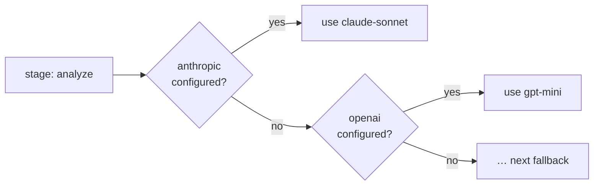

# Providers

Leviath needs at least one model provider, and a key reaches it three ways. Exporting the
provider's environment variable is enough on its own, with no config file at all. `lev setup`
writes it into `~/.leviath/config.toml` for you, interactively or with
`--non-interactive --anthropic-key ...`. Or write the config file yourself; every key is in
[Configuration](/docs/configuration).

| Provider | Env var | Get a key |
|---|---|---|
| Anthropic | `ANTHROPIC_API_KEY` | [console.anthropic.com](https://console.anthropic.com/settings/keys) |
| OpenAI | `OPENAI_API_KEY` | [platform.openai.com](https://platform.openai.com/api-keys) |
| OpenAI Codex | none (ChatGPT subscription; browser sign-in) | [see below](#openai-codex-chatgpt-subscription) |
| Google (Gemini) | `GOOGLE_API_KEY` | [aistudio.google.com](https://aistudio.google.com/app/apikey) |
| OpenRouter | `OPENROUTER_API_KEY` | [openrouter.ai/keys](https://openrouter.ai/keys) |
| Ollama | `OLLAMA_HOST` (optional, local) | [ollama.com/download](https://ollama.com/download) |
| Claude Code | none (subscription; terms caveat below; not in the wizard) | [see below](#claude-code-transport) |

The setup flag `--ollama-url` sets the same base URL that `OLLAMA_HOST` supplies.

Which providers can take an image, audio or a document in a request, and which can hand an image
back, is a per-model capability rather than a provider-wide one. [Typed mime](/docs/mime) covers
what a model sees and what a model hands back, and `lev models list --accepts image/*` names the
models on your keys that take a given type.

Every provider here is opt-in, Ollama included. It needs no key and answers on a well-known local
port, which used to be reason enough to register it on every machine - and that made a bare model
name in a blueprint resolvable against whatever happened to be running locally, which is a
surprising place for a run to end up. Choose it in `lev setup`, or set `[providers]
ollama_enabled = true`; naming an `ollama_base_url` also counts, so an install that configured it
before the switch existed keeps working untouched.

## Model identifiers

A model is always named by a `provider` and a `model` together. The `model` string is passed to that
provider verbatim, so it has to be spelled the way the provider spells it:

| Provider | Shape | Example |
|---|---|---|
| Anthropic | the bare model name | `claude-sonnet-5` |
| OpenAI | the bare model name | `gpt-5.4-mini` |
| OpenAI Codex | `codex/model` (prefix required) | `codex/gpt-5.5` |
| Google | the bare model name | `gemini-2.5-pro` |
| OpenRouter | `vendor/model` | `deepseek/deepseek-v4-flash` |
| Ollama | `model:tag` | `qwen3.5:9b` |

OpenRouter is the one that trips people up: its identifiers carry a vendor prefix, and the prefix is
part of the name. `deepseek-v4-flash` is not a valid OpenRouter model; `deepseek/deepseek-v4-flash`
is. OpenAI Codex carries a prefix for a different reason: `gpt-5.5` is the model, and the `codex/`
in front of it names the provider, required because a bare model name never routes to Codex on its
own (see [OpenAI Codex](#openai-codex-chatgpt-subscription)). Browse the full OpenRouter catalog at
[openrouter.ai/models](https://openrouter.ai/models), or ask your install:

```bash
lev models list --provider openrouter        # live from the gateway, with dates and prices
lev models list --provider openrouter --offline   # only what this build's table names
lev models list --all                        # every provider, even unconfigured ones
```

> [!NOTE]
> `lev models list` and `GET /api/models` both build their answer from `config.toml` as it stands
> when you ask, so what they show is **what your next run can use**, not what a run already under
> way is using. A daemon that started before your last edit may not have picked a new provider up
> yet, so a provider can appear in the listing a moment before a run can reach it. If a run is
> refused a provider the listing offers, the daemon is behind: start a new run, or restart it.

> [!NOTE]
> `lev models list` asks each provider for its own listing and shows that; the table compiled into
> this build is shown only for a provider that could not be reached, or with `--offline`. The table
> is a convenience, not the catalog. A model absent from it is not necessarily invalid: with no
> listing read, `lev validate` flags an unrecognized string with an `unknown-model` warning, never
> an error, and the string is still sent to the provider exactly as written. Once a provider's
> listing has been read, a model it does not carry is an `unserved-model` error instead, because
> the provider has said outright what it serves. Locally an unrecognized model gets conservative
> capability assumptions: 128K context and 8192 output on OpenRouter, 8192 context and 4096 output
> elsewhere.

### Dated and rotating identifiers

Providers publish dated aliases (`deepseek/deepseek-v4-flash-0731`,
`deepseek/deepseek-r1-0528`) alongside undated ones. A dated alias can be perfectly valid upstream
while being absent from `lev models list`, and it can also stop resolving later when the provider
retires it. Nothing local will warn you: the first sign is a model-not-found error from the API.

If you pin a dated identifier, treat it as something to revisit. If you would rather not, pin the
undated one and accept that the provider may move it under you.

## Per-stage model selection with fallback

Each [stage](/docs/stages) names an ordered list of provider/model pairs. The runtime picks the
first one you have configured, so a blueprint can prefer a strong model and fall back gracefully:



This is why a blueprint written against Anthropic still runs for someone who only has OpenAI keys.

The rest of the list is kept, not discarded. If the provider in use stops being usable partway
through a run, the stage moves to the next entry and carries on rather than failing:

```toml
[[stages.analyze.model.models]]
provider = "openrouter"
model    = "deepseek/deepseek-v4-flash"

[[stages.analyze.model.models]]
provider = "anthropic"
model    = "claude-sonnet-5"
```

"Stops being usable" means the account is out of credits, the key was rejected or is not allowed to
use that model, or the provider could not be reached at all after every retry. An ordinary bad
request is not that, and never spends a fallback.

## A host-wide fallback chain

A stage that names a single model has nowhere to go on its own. Give the whole host somewhere to
fall back to:

```toml
[providers]
fallback_order = ["anthropic/claude-sonnet-5", "openai/gpt-5.6-mini"]
```

Entries are `provider/model` pairs, best first, and are tried after the stage's own list and your
default model. A failover target needs a model to send, so a bare provider name is not enough. An
entry naming a provider you have not configured is skipped, and a malformed one is ignored with a
warning rather than stopping the daemon.

This is read per run, so editing it takes effect on the next `lev run` with no restart.

## When a provider keeps failing

Failing over saves the run in front of you. It does nothing for the next one, which would start on
the same dead provider and fail the same way. So Leviath counts consecutive failures per provider,
and after a few takes it out of service for every run:

```toml
[limits]
provider_failures_before_open  = 3    # consecutive failures before it is pulled
provider_circuit_cooldown_secs = 300  # how long before it is tried again
```

Three rather than one because a single "payment required" can be one request asking for more output
tokens than the balance covers, which a smaller request would survive. Three in a row is the
account.

Timeouts are counted on a longer fuse: four times the number above, so twelve by default. A provider
that refuses the connection is not serving anyone and the next request proves it again, but one that
accepts the connection and answers slowly is demonstrably there, and the usual cause is a large
prompt rather than a dead server. Pulling it after three would take a working provider away from
every run for the cooldown.

While a provider is out, runs move to their next candidate. A run with none left is failed with an
error saying so, rather than left sitting there looking healthy. Once the cooldown passes, the next
request goes through as a probe: if it works the provider is back immediately, and if it fails the
wait restarts. Topping up an account needs no restart.

`lev ps` lists anything currently out of service under the table, with why and how long until it is
retried. `lev ps --json` carries the same under `health.providers_down`, and the
`leviath.provider.circuit.open` metric reports it per provider. Set `provider_failures_before_open`
to `0` to switch the whole thing off and keep only per-run failover.

## Which entry a stage starts on

Failover decides where a run *goes* when something breaks. This decides where it *begins*.

The choice is made once, at spawn. The one thing to hold on to: it depends on whether the
**provider** is configured, never on whether the model exists. A typo in a model name is not caught
here, it fails at the first request.

In order:

1. `lev run --model <provider>/<model>`, which overrides everything and skips the check entirely. A
   bare `--model <model>` replaces only the model name and keeps the provider resolved below.
   "Everything" means the whole run: every stage of the blueprint, every
   [fan-out](/docs/sub-agents#fan-out) worker, and every sub-agent spawned with `spawn_agent`. A
   worker's own blueprint may list different models; they are its failover candidates when the run
   names no model, and are not consulted when it does.
2. Your `default_provider` from `config.toml`, when that provider is configured and the stage did
   not set `allow_user_default = false`. Every entry in the stage's `models` on that provider moves
   to the front, keeping the blueprint's order among them. This is what a preference means: your
   provider first, then whatever the blueprint asked for.
   An entry that names a model and **no** provider is an *open route*: the providers configured
   here are asked which of them serves that model, and yours is asked first. That is how the
   bundled agents run on whichever key you have without ever naming it. A
   [script provider](/docs/rhai-providers) is asked too when it is the one you named as
   `default_provider` - see [preferring a script provider](#preferring-a-script-provider) for what
   it has to report before it can answer.
3. Your `override_model`, when it is set, first among the entries from step 2. It leads even when the
   blueprint lists that same provider with a different model: `default_provider = "ollama"` with
   `override_model = "qwen3.8:latest"` runs on `qwen3.8:latest`, and the blueprint's own
   `qwen3.5:9b` becomes the failover. The name says what it does: it overrides the blueprint.
4. The first entry in `models` whose provider is configured.
5. Your `fallback_model`, when it is set, on `default_provider`. It sits behind every model the stage
   named and is never moved ahead of them, so it only ever carries a stage none of whose own models
   is configured here.
6. The host-wide `fallback_order`, for the stages that got past everything above with nothing left.
7. The first entry in the list, whether or not its provider exists. If it does not, the run fails at
   spawn with `stage '<name>' has no usable provider`.

Everything below the first line is the failover chain, in that same order, so a stage that starts on
your override still has the blueprint's own entries to fall back to.

A run says so when one of your two settings moved a stage off the model its blueprint named: one
`[model] stage 'fix' starts on openrouter/deepseek-v4-flash (override_model); blueprint asked for
openrouter/deepseek-v4-pro` line per stage in the run's log, at spawn, and nothing when the
blueprint's own choice stands. `lev validate` prints the same thing before anything is spent.

> [!IMPORTANT]
> `override_model` pins **one** model across every stage, which is usually not what you want. A
> blueprint picks per stage on purpose: `deep-researcher` gathers on a mid-tier model and analyses
> on a top one. Setting `default_provider` alone keeps that shape and moves it onto your
> provider - gathering on that provider's mid-tier entry, analysing on its top one. Setting
> `override_model` too flattens it, and the cheap stages start paying top-tier prices while the
> deciding stage loses the model the author chose for it. `fallback_model` is the safe one: it
> changes nothing for a stage that can run what it asked for.

Going back is a first-class move, not a repair. Delete the `override_model` line from `config.toml`,
or over the API send `PUT /api/config` with `{"override_model": null}` - `null` clears it, an absent
key leaves it alone, and an empty string is refused rather than read as a clear. Either way the next
run picks per stage again, with no restart. `GET /api/config` reports both settings, `null` when
nothing is set.

Before 0.6 there was one key, `default_model`, and it behaved as `override_model` does. A config
that still carries it is read as `fallback_model`, the load and `lev doctor` say so, and `lev update`
rewrites the file. Set `override_model` if the old behaviour was the one you wanted.

Run `lev validate <agent>` to see the result before you spend anything on it. It prints the model
each stage would actually use on this machine, and, where that differs from the blueprint's own
order, prints that order underneath so the substitution is visible:

```
Models this install would use:
  gather           openrouter/anthropic/claude-sonnet-5
                     blueprint order: anthropic/claude-sonnet-5, openai/gpt-5.4-mini, ...
  analyze          openrouter/anthropic/claude-opus-5
                     blueprint order: anthropic/claude-opus-5, openai/gpt-5.5, ...
  default_provider = openrouter, override_model = (unset), fallback_model = (unset)
```

`override_model` and `fallback_model` take a bare model id: `qwen3.8:latest`, not `ollama/qwen3.8:latest`. The provider is
`default_provider`. That differs from `--model` and `[providers] fallback_order`, which take
`provider/model` in one string, so a leading `<default_provider>/` is dropped rather than sent
(`lev doctor` names the reading when it happens). The slash in an OpenRouter id such as
`deepseek/deepseek-v4-flash` is part of the model id itself, and OpenRouter's own
`openrouter/auto`-style ids are left as written.

### A gateway is a route, not a model

`default_provider` picks the route, not the answer. This matters most for OpenRouter, which serves
models from every vendor: preferring the gateway should change who bills you and nothing else.

It once took discipline to keep that true. A stage listed one entry per route, and the entries were
matched whole, so `{ provider = "openrouter", model = "..." }` naming a cheaper model than the
Anthropic entry beside it meant `default_provider = "openrouter"` quietly ran the cheaper model
everywhere. A blueprint asking for `gemini-3.1-pro-preview` could and did run sonnet instead,
because the route it happened to match named sonnet.

Stages now name models and leave the route open, so the substitution has nowhere to hide. There is
one entry per model rather than one per route, and the provider is whichever configured one serves
it. The same spelling works everywhere: write `gpt-5.5`, and OpenAI serves it as `gpt-5.5` while
OpenRouter serves it as `openai/gpt-5.5`, without the blueprint knowing either id.

### Running the bundled agents on your provider

The [bundled agents](/docs/agent-catalog) name models rather than routes, so any configured key
works out of the box: whichever provider you set up is asked which of the listed models it serves.
Each blueprint's own order still decides which model is tried first. Naming yours as the default is
what puts it in front:

```toml
default_provider = "openrouter"
openrouter_api_key = "sk-or-..."
```

Every stage now starts on OpenRouter, on the model its author picked for that stage, and keeps the
blueprint's own order behind it. Add `override_model` only when you want one model everywhere
regardless of stage. A stage that must stay on the provider its author picked opts out with
`allow_user_default = false`.

Two other ways in. A full override, for one run:

```bash
lev run coder -t "fix the failing test" --model openrouter/deepseek/deepseek-v4-flash
```

Or, for something permanent and per stage, copying the blueprint and naming the models you want on
the stages you care about, best first:

```toml
model = { models = ["deepseek-v4-flash", "claude-sonnet-5"] }
```

Pin a provider only for a model that one route alone can reach, such as anything local:

```toml
model = { models = ["claude-sonnet-5", { provider = "ollama", model = "qwen3.5:9b" }] }
```

A model no configured provider serves is skipped, with a warning naming it, and the stage falls
through to the next model listed.

### Preferring a script provider

A [script provider](/docs/rhai-providers) is preferred the same way any other is - name it as your
`default_provider` and stages start there, each on the model its author picked for it:

```toml
default_provider = "spark"
```

One extra thing is true of a script provider, and it is worth knowing because the failure is
silent: it has to be able to say **which models it serves**, or there is nothing for the preference
to prefer and every stage quietly goes somewhere else.

Two ways it can say so, and the first needs nothing from you:

**Its `list_models`.** A script that implements `list_models(state)` is asked once at start-up and
claims whatever it reports. Every provider script in [the examples](/docs/rhai-providers) does this
already.

**Or `serves`, in config.** For a script with no `list_models` to be asked:

```toml
[model_providers.spark]
serves = ["deepseek-v4-flash"]
```

A provider that reports neither claims nothing, and can then only be reached by a blueprint that
pins it - `{ provider = "spark", model = "..." }` - which is worth knowing before concluding the
preference is broken.

> [!NOTE]
> Only the provider you name as `default_provider` is asked. Every other script on disk is left
> alone, because a script is compiled the first time it is used and asking all of them what they
> serve would compile every `.rhai` file on the machine before any run started.

Two commands settle whether it worked, and are much faster than a run:

```bash
lev models list --provider spark   # does it claim the model at all
lev validate <agent>               # which model each stage would actually use here
```

`lev validate` is the one that answers the real question. On a machine with `default_provider =
"spark"` it prints the route per stage, so a tiered blueprint shows its shape intact:

```
Models this install would use:
  cheap            spark/deepseek-v4-flash
  deciding         spark/deepseek-v4-max
  default_provider = spark, override_model = (unset), fallback_model = (unset)
```

Both stages on your provider, each still on the model its author chose. Add `override_model` and
that collapses to one model everywhere, with the blueprint's own choice printed underneath as the
substitution it is.

> [!WARNING]
> Once Ollama is enabled, it is registered whether or not a server is running. Leave `override_model`
> unset on such a machine with no Ollama server up and every stage that lists it starts against
> `http://localhost:11434`. The run moves on to its next candidate rather than dying there, but
> it still spends the attempts finding out. This is why the bundled agents pin their Ollama entry
> explicitly and put it last.

### Turning off an Ollama model's thinking

Reasoning models served by Ollama think by default, and the thinking is billed to the same output
budget as the answer. On a local model that mostly shows up as latency: a stage that wanted two
sentences waits through several hundred tokens of deliberation first.

`think` is a top-level field on Ollama's API rather than a sampling parameter, and Leviath lifts it
out of the stage's parameters for you:

```toml
[stages.classify.model.parameters]
think = false
```

Left unset, nothing is sent and the model does whatever it does by default. Set it per stage, not
globally: the stage that picks a label off a list has nothing to think about, and the one that
plans the work does.

> [!NOTE]
> Ollama also accepts at most one system message, so Leviath merges a blueprint's context regions
> into a single system block for every OpenAI-compatible provider, Ollama included. The region
> headings survive the merge, which is what keeps a multi-region agent coherent there. See
> [what the model sees](/docs/context#what-the-model-sees).

## Where credentials live

Keys live in `~/.leviath/config.toml` by default, or (to keep them out of a plaintext file) in
your OS keychain. `lev auth` manages the backend:

```bash
lev auth status                 # which backend holds your secrets
lev auth migrate                # move keys into the OS keychain
lev auth migrate --to-file      # move them back to config.toml
lev auth migrate --dry-run      # preview without moving anything
```

A key you add, replace, or remove is in force for the next run you start. The daemon watches
`config.toml` and rebuilds its provider registry when the credentials in it change, so no restart is
involved, and it makes no difference whether the write came from `lev setup`, `PUT /api/config`, or
an editor. A run already under way keeps calling the provider its current stage started on. A
provider whose key changed also has its circuit-breaker record cleared, so a replaced key is tried
at once rather than sitting out the old key's cooldown.

The exception is a key you export as an environment variable instead of writing it to the file. The
daemon inherited its environment when it started, so an `export` in your shell afterwards never
reaches it. Write the key to `config.toml`, or run `lev daemon restart` from the shell that exports
it.

### Browser sign-ins

A provider that authenticates with a browser keeps its grant in
`~/.leviath/provider-auth.json` (mode 0600), never in `config.toml`, which is
rewritten by the CLI and has no business holding a refresh token. With
`[security] credential_store = "keychain"` the grant moves to the OS store like
every other secret, and `lev auth migrate` moves it with them.

You sign in from `lev setup`, on the provider's own screen. The commands below
are for the times there is no wizard to run: a headless machine, a script, or a
session someone revoked from the ChatGPT settings page.

```bash
lev auth status          # which account, and on what plan
lev auth login codex     # sign in again
lev auth logout codex    # forget it (leaves the provider enabled)
```

**The access token renews itself.** Leviath refreshes it a couple of minutes
before it lapses, on whichever call needs it next, and writes the rotated token
back before using it. Signing in again is for a session that was revoked or one
left unused long enough for the refresh token itself to expire, not for
ordinary use.

## Rate limits

Optional per-provider client-side rate limits, enforced before each call:

```toml
[rate_limits.anthropic]
requests_per_minute = 50
tokens_per_minute   = 100000
```

## Custom OpenAI-compatible providers

Any server that speaks OpenAI's chat API is a provider with three lines of config and no script:
a `[model_providers.<name>]` entry with `kind = "openai-compatible"` and a `base_url`, plus an
`api_key` or `headers` if the server wants them. That covers llama.cpp, LM Studio, vLLM,
BionicGPT and most gateways; Leviath asks the server what models it serves and falls back to a
`models` list you write when it will not say. `lev setup` offers llama.cpp and LM Studio as
presets and a custom entry for the rest. The details, the detection rules and a two-server
example are in [OpenAI-compatible endpoints](/docs/configuration#openai-compatible-endpoints).

A server that needs more than the OpenAI shape, or a different one altogether, is a small Rhai
script instead. [Rhai providers](/docs/rhai-providers) walks through a complete Groq provider.

## OpenAI Codex (ChatGPT subscription)

If you have a ChatGPT Plus, Pro, Business or Enterprise plan, Leviath can bill
inference to it instead of an API balance. Sign in once with a browser and no
API key is involved at all.

```bash
lev setup                # select "OpenAI Codex", then "Sign in with your browser"
```

The whole thing happens on that screen. There is no key to paste, so instead of
a field the card shows who is signed in, a button that opens your browser, and
the same **Check this credential** button every other provider has. The check
asks your subscription about itself rather than reading a table, so a green
answer means the account really did agree.

If your browser does not open (an SSH session, say), the card prints the URL to
copy.

There is an HTTP route for the same thing, so a web console can offer it too:
`GET /api/providers` reports what is signed in, and `POST
/api/providers/codex/login` starts the flow and hands back the URL. See
[signing in to a subscription provider](/docs/api#signing-in-to-a-subscription-provider).
The browser still has to be on the machine running `lev serve`, because the
redirect goes to `localhost:1455` there and OpenAI registered it that way.

This is a different provider from `openai`, not a mode of it. You can hold both
credentials; a blueprint reaches this one as `codex/gpt-5.6-sol`.

```toml
[providers]
codex_enabled          = true
codex_reasoning_effort = "medium"   # none | minimal | low | medium | high | xhigh
codex_verbosity        = "medium"   # low | medium | high
```

### It never wins a bare model name

A blueprint entry that names a model with no provider is offered to every
configured provider, and model names are compared on their last path segment,
so `openai` and `codex` both answer to a bare `gpt-5.6-sol`. Turning this
provider on would otherwise move billing for every such stage with one line of
config and nothing saying so.

So it is only reachable deliberately: an explicit `codex/...` in a blueprint or
`--model`, an explicit `fallback_order` entry, naming it in
[`provider_order`](/docs/configuration#provider-preference-order), or being your
`default_provider`. Naming it in `provider_order` is how you say a bare name
*should* prefer the subscription: put `codex` first there and a stage that lists
`gpt-5.6-sol` with no provider runs on your plan, ahead of an OpenAI key that
also serves it.

### Measured caveats

Everything here was checked against a live account rather than read from a
reference.

**No per-stage output cap, and no temperature.** The route rejects both
outright, so a stage's `max_output_tokens` is advisory here and `temperature`
is ignored. Every model on this route is a reasoning model; use
`codex_reasoning_effort` instead.

**No cache breakpoints.** There is no `cache_control` and no TTL to choose,
only implicit prefix caching. Your structured regions still arrive intact and
in the order assembly sorted them, and that order is now the whole caching
strategy rather than an optimisation. Caching measured at 93% of the prefix
once the prefix is large; below roughly nine thousand tokens it does not engage
at all.

**Cost is reported as zero, because it is.** A subscription has no per-call
price. What to watch instead is the quota: a rolling five-hour window and a
weekly one, both of which Leviath reads to decide how long to wait after a rate
limit rather than guessing.

**The model list is compiled in.** The route publishes no catalogue, so the
context windows are this build's belief, and which models answer depends on
your plan. `lev models list --provider codex` shows what your plan reaches.
The compiled list is cross-checked against OpenAI's published catalogue every
week by `cargo xtask prices`, which reports a model that looks renamed,
withdrawn or newly served - it cannot fix the list, because what Codex serves
is published nowhere, but it stops the table going quietly stale.

**Reasoning effort is accepted per model.** `codex_reasoning_effort` takes
`none`, `minimal`, `low`, `medium`, `high` or `xhigh`, and any given model
takes some subset. `gpt-5.5` answers `400` to `minimal` and names its own set
as `none, low, medium, high, xhigh`; a model that must reason rejects `none`.
`low` and above have been accepted by everything seen so far.

**Reasoning continuity is replayed by Leviath.** The route stores nothing
server-side, so each turn's reasoning is handed back on the next request. Set
`codex_replay_reasoning = false` to stop, at the cost of the model re-deriving
its chain of thought every turn.

## Claude Code transport

If you have Claude Code installed and signed in, you can run Leviath on your Claude subscription
with no API key. Leviath's structured regions still work; the CLI is driven as a plain inference
relay.

> [!CAUTION]
> **Terms of service.** Anthropic's terms state that third-party developers may not offer claude.ai
> login or subscription rate limits for their products without prior approval. Using this transport
> routes inference through your Claude subscription via the CLI's OAuth session. By enabling it, you
> accept responsibility for compliance with Anthropic's terms. For unambiguous compliance, use a
> direct Anthropic API key instead.

Four measured caveats. The CLI adds about 130 tokens of its own context to **every** call, your
account email address and the current date included, and there is no flag to turn that off. There is
no prompt caching. Each call is a separate subprocess. And it serves Anthropic models only.

The setup wizard does not offer it. Turn it on with `lev setup --claude-code true`
(and `--claude-code-effort <level>` if you want something other than the default), or write the
keys yourself:

```toml
[providers]
claude_code_enabled = true
claude_code_binary  = "/usr/local/bin/claude"   # unset resolves `claude` on PATH
claude_code_effort  = "medium"                  # low | medium | high | xhigh | max
```

It is off unless you turn it on, and running the wizard later leaves these keys as they are.
`claude_code_effort` is always sent explicitly: left to itself the CLI picks `high` with adaptive
thinking, spending output tokens and latency Leviath never asked for.
