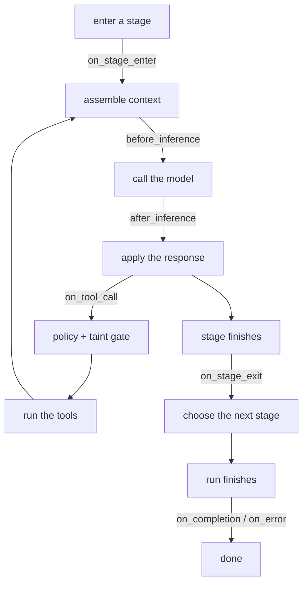

# Stage hooks

A [custom region](/docs/rhai-regions) owns one region. A [script tool](/docs/rhai-tools) adds one
tool. Stage hooks are the third shape: they let you step into the agent's own lifecycle and see, or
change, what it is about to do.

Seven points, declared per stage:

```toml
[stages.implement.hooks]
on_stage_enter   = "hooks/seed.rhai"
before_inference = "hooks/cost_gate.rhai"
on_tool_call     = "hooks/guard.rhai"
on_completion    = "hooks/notify.rhai"
```

Each field names a `.rhai` file beside the agent, and the file must define a function of the same
name taking one argument:

```rhai
fn on_stage_enter(ctx) {
    ()   // allow, unchanged
}
```

One file can back several hooks by defining several functions. A stage that declares none costs
nothing: no file is read and no engine is built.

## When each one fires



| Hook | Fires | Sees | `modify` replaces |
|---|---|---|---|
| `on_stage_enter` | entering a stage, before its first inference | stage, regions, parts | region contents |
| `before_inference` | context assembled, before the request goes out | stage, regions, parts | region contents |
| `after_inference` | response in hand, before it reaches context | response, token count, tool-call names | the response text |
| `on_tool_call` | before the policy and taint layers see the calls | the calls and their arguments | the calls |
| `on_stage_exit` | stage finished, before the next is chosen | stage, regions, parts | region contents |
| `on_completion` | run finished successfully | the final output | the final output |
| `on_error` | run finished in error | the error message | the message |

The three region hooks see each region's text under `regions` and, under `parts`, the stored
[parts](/docs/mime) each region holds, as maps with `mime_type`, `name`, `sha256`, `size` and
`tokens`, keyed by region name; a region holding none is absent from `parts`. A hook can refuse to
start a stage whose `storyboard` is empty, or note in `regions` that six frames arrived.

A **cancelled** run fires neither terminal hook. It was stopped from outside, and a hook narrating
that would report your own decision back to you.

## What a hook returns

The same four answers everywhere, so there is no vocabulary to learn per hook:

| Return | Means |
|---|---|
| `()` or `true` | allow, unchanged |
| `false` | refuse, no reason given |
| `#{ action: "modify", value: ... }` | proceed with `value` |
| `#{ action: "cancel", reason: "..." }` | refuse |
| `#{ action: "retry" }` | do it again |

Hooks are a **return-value contract**. Rhai passes arguments by value, so mutating `ctx` does
nothing. The script has to return its decision.

Not every hook can honour `retry`, and one that cannot says so rather than treating it as allow.
Today none of them do: it is reserved for re-inference, which needs an attempt bound first or a hook
that always retries would wedge the run.

## What hooks cannot do

**`on_tool_call` runs before the gate, not after.** Whatever it leaves is what your tool policy, the
taint gate, and the approval prompt then check. So a hook can *narrow* what runs. It can veto a call
or rewrite arguments to something tamer. It cannot widen anything, because nothing it produces skips
those checks. It also has no access to the gate itself: it cannot mark its own calls approved.

**`after_inference` cannot rewrite tool calls.** It is shown their names, which is enough to notice
"it wants to run shell". It can replace the response text only. Editing the calls there would be a
way around checks you configured; that is `on_tool_call`'s job, where the gate can see it.

**A failed hook is not an allowed hook.** A script that throws, or returns something malformed, fails
the run. Treating a broken gate as permission is how a gate quietly stops gating.

## Errors are caught at spawn

A hook script that cannot be read, does not compile, takes the wrong number of arguments, or does not
define the function it was named for fails `lev run` before the agent starts. A hook that never runs
looks exactly like one that ran and allowed everything, and you would not be there to notice.

## The sandbox

Hooks run on the same hardened engine everything else in Leviath does: no filesystem, no network, no
`eval`, and an operation budget that stops a runaway rather than letting it hold up the tick. See
[Scripting](/docs/scripting) for what that engine does and does not offer.

## Examples

Seed a region as a stage opens:

```rhai
fn on_stage_enter(ctx) {
    #{ action: "modify", value: #{ notes: "Focus on the failing test first." } }
}
```

Stop an expensive stage from running twice:

```rhai
fn before_inference(ctx) {
    if ctx.regions.conversation.len() > 40000 {
        #{ action: "cancel", reason: "context is larger than this stage should need" }
    } else {
        ()
    }
}
```

Keep a stage off the shell:

```rhai
fn on_tool_call(ctx) {
    for c in ctx.tool_calls {
        if c.name == "shell" {
            return #{ action: "cancel", reason: "this stage plans, it does not run commands" };
        }
    }
    ()
}
```

Tidy an answer on the way out:

```rhai
fn on_completion(ctx) {
    #{ action: "modify", value: ctx.output.trim() }
}
```
