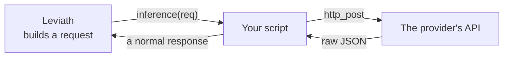

# Custom model providers

Leviath ships support for the big providers, but there are always more. A `.rhai` script in
`~/.leviath/providers/` teaches it any HTTP LLM API, without waiting for anyone to add it.

Your script does one job: translate. Leviath hands it a request in Leviath's own shape, the script
turns that into whatever body the API wants, and then turns the reply back:



Everything hard stays on Leviath's side: HTTP transport, rate limiting, per-stage timeouts, retry
with backoff, working out which errors are worth retrying, and token counting. You write the mapping
and nothing else: name the file after the provider, write an `inference` function, and reference it
from a stage.

Four things about the lifecycle:

- **The filename is the provider name.** `groq.rhai` is referenced as `provider = "groq"`.
- **Nothing runs until it is named.** The daemon does not scan and execute every file it finds at
  startup, only the ones an agent actually asks for.
- **Edits apply on the next run.** The file's modification time is checked on each use, so a change
  is picked up with no daemon restart. Its `[model_providers.<name>]` table is read the same way, so
  changing a `base_url` or an `api_key` needs no restart either.
- **A broken script is skipped, not fatal.** It logs a warning, and starts working again as soon as
  you fix the file.

## Where it goes and how it's referenced

Put the file at `~/.leviath/providers/groq.rhai`, then point a stage at it from the blueprint:

```toml
# agent.leviath
[stages.plan.model]
provider = "groq"                       # the filename stem
model    = "llama-3.3-70b-versatile"    # passed through as request.model
```

Model selection is per stage. Every stage that should use this provider needs its own
`[stages.<name>.model]` block.

> [!WARNING]
> A top-level `[model]` block is not read by anything. It parses without complaint and then has no
> effect, so the stage quietly runs on your default provider instead. `lev validate` catches this
> and reports it as `agent-model-block-ignored`.

A config table is optional. It only supplies overrides that reach the script's `initialize`:

```toml
# ~/.leviath/config.toml
[model_providers.groq]
script   = "groq"                            # optional; defaults to <name>.rhai
api_key  = "..."                             # optional; the script may read its own env var
base_url = "https://api.groq.com/openai/v1"  # optional

[model_providers.groq.rate_limit]            # optional; enforced by the Rust wrapper
requests_per_minute = 30
tokens_per_minute   = 100000

# Any other keys are forwarded verbatim to initialize(config).
```

## The script contract

A provider defines `initialize` and `inference` (required) and may add `stream`, `count_tokens`, and
`list_models`. Metadata comes from leading `// @key value` comments. Both required functions are
checked when the script loads, so one that is missing or takes the wrong number of parameters is
skipped with a warning, the same as a syntax error, rather than failing part-way into a run.

The metadata directives, all optional:

| directive | default | meaning |
|---|---|---|
| `// @provider <name>` | none | informational; activation is by config key / filename |
| `// @description <text>` | empty | one line shown in listings |
| `// @default_model <id>` | none | fills a stage that names no model |
| `// @max_context_tokens <int>` | 8192 | the model's whole context window |
| `// @max_output_tokens <int>` | 4096 | the largest reply the model can produce |
| `// @supports_streaming <bool>` | false | advisory; real streaming needs a `stream` function |
| `// @input_types <list>` | `text/*` | mime type patterns the script's models accept, comma-separated: `text/*, image/*`. See [typed mime](/docs/mime) |
| `// @output_types <list>` | `text/*` | mime type patterns the script's models can hand back |
| `// @mime_type <type> ...` | none | a [mime registry](/docs/mime) row the provider ships, repeatable. See below |

> [!IMPORTANT]
> `@max_context_tokens` is the window the
> [pre-flight guard](/docs/context#requests-are-measured-before-they-are-sent) holds every request
> against: one whose prompt plus its `max_tokens` reply budget would overflow it is refused before
> it is sent. Left at the 8192 default, a stage that asks for an 8192-token reply can never run,
> whatever its prompt - the refusal reads
> `Token limit exceeded: the prompt's N tokens plus the 8192-token reply budget (max_output_tokens)
> exceed the model's 8192-token context window`, and the number to fix is this annotation, not the
> stage's `max_output_tokens`. Declare the backing model's real window here, or override it
> per model with a [`[model_capabilities]`](/docs/configuration#model_capabilitiesmodel_id) entry;
> a `list_models` answer is a listing, and does not feed the guard.

### A provider ships the types its models are built for

A model built for a type the registry does not know can still be reached, but nothing downstream
knows what that type *is*: what family a provider encodes it as, whether its bytes are text, what a
stand-in for it should say. A provider declares that with `@mime_type`, one row per line:

```rhai
// @provider acme
// @output_types application/x-acme-scene
// @mime_type application/x-acme-scene family=model extensions=scene magic=41434D45
```

Each row names a `type/subtype` (or `type/*`) and then the fields it sets: `family=` (what a
provider keys its encoder on), `text=<bool>` (whether the bytes are UTF-8), `extensions=` (a
comma-separated list, no spaces) and `magic=` (a hex prefix for sniffing). A key it does not
recognize is ignored, and a line with no type is dropped, so a typo never fails a load. A provider
declares a type's *shape*, not a byte [check](/docs/rhai-mime-checks) - a check lives beside the
config or blueprint that names it, not in a provider.

The rows layer into every run's [mime registry](/docs/mime#the-registry) under the built-in table,
so a run that resolves onto the provider knows the type, and the operator's `mime_types.toml` and a
blueprint's own rows still win over it. `lev mime list` shows each provider row with its source
(`provider:<name>`), and editing the script reaches live runs on the daemon's next config pass, the
same way an edited `mime_types.toml` does.

`initialize(config)` runs once when the provider loads. It runs **offline**, so no HTTP host
functions are available here. Return a state map that is persisted and passed to every later call.

`inference(state, request)` does one non-streaming call. `request` carries:

```jsonc
{
  "system":   [ { "text": "...", "cache_hint": "...",
                  "region": "findings", "volatility": "grows" } ],
  "messages": [ { "role": "user", "content": "...", "cache_breakpoint": false } ],
  "tools":    [ { "name": "...", "description": "...", "parameters": { /* JSON schema */ } } ],
  "model": "...", "max_tokens": 1024, "temperature": 0.7,
  "request_timeout_secs": 120, "extra": { /* forwarded config keys */ }
}
```

Two field subtleties. A message's `content` is a string on plain turns, but an **array of content
blocks** (`tool_use`, `tool_result`) whenever the agent is mid tool work, so forward it untouched
unless your API needs a transform. And `cache_breakpoint` is present only when `true`; a normal
message carries no such key.

### Building your own prompt cache

Each system block says which region it came from and how much that region moves, so a provider
can arrange the prompt for whatever cache its API has:

| field | meaning |
|---|---|
| `region` | the region it was rendered from, or `""` for a block that is not one (a hint, a preamble) |
| `volatility` | `"stable"`, `"grows"` or `"rewritten"` - what the blueprint declared. See [context regions](/docs/context#what-caching-costs) |

These are facts about the content, deliberately not instructions. Leviath does **not** decide your
cache policy for you, because every API's differs: Anthropic caches by prefix with four markers
and a minimum length, and yours may have a different count, a different floor, or no cache at all.
The built-in Anthropic provider turns these same fields into its own policy and is worth reading as
one worked example.

The rule that makes them useful is prefix matching, if your API works that way: a marker caches
everything *before* it, so one placed after content that changes can never be read back. That makes
the arrangement worth having stable content first and churn last, and a marker belongs in front of
the first `"rewritten"` block rather than behind it.

```rhai
// Send the settled part of the prompt in a form your API can cache, and the
// churn after it.
fn inference(state, request) {
    let stable = "";
    let volatile = "";
    for b in request.system {
        if b.volatility == "rewritten" { volatile += b.text + "\n\n"; }
        else { stable += b.text + "\n\n"; }
    }
    // ... send `stable` as your API's cacheable prefix, `volatile` after it
}
```

A block whose region declared nothing arrives as `"rewritten"`, the pessimistic value, so a script
that trusts these fields is never told something holds still when it does not.

and must return:

```jsonc
{
  "content": "...",
  "tool_calls":  [ { "id": "...", "name": "...", "arguments": { /* parsed */ } } ],
  "tokens_used": { "prompt_tokens": 0, "completion_tokens": 0, "total_tokens": 0,
                   "cached_tokens": 0, "cache_write_tokens": 0,
                   "cost_usd": 0.0 },
  "finish_reason": "Complete",  // "Complete" | "ToolCall" | "TokenLimit" | "Stop"
  "parts": [ { "bytes": <blob>, "mime_type": "image/png", "name": "hero.png" } ]
}
```

`parts` is what a model that draws or speaks handed back, and is usually absent. Each entry
carries its bytes as a Rhai blob under `bytes` or as base64 under `data`, a `mime_type`
(`application/octet-stream` when missing or unparsable, which the run's registry sniffs past),
and an optional `name`. An entry with no bytes is skipped. A stream chunk takes the same key.
See [Mime](/docs/mime#what-a-model-hands-back) for where the parts go.

`finish_reason` also accepts the common wire spellings (`tool_calls`, `tool_use`, `length`,
`max_tokens`, `stop_sequence`), and anything unrecognized reads as `Complete`, so most APIs'
values pass through unmapped.

Every `tokens_used` field is optional, and the host normalizes what you send:

- `prompt_tokens` is the whole prompt, cache counts included, which is what an
  OpenAI-shaped `usage` object reports and what you should forward verbatim. The host
  subtracts `cached_tokens` and `cache_write_tokens` back out, so each token class is billed
  once at its own rate. If your API reports its input counts separately, the way Anthropic
  does, send `prompt_tokens` as their sum.
- `total_tokens` may be omitted: the host derives it from the other counts. Send it when your
  API reports one (a total larger than the sum of the parts you sent is kept, so an endpoint
  that reports only a total still records real usage).
- `cost_usd` (or `cost`) is what the endpoint said the call cost, in USD. It is kept verbatim
  and never recomputed: your script is the only thing that saw the invoice figure, and
  Leviath has no rate card for a model it has never heard of. Omit it and the call reports
  its cost as unknown rather than zero.

## Host functions

These are the only calls that reach outside the sandbox:

- HTTP: `http_get(url [, headers])`, `http_post(url, body [, headers])`, and
  `stream_request(url, body, headers, callback)` for SSE streaming. The callback is a Rhai closure
  invoked with each SSE `data:` payload.
- Data: `parse_json(str)`, `to_json(value)`, `parse_sse(chunk)`.

Build the request body as an object map and hand the whole map to `to_json`, the way the example
below does. Never assemble the body by joining strings. A model reply routinely contains a quote,
a newline or a backslash, and escaping those by hand is where a provider script breaks weeks later
on one unusual page.
- Env and encoding: `env_var(name)` (returns a string or `()`), `encode_uri(str)`,
  `encode_base64(str)`, `decode_base64(str)`. The base64 pair is the same implementation
  [tool scripts get](/docs/rhai-tools), including how `decode_base64` reports a failure.
- Tokens: `count_tokens_heuristic(text, hint)` where `hint` is `"openai"`, `"anthropic"`,
  `"gemini"`, or `"general"`.

Rate limiting, request timeouts, retry, and 429/5xx classification are applied by the Rust wrapper
around these calls, so you do not implement them.

## Error handling

Signal an error by throwing a structured map. `transient: true` is retried with backoff; a 429
returned by `http_post`/`stream_request` is mapped to a rate-limit error automatically.

```rhai
throw #{ message: "API key not set", transient: false };  // permanent, no retry
throw #{ message: "server 503",      transient: true  };  // retried with backoff
throw #{ message: "429",  kind: "rate_limited" };         // name the class exactly
```

A `kind` of `rate_limited`, `api`, or `transport` takes precedence over `transient` when you need
the error classed exactly.

### Saying what actually went wrong

`kind` says how the runtime should *treat* a failure - retry it, fail over, give up. `failure_kind`
says what it *was*, which is the half nobody downstream can work out for itself:

```rhai
throw #{
  kind: "transport",                    // how to treat it
  failure_kind: "connection-refused",   // what it was
  message: "nothing listening on :8080",
};
```

It reaches the daemon log as a `failure_kind` field, and the run's error text carries the remedy
for that kind. Without it a script could only fold a refused connection, an expired certificate and
a request that timed out into one word, which is the state the built-in providers were in.

The names are the ones the built-in providers use, so a script and a native provider describing the
same failure describe it the same way:

| | |
|---|---|
| `dns-failure` | the hostname did not resolve |
| `connection-refused` | nothing accepted the connection |
| `tls-failure` | the handshake failed |
| `timeout` | reachable, but no answer in time |
| `connection-dropped` | the answer stopped arriving |
| `transport` | could not be reached, more precisely unknown |
| `bad-request` | the provider rejected the request itself |
| `not-found` | 404 - usually a `base_url` path or a model that is not there |
| `server-error` | 5xx - their end, and may pass on a retry |
| `malformed-response` | an answer this build could not parse |

A name this build does not know is ignored rather than refused, so a script written against a later
version still runs here. Omitting `failure_kind` entirely is fine - it is extra detail, not a
requirement.

## A complete provider

This is a full OpenAI-compatible provider. Save it as `~/.leviath/providers/groq.rhai`, set
`GROQ_API_KEY`, and point a stage at `provider = "groq"`. It handles non-streaming and streaming
inference, tool calls, token usage, and model listing.

```rhai
// @provider groq
// @description Groq inference (OpenAI-compatible, fast)
// @supports_streaming true
// @default_model llama-3.3-70b-versatile
// @max_context_tokens 131072
// @max_output_tokens 32768

fn initialize(config) {
    let api_key = config.api_key ?? env_var("GROQ_API_KEY");
    if api_key == () { throw #{ message: "GROQ_API_KEY not set", transient: false }; }
    #{
        base_url: config.base_url ?? "https://api.groq.com/openai/v1",
        api_key: api_key,
        model: config.model ?? "llama-3.3-70b-versatile",
    }
}

fn auth_headers(state) {
    #{
        "Authorization": `Bearer ${state.api_key}`,
        "Content-Type": "application/json",
    }
}

fn build_messages(request) {
    let msgs = [];
    if request.system.len() > 0 {
        let sys_text = request.system.map(|b| b.text).reduce(|a, b| a + "\n\n" + b, "");
        msgs.push(#{ role: "system", content: sys_text });
    }
    for msg in request.messages {
        msgs.push(#{ role: msg.role, content: msg.content });
    }
    msgs
}

fn build_tools(request) {
    request.tools.map(|t| #{
        type: "function",
        function: #{ name: t.name, description: t.description, parameters: t.parameters },
    })
}

fn build_body(state, request, streaming) {
    let body = #{
        model: request.model ?? state.model,
        messages: build_messages(request),
        max_tokens: request.max_tokens,
        temperature: request.temperature,
    };
    let tools = build_tools(request);
    if tools.len() > 0 { body.tools = tools; }
    if streaming { body.stream = true; }
    to_json(body)
}

fn map_finish(reason) {
    switch reason {
        "stop" => "Complete",
        "tool_calls" => "ToolCall",
        "length" => "TokenLimit",
        _ => "Complete",
    }
}

// Forward the OpenAI-shaped usage object as it arrives: `prompt_tokens`
// includes the cached slice, and the host subtracts `cached_tokens` back out.
// An API that reports no total is fine; the host derives one from the parts.
fn usage_of(u) {
    if u == () { return #{ total_tokens: 0 }; }
    let details = u.prompt_tokens_details ?? #{};
    #{
        prompt_tokens: u.prompt_tokens ?? 0,
        completion_tokens: u.completion_tokens ?? 0,
        total_tokens: u.total_tokens ?? 0,
        cached_tokens: details.cached_tokens ?? 0,
        cache_write_tokens: 0,
    }
}

fn inference(state, request) {
    let resp = parse_json(http_post(
        `${state.base_url}/chat/completions`,
        build_body(state, request, false),
        auth_headers(state),
    ));
    let choice = resp.choices[0];
    let msg = choice.message;
    let tool_calls = if msg.tool_calls != () {
        msg.tool_calls.map(|tc| #{
            id: tc.id,
            name: tc.function.name,
            arguments: parse_json(tc.function.arguments),
        })
    } else { [] };
    #{
        content: msg.content ?? "",
        tool_calls: tool_calls,
        tokens_used: usage_of(resp.usage),
        finish_reason: map_finish(choice.finish_reason),
    }
}

fn stream(state, request, on_chunk) {
    stream_request(
        `${state.base_url}/chat/completions`,
        build_body(state, request, true),
        auth_headers(state),
        |chunk| {
            let data = parse_sse(chunk);
            if data == () { return; }
            let choice = data.choices[0];
            let delta = choice.delta;
            let result = #{ delta: delta.content ?? "" };
            if choice.finish_reason != () {
                result.finish_reason = map_finish(choice.finish_reason);
            }
            if data.usage != () { result.tokens = usage_of(data.usage); }
            on_chunk.call(result);
        },
    );
}

fn count_tokens(state, text, model) {
    count_tokens_heuristic(text, "openai")
}

fn list_models(state) {
    let resp = parse_json(http_get(`${state.base_url}/models`, auth_headers(state)));
    resp.data.map(|m| #{
        id: m.id,
        display_name: m.id,
        max_context_tokens: m.context_window ?? 8192,
        max_output_tokens: 4096,
    })
}
```

The three optional functions each carry their own shape. `stream(state, request, on_chunk)` calls
`on_chunk.call(#{...})` per delta, where each chunk map is
`{ delta, tool_calls: [{index, id, name, arguments_delta}], tokens: {...}, finish_reason }`.
`count_tokens(state, text, model)` returns an int (Leviath falls back to a local heuristic without
it). `list_models(state)` returns an array of
`{ id, display_name, max_context_tokens, max_output_tokens }`. What it answers is treated as a
real provider listing: `lev models list` counts the rows toward its "from the providers' own
listings" line and marks them `"learned": true` under `--json`, exactly as it does a native
provider's catalog. A `serves = [...]` or `[model_capabilities]` claim in the config is not - those
feed validation and never become listing rows.

### Counting tokens remotely

`count_tokens` is what the [context-window guard](/docs/context#requests-are-measured-before-they-are-sent)
calls before a large request goes out: once the runtime's estimate of a request plus its reply
budget reaches half the model's window, it asks the script for the real figure and refuses a
request that would not fit. Small turns never reach it. The example above answers with the byte
heuristic, which is the right answer for an API with no counting endpoint. For one that has such an
endpoint, ask it, and fall back to the heuristic if the call fails - the count is guarding a
request, and a failed count must not become a failed request:

```rhai
fn count_tokens(state, text, model) {
    // The shape of Anthropic's /messages/count_tokens; other APIs differ in
    // the path and the field name, not the idea.
    try {
        let resp = parse_json(http_post(
            `${state.base_url}/messages/count_tokens`,
            to_json(#{ model: model, messages: [#{ role: "user", content: text }] }),
            auth_headers(state),
        ));
        resp.input_tokens
    } catch {
        count_tokens_heuristic(text, "anthropic")
    }
}
```

`lev validate` says whether each script provider on the machine defines `count_tokens`, so you can
tell a provider the guard measures exactly from one it measures with the estimate.

## Testing it

To adapt this to another OpenAI-compatible API, change the metadata block, the default `base_url` and
env var in `initialize`, and the default `model`. The request/response mapping is usually the same.
For an API that is not OpenAI-shaped, rewrite `build_body` and the response parsing in `inference` to
match its wire format.

```bash
lev models list --provider groq   # compiles the script and calls list_models
lev doctor -m groq/<model>        # the same, then a real inference
lev run <agent> --task "..."      # a live run through a stage that references the provider
```

`lev models list --provider <name>` loads the script by name whether or not `--remote` is passed,
since a script provider has no row in the built-in model table. It **exits non-zero** when the
script does not compile, when there is no script of that name, and when `list_models` itself
raises - so it works as a CI gate, and a passing run means the script compiled, `initialize` ran,
and the provider answered.

> [!TIP]
> A broken provider script is skipped and model selection falls through to the next configured model,
> so a syntax error looks like "my agent quietly used the wrong model". Check it before you wire it
> into a blueprint: `lev models list --provider <name>` compiles it and shows the catalog, and
> `lev doctor -m <name>/<model>` goes one step further and bills a real inference. Both exit
> non-zero on failure.

Once the script is wired in, `lev validate` checks the model ids against it. A script that answers
`list_models` has named everything it takes, so a stage pinning `<name>/<model>` for a model outside
that list is an `unserved-model` error and a refused spawn rather than a run on some other model. A
script with no `list_models` can be checked the same way by writing the list down:

```toml
[model_providers.groq]
script = "groq"
serves = ["llama-4-scout", "llama-4-maverick"]
```

`serves` is read straight from the file, so this works with no network and no key, which is what
makes it usable in CI. A script that offers neither is reported as `catalog-unchecked`: it loaded,
but it has never said what it takes, so nothing can tell a good model id from a bad one. A script
that will not compile is a provider that is not there at all, and that stays
`no-reachable-provider`.

If `lev serve` is running, `POST /api/scripts/validate` with `kind: "provider"` answers the same
question without a run and without a key: it compiles the text and checks that `initialize(config)`
and `inference(state, request)` are both there. The rest of the [scripts
API](/docs/api#tools-and-scripts) manages the directory itself, so a console can list, open, edit and
save a provider the same way it does a script tool.

## When the API refuses the body

An API answering `HTTP 400` with a JSON parse error is complaining about the bytes your script
sent, not about the conversation. The message names the offset:

```
API error: HTTP 400 Bad Request: {"message":": Invalid JSON: invalid escape at line 1 column 26527",
"type":"invalid_request_error","param":"validation_error","code":"wrong_api_format"}
```

The tell is a run that worked for several turns and then stopped. Something reached the prompt that
the body could not carry. Two causes account for almost all of it:

| Symptom | Cause |
|---|---|
| Invalid escape, run had been fine for turns | A string joined by hand instead of passed through `to_json` |
| Parse error that moves with the prompt size | Same, at a different offset |

Leviath serializes with `to_json` for exactly this reason, including for an object map, where Rhai's
own `to_json` would otherwise take over and write strings in Rust's debug spelling. That spelling
renders an invisible character such as a narrow no-break space as `\u{202f}`, which JSON has no
escape for, so one such character anywhere in the prompt invalidates the whole request. Passing your
map to `to_json` is enough; nothing extra is needed.

## Not in scope

Three things this deliberately does not do: switching providers mid-run (one `inference()` call
always sees one consistent snapshot of the script), a community registry, and composing one
provider out of others.

See [Providers](/docs/providers) for how a stage selects a model and orders fallbacks, and the
[configuration reference](/docs/configuration#model_providersname) for the `[model_providers]`
keys.
