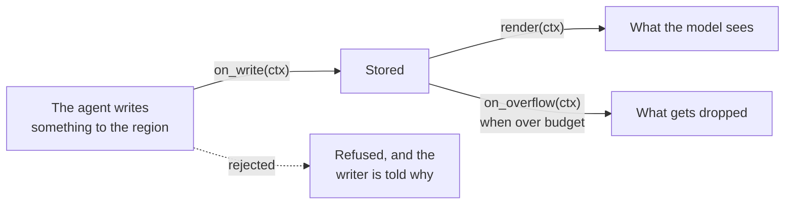

# Custom context regions

A [context region](/docs/context) normally picks one of seven built-in behaviours: keep everything,
keep the newest, summarize, drop it all, and so on. Sometimes none of those is what you want. Maybe
entries should be scored and the weakest dropped, or the region should render as a table rather than
a list.

Setting `kind = "custom"` hands that one region to a Rhai script. The script answers three
questions, and nothing else changes:



| Hook | Answers |
|---|---|
| `render` | What does this region look like in the model's context? |
| `on_write` | What happens to each incoming entry: keep it, reshape it, or refuse it? |
| `on_overflow` | What goes when the region is over budget? |

Only `render` is required.

## Declaring one

```toml
[context.regions.brain]
kind       = "custom"
script     = "context_hooks/brain.rhai"   # required, relative to the agent dir
persistent = false                        # optional, default false
budget     = "40%"                        # budgets work exactly as on built-ins
min_tokens = 10000
```

`script` resolves relative to the directory holding `agent.leviath`, so it travels with the agent
through `lev add` and through bundles.

`persistent` decides how the region behaves under budget pressure:

| Value | Behaves like | What it means for your script |
|---|---|---|
| `false` (default) | `temporary` | The region can be evicted, but `on_overflow` gets first say |
| `true` | `pinned` | Never evicted, fixed budget. Its rendered output is treated as cacheable across turns, since it does not change |

Percentage budgets are worked out at spawn against the stage model's window, and your script sees
the resulting absolute number in `ctx.region.budget`, not the percentage.

Per-stage layouts (`[stages.<name>.context.regions.<region>]`) can declare custom regions too.

The script is read and compile-checked **once, at spawn**. A missing or broken file, or one without
`fn render(ctx)`, is a hard spawn error that `lev validate` also reports. Editing the script takes
effect on the next run.

## The three hooks

All three receive one `ctx` argument. Rhai passes arguments by value, so mutating `ctx` does nothing.
Each hook **returns** its result.

`render(ctx)` is **required**. It runs on every inference (even when the region is empty, so a script
can emit static scaffolding). `ctx`:

```jsonc
{
  "region":  { "name": "brain", "budget": 80000, "current_tokens": 1234, "entry_count": 7 },
  "entries": [ {
      "content": "...", "tokens": 12, "timestamp": 1710000000, "key": null,
      // every part of the entry, in order: inline text carries `text`, a stored
      // part carries `sha256`, `size`, `width`, `height`, `tokens`, `stand_in`
      "parts": [ { "mime_type": "text/plain", "text": "..." },
                 { "mime_type": "image/png", "name": "hero.png", "sha256": "...", "size": 9012 } ],
      "kind": "text" | "user_message" | "assistant_turn" | "tool_result",
      // assistant_turn only:
      "tool_calls": [ { "id": "...", "name": "...", "arguments": { } } ],
      // tool_result only:
      "tool_call_id": "...", "tool_name": "...", "is_error": false
  } ],
  "stage_name": "plan", "stage_iterations": 2, "model": "claude-...",
  "window": { "total_tokens": 9000, "max_tokens": 200000 }
}
```

`render` returns either a string (one system block, empty string means nothing) or a map with
`system` (a string or an array of strings) and `messages` (typed `role`/`content` entries, optionally
carrying `tool_calls` or `tool_results`).

`content` is always the entry's text rendering, a stored part appearing in it as its stand-in, so a
script that only ever reads `content` keeps working when images arrive. `parts` is there for a
render that wants to count them, group them, or drop the bulky ones from what it emits. What a
script emits is text; a stored part reaches the model through the region's own entries, not through
`render`'s output. See [Typed mime](/docs/mime) for what a part is and how a stored one reaches a
model.

Providers reject a request where a tool call has no matching result, or the other way round. Leviath
strips any unpaired tool block before sending, so a script with a bug in it cannot produce a request
the provider will refuse.

Emitted messages render **in front of the live conversation**, wherever the region is declared. A
model reads the end of its input as "now", and for an agent that is the dialogue it is having, so
the conversation always ends the request. Declaring a region after the conversation to append a
trailing reminder does not work; use a [nudge](/docs/stages) for that.

`on_write(ctx)` is **optional**. It sees each entry headed into the region, with
`ctx = { region, entry: { content, kind, tokens, key } }` (`key` is `()` unless the write named
one). Return:

| Return | Meaning |
|---|---|
| a string | Accept, replacing the content (tokens re-estimated, kind preserved) |
| `true` or `()` | Accept unchanged |
| `false` | Reject, with no reason given |
| `#{ action: "reject", reason: "..." }` | Reject, and tell the writer why |
| `#{ content: "...", key: "..." }` | Accept; both fields optional (`action: "accept"` implied). `content` replaces the text, `key` stores the entry under a different key than the write named |

The map vocabulary here is `accept` and `reject`, nothing else. It is deliberately narrower than
the [stage hook](/docs/rhai-hooks) one: a region hook has no `allow`, `retry`, `cancel`, or
`modify`, and an unknown action is a malformed map, which **accepts the entry unchanged** with a
warning. So `#{ action: "cancel" }` does not refuse anything; write `#{ action: "reject" }` when
you mean no.

> [!IMPORTANT]
> `false` changed meaning. Earlier releases treated it as a silent drop that still reported
> success to the writer. Now a write from the model gets a tool error carrying the refusal, and a
> framework write (an assistant turn, a delivered message, a nudge) is stored unchanged with a
> warning. A script that used `false` to filter framework writes out of the region should do that
> filtering in `render` or `on_overflow` instead.

What a rejection does depends on who is writing. When the model writes through `context_write` or
`context_append`, or a tool result is routed into the region, the tool result reports the refusal
and its reason instead of claiming success, and nothing is stored. When the framework writes (an
assistant turn, a delivered message, a system nudge), the entry is stored unchanged and a warning
is logged: a script cannot delete the conversation record.

### Keyed writes render as an upsert

When several stored entries share a key, `render` sees only the newest one for that key; unkeyed
entries always appear, in order. Combined with `context_write`'s `key` argument (or a `key`
override from `on_write`), repeated writes to one key give the model an upserted view without any
hashmap plumbing in your script. The shadowed entries stay in the store, though: they keep holding
budget until `on_overflow` or `context_delete` removes them, and `on_overflow` always sees the
whole unfiltered store so its indices stay honest.

`on_overflow(ctx)` is **optional**. It runs when the region must shrink, with
`ctx = { region, entries, needed_tokens }`. Return an array of entry indices to drop. If the hook is
absent, or your drops do not free enough, oldest-first eviction makes up the difference.

## A complete region

This region keeps a running "brain", drops noisy successful tool results on write, and under budget
pressure evicts successes before errors. It renders everything as one XML user message (the
[12-Factor Agents](https://github.com/humanlayer/12-factor-agents) "own your context window"
pattern).

```rhai
// context_hooks/brain.rhai

fn render(ctx) {
    let xml = "<context>";
    for entry in ctx.entries {
        xml += `<event kind="${entry.kind}">${entry.content}</event>`;
    }
    xml += "</context>";
    #{ messages: [ #{ role: "user", content: xml } ] }
}

fn on_write(ctx) {
    // Keep tool errors verbatim; trim chatty successes to their first line.
    let entry = ctx.entry;
    if entry.kind == "tool_result" && !entry.content.contains("ERROR") {
        let head = entry.content.split("\n")[0];
        return head;                 // replace content (kind preserved)
    }
    ()                               // accept everything else unchanged
}

fn on_overflow(ctx) {
    // Drop successes first; oldest-first eviction covers any shortfall.
    let drops = [];
    for (entry, i) in ctx.entries {
        if !entry.content.contains("ERROR") { drops.push(i); }
    }
    drops
}
```

## Failure semantics

Load-time problems fail fast. Runtime problems never break an inference:

| Failure | Behavior |
|---|---|
| Script missing, does not compile, or has no `fn render(ctx)` | **Hard spawn error**, also caught by `lev validate` |
| `render` errors or returns an invalid shape | Warning, and the region renders as a plain `[name]:` block |
| `on_write` errors, or returns an invalid type or a malformed map | Warning, and the entry is accepted unchanged. A typo'd map must not read as a different instruction |
| `on_write` rejects an agent write | The tool result carries the refusal and the reason; nothing is stored |
| `on_write` rejects a framework write | Warning, and the entry is stored unchanged. Earlier releases treated `false` as a silent drop that still reported success; that no longer happens |
| `on_overflow` errors or returns invalid indices | Warning, and oldest-first eviction runs |
| Rendered output exceeds the region's budget | Warning only, and it is sent anyway. The [context-window guard](/docs/context#requests-are-measured-before-they-are-sent) refuses it only if the whole request would overflow the model |

> [!NOTE]
> Region hooks run in the pure-data sandbox: no filesystem, no network, no host I/O functions. They
> transform the `ctx` they are given and return a value.

## Recreating the built-ins

The point of the escape hatch is that you could write the built-ins yourself, and mostly you can:

- **pinned**: `persistent = true` with a render that joins entries. Exact.
- **temporary** and **clearable**: the defaults plus a `[name]:`-style render. Exact.
- **sliding_window**: `on_overflow` implementing your retention window, with a render emitting
  typed messages. Exact, and the reason typed message emission exists.
- **compacting**: approximable with deterministic condensing in `on_overflow`. The LLM
  summarization lane is not script-accessible.
- **hashmap**: close. Keyed writes plus last-wins rendering give the model the same upserted view,
  and `on_write` can normalize keys on the way in. The difference is in the store: a real `hashmap`
  region replaces the old entry and frees its tokens immediately, while a custom region only
  shadows it at render time until eviction or an explicit release catches up.

## Previewing

`lev test` assembles the context with your hooks active and real stage metadata, so you can see
exactly what the provider would receive before a live run. `lev validate` checks that the script
parses and defines `render`.

## Known limits

- Stage-instruction injection targets the first `pinned` region, never a custom one, and
  `[context.file_tracking]` requires a `hashmap` region.
- The per-render cache hint is fixed by `persistent` (always, versus until-changed). `render`
  cannot override it per call.
- Reordering or reshaping content between inferences can cost you provider prompt-cache hits. The
  script owns that tradeoff.
- Entries shadowed by a newer write to the same key still hold their tokens until eviction or an
  explicit `context_delete` releases them. A region rewritten under one key every turn should pair
  the pattern with an `on_overflow` that drops the shadowed copies first.

See [Context](/docs/context) for how regions, budgets, and cache hints fit together.
