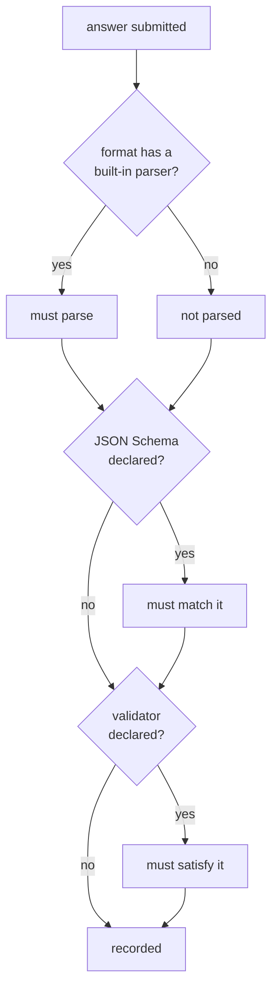

# Rhai output validators

Leviath checks that an answer parses when it recognises the format, and checks its shape when you
supply a JSON Schema. Neither helps with a format it has never heard of. If your agent produces
[a2ui](https://a2ui.org/), a house report layout, or a dialect of CSV nobody else uses, nothing knows
what a good answer looks like.

So write it down. A `.rhai` file beside your blueprint says what valid means. A bad answer then goes
back to the agent to fix, instead of reaching whoever asked.

## Write one

```rhai
// validators/a2ui.rhai
fn validate(content) {
    let doc = parse_json(content);
    if doc.root == () {
        return "an a2ui document needs a `root` node";
    }
    if doc.root.component == () {
        return "the `root` node needs a `component`";
    }
    ()   // fine
}
```

Point your blueprint at it:

```toml
[stages.present.output]
format = "a2ui"
validator = "validators/a2ui.rhai"
```

The path is relative to the blueprint directory, so the validator travels with the agent that needs
it.

## The contract

One function, `validate(content)`, taking the submitted answer as a string.

| Return | Meaning |
|---|---|
| `()` | The answer is fine |
| `""` | Also fine. Easy to write by accident, so it is not treated as a complaint |
| a string | The answer is wrong, for this reason |

The string goes back to the agent as an error and it tries again, exactly as a failed JSON Schema
does. So write the reason for the agent, not for yourself: say what is missing and where.

## What it runs on

The same hardened engine every Leviath script gets. No filesystem, no network, no `eval`, and an
operation budget so a runaway script stops instead of hanging the run. You get the
[standard helpers](/docs/scripting), including `parse_json`.

## When the validator itself fails

A validator can also fail to run at all: it throws, runs past its operation budget, or returns
something that is neither `()` nor a string.

By default the submission is **rejected**, and the script's own error goes back to the agent as the
reason. A throw is often the check working: a validator that calls `parse_json` on malformed output
throws, and "malformed JSON" is something the agent can fix on its next try. The alternative, and
the old behaviour, was to accept the answer unchecked, which shipped exactly the submissions the
validator existed to catch.

If you would rather end the run with an unchecked answer than risk ending it with none, say so:

```toml
[stages.present.output]
format = "a2ui"
validator = "validators/a2ui.rhai"
on_validator_error = "accept"
```

With `accept`, a validator that cannot run records the submission as if no validator were declared.
Choose it when any answer beats no answer, and be aware of what you are trading. Under the default,
a genuine script bug reads as "this answer is wrong" on every retry. The agent can burn its whole
budget against a check that can never pass.

The setting works at both levels, `[agent.output]`
and `[stages.<name>.output]`, and the stage's value wins. Anything other than `reject` or `accept`
refuses to load.

The setting governs validators only. A declared JSON `schema` that fails to compile keeps its old
fail-open behaviour: the check is skipped and the submission recorded unchecked, so one bad schema
cannot make a run unable to finish.

In both modes the run flags the script:

| Surface | What you see |
|---|---|
| `lev ps` | `complete (broken script)` on the run's status |
| `lev dash` | `⚠ 1 broken script` in the run's detail header |
| `meta.json`, the API | `flags.broken_scripts`, naming each script |

Named rather than counted, because the useful question is which one. It is recorded once per
script however many times the stage submits, since a validator that throws throws every time.

Under `accept` the flag is the only trace: the run completes, reports success, and an answer nobody
checked looks exactly like an answer that passed. Check it before trusting those runs.

`lev validate` compiles the machine's global tools and script providers as well as the blueprint's
own, so a script that will not load is something you can find before a run needs it.

## When it runs

Only when the format it was written for is the one in effect.

A validator describes one format. If a caller overrides the format at launch, your validator is
retired along with any JSON Schema, because neither describes what is now being produced. The
caller can bring a JSON Schema of their own (`--output-schema`, or `output_schema` on the API). A
replacement validator is the one check no request can supply, so a reshaped run keeps only whatever
schema came with it.



## Failing early

A validator is compiled when the agent spawns, not when it is first used. A missing file, a syntax
error, or a `validate` with the wrong number of parameters stops the run before any tokens are spent.

This is deliberate. The only other time the script gets read is at the end of the run. That is the
worst possible moment to learn the agent cannot hand back its work.

`lev validate <path>` compiles them too, so you can check without starting anything.
