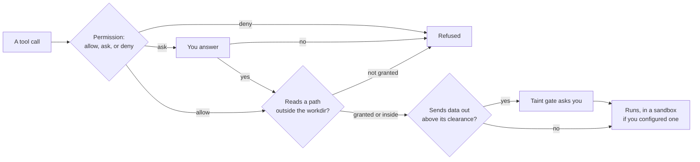
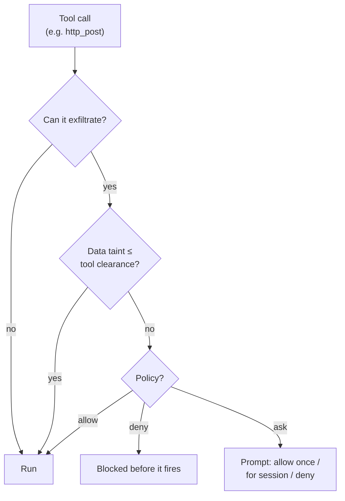

# Security: sandboxed execution and taint tracking

An agent runs shell commands and edits files. By default it does that directly on your machine, as
you, with your permissions. That is the right default for an agent working on your own project in a
directory you chose, and the wrong one for a blueprint somebody sent you.

Leviath gives you three separate controls, and you can use as few or as many as you need:

| Control | Question it answers | Section |
|---|---|---|
| Sandboxing | Where do commands run? | [Sandboxes](#sandboxes) |
| Read paths | Which files can it see? | [Reading outside the workdir](#reading-outside-the-workdir) |
| Taint tracking | Can it send what it read somewhere? | [Taint tracking](#taint-tracking-experimental) |



Tool permissions are a fourth, and they live in [Built-in tools](/docs/tools). Where API keys are
stored is `[security] credential_store` in [Configuration](/docs/configuration#security).

All of it is opt-in, and an installed blueprint can tighten these settings but never loosen them.
The one narrow exception: a blueprint may pre-allow `web_search` and `web_fetch` when you have not
configured those tools yourself.

## Sandboxes

A survey of the stronger isolation options (microVMs, gVisor, V8 isolates) and
why shared-kernel containers are not a boundary for untrusted code lives in the
repository at `docs/design/sandboxing-approaches.md`; the section below is what
Leviath ships today.

```toml
[sandbox]
kind    = "container"     # "container" | "namespace" | "none"
engine  = "docker"        # docker | podman | any Docker-CLI-compatible
image   = "debian:bookworm-slim"
network = false

[stages.analyze.sandbox]  # per-stage override
kind = "none"             # run discovery on the host…
```

> [!IMPORTANT]
> **Today the sandbox covers what the agent executes**, and that scope is being widened. Read this
> before you rely on it.
>
> Inside the boundary: the `shell` tool, a blueprint's seed commands, and a Rhai script tool's
> `shell()` calls. Outside it: file tools, which stay on the host and rely on workdir
> [path confinement](#reading-outside-the-workdir) instead. Also outside are `web_fetch`,
> `web_search`, and a script's HTTP functions, which use the host network, so `network = false`
> fences the sandboxed commands and not those tools.
> [MCP servers](/docs/mcp) are host processes shared across agents,
> so they sit outside too.
>
> Covering every side effect, and letting a single run opt into a sandbox, is
> [issue #326](https://github.com/GEMISIS/leviath/issues/326) and the intended end state. Until it
> lands, run the whole daemon in a container when you want a blanket boundary.

The sandbox bind-mounts the run's workdir, so sandboxed commands and host-side file tools see the
same files.

A `[sandbox]` table, at the agent or the stage level, accepts only the keys shown here (`kind`,
`image`, `engine`, `network`, `mount` or `mounts`, `persist`, `on_unavailable`). Anything else
fails the load and the error names it, so a misspelled `netwrok = false` cannot leave the sandbox
looser than the file reads.

**Containers**, using Docker or Podman, give you the real thing. The daemon keeps a warm container
per sandbox configuration, so stages with identical settings share one, and tears them down when
the agent finishes. Inside it, every Linux capability is dropped and the process cannot regain
privileges, and both process count and memory are capped.

**Namespaces** (Linux only) are lighter and need no container runtime. They isolate process IDs,
and with `network = false` they cut off connectivity. They do *not* isolate the filesystem, which
is the important limitation: a namespace shares the host's. Use one when you want cheap process
and network isolation, and a container when you want the agent's commands genuinely fenced off.

When the configured mechanism is unavailable, a `namespace` off Linux or a `container` with no
engine on `PATH`, the agent **fails to spawn** with a clear error. That is
`on_unavailable = "error"`, the default; set `on_unavailable = "warn"` to log and fall back to the
host instead.

> [!IMPORTANT]
> An *installed* agent can never weaken the sandbox you configured. It may pick a stricter kind,
> never a looser one, and its own `engine` choice is always discarded, because the engine binary
> runs on the host at spawn, before any prompt. With no `[sandbox]` of your own, a blueprint may
> still opt in with its own image and mounts, so read a downloaded agent's sandbox block rather
> than assuming it.

## Reading outside the workdir

An agent's file tools are confined to its workdir. Some agents legitimately need to see more:
a planner that reads run archives, a reviewer that reads design docs kept next to the repo. For
that, a blueprint can declare extra read paths:

```toml
[read_paths]
allow = [
    "~/.leviath/runs",          # an exact path grants its whole subtree
    "../shared-docs",           # relative entries resolve against the run's workdir
    "glob:~/design-docs/**",    # glob patterns; * stays in one component, ** crosses
    "regex:/data/archives/.*",  # regex patterns, auto-anchored (^...$)
]
```

Declaring is not granting. The blueprint travels with the agent package, and a package can only
tighten what your config allows. Declared paths stay inert until your `config.toml` grants them:

```toml
# Grant specific paths, for one agent...
[agent_read_paths.cto]
allow = ["~/.leviath/runs", "glob:~/design-docs/**"]

# ...or machine-wide, for any agent that declares them:
[security]
read_paths = ["~/.leviath/runs"]

# Or trust every blueprint's declarations wholesale (off by default):
[security]
allow_blueprint_read_paths = true
```

A grant applies to a path only when the running blueprint also declares it, so listing a
directory in your config does not open it to agents that never asked. When an agent declares
paths nothing grants, it still runs; the reads are refused.

Every surface says which side of that line an agent is on, so a missing grant turns up before a
run does:

```console
$ lev validate cto
✓ Blueprint 'cto' is valid.
  3 stages, version 1.0.0
  WARN your config does not grant glob:~/design-docs/**: reads matching them will be refused [read-paths-not-granted]
       add to your config.toml: [agent_read_paths.cto] allow = ["glob:~/design-docs/**"]
  NOTE declares [read_paths] (reads outside the run workdir): 2 declared, 1 granted [read-paths-declared]
       ~/.leviath/runs: granted; glob:~/design-docs/**: NOT granted
```

Four other commands surface the same thing, so this is hard to miss:

| Command | Shows |
|---|---|
| `lev list` | The same granted-over-declared counts under each agent |
| `lev add` | The status of what you just installed |
| `lev run` | Warns in the daemon log when an agent declares reads and your config grants none |
| `lev ps` | A `READS` column, granted over declared. `0/2` means every read outside the workdir will be refused |

Those checks compare patterns, not paths on disk, so treat them as the first answer rather than the
last: an individual read is still matched against the real, symlink-resolved path at run time.

You do not need to restart the daemon after editing the grant: it reloads `config.toml` on
change, so the **next `lev run` picks up the new grant automatically** (see
[the daemon docs](/docs/daemon#config-changes-take-effect-on-the-next-run)). The run that was
refused picks it up too, once you `lev resume` it, so a long run does not have to be thrown away
over a path you had not granted yet.

The rules that keep this safe:

- **Read-only.** Only `read_file`, `read_files`, and `list_dir` can leave the workdir.
  `write_file` and `edit_file` are confined to the workdir no matter what is granted.
- **Symlinks cannot widen a grant.** Every access is resolved to its real path first, and the
  real path must match a declared and granted entry. A symlink planted inside a granted
  directory that points at `~/.ssh` is refused.
- **Patterns match the real path**, written with `/` on every OS (on Windows, matching is
  case-insensitive and the `\\?\` prefix is handled for you). On macOS note that `/tmp` is
  really `/private/tmp`; `~/` entries avoid the problem since the home directory is stable.
- **Regexes are anchored and absolute.** `regex:/data/runs` matches exactly that path, not
  `/data/runs-anything`; end a pattern with `/.*` to grant a subtree. A pattern must start with
  `/`, a drive letter, or `~/`, so a catch-all like `regex:.*` is refused when the blueprint is
  parsed. Use `glob:` for anything relative to the workdir.
- **Globs cannot contain `.` or `..`**, except in a relative entry's leading run, which is folded
  into the workdir when the pattern is compiled.
- **Taint rises.** When a grant is active, the read tools are classified `Private` for that
  agent, so taint tracking treats out-of-workdir content with more suspicion, not less.
- **Seeds answer to the same fence.** A `seed = { files = [...] }`, `glob` or `rhai` path that
  resolves outside the workdir is refused at spawn unless a declared and granted `[read_paths]`
  entry covers it, on the same reasoning as `read_file`: the blueprint chose that path, not you.
  A `blueprint:`-prefixed seed reads only from the blueprint's own directory, and no grant can
  let it out - a blueprint does not ship files outside itself.
- Rhai script tools have their own `read_file` and it stays workdir-confined; among the tools,
  `[read_paths]` applies to the built-in file tools only.

Pick the run's workdir itself with `lev run <agent> --workdir <dir>` (defaults to the directory
you ran the command from).

## Taint tracking (experimental)

Sandboxes and read paths control what an agent can *reach*. Taint tracking controls what it can do
with what it found.

Every [context region](/docs/context) carries a sensitivity label: **Public**, **Internal**, or
**Private**, in that order of increasing sensitivity. The runtime assigns it. Model output never
can, which matters, because otherwise an agent could relabel its own data.

Every tool that could send bytes off the machine has a **clearance**, the highest sensitivity it is
trusted with. Before such a tool runs, Leviath compares the two. If the data is more sensitive than
the tool's clearance, your policy decides what happens next.



Taint recovers as entries evict, and an unrecognized tool **fails closed**: an MCP or script tool
with no classification of its own is treated as outbound and gated. Every built-in tool carries its
own classification, so only the ones that can carry bytes out (`shell`, `web_search`, `web_fetch`,
the HTTP tools, and `submit_output`) are ever gated; the file, context, todo, sub-agent and
interaction tools are not. `submit_output` is on that list because the final output counts as
leaving the machine: `lev serve` hands it to whoever reads `GET /api/agents/{id}/result` and the
dashboard shows it, so a Private region in a submitted answer raises the same prompt a `shell`
call would. Configure with a `[security]` block, layer on allowlists and Rhai policy rules, and
dry-run any tool:

```bash
lev policy list
lev policy add send_email --target "*.example.com" --max-sensitivity internal
lev policy test bash --target example.com
```

`lev policy add` and `lev policy test` take the tool name as a **positional** argument
(`lev policy add <tool> …`, `lev policy test <tool> --target …`).

### When there is nobody to ask

The prompt above assumes a person. Most runs do not have one, and the gate does not answer the same
way in each case. What actually happens, measured against a real daemon with a granted `[read_paths]`
read (which is Private) flowing into `submit_output` and into `shell`:

| The run | What the gate does | Does the private data leave? |
| --- | --- | --- |
| Attended, through `lev serve` or the dashboard | Raises the leak prompt and parks the run in `waiting_input` | Only if you pick **Allow once** or **Allow for this session** |
| `--yolo`, or the dashboard's unattended toggle | Waives enforcement and lets the call through, with no prompt | **Yes** |
| `--yolo`, and the run calls `install_tool` | Installs the script into `~/.leviath/tools/` without a prompt; the file is stamped with the run's workdir and time as its provenance. `install_tool` is the audited path, not the only one: a shell redirect outside the workdir is refused, but a run with `shell` and no `[sandbox]` can still copy a file into that directory, and `lev tools` shows such a file as having no provenance line | Not by itself, but the code runs on every later run that advertises it. See [Rhai tools](/docs/rhai-tools#installing-a-tool-from-a-run) |
| A tool set to `allow` in `[tool_permissions]` | Still prompts. Granting a tool is not granting the data | Only if you allow it |
| An embedded host with no interaction hub wired | Blocks the call outright and hands the model `[blocked]` | No |
| A prompt nobody answers before `[limits] interaction_timeout_secs` | Resolves as a deny once the deadline passes | No |
| The same with no `interaction_timeout_secs` set, which is the default | Waits indefinitely; the run stays in `waiting_input` | No |

`--yolo` is the row to read twice. It means "run unattended", and the gate's prompt is one of the
things it stops raising, so an unattended run over private data hands that data to whatever its
outbound tools reach, `GET /api/agents/{id}/result` included. Nothing is hidden: the gate is still
evaluated, and the waived block is written to the run's `stages/<n>/taint_audit.json` with
`decision_source: "YoloAutoApprove"` beside the `AutoBlock` it overrode. That file is the record to
read after an unattended run, and `lev policy test` is how to find out beforehand what a given tool
would have done.

If you want an unattended run that cannot leak rather than one that reports having done so, keep the
sensitive paths out of it: drop the `[read_paths]` grant, or set the outbound tool to `deny` in
`[tool_permissions]`, which no launch flag lifts.

## Response size caps

The daemon stops reading a remote peer at a fixed size rather than buffering
whatever it sends. A provider's buffered JSON reply (and any error page it
quotes) is cut at **64 MiB**, one streamed frame or partial line on a
streaming reply is cut at **8 MiB**, and one line from an MCP stdio server is
cut at **1 MiB**. Past the cap the call fails with a message naming the cap
and the peer (`response body exceeded 64 MiB from api.openai.com`, or `line
exceeded 1 MiB from the MCP server`), and the connection is dropped so the
rest is never read. The same caps apply to MCP HTTP replies, their SSE
streams, and the OAuth exchanges behind `lev mcp login`. They are constants,
not configuration: every well-formed reply is far below them, and a knob that
only matters under attack would be a knob for the attacker.

The update check (`lev update` and the daemon's cached `GET /api/update`)
reads the GitHub releases answer under the same 64 MiB cap and reports the
same message. One remote read stays bounded a different way: a Rhai script's
`http_get` refuses a body whose `Content-Length` is over its 900 KB output
cap before reading it, but a chunked response carries no length, so a body
that lies about its size is buffered until the client's 30 s timeout or the
peer's end of stream, then cut to 900 KB. Closing that needs a streaming
decoder that keeps the charset handling scripts rely on, and it is a known
residual rather than an oversight.

## Threat model

`lev serve` runs LLM-driven tools, so treat it as trusted-network only unless hardened. See
[SECURITY.md](https://github.com/GEMISIS/leviath/blob/main/SECURITY.md) for the full threat
model, what Leviath defends against, and how to report a vulnerability (GitHub private advisories).

