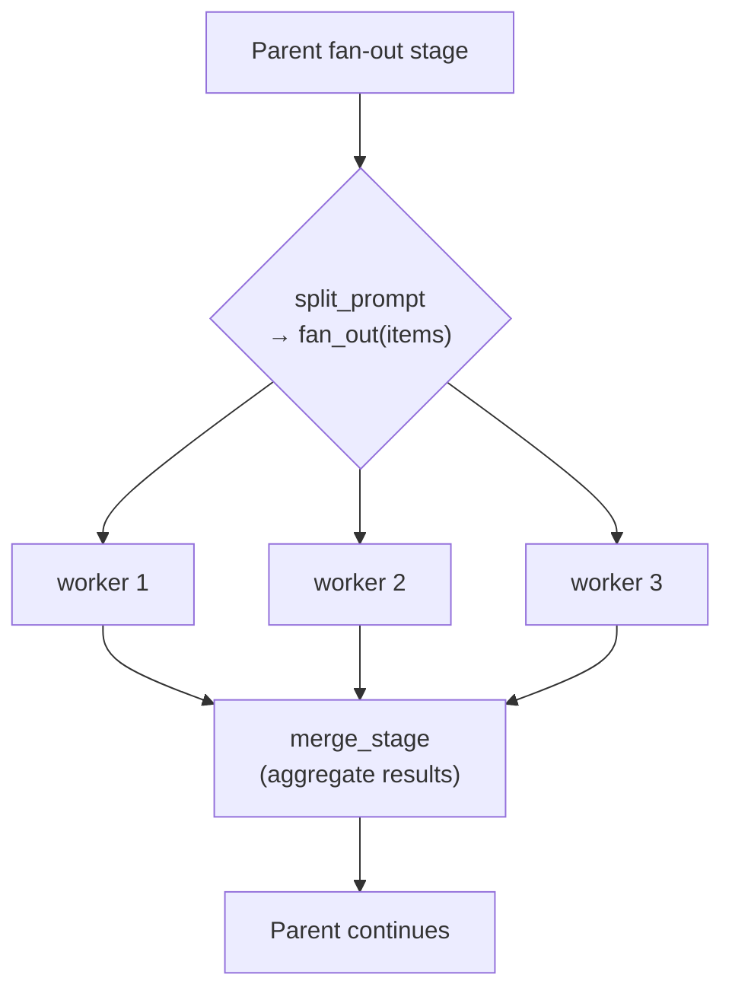
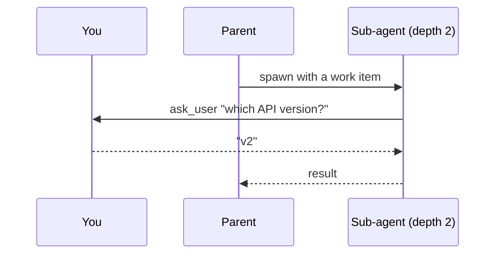

# Sub-agents and fan-out

Some jobs are really many small jobs. Twelve failing tests, forty files to review, eight sub-topics
to research. One agent working through them in sequence is slow, and by item nine its context is
full of items one through eight.

A **sub-agent** is a child agent started by another one. Give each item its own sub-agent and they
run at the same time, each with a clean context, and the parent gets the results back.

Six bundled agents work this way: `data-analyst` gathers one slice of a subject per worker,
`reviewer` takes a file or hunk group each, `log-analyzer` a log file or time window,
`orchestrator` hands each work item to a whole `coder` run, and `deep-researcher` and
`wide-researcher` hand each sub-question to a whole `researcher` run. See the
[agent catalog](/docs/agent-catalog) for all six.

Sub-agents cost very little here. They are more entities in the same [world](/docs/engine), so there
are no extra processes to start and nothing has to be serialized between a parent and its children.


> [!NOTE]
> A fan-out is where most of a run's money goes: in one measured research run, 34 second-generation
> workers accounted for $198 of a $236 total while the top-level agent cost $15. See
> [managing your costs](/docs/costs) for the knobs that bound it.

## Two tools, one for each shape of the job

| Want | Tool | What you get back |
|---|---|---|
| One sub-agent | [`spawn_agent`](#one-sub-agent) | Its answer, or its id if you did not wait |
| Many at once | [`fan_out`](#fan-out) | One merged report covering all of them |

Both are ordinary tools: a stage grants them in `available_tools` and the agent calls them when it
decides it needs help. `fan_out` is also what a `mode = "fan_out"` stage runs, which is covered
below - the stage is sugar over the same tool, not a separate mechanism.

## One sub-agent

```jsonc
spawn_agent({
  "blueprint": "researcher",
  "task": "What does the FLOW trial say about kidney outcomes?",
  "wait": true            // block until it finishes and return its answer
})
```

With `wait: false` you get the child's id straight back and check on it yourself with
`check_agent`, or block later with `wait_for_agent`. `send_to_agent` passes it a message mid-run and
`kill_agent` stops it.

Waiting does not hold a slot on the tool lane, so a parent waiting on a child cannot starve the
child of the capacity it needs to finish.

`seed_context` injects starting material into the child's first pinned region, and
`output_format` / `output_instructions` ask it for a particular shape of answer, overriding its
blueprint's. Override with care: an `output_format` that differs from what the child's blueprint
declares retires any Rhai validator and JSON schema it declared, since a check written for one
shape cannot judge another, and the only warning goes to the daemon log.

## Fan-out

```jsonc
fan_out({
  "agent": "researcher",
  "items": [
    {"id": "half-life",      "context": {"question": "How long does semaglutide stay active?"}},
    {"id": "after-stopping", "context": {"question": "What happens when someone stops?"}}
  ]
})
```

Every item starts one worker, they all run at once, and the call returns a single report covering
all of them. Three things are worth knowing:

**Each item's `context` is everything its worker gets.** A worker is a separate agent with a clean
context window and never sees the caller's conversation, so a reference to "the topic above"
reaches nobody.

**Put all the work in one call.** The engine paces the concurrency itself (`max_workers`, default
30), so a hundred items in one call is fine and a second call would only wait for the first. One
`fan_out` call per turn is the rule - it has to be the only tool call in its turn, because it waits
for its workers.

**An empty `items` array is a real answer.** It means there is nothing to hand out, and the run
moves on. That matters most in a stage a run enters more than once, where the honest answer the
second time is often that the work is already done.

The result is routed like any other tool result, so `[stages.<name>.tool_routing]` decides where it
lands - a region of its own, the conversation, or a cheap drop for a blueprint whose workers write
files and whose parent does not need their prose:

```toml
[stages.investigate.tool_routing.overrides]
fan_out = "sub_findings"
```

## The fan-out stage

`mode = "fan_out"` is a stage whose whole job is one `fan_out` call. It grants the tool
automatically, takes its worker and caps from the blueprint rather than from the call, and moves to
`merge_stage` once the workers are done:



Reach for the stage when the fan-out *is* a phase of the work and something specific should happen
after it. Reach for the bare tool when an agent needs helpers in the middle of doing something else,
and should carry on afterwards with what they found.

```toml
[stages.fix]
mode         = "fan_out"
worker_stage = "fix_one"    # which worker to run, see below
split_prompt = "..."        # tells the stage what to split the work into
merge_stage  = "verify"     # stage the parent resumes at once workers finish
max_workers  = 8            # how many run at once, default 30; 0 is unlimited
on_worker_failure = "continue"
max_attempts = 3            # times to ask again if it never calls fan_out
```

Those keys sit directly on the stage next to `mode = "fan_out"`, not in a sub-table.

| Key | Default | Meaning |
|---|---|---|
| `worker_agent` | unset | A separate installed blueprint to run as the worker |
| `worker_stage` | unset | A stage in *this* blueprint, which must set `allow_as_worker = true` |
| `worker_query` | unset | A hint matched against installed agent types |
| `merge_stage` | unset | Stage that reconciles worker results before the parent moves on |
| `results_region` | `conversation` | Where the consolidated worker report lands |
| `max_items` | unset | Most work items the split may produce. `0` or unset means however many it produces |
| `max_workers` | `30` | How many workers run at once. `0` means unlimited |
| `on_worker_failure` | `"continue"` | `continue` merges what succeeded. `fail_all` fails the whole fan-out if any worker fails |
| `split_prompt` | `""` | Added to the stage's system prompt. It says what to split the work into; the stage answers with a `fan_out` call |
| `max_attempts` | `3` | How many times the stage is asked again if it ends without calling `fan_out`. `0` lets it through on the first refusal |

Set exactly one of `worker_agent`, `worker_stage`, or `worker_query`. `lev validate` checks that,
and checks that a named `worker_stage` exists and has opted in with `allow_as_worker`.

### If the stage never fans out

The one thing a fan-out stage owes is a `fan_out` call. A model that answers in prose instead is
asked again - three times by default, or however many `max_attempts` says - and then let through. A
run is never stranded over a thing the model would not do. What it is not allowed to do is pass for
success: the stage's `splits_degraded` count goes up, a note goes into `error_report` so the merge
stage knows it is working from nothing, and `lev ps` renders the run as `complete (fan-out empty)`.

```toml
[stages.investigate]
max_attempts = 5   # a small local model may need more than a nudge
# max_attempts = 0 # or none at all, when an empty fan-out is an acceptable outcome
```

The budget is deliberately separate from `max_revisits`. Those answer different questions - "how
many times may the graph re-enter this stage" and "how many times do we ask a model that has not
done what the stage is for" - and each retry re-sends the whole stage context, so borrowing the
first for the second is how a routing setting quietly multiplies an inference bill.

`max_attempts` is also the *only* thing bounding those asks: **`max_iterations` does not apply to a
fan-out stage**. It once did, and the two budgets fought - a run that spent three of its four
iterations being asked, then called `fan_out` on the fourth, was already at its cap when the workers
came back, and thirteen minutes of finished research was discarded. Setting `max_iterations` on a
fan-out stage is harmless and does nothing.

That count is worth watching in a batch. A merge stage running on nothing and one running on a
genuinely empty fan-out look identical from the far side, and this is the only thing that tells
them apart.

### Entering the same stage twice

A stage a run comes back to is told so. On its second and later entries the split is given the
round number and the ids the previous round already handed out, and asked for only what is still
unanswered - with an empty `items` array available if that is nothing.

Without it the model sees a prompt it has already answered, over a context holding the findings it
answered with, and reasonably reports that the work is done. That is not a hypothetical: it is what
ended a `deep-researcher` run whose four workers had already finished.

### A worker that is a whole other agent

`worker_stage` keeps the work inside this blueprint. `worker_agent` hands each item to a separate
installed agent instead, which is worth doing when one already does the job:

```toml
[stages.investigate]
mode = "fan_out"
worker_agent = "researcher"    # every item is a full researcher run
merge_stage = "analyze"
max_workers = 30
```

That is what the bundled `deep-researcher` and `wide-researcher` do. The difference is not only who
does the work: a `worker_agent` worker is a run of its own, so it brings its own stages, its own
tools, and its own clean context window, rather than a share of the parent's.

It also brings its own ability to fan out. The bundled `researcher` grants the `fan_out` tool to its
gathering stage, so a worker that finds its slice is really several independent subjects hands them
out in parallel rather than working through them one at a time. `max_child_depth` bounds how far that
can go. Note the distinction: a `mode = "fan_out"` STAGE is only entered when the current stage ends,
which for a gathering stage means after the gathering is done, so a split meant to parallelise work
would arrive too late to save any. Granting the tool is what lets the decision happen while it still
matters.

A worker's bibliography merges back into its parent's `sources_index`, deduplicated by URL. Merged
entries name the worker they came from and carry no `[n]` marker, because numbering is per agent and
renumbering would repoint the citations already in the merged findings.

The cost is a dependency. The named blueprint has to be installed, and `lev validate` cannot check
that for you the way it checks a `worker_stage`, because what is installed is a property of the
machine rather than of the blueprint. A missing one fails per item, so with the default
`on_worker_failure = "continue"` the run reports it rather than dying. `lev setup` installs the
bundled agents together, so this only bites when an agent has been installed on its own.

## What a worker hands back

A worker contributes whatever it submitted through
[`submit_output`](/docs/outputs). That submission is what the merge stage reads.

A worker that submits nothing falls back to the text of its last message. That text is often empty,
because a worker whose final action was a tool call has no trailing prose. Set `require_output` on
the worker stage when the merge depends on its answer.

```toml
[stages.fix_worker]
mode = "autonomous"
available_tools = ["read_file", "edit_file", "shell", "submit_output"]
allow_as_worker = true
require_output = true
```

A worker that finishes without submitting is nudged and re-run a few times first. It never strands
the fan-out: after that the merge proceeds anyway, and the run records `output_forced`.

When it still hands back nothing, it is reported as a **failed** worker with the reason, rather than
as a success with an empty section:

```
[fan_out results: 7 succeeded, 3 failed]

## worker w4 FAILED
worker finished without the final output its stage requires
```

The merge stage can act on that. An empty section it cannot even see.

## Where the results land, and how they share the space

The merge stage reads one consolidated report holding every worker's answer. That report has to fit
a context region, so each worker gets an equal share of it.

Equal is the important word. Each worker's section is the region's budget divided by the number of
workers, so all of them appear. A section that had to be cut says so, and the worker's own run still
has the whole thing.

```toml
[stages.split]
mode = "fan_out"
worker_stage = "gather_worker"
merge_stage = "build"
results_region = "worker_rows"   # default: conversation
max_items = 12                   # default: however many the split produces
```

Name a `results_region` when the results are bulky. The default is `conversation`, which is also
carrying the message history, so a large report competes with the turns around it. A region of its
own has a budget of its own, and that budget is what the shares divide.

`max_items` caps how many work items the split may produce. This is not `max_workers`, which caps how
many run at the same time:

| | Caps | Why you set it |
|---|---|---|
| `max_workers` | How many run at once | Rate limits, machine load |
| `max_items` | How many exist at all | Cost, and each worker's share of the region |

Split a hundred ways and every worker gets a hundredth of the space. Past some point each section is
too small to be worth reading, and `max_items` is how you stop the split getting there. Without it,
whatever the split produces is what runs.

Both caps take `0` to mean no cap. `max_workers = 0` starts every work item the moment the split
has produced it; `max_items = 0` is the same as leaving the key out. A negative value, or a value
that is not a whole number, is a validation error rather than a quiet fallback, so a typo shows up
in `lev validate` and not as a fan-out wider than the manifest appeared to allow.

## `max_workers` is not the knob you might think

Four different settings limit concurrency, and they are easy to confuse. All four apply at once:

| Setting | Bounds | Scope |
|---|---|---|
| `max_workers` | Sub-agents this stage spawns | One fan-out stage |
| `[limits] max_concurrent_inferences` | Model requests in flight | Per model, daemon-wide |
| `[limits.max_concurrent_inferences_by_provider]` | Model requests in flight | Per provider, daemon-wide |
| `[rate_limits.<provider>]` | Requests per minute | Per provider |

So `max_workers = 30` (the default) starts up to thirty sub-agents, but if the model pool only allows
eight requests at once (also the default), the rest wait for a slot. That is fine and costs nothing;
it is also why an unlimited fan-out is safe to run. See
[inference pools](/docs/engine#inference-pools).

Both caps can be read and changed over the [HTTP API](/docs/api#fan-out-limits): the blueprint
detail route reports them resolved, and writing the manifest back is how they change.

## Any sub-agent can ask you a question

A sub-agent at any depth can ask *you* something directly. It does not have to route the question
back up through its parent, and nothing is fire-and-forget:



See [Human-in-the-loop](/docs/interaction) for how the question reaches you and how you answer it.

> [!TIP]
> The [dashboard](/docs/dashboard) and the API's `GET /api/agents/tree` show the whole sub-agent
> tree with token totals per subtree, so you can see where the budget is actually going.
