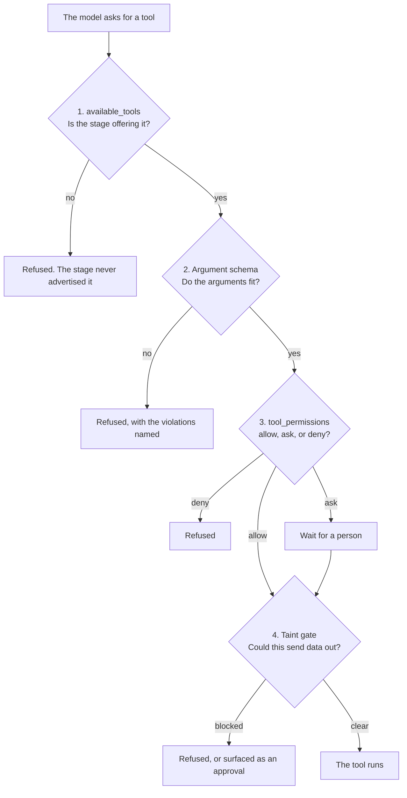

# Built-in tools

Every [agent](/docs/agents) advertises a set of tools to its LLM. The runtime ships a fixed catalog
of **built-in tools** (file access, a shell, context memory, human-in-the-loop prompts, review
surfaces, and sub-agent management) that need no configuration to exist. A [stage](/docs/stages)
decides which of them the model may actually call via `available_tools`, and `tool_permissions`
gates each call at `allow` / `ask` / `deny`.

For tools beyond this catalog you have two options: connect an [MCP server](/docs/mcp), or write
your own with [Rhai scripting](/docs/scripting).

## Files

Read and modify files relative to the agent's working directory.

| Tool | Purpose | Arguments |
| --- | --- | --- |
| `read_file` | Read one file, up to 256 KiB, with a note when the content is truncated. | `path` |
| `read_files` | Read several files in one call, separated by path headers. | `paths` (array) |
| `write_file` | Write content to a file, creating parent directories as needed. | `path`, `content` |
| `edit_file` | Replace an exact string that occurs exactly once in a file. | `path`, `old_str`, `new_str` |
| `list_dir` | List a directory's contents. | `path` (optional; defaults to the working root) |
| `install_tool` | Compile a Rhai tool script and install it into `~/.leviath/tools/`, where every future run on the machine can call it. Refuses a script that does not compile, lacks `// @tool` or `// @description`, or takes an existing tool's name. See [installing a tool from a run](/docs/rhai-tools#installing-a-tool-from-a-run). | `name`, `source`, `overwrite` (optional, default false) |

> [!TIP]
> `read_files` is cheaper than repeated `read_file` calls; reach for it after `list_dir` when you
> already know several paths you need.

## Shell

| Tool | Purpose | Arguments |
| --- | --- | --- |
| `shell` | Run a shell command in the working directory, using the system shell. It has a 60-second timeout. | `command` |

`bash` is an accepted alias for `shell`: a stage's `available_tools` may name either, and both
resolve to the same tool advertised to the model.

### Which shell you get

Leviath resolves the shell per platform, and tells the model which one it resolved instead of
leaving it to guess:

| Platform | Shell |
| --- | --- |
| Windows | `cmd.exe /C` |
| Unix | `$SHELL` when it exists and is a `sh`/`bash`/`zsh`, else the first of `/bin/bash`, `/usr/bin/bash`, `/bin/zsh`, `/usr/bin/zsh`, `/bin/sh` |

The resolved shell is named in the `shell` tool's own description, so a model on Windows reads
`cmd.exe` rather than a list of every platform's shell. On top of that, a stage that advertises the
shell tool carries a short system block when the platform warrants one. Today only Windows does:
it says commands run through `cmd.exe` rather than a POSIX shell, and gives the PowerShell stand-ins
for `cat`, `grep`, `ls`, and `wc -l`. On Linux and macOS nothing is added.

Turn it off with `shell_hint = false`, globally in `config.toml` or per agent or stage in a
blueprint. See [Configuration](/docs/configuration#system-prompt-hints).

> [!NOTE]
> [Rhai tool scripts](/docs/rhai-tools) are a separate path: their `shell()` host function always
> uses `/bin/sh` on Unix, never `$SHELL`, because a script is authored once and runs everywhere.

> [!WARNING]
> `shell` requires the platform's process-spawn capability. On platforms that don't provide it, the
> tool (and its `bash` alias) is filtered out and never advertised.

### Where a redirect may write

`echo x > report.md` is a file write that no tool name describes, so it answers to the `write_file`
policy rather than the shell's alone. A denied `write_file` denies the redirect too, and no
`[safe_commands]` entry can pre-approve one.

It also answers to the same **workspace confinement**. A redirect whose target resolves outside the
working directory is refused, exactly as `write_file` refuses that path, and no flag lifts it -
`--yolo` included. That is deliberate: `--yolo` grants permission, and this is not a permission
question.

Discarded writes cost nothing. `2>/dev/null`, `> /dev/null 2>&1`, `&> /dev/null` and `> NUL` write
nowhere anyone can read back, so they are neither clamped nor confined.

Some targets the parser cannot name at all, such as `> $OUT` or bash's `/dev/tcp/host/port`. Those
have no path to check, so they are ungrantable: they prompt every time, and no approval makes them
reusable.

A line the parser cannot read as commands at all is different again. A backtick, an unterminated
quote or an unbalanced `$(` could put a redirect anywhere, so a line carrying one is refused
outright the moment it also carries a `>` - guessing where it writes is exactly what the fence
exists not to do. Rewrite the line without the construct, or use the `write_file` tool.

A **heredoc is read**, not refused: its body is standard input, so `python3 - <<'EOF' ... EOF`
runs with the whole script on stdin, and a `>` or a `->` inside that body is text rather than a
redirect. A real redirect beside the operator still counts - `cat <<EOF > report.md` writes
`report.md` and is confined to the workspace like any other. The two heredoc shapes that could
still hide a command keep the old refusal: a body that never reaches its delimiter, and an
**unquoted** heredoc (`<<EOF`, not `<<'EOF'`) whose body contains a `$(...)` or backtick the shell
would expand and run. Quoting the delimiter makes the body pure data. On Windows there are no
heredocs, so the construct stays unreadable there and is refused.

### How much output comes back

At most 1 MB of stdout and 1 MB of stderr per call. Past that the bytes are counted and dropped,
and the result ends with a `[truncated]` line naming how much the command actually wrote.

The command still runs to completion. Leviath keeps draining both pipes after the cap so the
command never blocks on a full one, which would turn a truncated answer into a timed-out call.

The cap is a memory bound, not a context bound. A megabyte of shell output already overruns any
region budget an agent has, so what survives this cap gets trimmed again by the region it lands in.
The cap exists because a command printing at local-pipe speed for its full 60 seconds is
gigabytes, and the daemon holds that output in memory.

## Context

Read and write the agent's own [context window](/docs/context): named sections the runtime folds
back into the system prompt on later turns.

| Tool | Purpose | Arguments |
| --- | --- | --- |
| `context_write` | Store or replace a keyed entry in a named section. | `region`, `content`, `key` (optional) |
| `context_append` | Add to a section without replacing existing content. | `region`, `content`, `key` (optional) |
| `context_read` | Read a section, or a specific keyed entry within it. | `region`, `key` (optional) |
| `context_delete` | Release an entry the agent is finished with, freeing its tokens. See [letting the agent decide what to forget](/docs/context#letting-the-agent-decide-what-to-forget). | `region`, and one of `key` / `index` / `oldest` |
| `context_list` | List sections with their token counts and entry counts. | `region` (optional) |
| `todo_add` | Add an open item to a [checklist region](/docs/context#tracking-work-with-a-checklist), returning its id. | `region`, `item` |
| `todo_done` | Tick a checklist item off. | `region`, `id` |
| `todo_note` | Record a note against an item without closing it. | `region`, `id`, `note` |

## Final output

One tool, for the answer the run hands back. See [Final outputs](/docs/outputs).

| Tool | Purpose | Arguments |
| --- | --- | --- |
| `submit_output` | Submit the run's final answer. Every surface reports it. | `content` |

Its description is built for the stage that offers it. If you declared a shape, the format, your
instructions, and your example appear in the description the model reads. That is how a format
Leviath has never heard of still gets produced.

`mode = "output"` grants this tool, so a stage using that mode does not list it.

## Human-in-the-loop

Pause the run and hand control to the user. Each of these blocks until the user responds.

| Tool | Purpose | Arguments |
| --- | --- | --- |
| `ask_user_text` | Ask a free-form question and wait for a written answer. | `prompt` |
| `ask_user_choice` | Ask the user to pick one option from a list. | `prompt`, `options` (array, at least two) |
| `ask_user_confirm` | Ask a yes/no question. | `prompt` |

## Review

Present work to the user for approval or direct editing.

| Tool | Purpose | Arguments |
| --- | --- | --- |
| `present_for_review` | Pause and display a markdown document (plan, design, report) for the user to read and approve. | `title`, `markdown` |
| `edit_document` | Show a document in an editable field pre-filled with its current text; the returned text is the user's authoritative edit. | `content`, `prompt` (optional) |

### These tools need someone there

Every tool in the two tables above does the same thing: it opens a prompt and waits. That is fine
when you are watching the run. When nobody is, the wait has no end. The agent sits in
`WaitingInput` until somebody answers or you cancel the run. It hands its
[tool-lane](/docs/engine#the-tool-lane) slot back while it waits, and a daemon restart does not free
it either: the open prompt is written to disk, and the run comes back still parked on it.

So an unattended run does not get them. A run launched with `--yolo` (and every sub-agent and
fan-out worker under it) has these five tools removed from the set advertised to the model, per
stage, before the first inference. The model never sees them and decides for itself instead.

A stage that genuinely needs a person can opt out, tool by tool:

```toml
[stages.plan]
available_tools = ["read_file", "ask_user_text", "ask_user_choice"]
# Kept even when the run is unattended.
required_tools = ["ask_user_text", "ask_user_choice"]
```

`required_tools` entries must also appear in `available_tools`. `lev validate` rejects a blueprint
where they do not. It also warns (`blocking-tool-in-autonomous-stage`) about an autonomous stage
that grants one of these tools without saying it meant to. Naming the tool in `required_tools`
settles that, and keeps the tool through an unattended run; `allow_blocking_tools = true` on the
stage settles the warning alone, for a stage that only ever runs attended.

The run then waits for a person however long it takes. Pair the opt-out with
[`interaction_timeout_secs`](/docs/configuration#limits) if a prompt nobody answers should release
the run instead.

## Sub-agents

Spawn and coordinate [child agents](/docs/sub-agents) from within a run. These are advertised to the
model but executed by the engine's tool registry, since they act on the shared agent world.

| Tool | Purpose | Arguments |
| --- | --- | --- |
| `spawn_agent` | Spawn a sub-agent from a blueprint; returns its ID (blocks and returns the result when `wait` is true). | `blueprint`, `task`, `wait` (default false), `seed_context` (optional), `max_child_depth` (optional), `output_format` (optional), `output_instructions` (optional) |
| `check_agent` | Non-blocking status check; returns the child's answer once it is done. | `agent_id` |
| `wait_for_agent` | Block until a sub-agent completes, then return its answer. | `agent_id` |
| `send_to_agent` | Send a message into a running sub-agent's context. | `agent_id`, `message`, `target_region` (optional; defaults to the conversation) |
| `kill_agent` | Kill a sub-agent and all its descendants. | `agent_id` |

A child reports whatever it submitted through [`submit_output`](/docs/outputs). A child that
submitted nothing says so, rather than returning an empty result. `output_format` asks the child for
a particular shape, overriding what its blueprint declares. A label that differs retires the
child's declared validator and schema, and the warning appears only in the daemon log.

## Environment

What time it is, what machine this is, and what the run itself is doing. A model has no way to
know any of it: its training data has a cutoff and your run does not, so an agent asked about
anything current will otherwise reason from whenever it was trained.

| Tool | Purpose | Arguments |
| --- | --- | --- |
| `current_time` | The date and time now, in UTC and local, with the IANA timezone, UTC offset, weekday, ISO week and unix epoch. | none |
| `system_info` | Operating system and version, architecture, CPU count, hostname, path separator, line ending, and free disk space in the working directory. | none |
| `locale_info` | The user's language and region as a BCP-47 tag, such as `en-US`. | none |
| `environment_info` | The working directory, the home, temporary, config and data directories, the entries on `PATH`, and the environment variables this agent may see. | none |
| `which_command` | Whether a program is installed and where, the way `which` or `where` would. Looks the name up on `PATH` without running it. | `command` |
| `runtime_info` | This run reporting on itself: agent, stage, iteration and limit, model and provider, context tokens spent, and whether anyone is available to answer a question. | none |

All six are read-only, take no action, and default to `allow`, so grounding a run in the present
costs no approval prompt.

> [!TIP]
> If an agent researches current events, cites release dates, or reasons about what is recent, give
> it `current_time` and say so in the stage prompt. A tool that is advertised but never called
> changes nothing.

> [!NOTE]
> `runtime_info` is the one to reach for before `ask_user_text`, `ask_user_choice`,
> `ask_user_confirm` or `present_for_review`. It reports whether the run is unattended, and an
> unattended run has nobody to answer those, so an agent that checks first can decide and record
> the assumption instead of waiting.

### What these tools do not reveal

`environment_info` reports environment variables through the same gate a Rhai `env_var` read
answers to. A credential-shaped name is listed under `withheld_variables` with its value omitted,
so an agent can tell `ANTHROPIC_API_KEY` is set without seeing it. Name it in
`[security] allow_env_vars` to hand the value over. See
[environment variables](/docs/configuration#environment-variables).

`system_info` reports the machine's hostname, and `environment_info` reports absolute paths that
usually contain the user's account name. Both travel to whichever provider the stage calls, like
everything else in the context window. Neither is granted to a stage that does not list it in
`available_tools`.

Not every platform answers every question. `os_version` is read from `/etc/os-release` on Linux and
`SystemVersion.plist` on macOS; Windows publishes neither, so it reports `null` there rather than
guessing. Fields that cannot be answered are always present and null, never missing.

## Web access

Web tools are not built in. They ship as [Rhai script tools](/docs/rhai-tools) beside the agents
that use them, which is why they are editable and why an agent without them cannot reach the
network at all.

| Tool | Purpose | Arguments |
| --- | --- | --- |
| `web_search` | Search the web and return a JSON list of `{title, url, snippet, date}`. See below | `query`, `count` (optional, default 5), `freshness` (optional) |
| `web_fetch` | Fetch a URL and return its readable text, with HTML stripped to prose. See below | `url` |

`web_search` uses Brave Search when `BRAVE_API_KEY` is readable. Otherwise there is no search
engine, and the call falls back to a keyless Wikipedia lookup. Pass `freshness` to bound results by
age, as `pd` / `pw` / `pm` / `py` (past day, week, month, year) or `YYYY-MM-DDtoYYYY-MM-DD`; each
result carries the page's `date` when Brave knows it, which is what lets an agent judge "latest"
against the run's own clock rather than its training cutoff.

`web_fetch` truncates large pages, and a blocked or oversized request comes back as a diagnostic
rather than failing the run. So does a page whose text is rendered client-side: fetching a Reddit
thread returns HTML that strips to the single word "Reddit", so the tool names that instead of
handing back the husk as if it were the discussion.

Both ship with `data-analyst`, `researcher`, `deep-researcher`, and `wide-researcher`. To give
another agent web access, copy them into that agent's `tools/`
directory, or drop them in `~/.leviath/tools/` to offer them to every agent.

> [!IMPORTANT]
> Setting `BRAVE_API_KEY` is not enough on its own. The name ends in `KEY`, so Leviath treats it as
> a credential and refuses to hand it to a script unless you list it explicitly:
>
> ```toml
> [security]
> allow_env_vars = ["BRAVE_API_KEY"]
> ```
>
> Without that line the tool falls back to Wikipedia. It now says so in every result rather than
> returning a bare empty list, and `lev doctor` reports it as a `search` warning, but the searches
> still find nothing until you add the line. The grant is config, which the daemon re-reads before
> every run, so adding it needs no restart. See
> [environment variables](/docs/configuration#environment-variables).

> [!IMPORTANT]
> The key itself is different: it has to be in **the daemon's** environment, not only the shell you
> type `lev` in. A process inherits its environment when it starts, so a daemon that was already
> running when you exported the key cannot see it, and every search falls back to Wikipedia while
> your own shell looks correctly configured.
>
> `lev doctor` asks the daemon rather than itself, so it catches exactly this and tells you to
> `lev daemon restart` from a shell that exports the key. (A daemon started from a desktop session
> or a service manager inherits that environment, not your shell's - export the key where the
> daemon actually starts.)

A search that cannot reach an engine is the quietest failure a research agent has. The model is
handed an empty result set, cannot tell it apart from "nobody has written about this", and closes
the gap from its training data, citing what it remembers. The report comes out confident and
fully referenced. Three things make that visible now: `web_search` returns prose naming the
problem instead of `[]`, `lev doctor` runs a `search` check, and every run records `searches_run`
and `searches_empty` in its `meta.json` - equal counts, with a non-zero total, mean the run saw
nothing and wrote a report anyway.

> [!WARNING]
> Fetches cannot reach loopback, private, or link-local addresses unless you set
> `[security] allow_local_network = true`. That default blocks cloud metadata endpoints, your own
> `lev serve`, and the LAN, because the model chooses the URL out of context an attacker may have
> influenced.

## Granting tools per stage

A tool existing in the catalog does not mean an agent can call it. Two independent settings on each
stage control access:

- **`available_tools`**: the allowlist of tool names advertised to the model in that stage. A tool
  not listed here is invisible to the LLM, and a call to one it guessed is refused before it runs,
  with the refusal returned as that call's result. Names may use aliases (e.g. `bash` for `shell`).
- **`tool_permissions`**: a per-tool map whose values are `allow`, `ask`, or `deny`. `allow` runs
  the call outright, `ask` requires user approval first, and `deny` blocks it. Stage-level entries
  are narrower than agent-level `[tool_permissions]` and wider than launch-time flags. Any other
  value is a load error, because a misspelled `deny` that quietly resolved to `ask` would hand
  the author of the typo a prompt where they had written a refusal.

A third, optional setting widens the first. `available_global_tools = true` appends every
[Rhai tool](/docs/rhai-tools) installed in the global `~/.leviath/tools/` directory to the stage's
allowlist when the run spawns, so a tool an earlier run installed is offered without the blueprint
naming it. Only files in that directory qualify; a same-named script in the agent's own `tools/` or
the run's working directory is never granted this way. The permission gate is unchanged, so an
installed tool still resolves to `ask` unless something says otherwise. See
[which tools a stage gets](/docs/agents#which-tools-a-stage-gets).

```toml
[stages.implement]
available_tools = ["read_file", "read_files", "edit_file", "shell"]

[stages.implement.tool_permissions]
shell     = "ask"      # require approval before running commands
edit_file = "allow"    # apply edits without prompting
```

> [!NOTE]
> `available_tools` and `tool_permissions` are separate gates: a tool must be listed in
> `available_tools` to be offered at all, and its `tool_permissions` value then decides whether a
> call is allowed, prompted, or refused.

## Default permissions

With nothing configured, tools fall back to these:

| Tool | Default |
|---|---|
| `read_file`, `read_files`, `list_dir` | `allow` |
| `write_file`, `edit_file`, `shell` (and its `bash` alias) | `ask` |
| `install_tool` | `ask` |
| `context_read`, `context_write`, `context_append`, `context_delete`, `context_list` | `allow` |
| `todo_add`, `todo_done`, `todo_note` | `allow` |
| `ask_user_text`, `ask_user_choice`, `ask_user_confirm`, `edit_document` | `allow` |
| `spawn_agent`, `check_agent`, `wait_for_agent`, `send_to_agent`, `kill_agent` | `allow` |
| `current_time`, `system_info`, `locale_info`, `environment_info`, `which_command`, `runtime_info` | `allow` |
| Everything else, built-in or MCP | `ask` |

Read-only built-ins and the agent's own context tools run freely, mutating ones ask, and
human-in-the-loop tools are always allowed because prompting before a prompt would be circular.
The environment tools read the host and the run and change nothing, so they are allowed on the same
grounds as the file readers.

### How a policy is resolved

Narrowest scope wins: **launch flag, then stage, then agent, then `config.toml`, then the built-in
default above.**

Two rules constrain that:

- A blueprint may only **tighten** what your config set. A downloaded agent cannot grant itself
  `shell = "allow"` over your `ask`. For a tool you have not configured there is nothing of yours
  to clamp against, so a blueprint may raise it no higher than the built-in default. The exceptions
  are `web_search` and `web_fetch`, which research agents pre-approve and which can neither write
  nor execute. To trust one agent with more, name the tool in
  `[agent_tool_permissions.<agent>]` in your own [config](/docs/configuration#tool-permissions),
  or set `[security] allow_blueprint_permissions` for every agent.
- A launch flag (`--allow`, `--yolo`) can turn an `ask` into an `allow`, but it can **never** lift
  a `deny`.

### The four gates a call passes through

Permissions are only one of them. A tool call has to get past all four, in this order:



Each gate answers a different question:

| Gate | Asks | Configured by |
|---|---|---|
| 1. Visibility | Does this stage offer the tool at all? | `available_tools` on the stage |
| 2. Schema | Are the arguments the right shape? | The tool's own schema, nothing to set |
| 3. Approval | Is this call allowed, and does a person need to say so? | `tool_permissions` |
| 4. Data flow | Would this carry sensitive data off the machine? | The [taint gate](/docs/security#taint-tracking-experimental) |

There is a fifth for script tools specifically: `[tool_script_permissions]` limits what a Rhai tool
may do internally, such as whether it can run a shell command or read a file. See
[Rhai tools](/docs/rhai-tools).

> [!WARNING]
> A tool set to `ask` in a headless context blocks until someone answers. It never auto-denies, and
> by default it never times out. For unattended runs, either grant the tools explicitly with
> `--allow` or use `--yolo`, which cannot override a `deny`. Set
> [`interaction_timeout_secs`](/docs/configuration#limits) to put a deadline on any prompt that
> goes unanswered, whichever way it was raised.

## Argument validation

Before a call runs, its arguments are checked against the exact JSON Schema the tool advertised.
Every kind of tool declares one: built-in, Rhai script, MCP, and the sub-agent tools alike.

A call that does not fit its schema is refused back to the model as an `[error]` naming what was
wrong. Three examples: a missing required argument, a number where a string belongs, a value outside
a declared enum.

Two things follow from that. The call never runs and never reaches an approval prompt, so a
malformed call cannot wake anybody up. And the refusal does not count as work the agent did, so it
cannot be used to satisfy an edge [gate](/docs/stages#gating-an-edge-on-actual-work). The model
reads the message and corrects itself on its next turn.

If a schema cannot be compiled, validation is turned off for that tool rather than refusing all its
calls. That happens with a mistyped `@param` line in a Rhai tool, or an MCP schema fragment the
engine cannot interpret. The daemon logs a warning so the broken schema gets noticed.

Schemas using external `$ref` references land in that same bucket, deliberately. The validator never
fetches anything over the network or from disk, so a schema that needs an external reference fails
to compile and is skipped.
