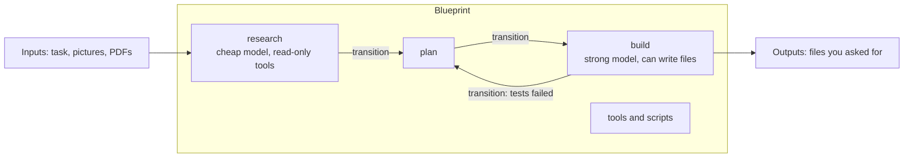
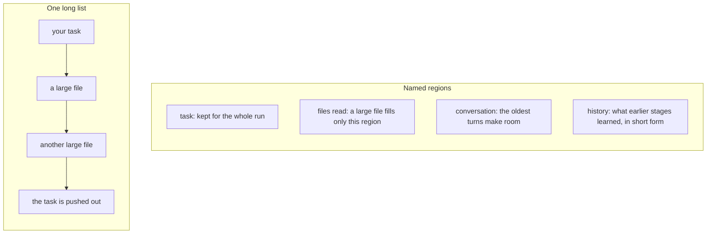

# What is Leviath?

You already run an agent: software that does a job in many steps, using a **large language model**,
the AI that reads and writes text. You have seen what happens on a long job. The agent's memory gets
full, and the agent makes a short note of its own work. Details you need later are gone. Your best
and highest-priced model does your cheapest reading. If the process dies, the work goes with it.

Leviath is a runtime: the program your agents run on. You describe the agent as a group of steps.
Each step gets its own model, its own **tools** (the things it may do other than talk, like reading
a file or running a command) and its own part of the memory. Leviath runs it on your
machine, in the background, and writes every step to disk. One blueprint describes an agent. One
binary runs ten thousand of them.

## Six ideas to know

Most of Leviath comes down to six words. The rest of the docs use them in this sense.

| Word | What it is |
| --- | --- |
| **Blueprint** | The files you write to define what a run does: its `agent.leviath` file, tools, and scripts. |
| **Stage** | One step in a blueprint, with its own model, tools, regions, inputs and outputs. |
| **Transition** | The way from one stage to the next. |
| **Run** | One execution of a blueprint, started with `lev run`. Each run gets its own id and its own memory. |
| **Region** | A named part of a run's memory, with its own size limit. |
| **Agent** | The casual word. It can mean a blueprint or a run. |

"Agent" means two things. "The agents I've built" means blueprints. "The agents I'm running" means
runs. In these docs we say blueprint or run, so you always know which one.

A blueprint is more than one model in a loop. It is a graph of stages. The `agent.leviath` file
lists the stages, the regions and the transitions, and the blueprint's own tools and scripts sit
beside it. You share, install and copy a blueprint as one unit.

You can start the same blueprint as many times as you like. Each run gets its own id and its own
memory, laid out in the regions the blueprint names. Two runs never share what they have seen.

Each stage says what it takes in, such as text, a picture or a PDF. It also says what it has to give
back, such as a report or a video file. A transition moves a run to its next stage. The model
picks some of them. Others fire on their own, when a stage fails or goes around in circles.



Every other word is in the [Glossary](/docs/glossary). You do not need it to read this page.

## I already use an agent. What is the problem?

Long runs break in the same five places.

### Long runs forget what you told them

An agent's memory is its **context window**: all it has seen so far, sent to the model as one long
input. On a long job the window gets full. Most agents then make a short account of their own work
and go on from that. A rule you gave at the start, or a detail you need an hour later, is gone.

### Reading costs what planning costs

The model that reads ten files is the same one you pay top price for on a hard change. There is no
natural place to say "use the cheap one here, the good one there".

### A handful of agents fills the machine

Going from one agent to fifty means fifty processes, each with its own memory and start time. The
machine is full long before the work is.

### A crash means starting over, or doing it twice

If the machine goes down in the middle of a job, the work is gone, and so is the money you paid for
it. A tool call that was half done is either lost or run again.

### You can stop the agent, but not its helpers

You can stop a chat and say "not that way". A helper agent the agent started for itself, three
levels down, is out of reach. It keeps going with the wrong plan until it is done.

## What does Leviath do differently?

### You write a blueprint

A blueprint is a directory. Its `agent.leviath` file lists the stages, and for each one its model,
its tools, what it takes in and what it gives back. Tools and scripts made for this blueprint sit
beside it. There is no agent code to write.

```text
csv-tool/
  agent.leviath        # stages, regions, transitions
  tools/summarize.rhai # a tool only this blueprint has
  hooks/cost_gate.rhai # a script that runs before each model request
```

Two stages can use models from two different companies, and Leviath sends each request to the right
place.

```toml
[stages.research]
model = { models = ["gpt-5.4-mini"] }
available_tools = ["read_file", "list_dir", "summarize"]

[stages.build]
model = { models = ["claude-opus-5"] }
available_tools = ["read_file", "write_file", "shell"]

[stages.build.input]
accepts = ["text/*", "image/png"]      # the task, and a picture of the design

[[stages.build.output.artifacts]]
name = "report"
type = "text/markdown"
required = true                        # the stage is not done until this file exists
```

A stage that says it needs a file does not end without one. See [Agent blueprints](/docs/agents)
and [Multi-stage workflows](/docs/stages).

### Memory is in named regions, not one long list

Leviath cuts a run's memory into regions. Each region has a **budget**, the part of the memory it
may use, and a rule for what to drop first when it is full. The task stays in its region for the
whole run. A large file fills the files region and nothing else. When that region is full, the oldest
reads are folded into a short form, and the file is still on disk to read again.



Regions keep the memory in order. They do not stop the model from making errors. In the runs
measured on the [home page](https://leviath.dev), 30 of 30 jobs finished on data too large to fit in
the window. See [Structured context](/docs/context).

### Runs go on in the background

`lev run` starts a run in a background service and comes back at once. Close the terminal and the
run goes on. A waiting run is kept as data, not as a running process. So one 42 MB binary has room
for 10,000 or more runs at once, and a new run starts in about 64 ms.

```bash
lev run coder --task "Build a CLI that converts CSV to JSON"   # comes back at once
lev dash                                                       # watch every run
```

You watch runs with `lev dash` in the terminal, or from [The Lair](https://leviath.dev/lair), the
web console. Before it writes a file or runs a shell command, a run stops and asks you. It goes
ahead on its own only when you started the run with `--yolo`, which tells it to stop asking. See
[Interaction](/docs/interaction).

A run in the background is not a black box. `lev msg` sends a message into a run, and the run reads it
before its next model request. A run can start helper runs, each with its own id. A helper takes a
message the same way, so you can turn a deep worker around without stopping the rest.

```bash
lev msg <run-id> "Skip the tests directory, it is generated"
```

### All of it is written down as it happens

Every run keeps a record on disk of its memory, its stages, its logs and its answer. Stop Leviath in
the middle of a run and the next start takes the work back up. A step that was cut off is picked up
again, not run a second time.

## What is it not?

- Not a chatbot, and not a stand-in for the back-and-forth chat you have with a coding agent. For a
  quick change, use Claude Code or Codex. Leviath asks you to describe the work first. That pays off
  on a job with stages and gets in the way of a quick one.
- Not a model. You bring one: an API key, a ChatGPT sign-in, or a local model through Ollama.
- Not a hosted service. It is one binary on your machine, and one job does not spread across
  machines.
- Not a full sandbox yet. The opt-in sandbox covers shell commands today, and file tools are kept
  inside the working directory by a path check. Work to cover more is going on. See
  [Security](/docs/security).

## Who is it for?

Leviath is a good fit when:

- the job has steps that want different models and tools, and you will run it more than once
- you want many runs going at the same time, on one machine
- you want to say exactly what is in memory at each step, and what each step may cost
- you want a person in the loop at the points you choose: a plan to approve, a question to answer,
  a result to check
- you want a run that keeps going through a closed terminal, a crash, or a restart

Leviath is the wrong answer when:

- you want quick changes in a chat, turn by turn
- you want agent logic written in Python or TypeScript (see [Where Leviath sits](/docs/comparison))
- you want another company to run it for you

## What do I do first?

Install is one command:

```bash
curl -fsSL https://leviath.dev/install.sh | sh
```

After it, `lev setup` asks for one model provider, and you are ready.

- [Getting Started](/docs/getting-started): from install to your first run in four steps.
- [Agent catalog](/docs/agent-catalog): seven ready-made blueprints.
- [Build your first agent](/docs/first-agent): write a blueprint from an empty directory.

Then read [Overview](/docs/overview) for the whole system in one pass.
