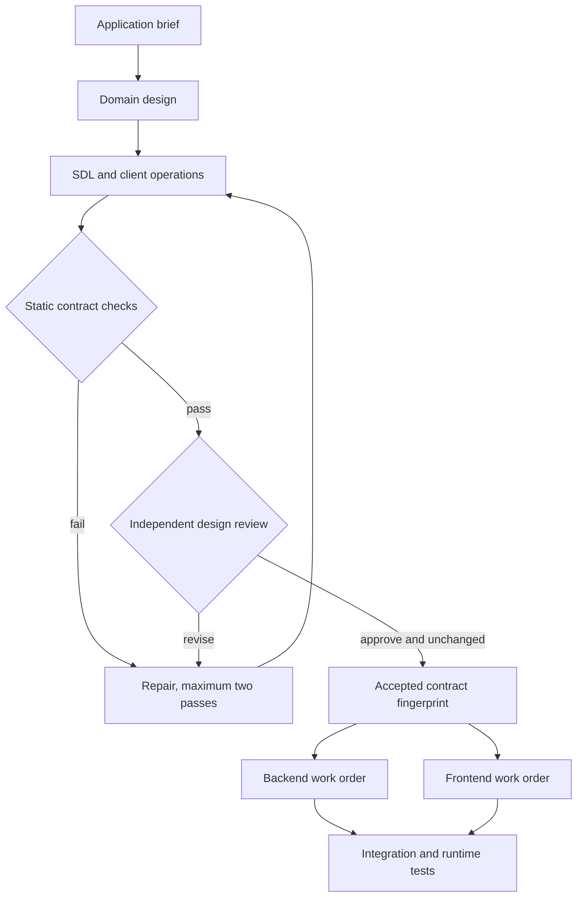

# GraphQL schema workflow

`graphql-schema` is an opt-in Leviath blueprint for the contract-design stage of an
application-building pipeline. The implementation and exact artifact format are in
[the blueprint README](../../crates/leviath-cli/agents/graphql-schema/README.md).



The authoring stages preserve requirements and business invariants, define nullability,
authorization and tenant boundaries, and explain mutation, pagination, batching and
schema-evolution choices. Cheap models do intake, drafting and repair; high-tier models
do domain design and independent review. No global model override is needed.

The static gate uses GraphQL parsing/validation and variable coercion; checks requirement
and root-field coverage through actual operation selections; requires per-field policies,
collection bounds, mutation semantics and custom scalar specifications; and compares a
real baseline when evolving an API. Breaking and dangerous changes block in version 1.
A separate reviewer assesses the semantic design. Final acceptance recomputes the file
fingerprint, rejects stale reviews, and atomically writes `accepted.json`.

Use one active schema run per application checkout. Activate a Python environment with
the blueprint's requirements, install with `lev add`, then invoke the packaged runner:

```sh
python /path/to/graphql-schema/scripts/run_stage.py --task ./application-brief.md
```

Only exit 0 with status `accepted` releases downstream work. Save its fingerprint in
the parent task. Backend and frontend workers both consume the exact SDL, operations,
and handoff. Before work and final application acceptance, run:

```sh
python /path/to/graphql-schema/scripts/gate.py verify --expected-fingerprint <fingerprint>
```

Contract changes return to the schema workflow. Application acceptance separately requires
resolver authorization, tenant isolation, pagination, null bubbling, idempotency,
concurrency, query-cost/batching, and generated-client checks appropriate to the contract.
Schema acceptance proves none of those runtime behaviors by itself.

This stage uses the existing Leviath lifecycle and can be invoked by the current parent
orchestrator. In LifeOps, the task controller remains authoritative; record this stage's
fingerprint and artifact paths in its existing task/attempt data. This change adds no
parallel task database and does not assume an unverified Desk or MCP endpoint.

The bundled task-board example and offline tests exercise the gate without model calls.
The controls detect accidental drift; host-capable authoring agents and unsigned receipts
are not a hostile-code security boundary. See the README for all version-1 limitations.
