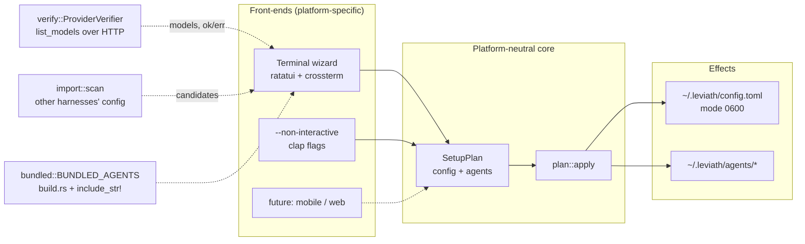
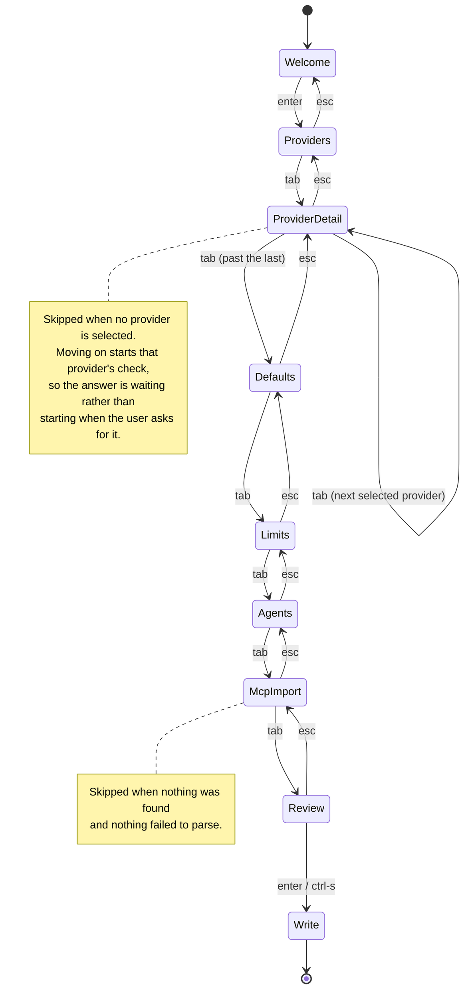
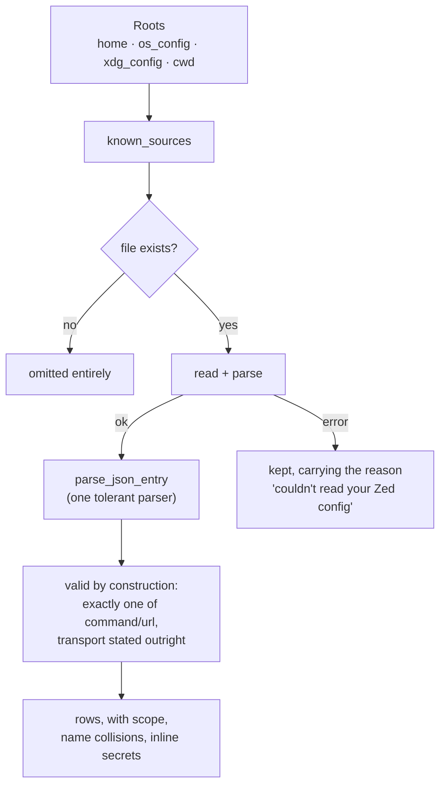

# `lev setup` - the onboarding wizard

## Why it was rebuilt

The old `lev setup` was nine `print!`/`read_line` prompts in a fixed order. It
asked every user for four API keys whether they had them or not, echoed them in
plaintext, touched about eight of `Config`'s twenty-odd fields, took
`default_provider` as unvalidated free text, and knew nothing about MCP servers
or agent blueprints. It ended by printing *"All API keys look valid"* on the
strength of a `key.starts_with("sk-ant-")` check that never touched the network.

A fresh install came out the other side with a config file and no agents - the
ten blueprints under `agents/` (now `crates/leviath-cli/agents/`) shipped only in the git repo, and `lev list`
looked for them in a directory beside the executable that no real install has.

Three defects were worth fixing regardless of the UI:

1. **Environment-only secrets were written to disk.** `Config::load()` folds
   `$ANTHROPIC_API_KEY` and friends into the struct; setup then re-serialized
   the whole thing, so a key deliberately kept in the environment landed in
   `~/.leviath/config.toml`.
2. **The success message was false** for a revoked key, a key with a trailing
   space, a key for the wrong account, and every key belonging to a provider the
   check did not cover (Google, OpenRouter, Ollama).
3. **`default_provider` was free text**, so a typo produced a config that only
   failed at the first agent run.

## Shape

The terminal is a *front-end*, not the feature. Everything the user chooses
lands in a `SetupPlan`; `plan::apply` is the only code that writes. The
`--non-interactive` flag path builds the same struct, and a future mobile or web
host would be a third builder with nothing downstream changing.

That split is also what makes the interesting logic - what actually changes,
what to warn about, which blueprint needs updating - testable without a
terminal.

### Modules

| Module | Holds |
|---|---|
| `commands/setup/state.rs` | Which step, what's chosen, and how it becomes a plan. Pure data and transitions. |
| `commands/setup/input.rs` | Key handling. |
| `commands/setup/render.rs` | Drawing. No state changes. |
| `commands/setup/plan.rs` | `SetupPlan`, `apply`, and the review diff. |
| `commands/setup/catalog.rs` | Which providers exist and how each is configured. |
| `commands/setup/import/` | MCP servers found in other harnesses. |
| `commands/setup/verify.rs` | Proving a credential works. |
| `src/tui/` | `TerminalSetup` / `EventSource` seams and the palette, shared with `lev dash`. |
| `src/bundled.rs` | The embedded blueprints and the install/update planner. |

## The flow

Eight screens. The two discovery-driven ones are skipped when they have nothing
to show - nobody should press Enter through *"no MCP servers found"* on a clean
machine.

| Screen | What it does |
|---|---|
| **Welcome** | Reports what is already configured, how many blueprints need installing, how many MCP servers were found elsewhere. |
| **Providers** | Multi-select. Pre-checked for anything already configured or supplied by the environment. |
| **Credentials** | One card per selected provider: masked key entry, Ollama base URL, Claude Code effort. `o` opens the signup page, `v` re-checks, `Ctrl-R` reveals. |
| **Defaults** | `default_provider` as a radio over what was actually selected. Request timeout. A toggle for the advanced screen. |
| **Limits** | Concurrency, iteration ceiling, exact token counting, the batch-tool hint, and the two model settings: `override_model` and `fallback_model`, each a chooser filled from what verification reported with "(each blueprint decides)" as the unset option. |
| **Agents** | The ten embedded blueprints, each showing `install` / `update X → Y` / `up to date`. Changes pre-checked. |
| **MCP servers** | Grouped by harness, with the project scope, name collisions, and inline secrets flagged. |
| **Review** | A diff against the current file, plus warnings, then write. |

**Keys** - `↑↓`/`kj` move · `←→`/`hl` change a choice · `space` toggle ·
`enter` edit or go on · `tab`/`esc` next/previous · `v` re-check · `o` signup
page · `Ctrl-R` reveal · `Ctrl-S` write from anywhere · `?` help ·
`q`/`Ctrl-C` quit.

Editing is modal and editing wins: while a field is open, `q` types a `q` rather
than quitting. Losing a half-entered API key to a shortcut is a bad way to learn
about modes. `Ctrl-C` is the one exception.

## MCP import

Nine sources, four families of format:

| Family | Harnesses |
|---|---|
| `mcpServers` object | Claude Code (global + per-project), `.mcp.json`, Claude Desktop, Cursor, Windsurf, Gemini CLI |
| `servers` object | VS Code |
| `mcp` object | OpenCode (argv-array `command`, `environment`) |
| `context_servers` object | Zed (nested `command: {path, args, env}`) |
| `[mcp_servers]` table | Codex (the one TOML source) |

Rather than nine near-identical structs, one tolerant entry parser accepts the
union of the field names and each wrapper normalises into it. Unknown fields are
dropped rather than rejected - these files are written by tools that add keys on
their own schedule.

Three things worth knowing:

- **URL wins over command** when an entry carries both, because
  `MCPServerConfig::resolve` rejects that combination without an explicit
  transport. Importing both fields would produce a config that fails to load.
- **Two config roots, not one.** Claude Desktop and VS Code follow the OS
  convention (`~/Library/Application Support` on macOS, `%APPDATA%` on Windows,
  `~/.config` on Linux). Zed and OpenCode use `~/.config` on macOS *as well as*
  Linux. Collapsing them onto `dirs::config_dir()` quietly looks in the wrong
  place for half the table on the commonest desktop.
- **VS Code and Zed permit comments**, which `serde_json` rejects. Their parse
  failures say so rather than printing a column number.

Imported `env`/`headers` values that look like literal credentials are flagged,
so importing does not silently copy another tool's live token into
`~/.leviath/config.toml`. `${VAR}`/`$VAR` are references Leviath expands at
connect time and are not flagged.

## Bundled blueprints

`build.rs` walks the crate's `agents/` directory (now `crates/leviath-cli/agents/`) and generates a
`BUNDLED_AGENTS` table whose file contents are `include_str!`s of the real files
- 23 files, ~170 KB of text. A missing `agents/` directory emits an empty table
rather than failing the build (the shape a packaged crate sees); `bundled`'s own
invariant test then catches an accidentally-empty catalog loudly.

Install/update planning compares version strings for inequality rather than
semver ordering: no new dependency, both versions are shown, and a hand-edited
blueprint surfaces as an update the user can decline. **Known limitation:** an
edit that does not bump the version reads as up to date, because nothing hashes
contents.

## Verification

Every provider already implements `list_models` against a real endpoint, so one
round trip both proves the credential and returns the model list the picker
needs.

`ProviderVerifier` is the seam that keeps tests off the network: `SkipVerifier`
backs `--no-verify`, `LiveVerifier` is instantiated only by `main.rs`, and the
wizard never calls a provider directly. Checks run on a background task and land
through a channel, so the UI never blocks on the network.

A failure is always a warning and never a blocker - an offline laptop or a
provider outage must not stop someone finishing setup. Errors are mapped to what
the user should actually do, distinguishing cases that look alike: a `429` means
the key *works*, a `403` means it is real but lacks access, and an unrecognised
provider name means the registry never built one (reporting that as
"unreachable" would send someone hunting a network problem that does not exist).

## Platform boundaries

The terminal wizard is a desktop front-end, not something prescribed to Leviath
as a whole:

- **Taking over a TTY** happens only in `main.rs`'s `CrosstermSetup`. Without a
  terminal, `lev setup` refuses and names the flags to use instead rather than
  starting ratatui on a pipe.
- **Scanning a home directory** for other tools' config is desktop-shaped. A
  host with no such layout simply finds no sources and the step is skipped.
- **The real environment** - `std::env`, `dirs::config_dir()`, a real browser,
  the live verifier - is assembled in the binary. Nothing in the library reaches
  it, so no test can either.
- The one genuine per-OS branch (the XDG-vs-OS config root) is `#[cfg]`-gated in
  a single place, following `daemon_service`'s precedent.

## Testing

Everything except the real crossterm binding runs against a `TestBackend` with
canned key events, using the same `TestEventSource` / `TestBackendHarness` /
`TestSetup` doubles as `lev dash`. Keeping exactly one of each crate-wide is
load-bearing for the 100%-coverage gate: `cargo-llvm-cov` reports generic
functions per instantiation, so a loop monomorphizing over two backend types
produces two region reports with arms covered in only one.

Rendering tests assert on the drawn text, not merely that drawing did not panic
- which is how the masking, redaction, and secret-warning behaviour is pinned.

**CI green is not evidence the wizard works.** Two defaults passed every unit
test and were visibly wrong the first time it ran under a pty: the Ollama
concurrency default never applied when Ollama was the only provider selected
(the hook was on an arrow key that never gets pressed with one option), and the
model picker was built before verification came back and never refilled. Both
now have regression tests naming what the unit tests missed.
